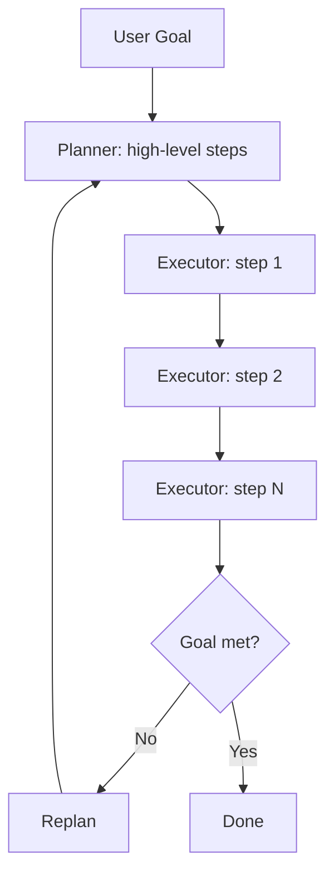
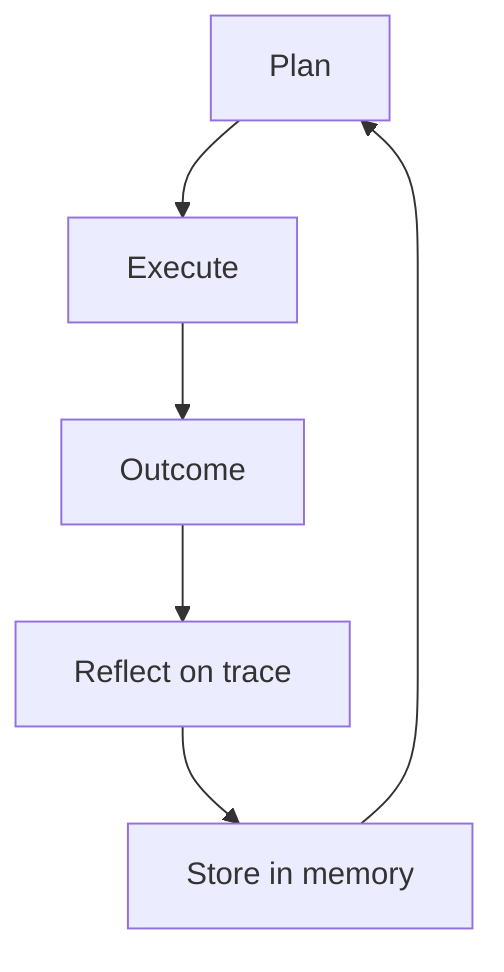
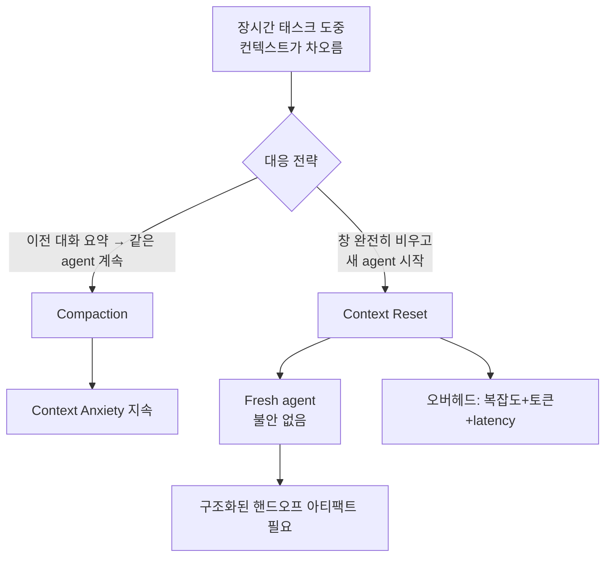
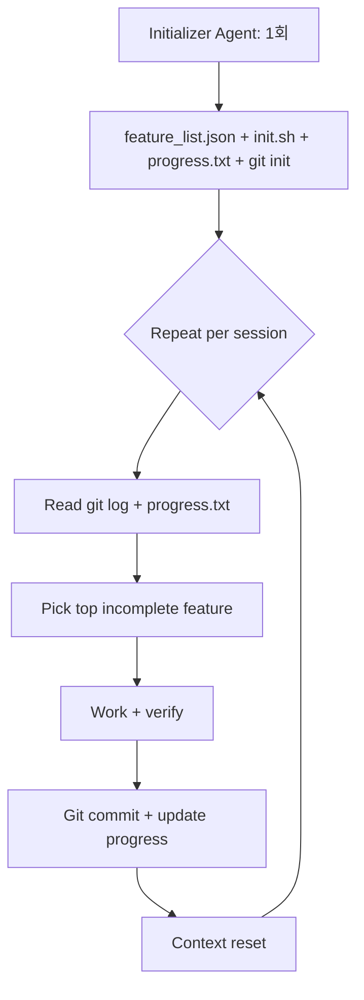

# Long-horizon Agent Loop

장시간(20분~수시간) 실행되는 에이전트는 단일 ReAct 루프로는 collapse한다. 이 페이지는 long-horizon 작업을 견디는 두 축 — **반복(loop)** 과 **격리(reset)** — 를 정리한다. Plan-and-Act, Reflexion, Anthropic harness design, Ralph Loop 패턴을 종합한다.

> 기존 [[anthropic-harness-design]], [[react-pattern]], [[long-running-agent-patterns]], [[orchestrator-worker-pattern]] 와 차별화 — 이 페이지는 "context anxiety", "Ralph Loop", "context reset vs compaction trade-off", 모델 세대별 패턴 진화에 초점을 맞춘다.

## 1. ReAct Loop의 한계

```
Thought → Action → Observation → Thought → Action → ... → Final Answer
```

### 4가지 한계
1. **Myopic decisions**: 다음 action에만 최적화, 전체 전략 누락
2. **Error propagation**: 초반 한 번의 잘못된 observation이 cascade
3. **Long-horizon weakness**: 컨텍스트가 길어질수록 coherence loss
4. **Self-evaluation 실패**: 모델이 자기 결과를 confidently praise (편향)

> "Models tend to lose coherence on lengthy tasks as the context window fills."
> "Agents consistently respond by confidently praising the work—even when, to a human observer, the quality is obviously mediocre."

## 2. Plan-and-Act / Plan-and-Execute

### 분리 구조

| 모듈 | 역할 |
|------|------|
| **Planner** | 고수준 plan을 step sequence로 생성 |
| **Executor** | 각 step을 environment-specific action으로 변환 |



### 장점
- Plan은 한 번 수립 → Executor 단계에서 myopic 결정 방지
- Replan trigger 시점에만 plan 갱신 (보통 매 N step 또는 실패 시)

## 3. Reflection / Reflexion Loop



### 핵심 개념

> "After a task failure or completion, the agent reflects on its entire execution trace (including thoughts, actions, and observations) to identify errors or inefficiencies. It then stores this reflection in its memory to inform future planning."

→ 모델 retrain 없이 "learning from mistakes" 효과. 자세한 내용은 [[reflexion]] 참조.

## 4. Compaction vs Context Reset

### Compaction
> "Earlier parts of the conversation are summarized in place so the same agent can keep going on a shortened history."

장점: 연속성 유지
단점: [[context-anxiety|Context Anxiety]] 잔존 (clean slate 아님)

### Context Reset
> "Creating a harness that worked well across context resets was key to keeping the model on task."

장점: 진짜 clean slate
단점: handoff artifact가 다음 에이전트가 작업을 이어받을 만큼의 state를 담아야 함



### 모델 세대별 차이

> "Claude Sonnet 4.5 exhibited context anxiety strongly enough that compaction alone wasn't sufficient to enable strong long task performance, so context resets became essential to the harness design."

> "Opus 4.5 largely removed that behavior on its own, so context resets could be dropped entirely. The agents were run as one continuous session across the whole build."

→ 모델 capability 향상에 따라 harness 패턴이 진화. Sonnet 4.5 시기엔 reset 필수, Opus 4.5에서는 compaction만으로 충분. [[load-bearing-harness|load-bearing test]]를 모델 업그레이드마다 재실행 권장.

## 5. Two-Agent Split: Initializer + Coding Agent



### Initializer Agent (1회 실행)
- 환경 setup (init script)
- Feature list 생성 (200+ items, JSON 포맷)
- progress.txt 초기화
- Initial git commit

### Coding Agent (매 세션)
1. Working directory 확인
2. git log + progress.txt 읽고 orient
3. 가장 높은 priority incomplete feature 선택
4. 앱 동작 verify (Browser automation 등 deterministic verifier)
5. 작업 + commit + progress 업데이트

> "An initializer agent that sets up the environment on the first run, and a coding agent that is tasked with making incremental progress."

## 6. 환경 Scaffolding (handoff artifact 4종)

| 아티팩트 | 포맷 | 목적 |
|----------|------|------|
| `feature_list.json` | JSON (model-induced corruption resistant) | 요구사항 + pass/fail |
| `init.sh` | Shell script | dev server startup + smoke test |
| `claude-progress.txt` | Plain text | 세션별 작업 로그 |
| Git history | git | versioning + rollback |

> "Structured requirements with pass/fail status, resistant to model-induced corruption."

JSON 포맷이 plain text보다 모델이 무심코 깨뜨릴 가능성이 낮다.

## 7. Ralph Loop Pattern

### 정의
> "A two-phase Ralph Loop pattern. It uses an Initializer Agent that sets up the environment, then a Coding Agent in every subsequent session reads git logs and progress files to orient itself, picks the highest-priority incomplete feature, works on it, commits, and writes summaries."

### 흐름
1. Initializer (1회): feature_list.json + init.sh + progress.txt + git init
2. Coding Agent (반복): orient → pick → work → commit → reset

각 세션이 fresh context에서 시작하지만, git/progress.txt가 외부 영속 메모리 역할을 한다.

## 8. Failure Modes & Solutions

| Failure mode | 대처 |
|--------------|------|
| Premature completion (양치기 완료 선언) | feature_list.json 의 모든 항목 starting failing 상태 |
| Undocumented progress | git commit + progress.txt 강제 |
| Inadequate testing | Browser automation 등 deterministic verifier 강제 |
| Coherence loss | Context reset + handoff |
| Self-praise bias | Generator/Evaluator 분리 |

## 9. Generator/Evaluator 분리

### 핵심 통찰
> "The solution involved separating generator and evaluator roles rather than relying on self-assessment."

같은 모델 인스턴스가 generate + evaluate 하면 self-praise 편향 발생 → 별도 agent로 평가.

### 패턴 변형
- **Generator + Critic** (separate context): subjective task에 적합
- **Generator + Test runner** (deterministic verifier): code/build 검증
- **Generator + Human approval gate**: 고위험 작업

## 10. Long-horizon 운영 체크리스트

- [ ] Initializer agent로 한 번 환경 setup
- [ ] feature_list.json 등 structured artifact (JSON 권장)
- [ ] init.sh + smoke test로 매 세션 시작 verify
- [ ] git commit 강제로 progress 추적
- [ ] Generator와 Verifier role 분리
- [ ] Browser automation 등 deterministic verifier 도입
- [ ] [[load-bearing-harness|Load-bearing test]]를 모델 업그레이드마다 실행

## 11. 모델별 권장 패턴

| 모델 세대 | 권장 |
|------|------|
| Sonnet 4.5 / 이전 | Context reset 강제, two-agent split |
| Opus 4.5+ | Continuous session + compaction |
| Haiku | Verifier role 한정 (cost-efficient) |

## 12. Anti-pattern

- 단일 ReAct loop로 multi-hour 작업 처리 (coherence loss)
- 자체 평가에 의존 (self-praise 편향)
- Plain text progress file (모델이 corrupt 시킬 위험)
- Compaction만으로 Sonnet 4.5 long task 처리 (context anxiety 미해결)
- Initializer agent 단계를 매 세션 반복 (불필요한 비용)

## 관련 문서

- [[anthropic-harness-design]] — Anthropic harness 종합
- [[long-running-agent-patterns]] — long-running 일반론
- [[react-pattern]] — ReAct 기본 패턴
- [[reflexion]] — Reflexion 메모리 패턴
- [[plan-and-execute-pattern]] — Plan-and-Execute
- [[plan-and-solve-prompting]] — Plan-and-Solve
- [[context-anxiety]] — context anxiety 실패 모드
- [[context-window-management]] — compaction 전략
- [[subagent-spawning]] — sub-agent 격리와 결합
- [[load-bearing-harness]] — 모델 업그레이드 시 harness 단순화
- [[generator-evaluator-architecture]] — generator/evaluator 분리
