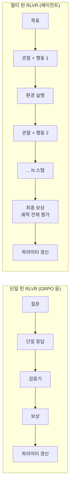
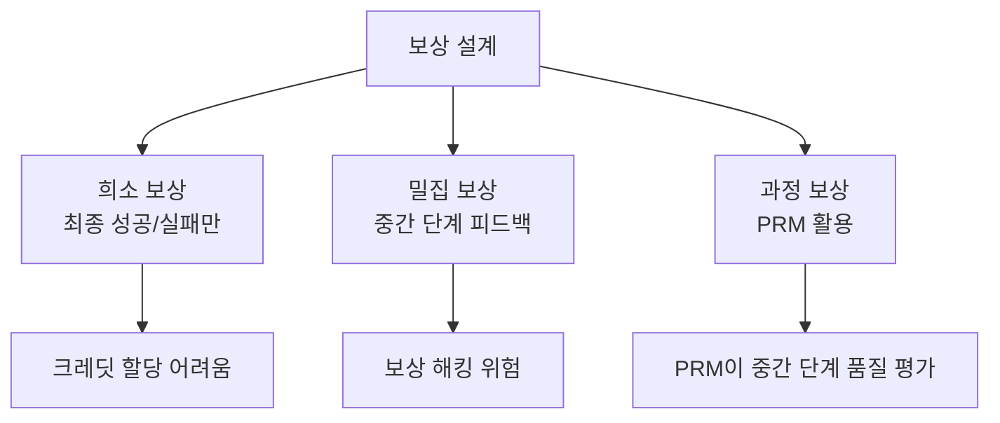

# Long-Horizon RL Training for Agents (Multi-Turn RLVR)

멀티 턴(multi-turn) 환경에서 검증 가능한 보상(verifiable reward)으로 에이전트의 도구 사용·계획·자기수정 능력을 직접 학습시키는 강화학습(RL) 기법. 단일 턴 RLVR(GRPO 등)을 에이전트 루프 전체로 확장한다.

## 왜 중요한가

2026년 3월 NVIDIA ProRL Agent(Rollout-as-a-Service), AgentGym-RL, ScalingInter-RL 등 멀티 턴 RL 인프라가 동시 공개됐고, 500편 이상을 종합한 "Landscape of Agentic RL" 서베이가 학습 가능한 에이전트로의 패러다임 시프트를 정식화했다.

## 단일 턴 RLVR vs 멀티 턴 RLVR



멀티 턴의 핵심 도전은 **크레딧 할당(credit assignment)** 문제: 수십 스텝 중 어느 행동이 최종 결과에 기여했는지 판단하기 어렵다.

## 주요 기법 및 인프라

| 기법/시스템 | 핵심 기여 |
|-----------|---------|
| LOOP (Anthropic/UCB) | 장기 상호작용 에이전트 RL 정식화 |
| AgentGym-RL | 멀티 턴 의사결정 RL 훈련 환경 |
| ReVeal | 생성-검증 반복으로 코드 에이전트 자기진화 |
| ReSearch | 검색 정책과 추론 정책을 RL로 결합 |
| FoldGRPO | 컨텍스트 폴딩을 RL로 학습 |

## 보상 설계 전략

에이전트 RL에서 보상 설계는 성패를 가르는 핵심이다.



실용적 접근: 희소 최종 보상 + 형식 준수(format compliance) 보상 + 도구 호출 정확성 보상의 혼합.

## Rollout-as-a-Service

NVIDIA ProRL의 핵심 개념: RL 학습 중 롤아웃(에이전트 시뮬레이션) 생성을 **전용 인프라로 분리**한다.

```
학습 클러스터 <--> Rollout 서버 (에이전트 실행 전용)
                            |
                    환경 실행 (코드 실행, 검색, 브라우저 등)
```

롤아웃 서버를 독립 확장하면 GPU 학습 시간을 롤아웃 대기로 낭비하지 않는다.

## Self-Evolving Code Agents: ReVeal

ReVeal(Self-Evolving Code Agents via Iterative Generation-Verification)은 코드 에이전트에 특화된 멀티 턴 RL 접근:

1. 에이전트가 코드 생성 → 실행 → 오류 관찰
2. 자기 수정 시도 (iterative self-correction)
3. 최종 성공 궤적으로 RL 업데이트

테스트 실행이라는 명확한 검증 신호 덕분에 보상 설계가 상대적으로 단순하다.

## ReSearch: 검색과 추론의 RL 결합

검색 정책(언제, 무엇을 검색할지)과 추론 정책(검색 결과를 어떻게 통합할지)을 하나의 RL 목표로 동시 최적화. 기존에 규칙 기반으로 처리하던 검색 시점 결정을 모델이 직접 학습한다.

## 크레딧 할당 심화 (Credit Assignment)

2026년 서베이 (Zhang, arXiv 2604.09459)는 LLM RL의 크레딧 할당을 **2차원 taxonomy**로 체계화했다.

- **Granularity 축**: Token / Segment / Step / Turn / Multi-Agent
- **Methodology 축**: Monte Carlo / Temporal Difference / Model-based / Game-theoretic / Information-theoretic

아젠틱 RL(100+ turn, 100k~1M 토큰)은 reasoning RL(500~30k 토큰, 단일 turn)과 근본적으로 다른 접근이 필요하다:

| 기법 | 적용 | 핵심 아이디어 |
|------|------|-------------|
| Hindsight counterfactual | Agentic RL | 에피소드 완료 후 대안 trajectory 역추적 |
| Privileged asymmetric critic | Agentic RL | 훈련 시에만 oracle 정보를 critic에 제공 |
| Turn-level MDP | Agentic RL | 시간 추상화 재구조화로 long-range attribution 완화 |
| PRM | Reasoning RL | 중간 추론 스텝 단위 평가 |
| GRPO | Reasoning RL | critic-free 그룹 비교로 어드밴티지 계산 |

→ 상세 taxonomy와 방법별 비교는 [[credit-assignment-survey-paper]] 참조
→ source-agnostic 개념 정리는 [[credit-assignment-rl]] 참조

## 장기 실행 에이전트 훈련의 과제

| 과제 | 설명 |
|------|------|
| 크레딧 할당 | 긴 궤적에서 기여 행동 특정 어려움 (→ 위 섹션 참조) |
| 탐색 효율 | 무작위 탐색으로 성공 궤적 얻기 어려움 |
| 환경 다양성 | 훈련 환경 다양성 부족 시 과적합 |
| 안전성 | 실제 환경(브라우저, 코드 실행)에서 부작용 위험 |
| 컨텍스트 관리 | 긴 궤적의 컨텍스트 오버플로 처리 |

## 실무 적용 관점

- **시작점**: 검증 가능한 태스크(코드 테스트, 수학)로 단순 에이전트부터 훈련. 복잡한 도구 조합은 나중에 추가
- **롤아웃 격리**: 에이전트 실행이 실제 환경에 영향을 주지 않도록 샌드박스(sandbox) 필수
- **보상 혼합**: 최종 보상 + 중간 형식 보상의 가중합으로 크레딧 할당 완화
- **[[long-horizon-agent-benchmarks|벤치마크 연동]]**: SWE-Bench, GAIA 2로 훈련 진행 상황을 주기적으로 평가

## 대표 레퍼런스

- [The Landscape of Agentic Reinforcement Learning for LLMs: A Survey](https://arxiv.org/abs/2509.02547)
- [Reinforcement Learning for Long-Horizon Interactive LLM Agents (LOOP)](https://arxiv.org/abs/2502.01600)
- [AgentGym-RL: Training LLM Agents for Long-Horizon Decision Making through Multi-Turn RL](https://arxiv.org/abs/2509.08755)
- [ReVeal: Self-Evolving Code Agents via Iterative Generation-Verification](https://arxiv.org/abs/2506.11442)
- [ReSearch: Learning to Reason with Search for LLMs via Reinforcement Learning](https://arxiv.org/abs/2503.19470)

## 관련 문서

- [[ai-hot-topics-2026-04|2026년 4월 AI 개발 핫토픽 100선]]
- [[context-folding|Context Folding & Sub-Trajectory Compression]]
- [[agent-memory-systems|Agent Memory Systems]]
- [[long-horizon-agent-benchmarks|Long-Horizon Agent Benchmarks]]
- [[agent-trees|Hierarchical Planning with Agent Trees]]
- [[subagents|Subagents]]
- [[rl-scaling-laws|RL Scaling Laws (ScaleRL)]]
- [[credit-assignment-survey-paper|Credit Assignment Survey (Zhang, 2026)]] -- 47 methods, 2D taxonomy
- [[genac-paper|GenAC (Shan et al., 2026)]] -- Generative Critic, value-free 트렌드 반론
- [[credit-assignment-rl|크레딧 할당 개념]] -- source-agnostic 개념 정리
