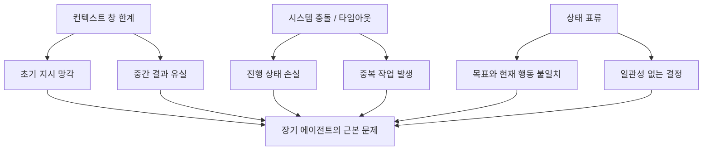
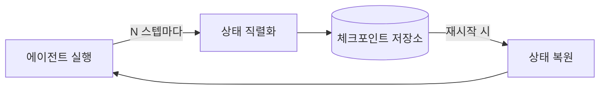
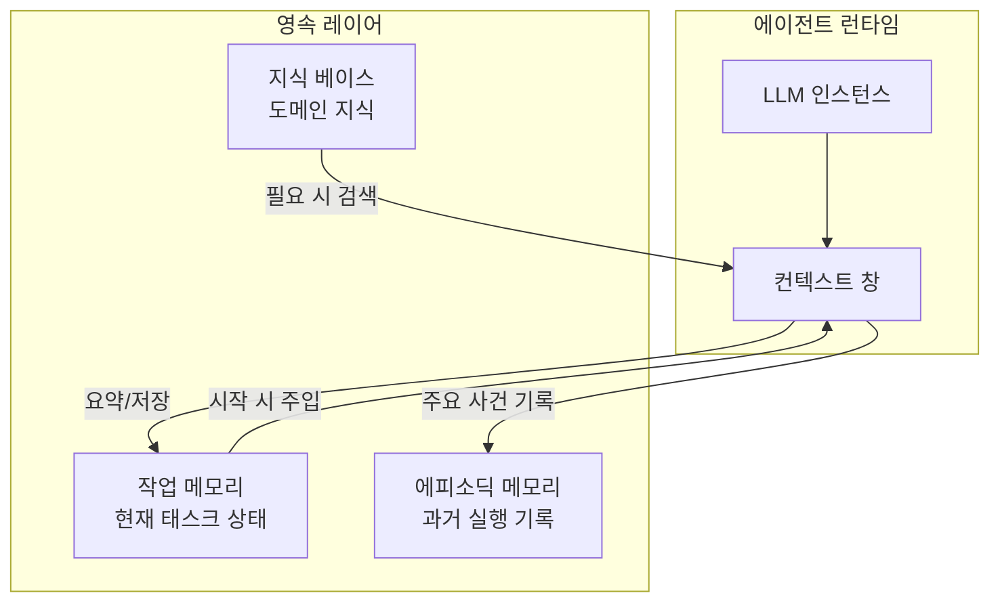
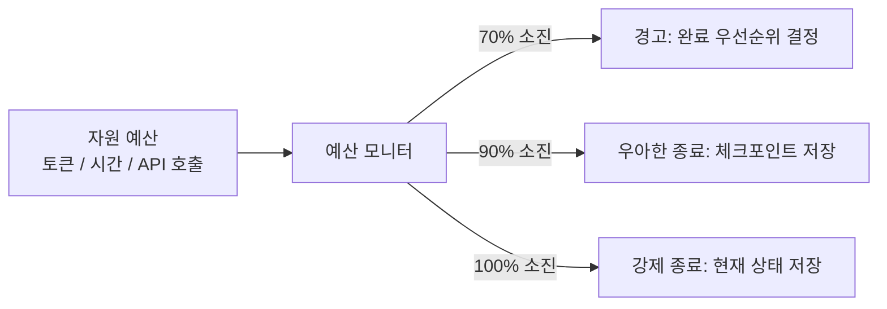

# 장기 실행 에이전트 패턴

장기 실행 에이전트(long-running agent)란 단일 LLM 컨텍스트 창의 한계를 넘어 수 시간, 수 일, 또는 그 이상 지속되는 태스크를 수행하는 에이전트를 말한다. 세션 연속성(session continuity), 상태 영속(state persistence), 재시작 가능성(restartability)이 핵심 설계 과제다.

## 왜 어려운가

단기 에이전트는 단일 컨텍스트 창에 모든 상태를 담을 수 있지만, 장기 에이전트는 컨텍스트가 여러 번 교체되어도 일관성을 유지해야 한다.

## 핵심 패턴 1: 체크포인팅 (Checkpointing)

에이전트의 현재 상태를 외부 저장소에 주기적으로 저장해 장애 발생 시 마지막 체크포인트에서 재개하는 패턴이다.

체크포인트에 저장해야 할 정보:
- 현재 태스크 목표 및 하위 목표 트리
- 완료된 스텝과 그 결과
- 미완료 스텝 목록
- 에이전트가 획득한 중간 결과물 (파일, URL, 데이터)
- 현재 의도(intention) 및 다음 계획 행동

## 핵심 패턴 2: 상태 영속 레이어

컨텍스트 창이 교체되어도 에이전트가 이전 상태를 불러올 수 있도록 외부 메모리 시스템을 연결한다. [[anthropic-harness-design]]에서 구현하는 harness 아키텍처가 이 레이어를 담당한다.

## 핵심 패턴 3: 재시작 가능 태스크 설계

태스크 자체를 멱등성(idempotency)을 갖도록 설계해 중단 후 재개 시 부작용이 없도록 한다.

**멱등성 원칙 적용 예시**

| 나쁜 설계 | 좋은 설계 |
|-----------|-----------|
| "파일에 내용을 추가한다" | "파일이 이미 해당 내용을 포함하지 않으면 추가한다" |
| "API를 호출한다" | "API를 호출하고 결과를 캐시한다. 캐시가 있으면 재호출하지 않는다" |
| "이메일을 발송한다" | "발송 기록을 확인하고 미발송 시에만 발송한다" |

## [[claude-code-routines]]와의 연계

[[claude-code-routines]]에서 정의하는 루틴(routine) 패턴은 장기 실행 에이전트의 좋은 사례다. 루틴은 체크포인트와 멱등성을 내장한 반복 가능한 에이전트 워크플로우다.

루틴의 구성 요소:
1. **트리거 조건**: 언제 실행되는가
2. **전제 조건 검사**: 이미 완료되었는가
3. **실행 단계**: 체크포인트 포인트를 포함한 단계별 작업
4. **완료 조건**: 성공 여부 판정
5. **실패 처리**: 재시도 전략

## 세션 연속성 구현 전략

장기 세션에서 LLM 인스턴스가 교체될 때 연속성을 유지하는 전략이다.

**전략 1: 압축 요약 주입**
이전 세션의 핵심 내용을 구조화된 요약으로 압축해 새 컨텍스트 창 최상단에 주입한다. 요약에는 목표, 완료 항목, 미완료 항목, 현재 상태가 포함된다.

**전략 2: 단계별 핸드오프 문서**
각 세션이 종료될 때 다음 세션을 위한 핸드오프 문서를 생성한다. "새로운 에이전트 인스턴스가 이 문서만 보고도 작업을 이어받을 수 있는가"를 기준으로 품질을 평가한다.

**전략 3: 외부 태스크 그래프**
에이전트 내부 상태가 아닌 외부 태스크 관리 시스템(데이터베이스, 태스크 큐)이 작업 상태를 소유한다. 에이전트는 상태를 보유하는 것이 아니라 외부 상태를 읽고 업데이트하는 역할만 한다.

## 타임아웃과 예산 관리

장기 에이전트에는 반드시 예산 관리 레이어가 필요하다. 토큰, 실행 시간, 외부 API 호출 횟수를 예산으로 정의하고 소진 임박 시 에이전트에게 완료 우선순위를 변경하도록 지시한다.

## 실무 관점

- 재시작 시나리오는 반드시 테스트한다. "50% 진행 후 충돌" 시뮬레이션을 정기적으로 실행해 체크포인트 복원이 실제로 작동하는지 검증한다.
- 상태 저장소는 에이전트 프로세스와 분리된 외부 시스템이어야 한다. 에이전트가 죽어도 상태가 살아있어야 한다.
- 장기 에이전트일수록 인간 감독(human-in-the-loop) 주기를 설계에 포함시킨다. 수 시간 단위로 진행 상황을 보고하고 방향을 확인받는 체크인 포인트를 추가한다.

## 관련 문서

- [[anthropic-harness-design]] - 장기 실행을 지원하는 harness 아키텍처 설계
- [[claude-code-routines]] - 재시작 가능한 에이전트 루틴 패턴
- [[agent-memory-systems]] - 세션 간 상태를 유지하는 메모리 시스템
- [[human-in-the-loop-patterns]] - 장기 에이전트에서 인간 감독을 통합하는 패턴
