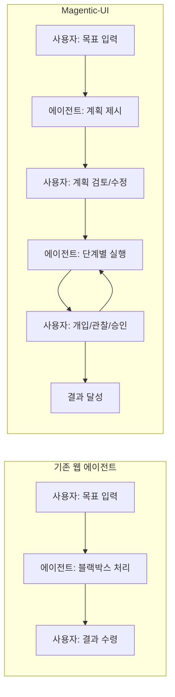
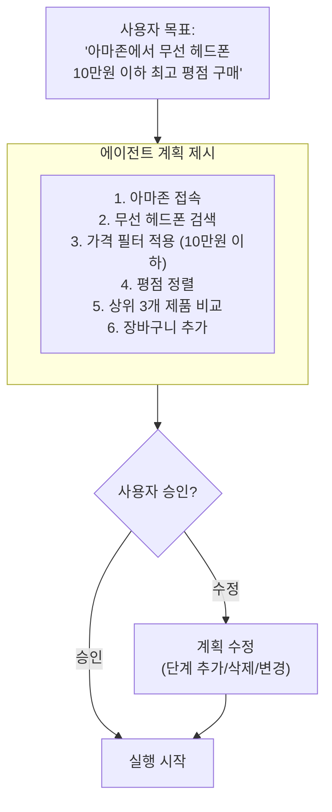
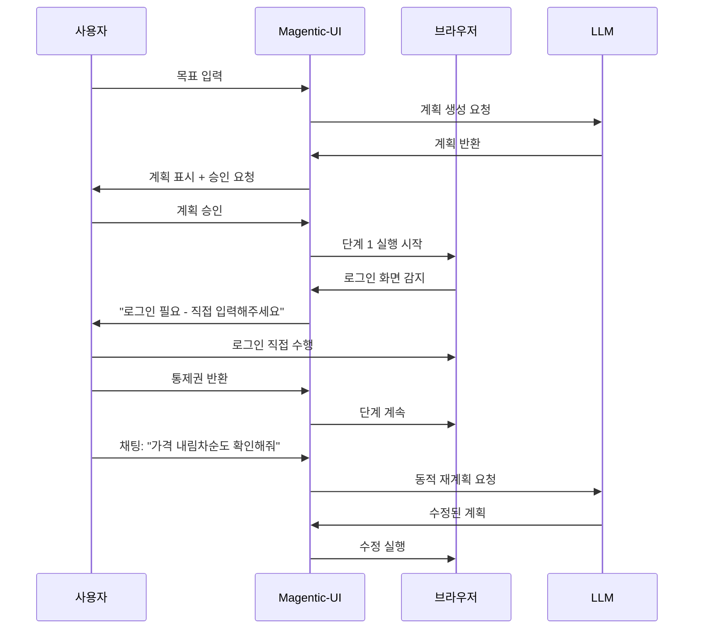
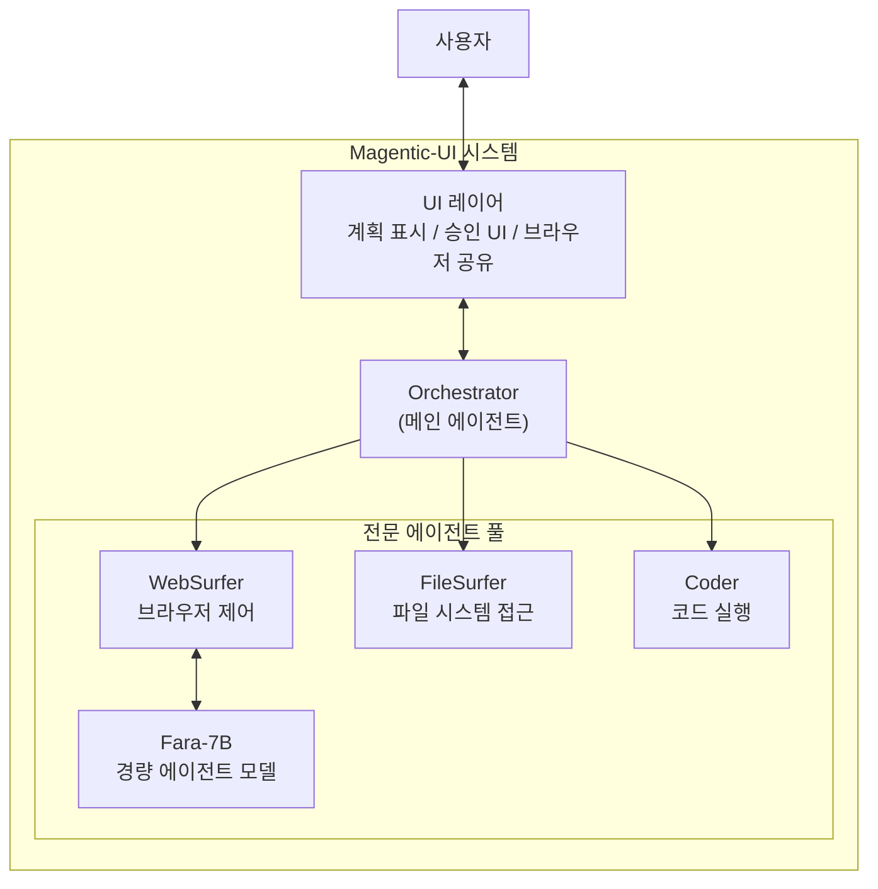

# Magentic-UI - Microsoft 인간 중심 웹 에이전트

Microsoft Research가 발표한 오픈소스 인간 중심 웹 에이전트 리서치 프로토타입이다. Magentic-One 및 AutoGen 기반으로 구축됐으며, 실행 전 단계별 계획 공개(Plan Preview), 사용자와의 Co-tasking(웹 브라우저 직접 개입 및 채팅 유도), 민감한 작업에 대한 명시적 사용자 승인 세 가지 설계 원칙으로 기존 블랙박스 에이전트와 차별화된다. MIT 라이선스로 GitHub 및 Azure AI Foundry Labs에서 공개됐다.

GitHub: https://github.com/microsoft/magentic-ui

## 왜 중요한가

웹 에이전트는 2025-2026년 AI 업계의 핵심 전선이다. Anthropic Computer Use, Google Project Mariner, OpenAI Operator 등이 경쟁 중인데, Magentic-UI는 "완전 자율"이 아닌 **"협력적 자율"**로 차별화한다.



기존 웹 에이전트는 "보내고 잊어버리기(fire and forget)"에 가까운 반면, Magentic-UI는 사용자가 언제든 개입하고 방향을 바꿀 수 있다.

## 핵심 설계 원칙

### 1. Plan Preview (계획 사전 공개)

에이전트가 실행 전에 전체 계획을 사용자에게 보여준다.



이 기능의 핵심 가치는 신뢰다. 사용자가 에이전트가 무엇을 할 것인지 미리 알고 동의한 상태에서 실행이 시작된다.

### 2. Co-tasking (협력 작업)

실행 중 언제든 두 가지 방식으로 개입할 수 있다.

**직접 개입 (Direct Takeover)**: 에이전트가 제어하는 브라우저에 사용자가 직접 마우스/키보드로 개입한다. 에이전트가 로그인 폼을 만나면 사용자가 직접 자격증명을 입력하고 통제권을 반환한다.

**채팅 기반 개입 (Chat Guidance)**: 실행 중 채팅으로 추가 지시를 보낸다. "두 번째 제품도 확인해줘", "아니야 가장 리뷰 많은 걸로 골라줘" 같은 동적 방향 수정이 가능하다.



### 3. 명시적 승인 (Explicit Approval)

민감한 작업(결제, 개인정보 입력, 삭제, 전송 등)은 반드시 사용자 명시적 승인 후 실행된다.

민감한 작업으로 분류되는 예시:
- 장바구니 추가 또는 구매 확정
- 이메일 전송
- 파일 삭제
- 폼 제출 (개인정보 포함)
- 계정 설정 변경

## 아키텍처

### Magentic-One 기반

Magentic-UI는 Microsoft Research의 멀티에이전트 프레임워크 Magentic-One을 기반으로 한다.



### AutoGen 통합

[[multi-agent-orchestration|멀티에이전트]] 조율은 AutoGen v0.4+ 런타임을 사용한다. 에이전트 간 메시지 패싱, 대화 히스토리 관리, 에이전트 생성/종료를 AutoGen이 담당한다.

### Fara-7B 에이전트 모델

Magentic-UI에는 Fara-7B라는 경량 에이전트 모델이 통합됐다. Fara-7B는 웹 탐색 특화 파인튜닝 모델로, WebSurfer 에이전트의 "다음 어떤 웹 액션을 취할 것인가" 결정을 담당한다. 7B 소형 모델이므로 로컬 배포도 가능하다.

### 브라우저 공유 메커니즘

직접 개입(Co-tasking)을 구현하기 위해 Magentic-UI는 브라우저 세션을 사용자와 에이전트가 공유한다.

기술적으로는 VNC/원격 데스크톱 방식 또는 CDP(Chrome DevTools Protocol) 기반 브라우저 제어를 사용하며, 사용자는 에이전트가 제어하는 브라우저 화면을 실시간으로 볼 수 있다. [교차검증 필요]

## [[browser-use-agent-framework|Browser Use]]와의 비교

[[browser-use-agent-framework|Browser Use]]는 강력한 자율 웹 에이전트 프레임워크이지만, 설계 철학에서 차이가 있다.

| 특성 | Magentic-UI | Browser Use |
|------|-------------|-------------|
| 자율성 | 협력적 (사람 개입 설계됨) | 자율 (최소 개입) |
| 계획 투명성 | 실행 전 계획 공개 | 불투명 (결과 중심) |
| 브라우저 공유 | 사용자가 직접 개입 가능 | 에이전트 전용 |
| 민감 액션 처리 | 명시적 승인 필수 | 에이전트 자율 결정 |
| 프레임워크 | AutoGen 기반 | 독립 프레임워크 |
| 라이선스 | MIT | Apache 2.0 |
| 연구 vs 프로덕션 | 리서치 프로토타입 | 프로덕션 지향 |

## 안전성 설계

Magentic-UI의 인간 중심 설계는 웹 에이전트의 핵심 안전 문제를 직접 해결한다.

### 문제: 에이전트가 잘못된 행동을 취했을 때

기존 에이전트: 실행 후 취소 불가능한 경우 발생 (구매 완료, 데이터 삭제 등)

Magentic-UI: 민감 액션 전 명시적 승인 → 사용자가 의도하지 않은 행동 사전 차단

### 문제: 프롬프트 인젝션

웹 페이지에 악의적 지시가 숨겨져 있을 때 에이전트가 속을 수 있다.

Magentic-UI: 계획이 갑자기 바뀌면 사용자가 인지 가능. 승인 UI가 "이상한 새 계획"을 차단

### 문제: 자격증명 노출

에이전트에게 비밀번호를 알려주어야 하는 상황

Magentic-UI: 직접 개입으로 사용자가 직접 입력. 에이전트가 자격증명을 볼 필요 없음

## Azure AI Foundry Labs

Microsoft Azure AI Foundry Labs에서 Magentic-UI를 체험 가능하다. Foundry Labs는 Microsoft Research의 실험적 AI 기능을 클라우드에서 프리뷰로 제공하는 채널이다.

체험 링크: Azure AI Foundry Labs 포털 (구체적 URL [교차검증 필요])

## 실무 활용 시나리오

### 적합한 시나리오

1. **리서치 및 정보 수집**: 여러 웹사이트를 탐색하며 정보를 수집하고 요약
2. **반복적 폼 작성**: 구조가 비슷한 폼을 여러 사이트에서 반복 작성
3. **가격 비교**: 여러 쇼핑 사이트에서 제품 가격/스펙 비교
4. **엔터프라이즈 내부 포털**: 내부 웹 도구에서 반복 업무 자동화 (승인 워크플로와 함께)

### 제한 사항

- **리서치 프로토타입**: 프로덕션 수준 안정성은 보장 안됨
- **속도**: 인간 승인 단계로 인해 완전 자율 에이전트보다 느림
- **복잡한 웹 앱**: SPA(Single-Page Application), 동적 JavaScript 렌더링에서 불안정할 수 있음

## 오픈소스 접근

```bash
# Magentic-UI 설치 및 실행 (개념적 예시)
git clone https://github.com/microsoft/magentic-ui
cd magentic-ui
pip install -e .  # [교차검증 필요] - 실제 설치 방법은 README 참조
```

MIT 라이선스로 상업적 이용, 수정, 배포가 자유롭다. 연구 및 프로토타입 용도로는 즉시 활용 가능하다.

## 관련 문서

- [[browser-use-agent-framework]] - 자율 웹 에이전트 접근법 비교
- [[multi-agent-orchestration]] - AutoGen 기반 멀티에이전트 시스템 패턴
- [[a2a-protocol-v12-upgrade]] - 에이전트 간 통신 표준
- [[agent-memory-systems]] - 에이전트 장기 메모리 관리
- [[agent-interrupt-resume]] - 에이전트 실행 중단 및 재개 패턴
