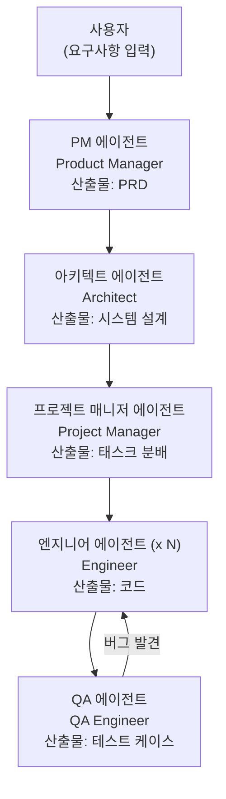
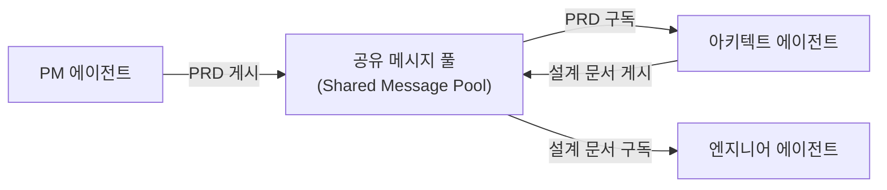

# MetaGPT - 소프트웨어 회사 시뮬레이션

## 개요

MetaGPT는 2023년 Sirui Hong 등이 발표한 멀티 에이전트 프레임워크로, LLM 에이전트들에게 소프트웨어 회사의 실제 역할(PM, 아키텍트, 엔지니어, QA)을 부여해 팀으로 소프트웨어를 개발한다. 핵심 기여는 **표준 운영 절차(SOP, Standard Operating Procedures)를 LLM 에이전트 워크플로우에 인코딩**한 것이다. 단순히 역할을 나누는 것을 넘어, 실제 소프트웨어 개발 프로세스의 절차와 산출물을 에이전트 간 협업 규약으로 형식화했다.

## 핵심 철학: SOP 인코딩

MetaGPT가 이전 에이전트 시스템과 다른 점은 "역할 플레이"가 아닌 **"절차의 형식화"**에 있다.

일반 멀티 에이전트 시스템:
- 에이전트 A에게 "PM 역할을 해라"라고 지시
- 에이전트 B에게 "개발자 역할을 해라"라고 지시
- 이후 에이전트들이 자유롭게 대화

MetaGPT의 접근:
- PM 에이전트는 반드시 PRD(Product Requirements Document) 형식의 문서를 출력
- 아키텍트 에이전트는 PRD를 입력받아 시스템 설계 문서를 출력
- 엔지니어 에이전트는 설계 문서를 입력받아 코드를 출력
- QA 에이전트는 코드를 입력받아 테스트 케이스를 출력

각 단계의 입출력 형식이 엄격하게 정의되어 있다.

## 에이전트 역할 구조



각 에이전트는 자신의 역할에 맞는 구조화된 산출물을 생성해야 한다.

## 산출물 형식 (구조화 문서)

### PM 에이전트 출력: PRD

```markdown
## 목표 및 배경
## 사용자 스토리
## 요구사항 목록
  - 기능 요구사항
  - 비기능 요구사항
## 경쟁사 분석
## 성공 지표 (KPI)
```

### 아키텍트 에이전트 출력: 시스템 설계

```markdown
## 시스템 아키텍처
## API 설계 (엔드포인트 명세)
## 데이터 모델 (ERD)
## 파일 구조
## 기술 스택 결정 및 이유
```

### 엔지니어 에이전트 출력: 코드

단순한 코드 스니펫이 아니라 실행 가능한 전체 프로젝트 파일(requirements.txt, main.py, 각 모듈 파일 등)을 생성한다.

## 공유 메시지 풀 (Shared Message Pool)

MetaGPT의 구현 상 특이한 점은 에이전트들이 직접 통신하는 것이 아니라 **공유 메시지 풀(Shared Message Pool)**을 통해 산출물을 게시하고 구독하는 방식이다.



이 패턴은 에이전트 간 직접 결합(coupling)을 없애고, 각 에이전트가 자신이 필요한 메시지만 구독하게 한다. 발행-구독(Publish-Subscribe) 패턴의 에이전트 적용이다.

## 예시: 스네이크 게임 개발

MetaGPT 논문에서 사용한 대표 예시.

```
입력: "Python으로 스네이크 게임을 만들어라"

PM 출력: PRD (게임 규칙, 사용자 스토리, 기능 요구사항)
아키텍트 출력: 시스템 설계 (클래스 다이어그램, 파일 구조)
PM_Lead 출력: 태스크 분배 (Snake 클래스, GameBoard 클래스 등)
엔지니어 출력: 실행 가능한 Python 코드 (여러 파일)
QA 출력: 테스트 케이스
```

논문에 따르면 MetaGPT는 HumanEval 기준에서 기존 단일 에이전트보다 코드 품질이 높았으며, 실행 가능한 코드 생성 비율도 우수했다.

## [[chatdev-software-company]]와의 비교

| 항목 | MetaGPT | ChatDev |
|------|---------|---------|
| 개발 프로세스 모델 | 역할 기반 SOP | 폭포수 (Waterfall) SDLC |
| 에이전트 통신 | 공유 메시지 풀 (비동기) | 직접 대화 (동기) |
| 구조화 산출물 | 강제 (PRD, 설계 문서) | 약함 |
| 역할 수 | 5개 (PM, Arch, PM_Lead, Eng, QA) | 4개 (CEO, CTO, CPO, Dev) |
| 초점 | 산출물의 품질과 형식 | 대화의 자연스러움 |

## 실무 적용 관점

MetaGPT의 SOP 인코딩 접근법은 **복잡한 다단계 작업을 LLM 에이전트에 위임할 때의 핵심 원칙**을 제시한다.

1. **구조화 출력 강제**: 에이전트의 출력 형식을 사전에 스키마로 정의하면 신뢰성이 높아진다
2. **단계별 검증 게이트**: 각 에이전트의 출력이 다음 에이전트의 입력 형식을 만족하는지 검증하면 오류 전파를 막는다
3. **역할 분리**: 한 에이전트가 모든 것을 하려 하면 품질이 낮아진다. 전문화된 역할 분리가 효과적이다

이 원칙들은 [[multi-agent-orchestration]] 설계에서 범용적으로 적용된다.

## 한계

- **비용**: 각 역할의 에이전트가 GPT-4를 별도 호출하므로 단일 에이전트 대비 비용이 수 배
- **속도**: 순차적 파이프라인이라 전체 완료까지 시간이 오래 걸림
- **SOP 설계 의존성**: SOP 자체가 잘못 설계되면 전체 파이프라인이 실패. SOP 작성에 전문 지식 필요
- **피드백 루프 제한**: 기본 구조는 선형 파이프라인이라 QA에서 PM 수준의 요구사항 변경은 어렵다

## 관련 문서

- [[chatdev-software-company]] - 동시기 소프트웨어 개발 에이전트 시스템
- [[multi-agent-orchestration]] - 멀티 에이전트 조율 패턴
- [[agent-workflow-patterns]] - 에이전트 워크플로우 패턴
- [[agentic-ai-foundation]] - 에이전트 개념 기초
