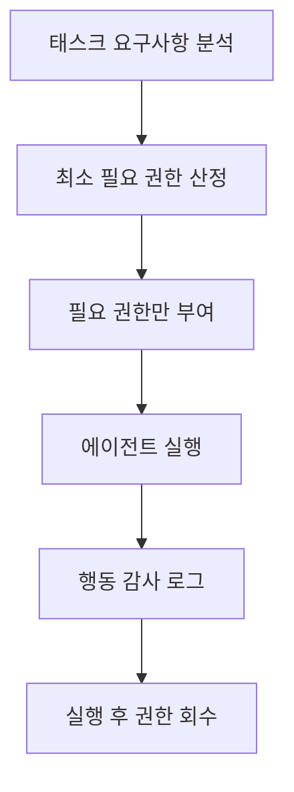

# 최소 발자국 원칙

에이전트가 태스크 수행 시 **필요한 최소한의 권한, 리소스, 부작용**만으로 동작해야 한다는 안전 설계 원칙. OS의 최소 권한 원칙(Principle of Least Privilege)을 AI 에이전트에 적용한 것이다.

## 왜 중요한가

LLM 에이전트는 도구 사용, 파일 시스템 접근, 네트워크 호출 등 실세계에 영향을 미친다. 과도한 권한은:

- 프롬프트 인젝션 시 공격 표면 확대
- 의도치 않은 부작용 (파일 삭제, 잘못된 API 호출)
- 감사 추적 어려움

## 구현 전략

1. **도구 제한**: 태스크에 필요한 도구만 에이전트에 노출. 파일 삭제 불필요 시 읽기/쓰기만 제공
2. **경로 제한**: 파일 시스템 접근을 특정 디렉토리로 제한 ([[agent-sandbox-infrastructure|샌드박스]])
3. **네트워크 제한**: 필요한 엔드포인트만 화이트리스트
4. **비가역성 게이트**: 삭제, 전송 등 되돌릴 수 없는 행동 전 인간 승인 요구

## [[zero-trust-ai-agents|제로 트러스트]]와의 관계

최소 발자국은 에이전트 제로 트러스트의 핵심 구성요소다. "절대 신뢰하지 말고, 항상 검증하라"는 원칙에서 "필요한 것만 허용하라"가 도출된다.

## 관련 문서

- [[agent-safety-alignment]] -- 에이전트 안전성과 정렬
- [[zero-trust-ai-agents]] -- 제로 트러스트 AI 에이전트
- [[agent-sandbox-infrastructure]] -- 에이전트 샌드박스 인프라
- [[owasp-agentic-top-10]] -- OWASP 에이전틱 Top 10
