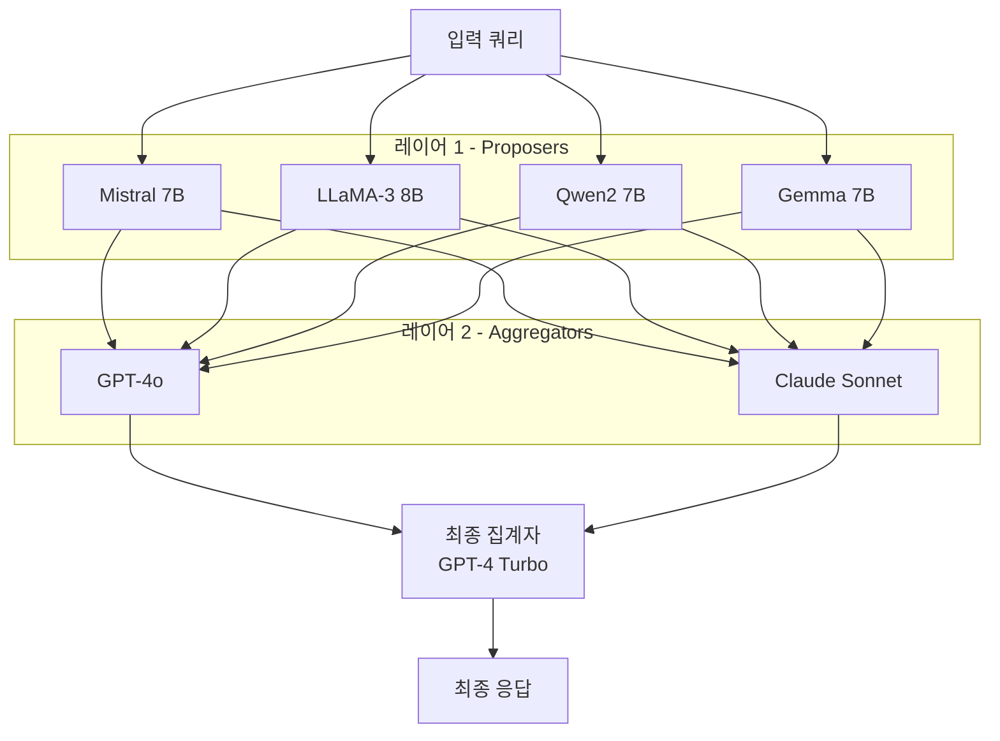

# 에이전트 혼합 (Mixture of Agents, MoA)

이기종(heterogeneous) LLM 여러 개를 레이어로 쌓아 앙상블하는 아키텍처. 각 레이어의 모델들이 독립적으로 응답을 생성하면, 다음 레이어의 집계자(aggregator) 모델이 이를 종합해 더 나은 출력을 만든다. Together AI가 2024년 공개한 논문에서 GPT-4 Turbo를 능가하는 성능을 오픈소스 모델 조합으로 달성해 주목받았다.

## 왜 중요한가

단일 최고 성능 모델 하나보다 여러 모델의 집합이 더 나을 수 있다는 실증적 증거다. 모델들은 서로 다른 학습 데이터, 아키텍처, 강점을 가지므로 각자가 상호 보완적 관점을 제공한다. MoA는 이 다양성을 구조적으로 활용한다. 비용 효율성 측면에서도 가장 비싼 Frontier 모델 하나에 의존하는 대신, 중간 성능 모델들의 조합으로 유사하거나 더 나은 결과를 낼 수 있다.

## 레이어 구조

- **제안자(Proposer)**: 1레이어에 배치된 모델들. 각자 독립적으로 초기 응답을 생성한다.
- **집계자(Aggregator)**: 이전 레이어의 모든 응답을 컨텍스트로 받아 더 정제된 응답을 생성한다.
- 레이어 수는 2~3개가 실용적이다. 레이어가 늘수록 비용과 지연이 선형 증가한다.

## [[mixture-of-experts]]와의 비교

| 구분 | MoE (Mixture of Experts) | MoA (Mixture of Agents) |
|------|--------------------------|-------------------------|
| 단위 | 신경망 내부의 Expert 레이어 | 독립된 LLM 에이전트 |
| 선택 방식 | 게이팅 네트워크가 토큰별 라우팅 | 모든 에이전트가 전체 응답 생성 |
| 병렬성 | 게이팅이 선택한 일부 Expert만 활성화 | 레이어 내 모든 에이전트 동시 실행 |
| 배포 | 단일 모델 파일 내 | 분산 서비스/API 조합 |
| 비용 | 활성 파라미터만 비용 발생 | 모든 에이전트 호출 비용 합산 |

[[mixture-of-experts]]는 모델 내부 아키텍처의 효율화 기법인 반면, MoA는 완성된 모델들을 시스템 레벨에서 앙상블하는 패턴이다.

## 집계 방법론

**연결 집계(Concatenation Aggregation)**: 모든 이전 레이어 응답을 집계자의 프롬프트에 그대로 붙인다. 구현이 단순하지만 컨텍스트가 폭발적으로 증가한다.

**요약 집계(Summary Aggregation)**: 집계자에게 "다음 N개의 응답을 통합해 가장 좋은 답변을 만들어라"는 명시적 지시를 추가한다. 컨텍스트 효율이 높다.

**투표 후 집계(Vote-then-Aggregate)**: 먼저 다수결로 방향을 정한 뒤, 집계자가 정제한다. 편향 감소 효과가 있다.

## [[multi-agent-orchestration]]과의 관계

[[multi-agent-orchestration]]은 에이전트들이 서로 다른 **역할**과 **태스크**를 수행하는 분업 구조다. MoA는 에이전트들이 **동일한 태스크**에 대해 독립적으로 응답을 생성하고 이를 집계하는 앙상블 구조다. MoA는 오케스트레이션 아키텍처 내의 특정 노드(예: 고품질 응답이 필요한 핵심 단계)에 적용될 수 있다.

## 실무 적용 가이드

**언제 사용하나**:
- 단일 최고 모델의 성능이 불충분한 태스크
- 특정 도메인(법률, 의료, 코드)에서 전문 모델들의 강점을 결합하고 싶을 때
- 응답 일관성(consistency)이 중요한 프로덕션 환경

**비용 관리**:
- 1레이어에는 빠르고 저렴한 모델(예: 8B급)을 배치
- 최종 집계만 고성능 모델에 위임하면 비용 대비 효과를 극대화할 수 있다

**병렬 실행**: 같은 레이어 내 에이전트들은 독립적이므로 asyncio.gather() 등으로 병렬 호출해 지연을 줄인다.

## 관련 문서

- [[multi-agent-orchestration]] - 멀티에이전트 오케스트레이션
- [[mixture-of-experts]] - MoE 아키텍처 (모델 내부 기법)
- [[multi-agent-debate]] - 멀티에이전트 디베이트 패턴
