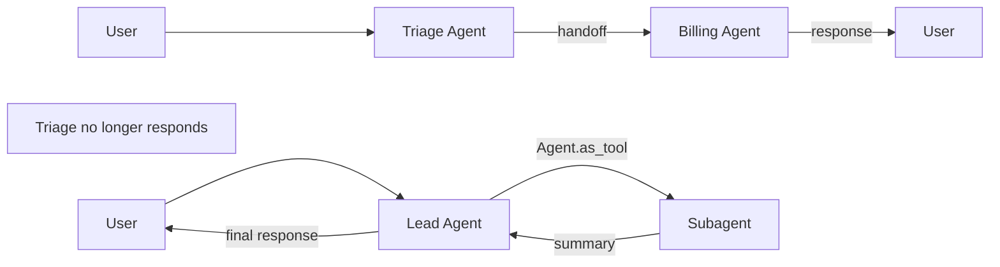
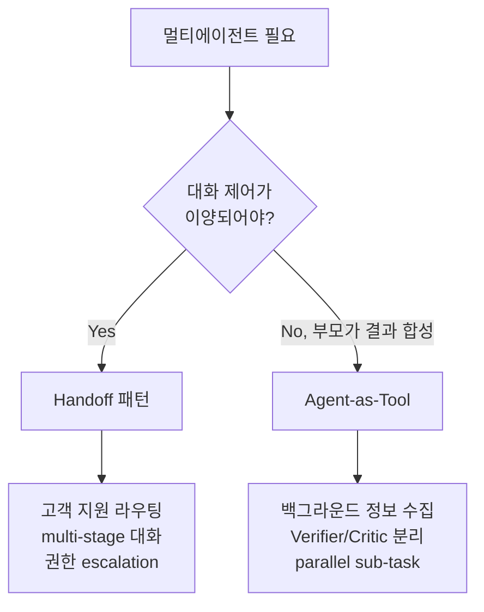

# Multi-agent Orchestration Frameworks

멀티에이전트 조율의 두 핵심 추상은 **handoff** (제어권 이양)와 **agent-as-tool** (도구로서의 에이전트)다. 이 페이지는 두 패턴의 차이, framework-level API의 비교, 그리고 적합한 use case를 정리한다.

> 기존 [[orchestrator-worker-pattern]], [[parent-child-spawn-pattern]], [[swarm-openai-handoffs]] 와 차별화 — 이 페이지는 handoff와 agent-as-tool의 추상 차이, framework 별 primitive(Agent/Handoff/Guardrail), 그리고 input_filter / on_handoff 같은 미세 API에 초점.

## 1. 두 가지 핵심 추상

### Handoff (제어권 이양)
> "Handoffs are the clearest fit when a specialist should own the next response rather than merely helping behind the scenes."

- 대화의 다음 응답을 specialist agent가 담당
- 부모는 더 이상 응답 생성 안 함

### Agent-as-Tool (도구로 호출)
> "The agent-as-tool pattern (`Agent.as_tool()`) is preferred when you want structured input for a nested specialist without transferring the conversation."

- 부모가 specialist에 질의 → 결과를 받아 자기 응답 작성
- 대화 제어권은 부모 유지

### 비교



| 측면 | Handoff | Agent-as-Tool |
|------|---------|---------------|
| 다음 응답 주체 | 새 agent | 부모 agent |
| 사용 시점 | 전문 영역 전환 (지원→영업) | 보조 정보 수집 |
| 제어 흐름 | 일방향 (return 없을 수도) | 양방향 (결과 반환) |
| Input | 메타데이터 (reason, priority) | structured argument |

## 2. OpenAI Agents SDK 3 primitives

> "The Agents SDK has a very small set of primitives: Agents, Handoffs, and Guardrails."

| Primitive | 역할 |
|-----------|------|
| **Agent** | LLM + instructions + tools |
| **Handoffs** | 다른 agent에 제어 이양 |
| **Guardrails** | 입출력 검증 |

### Provider 호환

> "It is provider-agnostic, supporting the OpenAI Responses and Chat Completions APIs, as well as 100+ other LLMs."

→ Anthropic, Google, local 모델 모두 사용 가능.

## 3. handoff() 함수 시그니처

```python
from agents import handoff, Agent

triage = Agent(...)
billing = Agent(...)
support = Agent(...)

triage.handoffs = [
    handoff(
        agent=billing,
        tool_name_override="transfer_to_billing",
        tool_description_override="Transfer to billing specialist",
        on_handoff=on_billing_transfer,
        input_type=BillingHandoffInput,  # Pydantic schema
        input_filter=billing_input_filter,
        is_enabled=True,
        nest_handoff_history=True,
    ),
    handoff(agent=support),
]
```

| 파라미터 | 의미 |
|----------|------|
| `agent` | 이양 대상 agent |
| `tool_name_override` | 기본 `transfer_to_<agent_name>` 변경 |
| `tool_description_override` | LLM이 routing 결정에 사용할 설명 |
| `on_handoff` | callback (data fetching 등) |
| `input_type` | 메타 schema (reason, priority 등) |
| `input_filter` | 다음 agent로 전달되는 입력 가공 |
| `is_enabled` | bool 또는 callable로 동적 제어 |
| `nest_handoff_history` | per-call conversation history nesting |

### on_handoff callback

> "A callback function executed when the handoff is invoked. This is useful for things like kicking off some data fetching as soon as you know a handoff is being invoked."

→ 이양 결정 직후 미리 데이터 fetch 가능. latency 감소 효과.

### input_type 의도

> "Small piece of model-generated metadata such as `reason`, `language`, `priority`, or `summary`. The parsed input passes to `on_handoff` but doesn't replace the receiving agent's main conversation input."

원래 대화 입력을 대체하지 않고 메타데이터로만 활용.

### HandoffInputData 구조

input_filter가 받는 데이터:

| 필드 | 의미 |
|------|------|
| `input_history` | run 이전 대화 |
| `pre_handoff_items` | handoff turn 이전 items |
| `new_items` | 현재 turn (handoff call 포함) |
| `input_items` | 다음 agent에 전달될 (filter된) items |
| `run_context` | RunContextWrapper |

## 4. Recommended Prompt Prefix

```python
from agents.extensions.handoff_prompt import RECOMMENDED_PROMPT_PREFIX, prompt_with_handoff_instructions

agent = Agent(
    name="Triage",
    instructions=f"{RECOMMENDED_PROMPT_PREFIX}\n\nYou are a triage agent.",
    handoffs=[...]
)
```

→ LLM이 handoff 메커니즘을 이해하도록 표준 prompt 삽입. 미사용 시 모델이 handoff tool을 잘못 호출할 가능성.

## 5. Anthropic-style Subagent (비교)

| 측면 | Handoff (OpenAI Agents SDK) | Subagent (Anthropic-style) |
|------|----------------|---------------------|
| 추상 단위 | Agent + Handoff registry | Markdown file (`.claude/agents/<name>/`) |
| 호출 방식 | `transfer_to_X` tool call | Task tool 또는 description 매칭 |
| Context | `nest_handoff_history` 옵션 | 별도 context window (default isolated) |
| 부모 응답 | 없음 (handoff 후 sub가 담당) | 결과 받아 부모가 응답 |
| 모델 혼용 | provider-agnostic | Claude 시리즈 우선 |
| 격리 | history filter | worktree 격리 옵션 |

→ Anthropic 패턴은 **agent-as-tool** 모델에 가까움. OpenAI handoff는 진짜 제어 이양.

자세한 내용은 [[subagent-spawning]] 참조.

## 6. Routine Pattern

OpenAI cookbook은 routine을 "system prompt + tools"의 결합으로 정의:

```python
def routine(instructions: str, tools: list):
    return Agent(instructions=instructions, tools=tools)
```

handoff와 결합하면 multi-routine orchestration:

```
[Triage routine] → handoff → [Billing routine] → handoff → [Refund routine]
```

각 routine은 자기 영역만 알고, 외부는 handoff로 위임.

## 7. Guardrails

### Input Guardrail
```python
@input_guardrail
async def topic_check(ctx, agent, input_data):
    if not_relevant(input_data):
        return GuardrailFunctionOutput(
            output_info="off-topic",
            tripwire_triggered=True,
        )
    return GuardrailFunctionOutput(output_info=None, tripwire_triggered=False)
```

### Output Guardrail
LLM 응답 검증 (PII 누출, jailbreak 탐지 등).

### Tripwire 동작
`tripwire_triggered=True` → 즉시 raise → 후속 처리 차단.

## 8. Handoff vs Agent-as-Tool: 적합 use case



### Handoff 적합 use case
- 고객 지원 라우팅 (triage → billing → refund)
- Multi-stage 대화 (greeter → onboarding → checkout)
- 권한 escalation (read-only → admin)

### Agent-as-Tool 적합 use case
- 백그라운드 정보 수집 (parent가 합성)
- Verifier/Critic 분리
- Parallel sub-task 분배 (research, web_search 등)

## 9. Framework 선택 기준

| 요구 | 권장 |
|------|------|
| Provider-agnostic | OpenAI Agents SDK |
| Claude 단독 환경, 코드 자동화 | Anthropic Subagent |
| 복잡한 state machine + 노드 그래프 | LangGraph |
| 단순 routine 체인 | Cookbook routine 패턴 |

## 10. Production Checklist

- [ ] Recommended prompt prefix 적용
- [ ] Input/Output guardrail 정의
- [ ] on_handoff에서 logging/audit
- [ ] handoff registry를 코드 review 대상에
- [ ] Multi-tenant: tool_name_override로 namespace 격리
- [ ] is_enabled callable로 권한 기반 동적 제어
- [ ] Tracing 도입 (OpenAI Agents SDK는 내장)

## 11. Anti-pattern

- Handoff와 agent-as-tool를 혼동 → 응답 주체 모호
- on_handoff에서 무거운 작업 → handoff latency 증가
- nest_handoff_history 무분별 사용 → context 폭증
- guardrail tripwire 미처리 → uncaught exception 전파
- recommended prompt prefix 미사용 → 모델이 handoff tool을 잘못 호출

## 관련 문서

- [[subagent-spawning]] — Anthropic-style subagent
- [[orchestrator-worker-pattern]] — orchestrator-worker
- [[parent-child-spawn-pattern]] — 부모-자식 spawn
- [[agent-as-tool-pattern]] — agent를 도구로 노출
- [[swarm-openai-handoffs]] — OpenAI Swarm (실험적 전신)
- [[anthropic-multi-agent-research-system]] — Anthropic 사례
- [[multi-agent-orchestration]] — 멀티에이전트 일반
- [[long-horizon-agent-loop]] — long-horizon에서 multi-agent
- [[react-pattern]] — single-agent 대안
