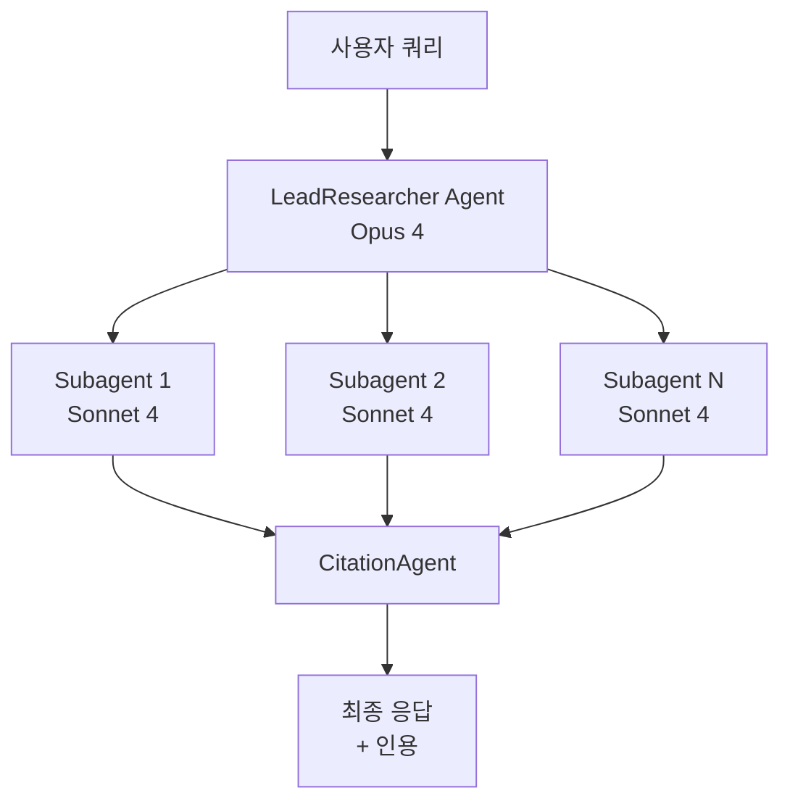
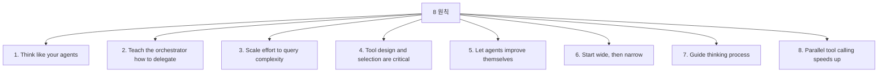

# How We Built Our Multi-Agent Research System (Anthropic Engineering 2025-06)

Anthropic의 6인 저자(Jeremy Hadfield, Barry Zhang, Kenneth Lien, Florian Scholz, Jeremy Fox, Daniel Ford)가 작성한 Anthropic Research 기능의 백엔드 아키텍처 글. **multi-agent system 패턴의 사실상 표준 레퍼런스**.

> **핵심 인사이트**: "agents are essentially long-running, stateful processes"

## 시스템 아키텍처

Anthropic의 Research 기능은 **orchestrator-worker 패턴**을 사용한다:

### 세 핵심 컴포넌트
1. **LeadResearcher Agent** — 사용자 쿼리를 보고 연구 계획을 수립, 서브에이전트 배치 조율
2. **Specialized Subagents** — 병렬로 검색 수행, 독립적인 컨텍스트 윈도우
3. **CitationAgent** — 모든 발견을 받아 문서를 처리하고 인용 위치 식별, 출처 귀속 처리

기존 RAG와의 핵심 차이: 정적 검색이 아니라 **동적·반복적 검색(dynamic, iterative searching)**.

## 성능 메트릭

> "a multi-agent system with **Claude Opus 4 as the lead agent and Claude Sonnet 4 subagents outperformed single-agent Claude Opus 4 by 90.2%** on our internal research evaluation."

### 토큰 경제성

| 시스템 | 토큰 소모 |
|---|---|
| 일반 chat | 1× |
| Single-agent | ~4× |
| Multi-agent | **~15×** |

→ 멀티에이전트 시스템은 **고가치 태스크에서만 경제성**이 있다. 토큰을 효과적으로 활용할 수 있는 작업이어야 함.

## 8가지 프롬프트 엔지니어링 원칙

### 1. Think like your agents
에이전트의 시점에서 시뮬레이션. 도구 출력을 보고 LLM 시점에서 추론을 디버그.

### 2. Teach the orchestrator how to delegate
명확한 목표, 출력 형식, 작업 경계, 도구·소스 가이던스 제공.

### 3. Scale effort to query complexity
| 쿼리 유형 | 적정 규모 |
|---|---|
| 단순 사실 확인 | 1개 서브에이전트 + 3-10 도구 호출 |
| 비교 분석 | 2-4 서브에이전트 |
| 복잡한 연구 | 10+ 서브에이전트 |

### 4. Tool design and selection are critical
도구 설명을 정교하게. **잘못된 도구 = 작업 실패**.

### 5. Let agents improve themselves
모델이 도구 설명과 프롬프트를 자가 진단하고 개선.

### 6. Start wide, then narrow
광범위한 쿼리부터 시작 후 점진적 좁히기. 너무 좁은 쿼리에서 시작하면 결과 적음.

### 7. Guide thinking process
Extended thinking으로 계획·평가를 명시화 ("**interleaved thinking**").

### 8. Parallel tool calling speeds up
**90% 시간 절약 관찰**. 일부 도구 호출은 동시 실행.

## 운영 관점 (Production Engineering Lessons)

### 1. Statefulness compounds errors
- 에이전트는 상태를 유지하므로 작은 오류가 누적·증폭
- 대응: **체크포인트 시스템, 그레이스풀 에러 처리**

### 2. Non-determinism complicates debugging
- 동일 쿼리도 매번 다른 경로. 종래 디버깅 한계
- 대응: **풀 프로덕션 추적(full production tracing)** 필수. 단, 사용자 프라이버시 보호

### 3. Deployment coordination needed
- 장기 실행 에이전트가 배포 중에 상태 불일치 가능
- **Rainbow deployment** 전략: 새 버전과 이전 버전이 동시에 동작하면서 점진 전환

## 평가 (Evaluation)

종래의 "예상 경로 검증"보다 **outcome-focused** 평가:

- LLM-as-judge 점수: 사실 정확성, 인용 정밀도, 완전성, 출처 품질, 효율성
- 인간 테스터 병행: 자동화가 놓치는 엣지 케이스 발견
- **발견 사례**: 초기 에이전트는 SEO 최적화된 콘텐츠 농장을 권위 있는 학술 출처보다 선호 → 명시적 휴리스틱 프롬프트로 교정

## 자주 발생하는 실패 모드

- 단순 쿼리에 50+ 서브에이전트 스폰 (과잉 분배)
- 존재하지 않는 출처를 무한정 검색
- 서브에이전트끼리 과도한 업데이트로 서로 산만하게 함
- 모든 에이전트가 같은 도구를 호출해 중복 작업

## 메모

- 게시일: 2025-06-13
- 본 글은 multi-agent system 패턴의 사실상 표준 레퍼런스

## 관련 문서

- [[anthropic-multi-agent-research-system]] — 기존 가이드 (읽기 가이드 중심)
- [[orchestrator-worker-pattern]] — Orchestrator-Worker 패턴
- [[subagents]] — 서브에이전트
- [[deep-research-agents-roadmap]] — Deep research agents 로드맵
- [[effective-agents-patterns]] — Anthropic 7가지 빌딩 블록
- [[effective-context-engineering-anthropic]] — 컨텍스트 엔지니어링 후속 글
- [[agent-evaluation-framework]] — 에이전트 평가 일반
