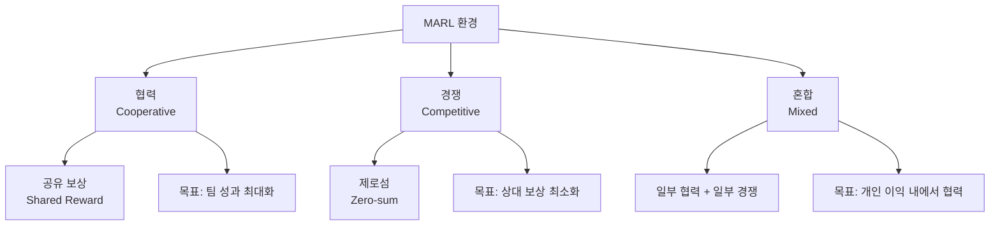
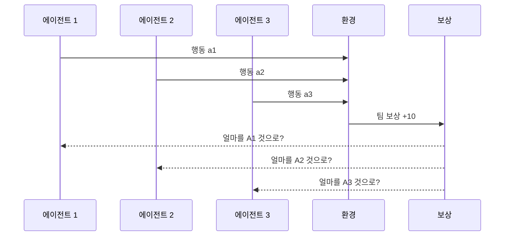
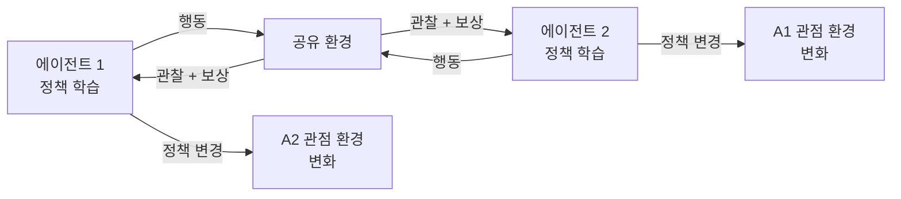

# 멀티에이전트 강화학습 (MARL)

멀티에이전트 강화학습(Multi-Agent Reinforcement Learning, MARL)은 여러 에이전트가 공유 환경에서 상호작용하며 동시에 학습하는 RL 프레임워크다. 단일 에이전트 RL과 달리 각 에이전트의 행동이 다른 에이전트의 보상과 상태에 영향을 미쳐 환경 자체가 비정상적(non-stationary)이 된다.

## 왜 MARL이 필요한가

단일 에이전트로 해결하기 어려운 문제 구조:
- 물리적으로 분산된 시스템 (로봇 군집, 자율주행 차량대)
- 역할 분리가 필요한 복잡한 태스크 (연구 + 실행 + 검증)
- 경쟁자가 존재하는 환경 (게임, 경매, 금융 시장)
- 확장성이 필요한 시스템 (에이전트 수를 늘려 성능 향상)

## MARL의 세 가지 상호작용 모드

**협력 MARL (Cooperative)**
모든 에이전트가 동일한 목표를 공유한다. LLM 기반 멀티에이전트 시스템([[multi-agent-orchestration]])에서 서브에이전트들이 오케스트레이터의 지시에 따라 협력하는 구조가 이에 해당한다.

**경쟁 MARL (Competitive)**
에이전트들이 서로 대립하며 각자 보상을 최대화한다. 자기대결(self-play) 학습이 대표적으로, AlphaGo와 AlphaZero가 이 방법으로 게임에서 초인적 성능을 달성했다.

**혼합 MARL (Mixed)**
팀 내에서 협력하면서 다른 팀과 경쟁하거나, 개인 이익과 집단 이익이 부분적으로 일치하는 복잡한 구조다.

## 핵심 도전: 크레딧 배분 문제

협력 MARL에서 팀 보상(team reward)을 각 에이전트의 기여도에 따라 배분하는 문제가 **크레딧 배분(credit assignment)**이다.

**차이 보상 (Difference Reward)**
에이전트 i가 없었다면 팀 보상이 얼마였을지를 반사실적으로 계산해 그 차이를 i의 기여도로 정의한다.

$$D_i = R_{team}(a_1, ..., a_n) - R_{team}(a_1, ..., a_{i-1}, \hat{a}_i, a_{i+1}, ..., a_n)$$

$\hat{a}_i$는 에이전트 i의 기본(default) 행동이다. 계산 비용이 크지만 기여도 추정이 정확하다.

**중앙화된 비평가 (Centralized Critic)**
학습 시에만 모든 에이전트의 관찰과 행동을 입력으로 받는 전역 가치 함수를 사용하고, 실행 시에는 에이전트가 독립적으로 행동한다. MADDPG, QMIX, MAPPO 등이 이 접근을 사용한다.

## [[policy-gradient-ppo]]와의 관계

[[policy-gradient-ppo]]의 PPO 알고리즘은 MARL로 직접 확장된다. MAPPO(Multi-Agent PPO)는 다음 수정을 적용한다.

| 구성 요소 | 단일 에이전트 PPO | MAPPO |
|-----------|-----------------|-------|
| 정책 | 단일 $\pi_\theta(a|s)$ | 각 에이전트별 $\pi_{\theta_i}(a_i|o_i)$ |
| 가치 함수 | $V(s)$ | $V(s_1,...,s_n)$ 공유 전역 비평가 |
| 보상 | 개인 보상 | 팀 보상 또는 개인+팀 혼합 |
| 업데이트 | 단일 신경망 | 에이전트별 또는 파라미터 공유 |

IPPO(Independent PPO)는 각 에이전트가 다른 에이전트의 존재를 무시하고 독립적으로 학습한다. 이론적으로는 비정상 환경에서 수렴 보장이 없지만 실제로는 많은 협력 태스크에서 MAPPO와 비슷한 성능을 보인다.

## 비정상 환경 문제

MARL에서 각 에이전트의 관점에서 환경은 비정상적(non-stationary)이다. 에이전트 A가 학습하는 동안 에이전트 B도 학습하므로, A가 학습하는 환경이 계속 변한다.

이를 완화하는 기법:
- **중앙화된 학습, 분산화된 실행 (CTDE)**: 학습 시에만 전역 정보를 활용
- **파라미터 공유**: 동일 구조의 에이전트가 파라미터를 공유해 일관성 유지
- **에이전트 모델링**: 다른 에이전트의 정책을 모델링해 예측 가능하게 만들기

## LLM 에이전트 시스템에서의 MARL

[[multi-agent-orchestration]]에서 LLM 기반 에이전트들은 전통적 MARL과 다르게 학습하지 않고 추론만 한다. 그러나 MARL의 개념적 틀은 여전히 유효하다.

- **협력 신호**: 에이전트 간 메시지 품질을 보상으로 사용해 커뮤니케이션 학습
- **역할 특화**: 각 에이전트가 다른 관점을 유지하도록 페르소나를 설계하는 것이 크레딧 배분과 유사한 역할 분리를 만든다
- **결과 귀속**: 멀티에이전트 태스크 완료 후 어떤 에이전트의 기여가 결정적이었는지 분석하는 것이 크레딧 배분 문제의 사후 분석 버전이다

## 실무 관점

- 협력 MARL 시스템에서 에이전트 수가 늘어날수록 크레딧 배분이 어려워진다. 초기에는 2-3개 에이전트로 시작하고 성능이 검증된 후 확장한다.
- LLM 에이전트 시스템에서 "MARL"을 언급하는 논문들은 종종 전통적 RL 학습이 아닌 프롬프트 기반 협력을 다루므로 맥락을 주의해서 읽어야 한다.
- 경쟁 에이전트를 내부 시뮬레이션에 활용(레드팀 vs 블루팀)하면 에이전트의 강건성을 높이는 효과적인 방법이 된다.

## 관련 문서

- [[policy-gradient-ppo]] - MARL의 기반이 되는 PPO 알고리즘
- [[multi-agent-orchestration]] - LLM 기반 멀티에이전트 협력 구조
- [[long-horizon-rl-training-for-agents]] - 장기 보상 신호를 사용하는 에이전트 RL 학습
- [[agent-trees]] - 멀티에이전트 계층 구조와 역할 분배
