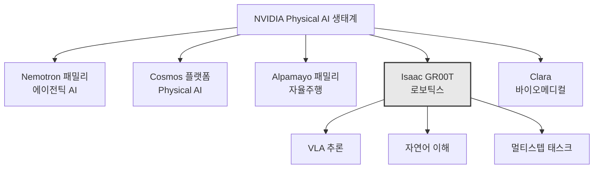

# NVIDIA Isaac GR00T

## 개요

NVIDIA Isaac GR00T은 로봇이 자연어 지시를 이해하고 비전-언어-액션(Vision-Language-Action, VLA) 추론을 사용하여 복잡한 다단계 작업을 수행할 수 있게 하는 **오픈 파운데이션 모델**이다. 2026 National Robotics Week에 맞춰 발표되었으며, NVIDIA Physical AI 생태계의 로보틱스 핵심 축이다.

Embodied AI가 2026년 주요 투자 테마로 부상한 가운데, 데모와 신뢰성 있는 시스템(만 번 연속 무인 운영) 간의 격차가 여전히 과대광고보다 큰 상황이다.

## 핵심 기능

- **자연어 명령 이해**: 사람의 지시를 직접 해석하여 행동으로 변환
- **Vision-Language-Action(VLA) 추론**: 시각 정보 + 언어 이해 + 물리적 행동을 통합
- **복잡한 멀티스텝 태스크 수행**: 단일 명령에서 다단계 작업 계획 및 실행
- **오픈 모델**: 연구 및 상업적 활용을 위해 공개

## NVIDIA Physical AI 생태계

위 다이어그램은 NVIDIA의 Physical AI 생태계에서 Isaac GR00T의 위치를 보여준다. 5개 주요 제품/플랫폼 축 중 로보틱스 전담 파운데이션 모델이다.

## VLA 모델이란

VLA(Vision-Language-Action) 모델은 로봇 파운데이션 모델의 핵심 아키텍처다:

- **Vision**: 카메라/센서로 환경을 인식
- **Language**: 자연어 명령을 이해
- **Action**: 물리적 행동(모터 제어, 그리핑 등)을 출력

이 세 가지를 통합 추론하는 것이 VLA의 핵심이며, GR00T은 이를 오픈 파운데이션 모델로 구현한 대표 사례다.

## 시장 맥락

| 플레이어 | 모델/플랫폼 | 특징 |
|----------|------------|------|
| **NVIDIA** | **Isaac GR00T** | **오픈 VLA, Physical AI 생태계 통합** |
| Tencent | HY-Embodied-0.5 | 22개 벤치마크 16개 SOTA |
| Google | RT-X | 범용 로보틱스 모델 |
| Meta | Ego4D | 1인칭 시점 데이터 기반 |
| AMI Labs | JEPA 기반 | 월드 모델 접근 |

2026년 Embodied AI 분야는 데모에서 실제 배포로 전환되는 과도기에 있다. 핵심 과제는 "만 번 연속 무인 운영"이 가능한 수준의 신뢰성 확보다.

## 관련 문서

- [[hy-embodied]] -- Tencent의 HY-Embodied-0.5 VLA 파운데이션 모델
- [[ami-labs]] -- LeCun의 JEPA 기반 월드 모델 벤처
- [[ai-robotics-physical-ai]] -- Physical AI 및 로보틱스 시장 전반
