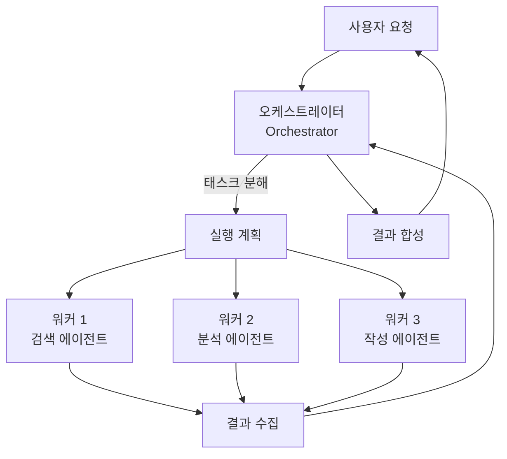
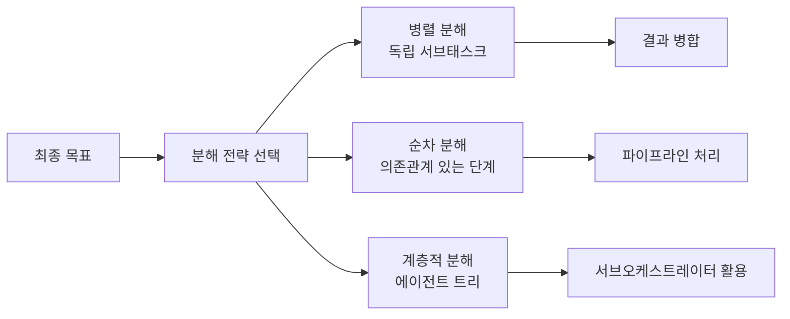

# Orchestrator-Worker Multi-Agent Pattern

리드 에이전트(오케스트레이터, orchestrator)가 작업을 분해하고 병렬 서브에이전트(워커, worker)에게 위임한 뒤 결과를 합성하는 분산형 멀티에이전트(multi-agent) 아키텍처.

## 왜 중요한가

Anthropic이 Claude의 Research 기능 백엔드로 공개한 이 패턴이 단일 Opus 4 대비 90.2% 향상을 보인 이후 사실상 멀티에이전트 표준이 됐다. 2026년 4월 8일 출시된 Claude Managed Agents는 이 패턴을 매니지드 인프라로 제품화했으며, [[anthropic-multi-agent-research-system|Anthropic 멀티에이전트 연구 시스템]]에서 실증됐다.

## 기본 구조



## 역할 정의

| 역할 | 책임 | 특성 |
|------|------|------|
| 오케스트레이터 | 목표 이해, 태스크 분해, 워커 지시, 결과 합성 | 고수준 추론 모델 (예: Claude Opus) |
| 워커 | 특정 서브태스크 수행 (검색, 코드 실행, 문서 작성 등) | 특화 도구 보유, 더 작은 모델 가능 |
| 검증기 (선택) | 워커 출력 품질 평가, 오케스트레이터에 피드백 | Generator-Evaluator 패턴의 평가자 |

## 태스크 분해 전략



## 평면 패턴 vs 계층적 패턴

| 항목 | 평면 오케스트레이터-워커 | 계층적 에이전트 트리 |
|------|--------------------|--------------------|
| 복잡도 | 낮음 | 높음 |
| 적합한 태스크 | 독립 병렬 서브태스크 | 깊은 계획이 필요한 태스크 |
| 오케스트레이터 부하 | 높음 (모든 조율 집중) | 분산 (서브오케스트레이터 위임) |
| 디버깅 용이성 | 쉬움 | 어려움 |

→ 복잡한 장기 계획이 필요한 경우 [[agent-trees|에이전트 트리]] 패턴으로 확장한다.

## Anthropic Research 시스템 사례

Anthropic의 내부 리서치 시스템 공개 수치:
- 단일 Opus 4 대비 **90.2% 성능 향상**
- 병렬 워커 5-10개 동시 운용
- 오케스트레이터: Opus 4 (복잡한 추론)
- 워커: Sonnet 4.5 (빠른 실행)

이 비대칭 모델 조합이 비용과 성능의 최적 균형을 달성했다.

## 구현 패턴 (Claude Agent SDK)

```python
# 오케스트레이터-워커 패턴 개요 (개념 코드)
import anthropic

client = anthropic.Anthropic()

def orchestrator(goal: str):
    # 오케스트레이터: 태스크 분해
    plan = client.messages.create(
        model="claude-opus-4-5",
        messages=[{"role": "user", "content": f"분해: {goal}"}],
        tools=[{"name": "spawn_worker", ...}]
    )
    # 워커: 병렬 실행
    results = [worker(task) for task in plan.tasks]
    # 합성
    return synthesize(results)
```

## 실무 적용 관점

- **모델 계층 선택**: 오케스트레이터에 강력한 추론 모델, 워커에 빠른 모델을 써서 비용 최적화
- **병렬도 한계**: 워커 수가 많아질수록 오케스트레이터 컨텍스트가 길어져 합성 품질 저하 위험. 5-10개가 실용적 상한
- **실패 복구**: 워커 실패 시 오케스트레이터가 재시도 또는 대체 전략을 선택하는 로직 필수
- **컨텍스트 관리**: [[context-folding|컨텍스트 폴딩]]으로 워커 결과를 압축해 오케스트레이터 컨텍스트 절약

## 대표 레퍼런스

- [How we built our multi-agent research system (Anthropic)](https://www.anthropic.com/engineering/multi-agent-research-system)
- [Orchestrator-Workers Workflow Cookbook (Anthropic)](https://github.com/anthropics/anthropic-cookbook/blob/main/patterns/agents/orchestrator_workers.ipynb)
- [Create custom subagents (Claude Code Docs)](https://code.claude.com/docs/en/sub-agents)
- [Building agents with the Claude Agent SDK](https://claude.com/blog/building-agents-with-the-claude-agent-sdk)
- [The Landscape of Agentic Reinforcement Learning for LLMs: A Survey](https://arxiv.org/abs/2509.02547)

## 관련 문서
- [[ag-ui-protocol]] -- AG-UI Protocol (Agent-User Interface Protocol)

- [[ai-hot-topics-2026-04|2026년 4월 AI 개발 핫토픽 100선]]
- [[agent-trees|Hierarchical Planning with Agent Trees]]
- [[context-folding|Context Folding & Sub-Trajectory Compression]]
- [[subagents|Subagents]]
- [[agent-memory-systems|Agent Memory Systems]]
- [[anthropic-multi-agent-research-system|Anthropic 멀티에이전트 연구 시스템]]
