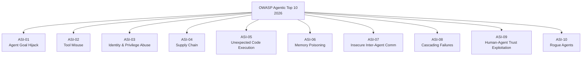

# OWASP Top 10 for Agentic Applications 2026

## 정의

**OWASP Top 10 for Agentic Applications**은 2025년 12월 OWASP GenAI 프로젝트에서 100명 이상의 보안 전문가가 공동 작성한 에이전틱 AI 특화 위협 분류 체계다. 기존 [[llm-security-owasp]]가 모델 입출력 보안에 초점을 맞췄다면, 이 목록은 **에이전트가 자율적으로 도구를 호출하고, 다른 에이전트와 통신하며, 실세계에 행동을 수행하는 과정**에서 발생하는 고유한 위협을 다룬다.

## 왜 지금 중요한가

2026년 4월 기준 기업의 85%가 AI 에이전트를 실험 중이지만, 프로덕션 배포는 5%에 불과하다. 가장 큰 장벽은 능력이 아니라 **신뢰(trust)**다. 에이전트는 텍스트를 생성하는 것이 아니라 실세계에서 **행동**하기 때문에, 기존 LLM 보안 프레임워크로는 커버할 수 없는 공격 표면이 존재한다.

## 10대 위협 목록

### ASI-01: Agent Goal Hijack (에이전트 목표 탈취)

공격자가 악의적 텍스트 콘텐츠를 통해 에이전트의 목적을 변경한다. 에이전트는 지시(instruction)와 데이터(data)를 구분하지 못하기 때문에 간접 [[agent-prompt-injection-defense]]이 핵심 공격 벡터다. 악성 문서, 캘린더 초대, 검색 결과 등을 통해 데이터 유출이나 목표 전환이 발생할 수 있다.

**완화**: 자연어 입력을 신뢰되지 않는 입력으로 처리. 프롬프트 인젝션 필터링, 도구 접근 제한, 중요 목표 변경 시 인간 승인 요구.

### ASI-02: Tool Misuse and Exploitation (도구 오용)

정당한 도구가 모호한 프롬프트나 조작된 입력을 통해 무기화된다. 파괴적 파라미터 호출이나 안전하지 않은 도구 체인이 생성될 수 있다. GitHub Actions 워크플로우에서 신뢰되지 않은 이슈/PR 콘텐츠가 프롬프트에 주입되어 시크릿이 노출된 사례(PromptPwnd 연구)가 대표적이다.

**완화**: 엄격한 권한 스코핑, 샌드박스 실행 환경, 인자 유효성 검사, 모든 도구 호출 지점에서의 정책 제어.

### ASI-03: Identity and Privilege Abuse (신원 및 권한 남용)

에이전트가 상속받은 자격증명, 토큰, 위임 접근이 의도치 않게 재사용, 에스컬레이션, 또는 범위 없이 공유된다. SSH 키가 에이전트 메모리에 캐시되거나, 교차 에이전트 위임에서 경계가 없는 경우가 해당한다.

**완화**: 단기 자격증명, 작업 범위 권한, 정책 기반 인가, 격리된 에이전트 신원.

### ASI-04: Agentic Supply Chain Vulnerabilities (에이전틱 공급망 취약점)

동적으로 가져오는 컴포넌트(도구, 플러그인, [[model-context-protocol-mcp]] 서버, 프롬프트 템플릿)가 손상되어 동작 변경이나 데이터 노출이 발생한다. 악성 MCP 서버가 신뢰된 도구를 사칭하거나, 오케스트레이션 워크플로우의 서드파티 에이전트가 취약한 경우가 해당한다.

**완화**: 서명된 매니페스트, 큐레이션된 레지스트리, 의존성 고정, 샌드박싱, 손상 컴포넌트 킬 스위치.

### ASI-05: Unexpected Code Execution (예기치 않은 코드 실행)

에이전트가 셸 명령, 스크립트, 역직렬화를 포함한 코드를 안전하지 않게 생성 또는 실행한다. 코드 어시스턴트가 생성된 패치를 리뷰 없이 직접 실행하는 것이 전형적이다.

**완화**: 생성된 코드를 신뢰되지 않은 것으로 취급. 직접 평가 기능 제거, 강화된 샌드박스, 실행 전 미리보기/리뷰 단계 필수.

### ASI-06: Memory and Context Poisoning (메모리 및 컨텍스트 오염)

공격자가 에이전트 메모리 시스템, 임베딩, [[agentic-rag]] 데이터베이스, 요약을 오염시켜 이후 결정에 영향을 미친다. 테넌트 간 컨텍스트 유출이나 적대적 콘텐츠 반복 노출에 의한 장기 행동 드리프트가 해당한다.

**완화**: 테넌트별 메모리 분리, 수집 전 콘텐츠 필터링, 데이터 출처 추적, 의심스러운 항목 만료.

### ASI-07: Insecure Inter-Agent Communication (안전하지 않은 에이전트 간 통신)

멀티 에이전트 메시지 교환에 인증, 암호화, 시맨틱 유효성 검사가 없어 가로채기나 지시 주입이 가능하다. 위조된 에이전트 신원, 재전송된 위임 메시지, 보호되지 않은 MCP/[[a2a-protocol]] 통신 채널 변조가 해당한다.

**완화**: 상호 TLS, 서명된 페이로드, 재전송 방지, 인증된 에이전트 발견 메커니즘.

### ASI-08: Cascading Failures (연쇄 장애)

한 에이전트의 오류가 상호 연결된 아키텍처로 인해 계획, 실행, 메모리, 다운스트림 시스템으로 빠르게 전파된다. 환각하는 플래너가 다수 에이전트에 파괴적 작업을 지시하거나, 오염된 상태가 배포/정책 시스템으로 확산되는 사례가 해당한다.

**완화**: 격리 경계, 레이트 리밋, [[circuit-tracing]] 구현, 배포 전 멀티스텝 계획 테스트.

### ASI-09: Human-Agent Trust Exploitation (인간-에이전트 신뢰 악용)

사용자가 에이전트 추천을 과신하여, 공격자나 비정렬 에이전트가 결정에 영향을 미치거나 민감 정보를 추출한다. 코딩 어시스턴트가 미묘한 백도어를 삽입하거나, 금융 코파일럿이 사기 이체를 승인하는 사례가 해당한다.

**완화**: 민감 행동에 대한 강제 확인, 불변 로그, 명확한 위험 표시, 중요 워크플로우에서 설득적 언어 금지.

### ASI-10: Rogue Agents (불량 에이전트)

손상되거나 비정렬된 에이전트가 정당해 보이면서 유해하게 행동한다. 단일 프롬프트 인젝션 이후 지속적 데이터 유출, 승인 에이전트의 무인 승인, 비용 최적화기의 백업 삭제가 해당한다.

**완화**: 엄격한 거버넌스, 샌드박싱, 행동 이상 모니터링, 손상 에이전트용 킬스위치.

## 기존 LLM Top 10과의 차이

| 구분 | LLM Top 10 | Agentic Top 10 |
|---|---|---|
| 초점 | 모델 입출력 | 에이전트의 자율 행동 |
| 공격 표면 | 프롬프트, 학습 데이터 | 도구 호출, 에이전트 간 통신, 메모리 |
| 피해 범위 | 텍스트 생성 오류 | 실세계 행동 (파일 삭제, 금융 이체 등) |
| 방어 패러다임 | 입력 필터링 | [[zero-trust-ai-agents]], 런타임 모니터링 |

## Palo Alto Networks 보안 프레임워크

Palo Alto Networks는 에이전틱 보안을 4가지 기반 역량으로 정리한다:

1. **포괄적 가시성** - 에이전트, 도구, 데이터셋, 모델, 신원 전체 파악
2. **에이전트 중심 인벤토리** - 행동, 권한, 메모리 사용 추적
3. **공급망 무결성** - 프롬프트, 플러그인, 의존성 검증
4. **런타임 제어** - 최소 권한 원칙과 실시간 모니터링

NHI(비인간 신원) 대 인간 신원 비율이 **82:1**에 달해 공격 표면이 급격히 확대되고 있다는 점이 핵심 경고다.

## 대표 자료

- [OWASP Top 10 for Agentic Applications 2026](https://genai.owasp.org/resource/owasp-top-10-for-agentic-applications-for-2026/)
- [Aikido: OWASP Top 10 Agentic Applications 분석](https://www.aikido.dev/blog/owasp-top-10-agentic-applications)
- [Palo Alto Networks: OWASP Agentic AI Security](https://www.paloaltonetworks.com/blog/cloud-security/owasp-agentic-ai-security/)

## 관련 문서

- [[zero-trust-ai-agents]] - ASI-03/07 대응 프레임워크
- [[cisco-defenseclaw]] - ASI-02/04/05 대응 스캐닝 도구
- [[agentmon]] - ASI-08/10 대응 모니터링 플랫폼
- [[nist-ai-agent-standards]] - ASI-03/07 표준화 노력
- [[mcp-server-cards]] - ASI-04 공급망 발견 인프라
- [[agent-prompt-injection-defense]] - ASI-01 프롬프트 인젝션 방어
