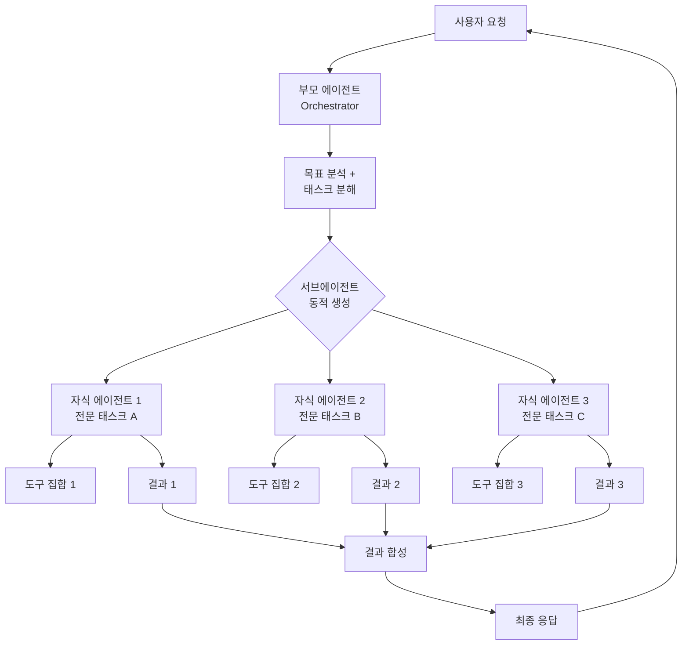
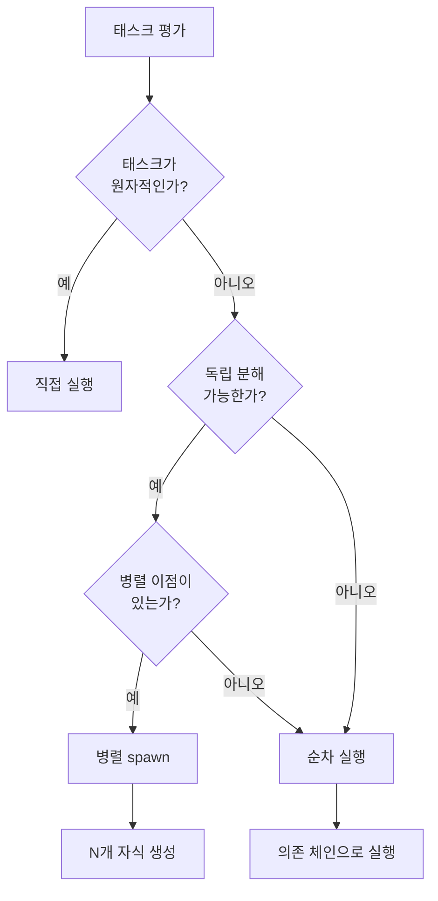
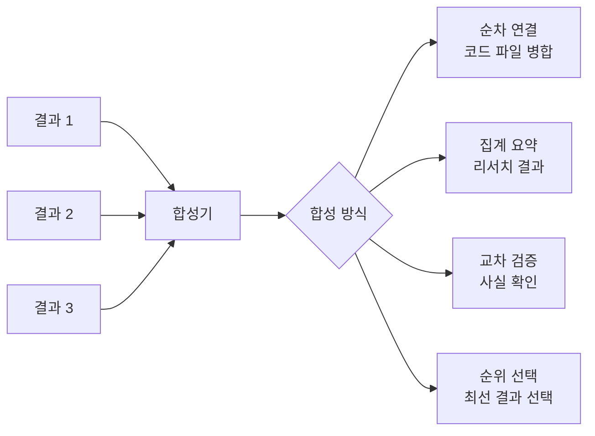
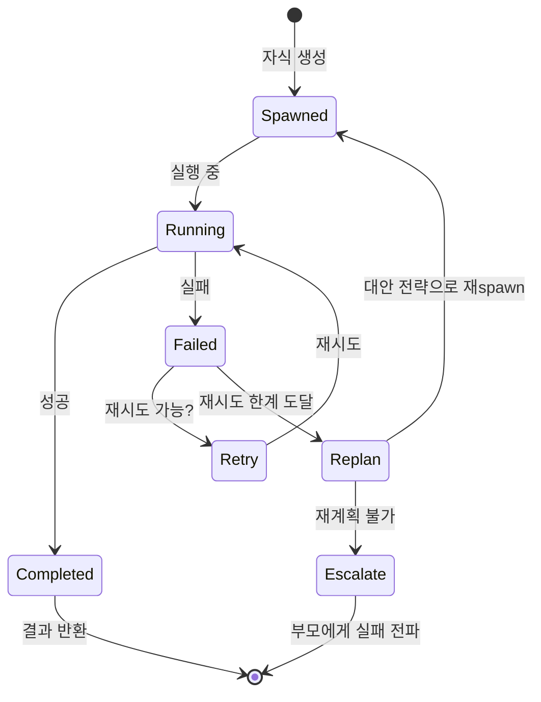

# 부모-자식 에이전트 Spawn 패턴

## 개요

부모-자식 spawn 패턴은 오케스트레이터 에이전트(부모)가 실행 시간에 동적으로 전문화된 서브에이전트(자식)를 생성하고 위임하는 멀티에이전트 아키텍처다. 부모는 전체 목표를 이해하고 분해하며 조율하는 역할을 맡고, 자식은 구체적인 하위 태스크를 독립적으로 수행한다.

이 패턴은 단일 에이전트의 컨텍스트 창 한계를 극복하고, 복잡한 워크플로우를 병렬/계층적으로 처리할 수 있게 한다. Claude Code에서 실제로 사용하는 핵심 에이전트 아키텍처이기도 하다.

## 왜 중요한가

- **규모 확장성**: 태스크 크기에 따라 서브에이전트 수를 동적으로 조정
- **전문화**: 각 자식 에이전트가 특정 도메인이나 도구셋에 특화된 설정을 사용
- **격리**: 자식 실패가 다른 자식이나 부모에게 직접 전파되지 않음
- **병렬성**: 독립적인 자식들을 동시에 실행해 전체 소요 시간 단축
- **컨텍스트 분리**: 각 자식은 자신의 태스크와 관련된 컨텍스트만 보유

## 아키텍처 다이어그램



부모 에이전트는 전체 흐름을 제어하고, 자식 에이전트들은 병렬로 독립 실행된 후 결과를 부모에게 반환한다.

## 핵심 컴포넌트

### 부모 에이전트의 역할

1. **목표 파싱**: 사용자의 고수준 목표를 이해
2. **태스크 분해**: 독립 또는 의존적 하위 태스크로 분할 (→ [[agent-task-decomposition-patterns]])
3. **스폰 결정**: 어떤 자식을 생성할지, 몇 개를 병렬로 생성할지 결정
4. **컨텍스트 주입**: 각 자식에게 필요한 컨텍스트만 선택적으로 전달
5. **결과 합성**: 자식들의 결과를 통합해 최종 응답 생성
6. **오류 처리**: 자식 실패 시 재시도, 재계획, 또는 상위로 전파

### 자식 에이전트의 역할

1. **단일 태스크 집중**: 부모로부터 받은 명확한 목표에만 집중
2. **자체 도구 사용**: 해당 태스크에 필요한 도구만 사용
3. **결과 반환**: 구조화된 형식으로 결과를 부모에게 반환
4. **자기 완결성(self-containedness)**: 부모나 형제 에이전트에게 상태를 직접 의존하지 않음

## Spawn 시점 결정 로직



실무에서는 단순히 "분해 가능하면 spawn"이 아니라, spawn 비용(LLM 호출 오버헤드)과 병렬화 이득을 비교해 결정한다.

## Claude Code에서의 구현

Claude Code는 `Task` 도구를 통해 서브에이전트를 생성한다. 부모 Claude Code 인스턴스가 자식 Claude Code 인스턴스를 spawn하는 구조다.

```python
# Claude Code의 Task 도구 사용 패턴 (의사코드)
# 실제 구현은 Anthropic 내부 도구 스키마 따름

# 부모가 여러 자식 태스크를 병렬로 생성
tasks = [
    Task(
        description="프론트엔드 컴포넌트 구현",
        subagent_type="general-purpose",
        tools=["str_replace_editor", "bash"],
        context=frontend_context
    ),
    Task(
        description="백엔드 API 엔드포인트 구현",
        subagent_type="general-purpose",
        tools=["str_replace_editor", "bash"],
        context=backend_context
    ),
    Task(
        description="테스트 코드 작성",
        subagent_type="general-purpose",
        tools=["str_replace_editor", "bash"],
        context=test_context
    )
]
# 병렬 실행 후 결과 수신
results = await run_parallel(tasks)
```

Claude Code의 실제 패턴에서 주요 특징:
- 각 자식은 독립된 컨텍스트 창을 가진다
- 자식은 부모의 도구 중 허용된 부분집합만 사용
- 부모는 자식의 전체 실행 내용을 컨텍스트에 보유하지 않고 요약만 수신

## 컨텍스트 전달 전략

과도한 컨텍스트는 자식의 성능을 저하시킨다. 선택적 전달이 원칙이다.

| 전달 유형 | 설명 | 예시 |
|-----------|------|------|
| 태스크 명세 | 자식이 해야 할 일의 명확한 기술 | "users 테이블 스키마를 분석하라" |
| 관련 코드/파일 | 태스크 수행에 필요한 파일만 | 관련 모듈 2-3개 |
| 제약 조건 | 따라야 할 규칙이나 인터페이스 | API 스키마, 코딩 컨벤션 |
| 출력 형식 | 반환해야 할 결과 형식 | JSON 스키마, 파일 경로 |
| 전역 맥락 | 전체 프로젝트의 필수 배경만 | 프로젝트 개요 1-2줄 |

## 결과 합성 패턴

자식들의 결과를 부모가 합성하는 방법은 태스크 성격에 따라 달라진다.



- **순차 연결(concatenation)**: 각 자식이 독립된 파일이나 모듈을 생성한 경우
- **집계 요약(aggregation)**: 여러 소스에서 정보를 수집한 경우
- **교차 검증(verification)**: 자식들이 동일 문제를 다른 방식으로 접근한 경우
- **순위 선택(ranking)**: 여러 후보 중 최선을 선택하는 경우

## 오류 처리 및 복구



**재시도 정책**: 일시적 오류(도구 호출 실패 등)는 동일 자식으로 재시도  
**재계획 정책**: 태스크 자체가 잘못 설계된 경우 부모가 재분해  
**에스컬레이션(escalation)**: 복구 불가 시 부모가 사용자에게 보고

## 깊이 제한과 재귀 spawn

자식 에이전트가 다시 자신의 자식을 spawn하는 재귀 구조가 가능하다. 단, 깊이 제한(depth limit)이 필수다.

```
부모 (깊이 0)
├─ 자식 A (깊이 1)
│   ├─ 손자 A1 (깊이 2)
│   └─ 손자 A2 (깊이 2)
└─ 자식 B (깊이 1)
    └─ 손자 B1 (깊이 2)  ← 여기서 더 이상 spawn 금지 (max_depth=2)
```

Claude Code에서는 기본적으로 재귀 spawn 깊이를 제한한다. 깊이가 깊어질수록 비용이 기하급수적으로 증가한다.

## 보안 고려사항

- **권한 위임(permission delegation)**: 자식에게 최소 권한 원칙 적용. 부모의 전체 권한을 자동 상속하지 않음
- **샌드박스(sandbox)**: 자식의 파일시스템/네트워크 접근 범위를 명시적으로 제한
- **프롬프트 주입(prompt injection) 방지**: 자식이 처리하는 외부 데이터가 자식의 지시를 변조하지 못하도록 입력 검증
- **결과 검증**: 자식이 반환한 코드나 명령어를 부모가 무조건 신뢰하지 않고 검증

## 비용 최적화

과도한 spawn은 LLM API 비용을 급격히 증가시킨다.

| 전략 | 설명 |
|------|------|
| 태스크 배칭(batching) | 작은 독립 태스크들을 하나의 자식에게 묶어서 위임 |
| 모델 선택 | 단순 태스크는 소형 모델의 자식, 복잡 태스크는 대형 모델 |
| 캐싱(caching) | 동일 입력의 자식 결과 재사용 |
| 조기 종료 | 충분한 결과가 모이면 남은 자식 실행 취소 |

[[agent-cost-optimization]] 페이지에서 더 상세한 비용 전략을 다룬다.

## 한계 및 트레이드오프

### 장점
- 컨텍스트 창 한계 극복
- 병렬 실행으로 속도 향상
- 각 자식의 독립 실패 격리

### 단점
- **조율 오버헤드**: 부모의 분해-합성 로직이 복잡해질수록 오류 가능성 증가
- **비용 증가**: 자식 수에 비례한 LLM 호출 비용 (multi-agent는 single-turn chat의 약 15배)
- **디버깅 난이도**: 분산 실행이므로 오류 추적이 단일 에이전트보다 복잡
- **컨텍스트 손실**: 자식들 간 암묵적 지식 공유가 어려움

## 격리 4계층 (2026 갱신)

| 계층 | 메커니즘 |
|------|----------|
| Context isolation | 별도 context window (default) |
| Worktree isolation | `isolation: worktree` — 임시 git worktree에서 실행 |
| Permission isolation | `tools` / `disallowedTools` 필드로 도구 제약 |
| Model isolation | per-subagent `model` 필드 (Lead Opus + Workers Sonnet/Haiku) |

자세한 내용과 프레임워크별 비교는 [[subagent-spawning]] 참조.

## Production 운영 lessons

- **Rainbow deployments**: 진행 중인 long-running agent를 깨뜨리지 않도록 신구 버전 traffic 점진 이동
- **Checkpoint resume이 restart보다 중요**: 한 자식 실패가 cascade되지 않도록
- **Production tracing**: 비결정적 실패 디버깅 필수 (privacy 고려)
- **Skill 자동 상속 X**: 부모의 skill을 자식이 자동으로 받지 않음, `skills` 필드로 명시 필요
- **재귀 spawn 차단**: 대부분의 시스템은 자식이 다시 자식을 spawn하는 것을 막음 (무한 분기 방지)

## 관련 문서

- [[subagent-spawning]] - production lessons + frontmatter 신규 필드 (isolation/memory/effort)
- [[agent-task-decomposition-patterns]] - 태스크를 어떻게 분해할 것인가
- [[agent-as-tool-pattern]] - 에이전트를 도구처럼 노출하는 패턴
- [[multi-agent-orchestration]] - 멀티에이전트 오케스트레이션 전반
- [[multi-agent-orchestration-frameworks]] - handoff vs subagent 비교
- [[hierarchical-agents]] - 계층적 에이전트 구조
- [[agent-cost-optimization]] - 에이전트 비용 최적화 전략
- [[agent-safety-alignment]] - 에이전트 안전성 및 권한 관리
- [[agent-circuit-breaker]] - 자식 실패 시 회로 차단 패턴
- [[long-horizon-agent-loop]] - long-horizon에서 부모-자식 활용
