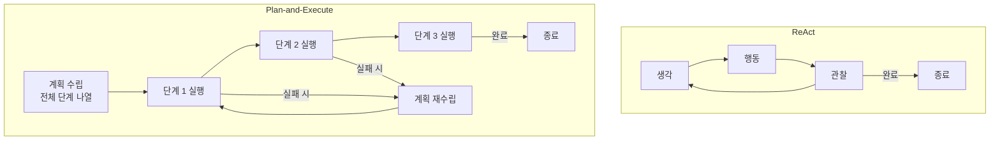
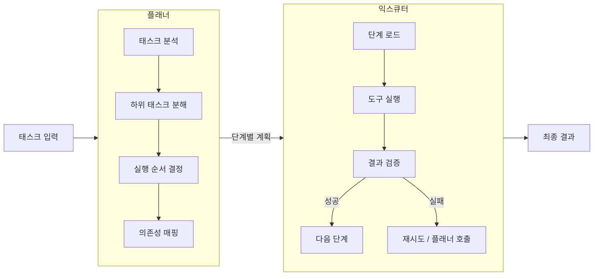
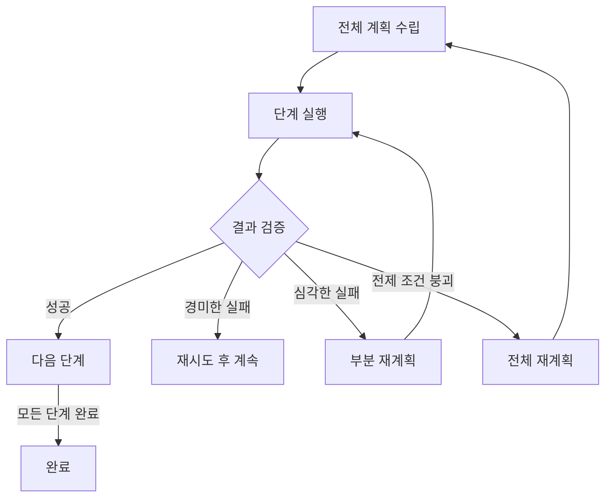

# 플랜-앤-익스큐트 패턴 (Plan-and-Execute)

플랜-앤-익스큐트(Plan-and-Execute)는 에이전트가 태스크 실행 전에 **전체 계획을 먼저 수립**한 다음 각 단계를 순서대로 실행하는 2단계 아키텍처다. 각 스텝에서 다음 행동을 즉석으로 결정하는 [[react-pattern]]과 대조되며, 복잡하고 예측 가능한 태스크에서 더 일관된 성능을 보인다.

## ReAct와의 구조적 차이



ReAct는 각 스텝에서 "지금 뭘 해야 하나"를 결정하는 반면, Plan-and-Execute는 실행 전에 "무엇을 어떤 순서로 할지"를 완성한다.

## 플래너와 익스큐터 분리

플랜-앤-익스큐트의 핵심 설계 원칙은 계획 수립과 실행을 담당하는 컴포넌트를 분리하는 것이다.



플래너는 전략적 사고에 최적화된 고성능 모델(예: Opus)을 사용하고, 익스큐터는 비용 효율적인 모델(예: Haiku)을 사용하는 이중 모델 구성이 일반적이다.

## [[agent-planning-strategies]]와의 관계

[[agent-planning-strategies]]에서 다루는 다양한 계획 기법 중 플랜-앤-익스큐트는 가장 구조화된 형태에 해당한다. 계획 수립 단계에서 사용하는 세부 기법은 다음과 같다.

**계층적 태스크 분해 (HTN)**
복잡한 목표를 점진적으로 세분화한다. 예: "보고서 작성" → "데이터 수집", "분석", "작성", "검토" → 각 단계의 구체적 작업.

**의존성 분석**
태스크 간 선후 관계를 파악해 병렬 실행 가능한 단계를 식별한다. 의존성이 없는 단계는 동시에 실행해 전체 시간을 단축한다.

**실패 예측 계획**
각 단계에서 발생 가능한 실패 시나리오와 대응 방안을 계획 수립 시점에 포함한다.

## [[react-pattern]] 대비 장단점

| 기준 | Plan-and-Execute | ReAct |
|------|-----------------|-------|
| 적합한 태스크 | 예측 가능하고 단계가 명확한 태스크 | 탐색적이고 불확실한 태스크 |
| 일관성 | 높음: 전체 구조가 사전 정의됨 | 낮음: 각 스텝이 이전 관찰에 의존 |
| 유연성 | 낮음: 예상치 못한 상황에 취약 | 높음: 실시간으로 전략 조정 |
| 컨텍스트 효율 | 높음: 각 실행 스텝이 전체 계획을 볼 필요 없음 | 낮음: 누적 이력이 컨텍스트 소비 |
| 디버깅 | 쉬움: 계획이 명시적으로 존재 | 어려움: 의사결정 근거 추적 필요 |

## 동적 재계획 (Dynamic Replanning)

순수한 플랜-앤-익스큐트는 실행 도중 발생하는 예상치 못한 상황에 취약하다. 현실적 구현은 **조건부 재계획** 메커니즘을 포함한다.



재계획 트리거 기준을 명확히 정의하는 것이 중요하다. 너무 자주 재계획하면 ReAct와 다를 바 없어지고, 너무 드물게 재계획하면 잘못된 방향으로 계속 진행하는 문제가 생긴다.

## 실제 구현 예시

LangGraph를 이용한 간단한 플랜-앤-익스큐트 구현 구조:

```python
from langgraph.graph import StateGraph
from typing import TypedDict, List

class AgentState(TypedDict):
    task: str
    plan: List[str]        # 플래너가 생성한 단계 목록
    current_step: int      # 현재 실행 중인 단계 인덱스
    results: List[str]     # 각 단계의 실행 결과

def planner_node(state: AgentState) -> AgentState:
    # LLM으로 전체 계획 수립
    plan = llm.invoke(f"다음 태스크를 단계별로 분해하라: {state['task']}")
    return {**state, "plan": plan.steps, "current_step": 0}

def executor_node(state: AgentState) -> AgentState:
    # 현재 단계를 도구로 실행
    step = state["plan"][state["current_step"]]
    result = execute_step(step, state["results"])
    return {**state, "results": [*state["results"], result],
            "current_step": state["current_step"] + 1}
```

## 실무 관점

- 플랜-앤-익스큐트는 태스크가 충분히 예측 가능하고 반복적일 때 ROI가 높다. 매번 다른 탐색이 필요한 연구형 태스크에는 ReAct가 더 적합하다.
- 계획 단계에서 단계 수를 너무 세분화하면 오버헤드가 증가한다. 5-10개 고수준 단계로 계획하고 각 단계 내에서 ReAct를 사용하는 하이브리드 접근이 실용적이다.
- 계획 결과를 사용자에게 먼저 보여주고 확인을 받는 human-in-the-loop 포인트를 계획-실행 사이에 추가하면 전체 실행의 신뢰도가 높아진다.

## 관련 문서

- [[agent-planning-strategies]] - 플랜-앤-익스큐트에서 사용하는 다양한 계획 수립 기법
- [[react-pattern]] - 즉석 결정 방식인 ReAct와의 비교
- [[belief-desire-intention]] - BDI 모델에서 욕구를 의도로 변환하는 계획 과정
- [[orchestrator-worker-pattern]] - 플래너-익스큐터를 오케스트레이터-워커로 구현하는 패턴
