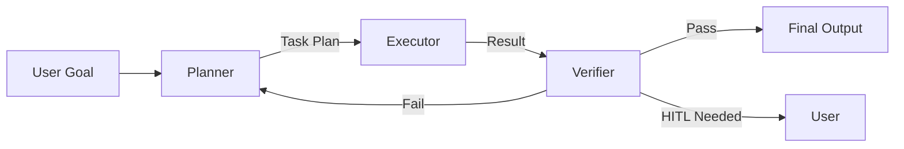

# Planner-Executor-Verifier 분리 패턴 비교

목표를 sub-task로 분해하는 Planner, 실행하는 Executor, 결과를 검증하는 Verifier의 3-역할 분리 패턴이 LangGraph/CrewAI/AutoGen/OpenAI Agents SDK에서 어떻게 표현되는지 비교한다.

## 핵심 패턴 (3-Role 분리)



### 역할 정의

| 역할 | 책임 | 실패 시 |
|---|---|---|
| Planner | 목표를 sub-task로 분해, 순서 결정 | Plan 재생성 |
| Executor | 각 sub-task 실행, tool 호출 | Retry 또는 verifier 통보 |
| Verifier | 결과 검증, 품질 체크 | Planner에 피드백 또는 HITL escalate |

## 4개 프레임워크 아키텍처 철학

> AutoGen treats work as a conversation, CrewAI mirrors a human team, LangGraph enforces a state machine, and OpenAI's SDK keeps orchestration intentionally lightweight.

### LangGraph

> Extends LangChain into a graph-based architecture that treats agent steps like nodes in a directed acyclic graph. Each node handles a prompt or sub-task, and edges control data flow and transitions.

특징:
- **State machine 기반**: node + edge로 워크플로우 정의
- **Failure encoded in graph**: error edge → 보상 액션 또는 last checkpoint roll back
- **Granular control over partial restarts**
- **Observability**: LangSmith tracing 1st-class
- **러닝커브 가장 높음** (10-14 engineer-days)

```python
# 의사 코드 예시
graph = StateGraph(State)
graph.add_node("planner", planner_fn)
graph.add_node("executor", executor_fn)
graph.add_node("verifier", verifier_fn)
graph.add_edge("planner", "executor")
graph.add_conditional_edges(
    "verifier",
    lambda s: "planner" if s["needs_replan"] else "end"
)
```

### CrewAI

> Models multi-agent collaboration as a team ("crew") of role-playing agents. You define each agent's role, backstory, and goal, then assemble them into a crew with a set of tasks.

특징:
- **Human team 모델**: 각 agent에 역할/배경/목표 부여
- **Manager-Worker pattern**: manager agent가 specialists에 well-scoped task 위임
- **빠른 prototyping** (2-3 engineer-days로 데모)
- **Observability 약함**: delegation chain tracing 제한적

```python
# 의사 코드
planner = Agent(role="Planner", goal="Break down requirements", ...)
coder = Agent(role="Coder", goal="Implement features", ...)
reviewer = Agent(role="Reviewer", goal="Check quality", ...)
crew = Crew(agents=[planner, coder, reviewer], tasks=[...])
```

### AutoGen (Microsoft)

> Orchestrates agents through structured turn-taking: each participant—writer, critic, executor—posts a message, waits, then reacts. This enables iterative refinement loops that shine in code-generation scenarios.

특징:
- **Conversation 기반**: agents가 메시지 주고받으며 협업
- **Specialized roles**: planner, coder, critic, safeguard
- **Iterative refinement**: 수용 기준 충족까지 반복
- **5-7 engineer-days**
- **Observability 향상 중**, 보통 custom work 필요

### OpenAI Agents SDK

- **Lightweight orchestration** 의도
- 가장 단순한 mental model
- Production control 측면에서는 제한적

## Planner-Executor-Verifier를 각 프레임워크가 어떻게 표현하나

### LangGraph 방식

> Encodes failures directly in the graph; a node can branch to an "error edge," trigger compensating actions or roll back to the last checkpoint.

- planner/executor/verifier를 명시 node로
- conditional edge로 success/fail 라우팅
- checkpoint로 partial restart

### CrewAI 방식

> A manager agent delegates well-scoped tasks to specialists, aggregates results and pushes the project forward.

- manager = planner + verifier 하이브리드
- specialists = executors
- 결과 aggregation 자동

### AutoGen 방식

> Specialized roles—planner, coder, critic, safeguard—iterate through multi-turn dialogues, refining plans until outcomes meet acceptance criteria.

- planner agent 별도
- coder = executor
- critic = verifier
- safeguard = HITL gate

## 비교 표

| 차원 | LangGraph | CrewAI | AutoGen | OpenAI SDK |
|---|---|---|---|---|
| 모델 | DAG state machine | Role-playing crew | Conversation turns | Lightweight orchestration |
| Planner-Executor-Verifier | Explicit nodes | Manager + Specialists | Specialized agents | 의도적 단순 |
| Failure handling | error edge / checkpoint | Manager re-delegation | Critic loop | Custom |
| Observability | LangSmith (1st class) | 제한적 | 향상 중 | 단순 |
| Dev speed | 10-14 days | 2-3 days | 5-7 days | 빠름 |
| Production control | 가장 강함 | 중간 | 중간 | 제한적 |

## OpenHands (참고)

OpenHands (전 OpenDevin)는 오픈소스 software engineer agent로, ICLR 2025에 논문이 채택된 학술/산업 협력 프로젝트다 (MIT 라이선스).

- **이벤트 스트림 아키텍처**: 모든 agent-environment 상호작용이 typed event로 중앙 허브를 통과 (User Message → Agent → LLM → Action → Runtime → Observation → Agent)
- **CodeAct 프레임워크**: 기본 generalist agent인 `CodeActAgent`가 자연어 대화 또는 코드 실행(bash, Python, browser) 중 하나를 매 step마다 선택
- **Sandbox runtime**: Docker 기반 OS, bash shell, web browser, IPython server를 격리 환경에서 제공
- **Multi-agent delegation**: `AgentDelegateAction`을 통해 한 agent가 다른 agent에게 sub-task 위임 (예: CodeActAgent → BrowsingAgent)
- planner/executor/verifier를 *명시 역할*로 분리하기보다, generalist agent가 필요할 때만 specialized agent로 위임하는 *동적 분기* 모델

따라서 OpenHands는 LangGraph의 명시 state machine이나 CrewAI의 명시 role assignment보다 *event-sourced delegation*에 가까운 패러다임이다.

## Verifier 패턴의 변종

| 변종 | 동작 |
|---|---|
| Critic loop | Verifier feedback → Planner re-plan |
| HITL gate | Verifier가 필요 시 사용자 escalate (Replit Agent) |
| Test-driven | 자동 test 실행 + pass까지 반복 (Replit Agent 3) |
| Self-consistency | 여러 executor 결과 비교 |
| External judge | LLM-as-Judge로 결과 평가 |

## 핵심 인사이트

1. **State machine vs Conversation vs Crew**: 4개 프레임워크가 각각 다른 mental model
2. **Failure handling이 차별점**: LangGraph는 graph 안에 명시 (가장 enterprise-friendly), 나머지는 implicit
3. **빠른 시작 vs 정밀 제어**: CrewAI 빠르고, LangGraph 강력
4. **Observability**: LangGraph가 currently 가장 성숙 (LangSmith)
5. **Verifier가 critic이자 HITL gate**: 단순 quality check 넘어 사용자 fallback
6. **DSL/Code generation > raw function calling**: Replit이 reliability 향상 (별도 사례)

## 관련 문서

- [[plan-and-execute-pattern]] — plan-then-execute 일반 패턴
- [[production-agent-architectures]] — Devin/Replit/Copilot Workspace 비교
- [[agent-task-decomposition-patterns]] — task decomposition 전반
- [[agent-self-correction]] — verifier feedback loop
- [[agent-saga-pattern]] — failure recovery 변종
- [[agent-state-machine]] — state machine 기반 설계
- [[langgraph-agent]] — LangGraph 메인 (있다면)
- [[autogen]] — AutoGen 메인
- [[ag2]] — AutoGen 후속
- [[agent-failure-modes-error-budget]] — production 실패 모드

## 참고

- Galileo 비교: https://galileo.ai/blog/autogen-vs-crewai-vs-langgraph-vs-openai-agents-framework
- Langfuse 오픈소스 비교: https://langfuse.com/blog/2025-03-19-ai-agent-comparison
- DataCamp 튜토리얼: https://www.datacamp.com/tutorial/crewai-vs-langgraph-vs-autogen
- Composio 비교: https://composio.dev/content/openai-agents-sdk-vs-langgraph-vs-autogen-vs-crewai
- OpenAgents 2026 비교: https://openagents.org/blog/posts/2026-02-23-open-source-ai-agent-frameworks-compared
