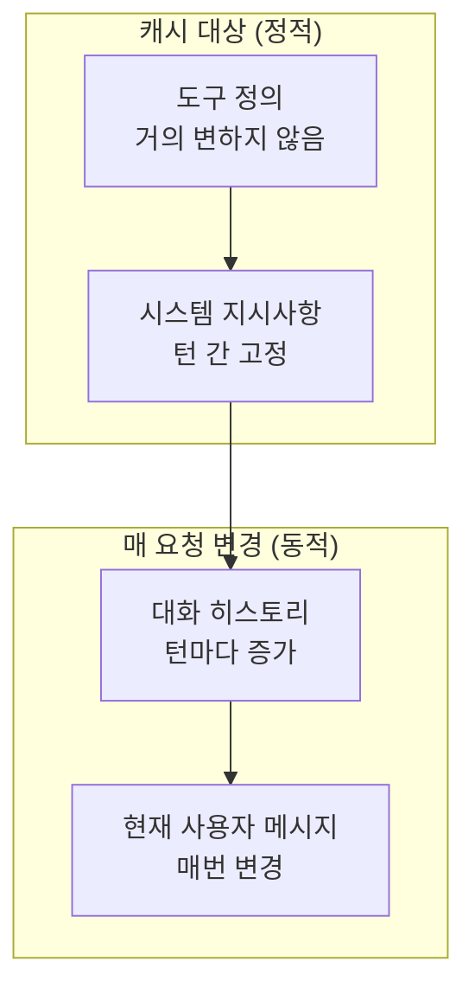

## 개요

프롬프트 캐싱은 멀티턴 [[agentic-ai-foundation|에이전트]] 대화에서 반복되는 정적 프리픽스(시스템 프롬프트, 도구 정의, 컨텍스트)를 캐시에 저장하고 재사용하여 비용과 지연 시간을 최대 90%까지 절감하는 기술이다. 에이전트가 [[tool-calling-optimization|도구를 반복 호출]]하며 수십 턴의 대화를 수행하는 워크로드에서 특히 효과적이다. [[context-folding|컨텍스트 폴딩]]과 함께 long-horizon 비용 절감의 핵심 기법이다.

## 핵심 개념

### 프로바이더별 캐싱 방식 비교

| 특성 | Anthropic (Claude) | OpenAI | Google |
|------|-------------------|--------|--------|
| 캐싱 방식 | 명시적 (`cache_control` 파라미터) | 자동 (1,024+ 토큰 자동 캐싱) | 자동 |
| 캐시 TTL | 5분 / 1시간 선택 | 5-10분 (비피크: 1시간) | 자동 관리 |
| 비용 절감 | 읽기 90% 절감, 쓰기 25% 추가 | 읽기 50% 절감, 쓰기 무료 | 자동 |
| 최대 브레이크포인트 | 4개 | 자동 | 자동 |
| 지연 시간 절감 | 최대 85% | 최대 80% | 가변 |

Anthropic의 90% 읽기 할인은 안정적 콘텐츠가 많은 에이전트 워크로드에 유리하고, OpenAI의 무료 쓰기는 프롬프트가 자주 변경되는 경우에 유리하다.

### 정적 프리픽스 설계 패턴

에이전트 워크로드에서 캐시 효율을 극대화하는 핵심은 변하지 않는 콘텐츠를 메시지 앞부분에 배치하는 것이다:



### 비용 구조

| 유형 | 비용 배율 | Claude Opus 4.6 | Claude Sonnet 4.6 | Claude Haiku 4.5 |
|------|----------|----------------|-------------------|-----------------|
| 일반 입력 | 1x | $5 / MTok | $3 / MTok | $1 / MTok |
| 캐시 쓰기 (5분) | 1.25x | $6.25 / MTok | $3.75 / MTok | $1.25 / MTok |
| 캐시 쓰기 (1시간) | 2x | $10 / MTok | $6 / MTok | $2 / MTok |
| **캐시 읽기** | **0.1x** | **$0.50 / MTok** | **$0.30 / MTok** | **$0.10 / MTok** |

캐시 히트 시 일반 입력 대비 90% 비용 절감이 가능하다. 도구 정의 + 시스템 프롬프트가 수만 토큰인 에이전트에서는 턴당 수 달러의 절감 효과가 발생한다.

### 캐시 수명(TTL)

- **기본**: 5분 TTL, 접근 시 무료 갱신
- **확장**: 1시간 TTL (`"ttl": "1h"`), 도구 호출 간격이 5분을 넘는 장시간 에이전트에 적합
- **혼합 규칙**: 1시간 항목이 5분 항목보다 먼저 배치되어야 함

## 기술 상세

### 자동 캐싱 vs. 명시적 캐싱

**자동 캐싱 (멀티턴 대화 권장)**: 최상위 레벨에 `cache_control`을 설정하면 시스템이 마지막 캐시 가능 블록에 자동으로 브레이크포인트를 적용하고, 대화가 성장하면 자동으로 전진시킨다.

```python
response = client.messages.create(
    model="claude-opus-4-6",
    cache_control={"type": "ephemeral"},  # 자동 캐싱
    system="장문 시스템 프롬프트...",
    messages=[...]
)
```

**명시적 캐싱 (세밀한 제어)**: 개별 콘텐츠 블록에 직접 `cache_control`을 배치하여 최대 4개 브레이크포인트를 독립적으로 관리한다. 순서는 반드시 `tools` -> `system` -> `messages`이어야 한다.

### 다중 브레이크포인트 전략

최대 4개 브레이크포인트를 설정하여 변경 빈도가 다른 섹션을 독립적으로 캐싱할 수 있다:

1. **도구 정의 끝**: 가장 안정적인 영역
2. **시스템 프롬프트 끝**: 세션 내 고정
3. **지식 베이스/컨텍스트 끝**: 간헐적 갱신
4. **대화 히스토리 끝**: 턴마다 증가

```json
{
  "tools": [
    { "name": "search", "cache_control": { "type": "ephemeral" } }
  ],
  "system": [
    { "type": "text", "text": "지시사항...",
      "cache_control": { "type": "ephemeral" } }
  ]
}
```

### 캐시 무효화 규칙

변경이 발생하면 계층적으로 하위 캐시가 모두 무효화된다:

| 변경 사항 | 도구 캐시 | 시스템 캐시 | 메시지 캐시 |
|----------|---------|-----------|-----------|
| 도구 정의 변경 | 무효 | 무효 | 무효 |
| 웹 검색/인용 토글 | 유지 | 무효 | 무효 |
| tool_choice 파라미터 | 유지 | 무효 | 무효 |
| 이미지 포함 여부 | 유지 | 무효 | 무효 |
| thinking 파라미터 | 유지 | 무효 | 무효 |
| 메시지만 변경 | 유지 | 유지 | 무효 |

### 모델별 최소 캐시 길이

| 모델 | 최소 캐시 가능 토큰 |
|------|-------------------|
| Claude Mythos Preview / Opus 4.6 / Opus 4.5 | 4,096 |
| Claude Sonnet 4.6 / Haiku 4.5 | 2,048 |
| Claude Sonnet 4.5 / Opus 4.1 / Opus 4 / Sonnet 4 | 1,024 |

최소 길이 미만 요청은 오류 없이 성공하지만 캐싱되지 않는다. 응답의 `cache_creation_input_tokens`와 `cache_read_input_tokens`가 모두 0이면 캐싱이 적용되지 않은 것이다.

### 룩백 윈도우와 장기 대화

시스템은 최대 **20개 블록을 역방향으로 탐색**하여 이전 캐시 항목을 찾는다. 20개 블록을 초과하는 장기 대화에서는 중간 위치에 명시적 브레이크포인트를 추가해야 한다. 흔한 실수는 매 요청 변경되는 콘텐츠(타임스탬프, 사용자 메시지)에 브레이크포인트를 배치하는 것인데, 이 경우 매번 캐시 미스가 발생한다. 브레이크포인트는 반드시 정적 프리픽스의 끝에 배치해야 한다.

### 캐시 성능 모니터링

API 응답의 `usage` 필드에서 캐시 효과를 추적한다:

```json
{
  "usage": {
    "input_tokens": 50,
    "cache_creation_input_tokens": 0,
    "cache_read_input_tokens": 100000,
    "output_tokens": 503
  }
}
```

`cache_read_input_tokens`가 높을수록 캐시가 효과적으로 동작하는 것이다. 총 입력 토큰은 `cache_read + cache_creation + input_tokens`이다.

### 에이전트 워크로드 실전 예시

리서치 에이전트가 반복 도구 호출을 수행하는 시나리오:

```
요청 1: 사용자 질의 -> [search] -> 캐시 생성 (도구+시스템 전체 기록)
요청 2: 도구 결과 -> [get_document] -> 시스템+메시지1 캐시 읽기, 응답1+메시지2 쓰기
요청 3: 다음 도구 호출 -> [analyze] -> 시스템~메시지2 캐시 읽기, 응답2+메시지3 쓰기
=> 턴당 정적 콘텐츠 비용 ~90% 절감, 브레이크포인트 자동 전진
```

### 주의사항

- **thinking 블록**: 명시적 `cache_control` 마킹이 불가하지만, assistant 턴에 포함되면 자동으로 캐싱됨. 캐시에서 읽힐 때 입력 토큰으로 계산됨
- **병렬 요청**: 첫 번째 응답이 시작된 후에야 캐시 항목이 사용 가능하므로, 후속 요청은 첫 응답 이후에 전송
- **캐시 격리**: 조직(organization) 수준 격리, 2026.02.05부터 워크스페이스 수준으로 전환
- **정확 매칭**: 텍스트, 이미지, 도구 정의 순서까지 100% 동일해야 캐시 히트

### Pre-warming 패턴

`max_tokens: 0`으로 시스템 프롬프트만 미리 캐시할 수 있다:

```python
prewarm = client.messages.create(
    model="claude-opus-4-7",
    max_tokens=0,
    system=[{"type": "text", "text": "...", "cache_control": {"type": "ephemeral"}}],
    messages=[{"role": "user", "content": "warmup"}],
)
```

배포 직후 startup script로 warm-up하면 첫 사용자 요청부터 cache hit이 가능하다. 워크스페이스 단위 isolation을 고려해 워크스페이스마다 warm-up이 필요할 수 있다.

### Cache Hit Rate KPI

- `cache_read_input_tokens / (cache_read + cache_creation + input)` 모니터링
- 목표 70-90%
- 70% 미만이면 prompt 구조(정적/변동 분리) 재검토

### 1시간 TTL 도입 시점

- 24시간 내 동일 시스템 프롬프트로 100+ 요청
- 5분 TTL 만료가 잦은 워크플로우 (사용자별 deep work)
- 2x cache write cost를 hit rate × 90% 절감으로 회수 계산

### OpenAI와의 비교

[[prompt-caching-strategies]]에 cross-provider 비교표(활성화 방식, 비용, TTL, lookback)가 정리되어 있다. 핵심 차이만 요약:
- OpenAI: 자동 캐시, write 비용 무료, read 0.5x (50% 절감)
- Anthropic: 명시적 breakpoint, write 1.25x/2x, read 0.1x (90% 절감)
- OpenAI는 routing 영향에 `prompt_cache_key` 사용

## 관련 문서

- [[prompt-caching-strategies]] - cross-provider 비교 (Anthropic vs OpenAI)
- [[tool-calling-optimization]] - 도구 호출 최적화
- [[how-coding-agents-work]] - 코딩 에이전트 동작 원리
- [[context-folding]] - 컨텍스트 폴딩
- [[context-window-management]] - 캐시와 context editing의 트레이드오프
- [[tool-orchestration-patterns]] - 도구 정의 캐싱
- [[portkey]] - AI 게이트웨이 (캐싱 기능 포함)
