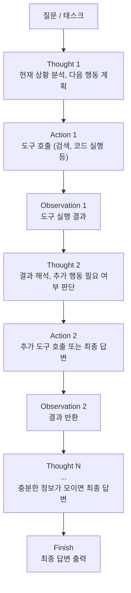
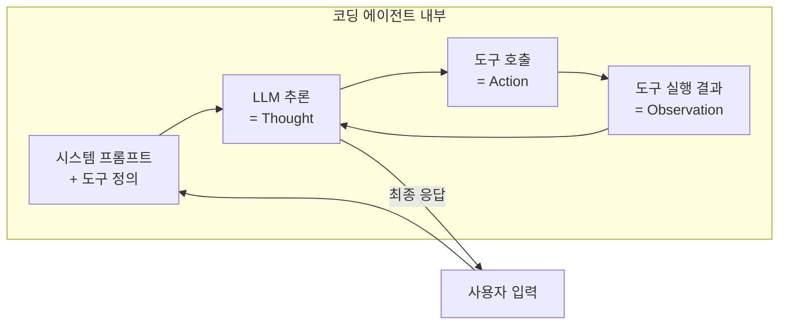

# ReAct 패턴 (Reasoning + Acting)

## 정의

**ReAct (Reasoning + Acting)**는 Yao et al. (2022)이 "ReAct: Synergizing Reasoning and Acting in Language Models"에서 제안한 에이전트 프롬프팅 패턴이다. LLM이 **추론(reasoning)**과 **행동(acting)**을 번갈아 수행하면서 과제를 해결하도록 유도한다. 단순한 chain-of-thought 추론이나 단순한 도구 호출을 각각 수행하는 것보다, 둘을 인터리빙(interleaving)하면 정확도와 해석 가능성이 동시에 향상된다는 것이 핵심 발견이다.

## 왜 중요한가

- 현대 코딩 에이전트([[how-coding-agents-work]])의 내부 루프가 사실상 ReAct의 구현체다
- [[chain-of-thought]] 추론만으로는 외부 세계 정보에 접근할 수 없고, 도구만 호출하면 계획 없이 맹목적으로 실행한다
- ReAct는 이 두 한계를 결합으로 해소하여, 에이전트가 "왜 이 도구를 쓰는지" 스스로 설명하면서 행동하게 만든다
- 2026년 기준 Claude Code, Cursor, Copilot Workspace 등 주요 [[coding-agent]]의 기본 추론 루프로 자리잡았다

## 핵심 루프: Thought -> Action -> Observation

ReAct의 추론 단위는 세 단계의 반복이다.



이 다이어그램은 ReAct의 핵심 루프를 보여준다. 각 Thought에서 모델은 현재까지의 정보를 해석하고, Action에서 외부 도구를 호출하며, Observation에서 결과를 수신한다.

### 각 단계의 역할

| 단계 | 역할 | 예시 |
|------|------|------|
| **Thought** | 현재 상태 분석 + 다음 행동 계획 | "사용자가 파리의 인구를 물었다. 위키피디아를 검색해야 한다" |
| **Action** | 외부 도구 호출 (검색, 계산, 코드 실행) | `Search[Paris population 2024]` |
| **Observation** | 환경에서 반환된 결과 | "Paris metropolitan area: 12.3 million" |

## 기존 접근법과 비교

### 순수 CoT (Reasoning Only)

[[chain-of-thought]] 만 사용하면 모델은 내부 지식에만 의존한다. 환각(hallucination)에 취약하고, 학습 데이터 이후의 정보에 접근 불가능하다.

```
Thought: 파리 인구는 약 200만이다 (실제 도시 경계 기준은 맞지만, 광역은 1,230만)
-> 외부 검증 없이 잠재적 오류 포함
```

### 순수 Act (Acting Only)

도구만 호출하면 계획 없이 무작위로 행동한다. 불필요한 도구 호출이 증가하고, 결과를 해석하지 못해 같은 실수를 반복한다.

```
Action: Search[Paris]
Action: Search[population of Paris]
Action: Search[how many people live in Paris France]
-> 중복 검색, 결과 통합 실패
```

### ReAct (Reasoning + Acting)

추론이 행동을 안내하고, 행동 결과가 추론을 보정한다.

```
Thought: 파리의 현재 인구를 정확히 알아야 한다. 도시 경계와 광역의 차이를 구분해야 한다.
Action: Search[Paris population 2024 metropolitan area]
Observation: Paris metropolitan area population: 12.3 million (2024 estimate)
Thought: 광역 인구를 찾았다. 도시 경계 인구도 확인하자.
Action: Search[Paris city proper population 2024]
Observation: Paris city proper: 2.1 million (2024)
Thought: 두 수치를 모두 확보했다. 구분해서 답변하겠다.
```

## 실험 결과 (Yao et al. 2022)

| 태스크 | Act Only | CoT Only | ReAct |
|--------|---------|---------|-------|
| HotpotQA (질의응답) | 25.7% | 29.4% | **34.3%** |
| Fever (사실 검증) | 57.1% | 56.3% | **64.6%** |
| ALFWorld (게임 환경) | 45% | - | **71%** |
| WebShop (웹 탐색) | 30.1% | - | **40.0%** |

추론 태스크(HotpotQA, Fever)에서는 CoT 대비 의미 있는 향상을 보였고, 행동 태스크(ALFWorld, WebShop)에서는 Act Only 대비 큰 폭의 개선이 나타났다.

## 프롬프트 구조

ReAct 프롬프트는 few-shot 예시로 Thought-Action-Observation 패턴을 시연한다.

```
Answer the following questions by reasoning step-by-step and
using available tools.

Available tools:
- Search[query]: searches Wikipedia
- Lookup[keyword]: looks up a keyword in the current page

Question: What is the elevation range for the area that the
eastern segment of the Colorado orogeny extends into?

Thought 1: I need to find the eastern segment of the Colorado
orogeny and its geographic extent.
Action 1: Search[Colorado orogeny]
Observation 1: The Colorado orogeny was an episode of mountain
building... The eastern extent reached into the High Plains.
Thought 2: The eastern segment extends into the High Plains.
I need to find the elevation range of the High Plains.
Action 2: Search[High Plains elevation]
Observation 2: The High Plains rise from around 460m to 1,800m.
Thought 3: I have the answer.
Action 3: Finish[460m to 1,800m]
```

## 현대 에이전트에서의 ReAct

2026년 현재, ReAct 패턴은 명시적 프롬프트보다는 에이전트 하네스의 **구조적 루프**로 내장되어 있다.



이 다이어그램은 현대 코딩 에이전트가 ReAct 루프를 하네스 수준에서 구현하는 방식을 보여준다.

### 하네스 수준 구현

- **Thought**: LLM의 추론 출력 (사용자에게 표시되거나 내부적으로만 처리)
- **Action**: [[tool-calling-optimization|도구 호출]] 명세에 따른 함수 실행
- **Observation**: 도구 실행 결과를 컨텍스트에 추가

[[agent-prompt-patterns]]에서 정리한 다양한 에이전트 프롬프트 패턴 중 ReAct는 가장 기본적이고 보편적인 패턴이다.

## 한계와 확장

### 알려진 한계

1. **Thought 품질 의존**: 추론 단계의 품질이 낮으면 잘못된 도구를 호출하고, 잘못된 결과를 해석한다
2. **루프 종료 어려움**: 언제 탐색을 멈추고 최종 답변을 할지 판단이 어렵다 (과소/과다 탐색)
3. **단일 추론 경로**: 한 번에 하나의 Thought-Action-Observation 체인만 추적. 백트래킹이 없다

### 확장 패턴

| 패턴 | ReAct 대비 추가 기능 |
|------|---------------------|
| [[reflexion]] | 실패 시 자연어 반성문 생성 후 재시도 |
| **Toolformer** | 도구 호출 시점을 모델이 자율 학습 |
| **LATS** | ReAct + MCTS 트리 탐색으로 백트래킹 지원 |
| [[self-evolving-agents\|SEA]] | ReAct 루프 자체를 경험에서 진화 |

## 실무 적용 가이드

1. **도구 정의를 명확하게**: 도구의 입력/출력 스키마가 모호하면 Action 단계에서 실패한다
2. **Observation 크기 제한**: 검색 결과가 너무 길면 컨텍스트를 압도한다. 요약/트렁케이션 필수
3. **최대 반복 횟수 설정**: 무한 루프 방지를 위해 max_iterations를 하네스에서 강제한다
4. **Thought 가시성 결정**: 사용자에게 추론 과정을 보여줄지는 UX 결정. Claude Code는 "thinking" 토글로 처리

## 관련 문서

- [[chain-of-thought]] -- ReAct의 추론 축을 구성하는 기반 기법
- [[agent-prompt-patterns]] -- ReAct를 포함한 에이전트 프롬프트 패턴 카탈로그
- [[tool-calling-optimization]] -- ReAct의 Action 단계 최적화
- [[how-coding-agents-work]] -- ReAct 루프를 내장한 현대 코딩 에이전트 구조
- [[reflexion]] -- ReAct에 자기반성 메커니즘을 추가한 확장 패턴
