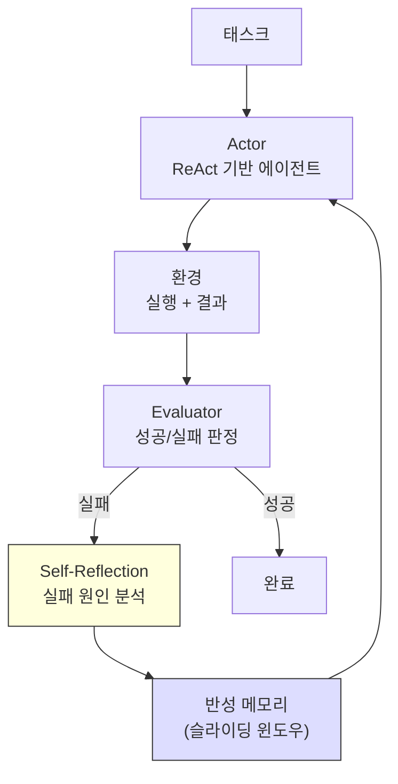
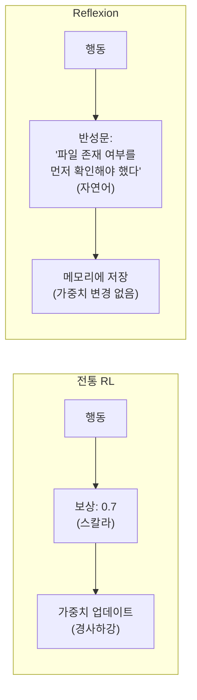

# Reflexion (언어적 자기반성 에이전트)

## 정의

**Reflexion**은 Shinn et al. (2023)이 "Reflexion: Language Agents with Verbal Reinforcement Learning"에서 제안한 에이전트 학습 프레임워크다. 전통적인 강화학습(RL)이 **스칼라 보상 신호**로 정책을 업데이트하는 것과 달리, Reflexion은 **자연어 반성문(verbal reflection)**을 생성하여 에이전트의 다음 시도를 개선한다. 가중치 업데이트 없이 컨텍스트 내 학습만으로 자기 개선이 가능하다.

## 왜 중요한가

- 전통 RL은 "0.7점"이라는 스칼라만 돌려주지만, Reflexion은 "파일을 읽기 전에 존재 여부를 확인하지 않아서 실패했다"는 구체적 피드백을 생성한다
- 파인튜닝이나 가중치 업데이트 없이 프롬프트만으로 에이전트가 개선되므로, API 기반 모델(GPT-4, Claude)에 즉시 적용 가능하다
- [[agent-memory-systems|에이전트 메모리 시스템]]의 일화적 기억(episodic memory)에 반성문을 저장하는 것이 핵심 메커니즘이다
- [[self-evolving-agents|자기 진화 에이전트]]의 자기개선 축을 구성하는 핵심 패턴이다

## 핵심 아키텍처

Reflexion 시스템은 세 가지 모듈로 구성된다.



이 다이어그램은 Reflexion의 세 모듈(Actor, Evaluator, Self-Reflection)과 반성 메모리의 피드백 루프를 보여준다.

### 1. Actor (행위자)

[[react-pattern|ReAct]] 패턴 기반의 에이전트다. Thought-Action-Observation 루프로 태스크를 수행한다. 이전 시도의 반성문이 컨텍스트에 추가되어 있으므로, 같은 실수를 반복하지 않도록 행동을 수정한다.

### 2. Evaluator (평가자)

에이전트의 시도 결과를 평가한다. 태스크 유형에 따라 다양한 형태를 취한다:

| 태스크 | 평가 방식 |
|--------|----------|
| 코딩 (HumanEval) | 테스트 케이스 통과 여부 (바이너리) |
| 질의응답 (HotpotQA) | 정답과 생성된 답의 일치도 |
| 의사결정 (ALFWorld) | 환경에서 목표 달성 여부 |

### 3. Self-Reflection (자기반성)

실패한 에이전트가 "무엇이 잘못되었는가?"를 자연어로 분석하는 모듈이다. 이것이 Reflexion의 핵심 혁신이다.

#### 반성문 생성 프롬프트

```
You are an advanced reasoning agent that can improve based
on self-reflection.

You were given the following task:
[태스크 설명]

Your previous attempt:
[Thought-Action-Observation 시퀀스]

Result: FAILED
[실패 이유 또는 에러 메시지]

Reflect on what went wrong and what you should do differently
in the next attempt. Be specific and concise.
```

#### 반성문 예시

```
이전 시도에서 나는 리스트가 비어 있을 때의 엣지 케이스를 처리하지
않았다. 다음 시도에서는 함수 시작 부분에 빈 리스트 체크를 추가하고,
반환값의 타입도 Optional로 변경해야 한다.
```

## 전통 RL과의 비교



이 다이어그램은 전통 RL의 스칼라 보상 기반 학습과 Reflexion의 언어적 피드백 기반 학습의 근본적 차이를 보여준다.

| 측면 | 전통 RL (PPO 등) | Reflexion |
|------|-----------------|-----------|
| 피드백 형태 | 스칼라 보상 (예: 0.7) | 자연어 반성문 |
| 학습 방식 | 가중치 업데이트 | 컨텍스트 내 학습 (in-context) |
| 필요 시도 횟수 | 수천-수만 에피소드 | 2-5회 시도 |
| 모델 변경 | 필수 (파인튜닝) | 불필요 (프롬프트만) |
| 해석 가능성 | 낮음 (보상 함수만 관찰) | 높음 (반성문이 읽기 가능) |

## 실험 결과

### 코딩: HumanEval

| 방법 | Pass@1 |
|------|--------|
| GPT-4 (baseline) | 67.0% |
| GPT-4 + Reflexion (1회 반성) | 80.0% |
| GPT-4 + Reflexion (최대 3회) | **91.0%** |

baseline 대비 **+24%p** 향상. 대부분의 개선은 첫 번째 반성에서 발생했다.

### 의사결정: ALFWorld

| 방법 | 성공률 |
|------|-------|
| ReAct | 75% |
| ReAct + Reflexion (2회 시도) | **97%** |

### 질의응답: HotpotQA

| 방법 | EM (Exact Match) |
|------|-----------------|
| CoT | 34.0% |
| ReAct | 30.0% |
| ReAct + Reflexion | **51.0%** |

## 반성 메모리 관리

반성문은 [[agent-memory-systems|에이전트 메모리]]의 일화적 기억(episodic memory)으로 관리된다.

### 슬라이딩 윈도우

컨텍스트 창 제한 때문에 모든 반성문을 유지할 수 없다. 최근 N개의 반성문만 유지하는 슬라이딩 윈도우 방식을 사용한다.

```
시도 1 반성: "입력 유효성 검사를 누락했다" <- 윈도우 밖 (삭제)
시도 2 반성: "재귀 종료 조건이 잘못되었다" <- 유지
시도 3 반성: "타입 변환에서 예외 처리 누락" <- 유지
시도 4: 이전 반성 2개를 컨텍스트에 포함하여 실행
```

### 반성 품질의 중요성

반성문이 너무 일반적이면 ("더 주의깊게 하겠다") 다음 시도에 도움이 되지 않는다. 구체적이고 실행 가능한(actionable) 반성이 핵심이다.

- **나쁜 반성**: "다음에는 더 조심하겠다"
- **좋은 반성**: "함수 `parse_date()`에서 ISO 8601 형식만 처리했는데, 입력이 'MM/DD/YYYY'일 때 ValueError가 발생했다. 다음 시도에서는 여러 날짜 형식을 파싱하는 로직을 추가하겠다"

## 한계

1. **컨텍스트 창 소비**: 반성문이 누적되면 실제 태스크에 사용할 컨텍스트가 줄어든다
2. **반성 정확도**: LLM이 실패 원인을 잘못 진단하면 오히려 성능이 하락할 수 있다 (잘못된 자기진단)
3. **최대 시도 횟수 제한**: 실제로는 3-5회 이내에 수렴하지 못하면 근본적으로 모델 능력 밖의 문제일 가능성이 높다
4. **비결정적 환경**: 환경 자체가 확률적이면 같은 전략이 다른 결과를 낳을 수 있어 반성의 신뢰성이 떨어진다

## 후속 연구

- **LATS (Language Agent Tree Search)**: Reflexion + Tree Search를 결합. 반성과 탐색을 동시에 수행
- **Retroformer**: 반성 모델을 별도로 파인튜닝하여 반성 품질을 향상
- **[[self-evolving-agents|SEA 패러다임]]**: Reflexion의 에피소드 단위 반성을 장기 스킬 진화로 확장
- **[[long-horizon-agent-benchmarks]]**: Reflexion의 효과를 수십-수백 단계의 장기 태스크에서 검증

## 관련 문서

- [[agent-memory-systems]] -- 반성문을 저장하는 일화적 기억 시스템
- [[self-evolving-agents]] -- Reflexion을 장기 자기 진화로 확장한 패러다임
- [[long-horizon-agent-benchmarks]] -- 복잡한 장기 태스크에서 반성 기반 개선의 효과 검증
- [[react-pattern]] -- Reflexion의 Actor가 사용하는 기본 추론 패턴
- [[self-refine]] -- 외부 환경 없이 자체 출력만으로 반복 개선하는 관련 패턴
