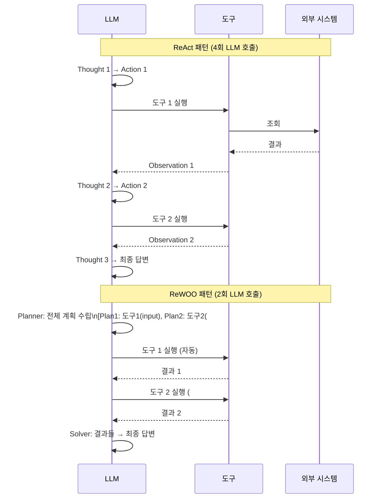
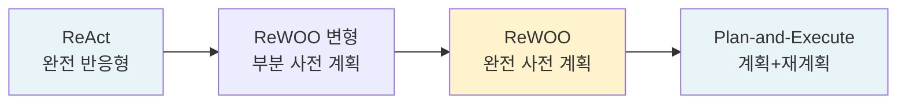

# ReWOO 효율 패턴 (Reasoning Without Observation)

## 개요

ReWOO(Reasoning WithOut Observation)는 2023년 Xu et al.이 제안한 에이전트 효율화 패턴으로, **도구 호출 결과를 관찰(observe)하기 전에 전체 실행 계획을 먼저 수립**함으로써 LLM 호출 횟수를 줄이는 접근법이다.

전통적인 ReAct 패턴은 Thought -> Action -> Observation을 매 스텝마다 반복하므로 도구 호출 수만큼 LLM 호출이 발생한다. ReWOO는 이를 분리하여 **계획 단계에서 LLM을 한 번만 호출**하고, 나머지는 플래너 없이 도구를 순차 실행한다.

## ReAct vs ReWOO 비교



## 핵심 구성요소

### 1. Planner (계획자)

Planner는 쿼리를 받아 **모든 도구 호출을 사전에 나열하는 계획**을 생성한다. 각 계획 스텝은 다음을 포함한다:

- 실행할 도구명
- 도구에 전달할 입력
- 이전 스텝 결과를 참조하는 변수 (`#E1`, `#E2` 형식)

예시 Planner 출력:
```
Plan: 오바마 대통령의 나이를 검색한다.
#E1 = Search["버락 오바마 생년월일"]

Plan: 오바마 나이가 몇 번째 대통령 임기 중인지 확인한다.
#E2 = Calculator["2024 - {#E1.birth_year}"]

Plan: 최종 답변을 조합한다.
#E3 = LLM["오바마는 {#E1.name}로, 현재 {#E2}세이다."]
```

### 2. Worker (실행자)

Worker는 Planner의 계획을 **LLM 없이 순차 실행**한다. 각 스텝에서:
1. 이전 스텝 결과를 변수에 바인딩
2. 현재 스텝의 입력에서 변수 참조를 실제 값으로 치환
3. 해당 도구를 호출하고 결과 저장

Worker는 LLM을 호출하지 않으므로 대부분의 실행 지연이 LLM이 아닌 실제 도구(API, 검색 엔진 등) 응답 시간에서 발생한다.

### 3. Solver (해결자)

모든 도구 실행이 완료되면 Solver가 **수집된 모든 결과를 종합하여 최종 답변을 생성**한다. 이때 LLM을 다시 한 번 호출한다.

## 효율성 분석

ReAct 대비 ReWOO의 이론적 LLM 호출 감소량:

| 도구 호출 수 | ReAct LLM 호출 | ReWOO LLM 호출 | 절감률 |
|-------------|---------------|---------------|--------|
| 2 | 3 | 2 | 33% |
| 4 | 5 | 2 | 60% |
| 8 | 9 | 2 | 78% |
| N | N+1 | 2 | (N-1)/(N+1) |

도구 호출이 많을수록 절감 효과가 커지며, 도구 실행 비용보다 LLM 토큰 비용이 높은 경우 특히 유리하다.

또한 Worker 단계에서 도구들을 **의존성 그래프에 따라 병렬 실행**할 수 있으므로 지연(latency)도 추가로 감소한다.

## [[plan-and-execute-pattern]]과의 차이

[[plan-and-execute-pattern]]은 ReWOO와 유사하게 계획-실행을 분리하지만, 실행 중간에 계획을 수정하는 **재계획(replanning)** 단계가 있다. ReWOO는 재계획 없이 초기 계획을 끝까지 실행하므로 더 단순하고 효율적이지만, 실행 중 예상치 못한 도구 결과에 대응하기 어렵다.

| 특성 | ReWOO | Plan-and-Execute |
|------|-------|-----------------|
| 중간 LLM 호출 | 없음 | 재계획 시 있음 |
| 적응성 | 낮음 | 높음 |
| 효율성 | 높음 | 중간 |
| 적합 태스크 | 구조화된 멀티스텝 | 탐색적 문제 해결 |

## 한계와 적합 태스크

### 한계

- **고정 계획**: 실행 중 도구 결과가 예상과 크게 다를 경우 적응 불가
- **계획 오류 전파**: Planner가 잘못된 계획을 세우면 전체 실행이 실패
- **동적 의존성**: 한 도구의 결과에 따라 다음 도구 선택이 달라지는 경우 처리 어려움

### 적합 태스크

ReWOO는 다음 특성의 태스크에 최적이다:
- 실행 전에 필요한 도구와 순서가 예측 가능한 경우
- 동일 쿼리 패턴이 반복되는 경우 (계획 캐싱 활용)
- 비용 최소화가 정확도보다 중요한 경우
- 병렬 실행 가능한 독립적 도구 호출이 많은 경우

## [[agent-planning-strategies]] 내에서의 위치

ReWOO는 [[agent-planning-strategies]] 스펙트럼에서 **사전 계획(upfront planning)** 극단에 위치한다:



## 관련 문서

- [[plan-and-execute-pattern]] - ReWOO와 유사하지만 재계획을 지원하는 패턴
- [[agent-planning-strategies]] - 에이전트 계획 수립 전략 전반
- [[agent-cost-optimization]] - LLM 호출 비용 최소화 전략 비교
- [[orchestrator-worker-pattern]] - Planner-Worker 분리 구조의 상위 패턴
