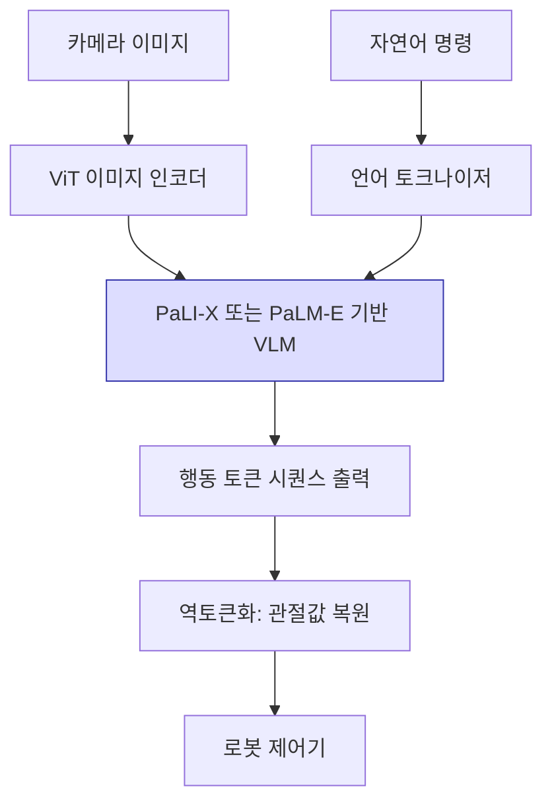

# RT-2 비전-언어-행동 모델

## 개요

RT-2(Robotic Transformer 2)는 Google DeepMind가 2023년에 발표한 비전-언어-행동(VLA, Vision-Language-Action) 모델이다. 대형 비전-언어 모델(VLM)의 사전학습 지식을 로봇 제어에 직접 전이하는 방식으로, 언어 명령을 이해하고 카메라 이미지를 분석해 로봇 팔 동작을 토큰 시퀀스로 출력한다.

핵심 통찰은 단순하지만 강력하다. VLM이 텍스트를 토큰으로 예측하듯, 로봇 행동값(관절 각도, 그리퍼 상태 등)도 "행동 토큰"으로 이산화(discretize)하면 동일한 언어 모델 아키텍처로 학습할 수 있다는 것이다.

## 아키텍처

VLM 본체는 PaLI-X(55B) 또는 PaLM-E 구조를 사용하며, 행동 출력 헤드를 언어 출력 레이어와 공유한다. 행동값은 각 차원별로 256개 빈(bin)으로 이산화되어 어휘 토큰으로 매핑된다.

## 행동 토큰화 방식

로봇 행동은 7차원 벡터로 표현된다.

| 차원 | 내용 |
|------|------|
| x, y, z | 엔드이펙터 위치 변화량 |
| roll, pitch, yaw | 회전 변화량 |
| grasp | 그리퍼 개폐 여부 (이진) |

각 연속값은 정규화 후 256개 빈으로 이산화된다. 즉, 한 스텝의 행동은 7개의 정수 토큰 시퀀스로 표현된다. 이를 통해 표준 causal language modeling 목적함수로 행동을 학습할 수 있다.

## 핵심 기여

### 1. 웹 지식의 로봇 행동 전이

대규모 인터넷 데이터로 학습된 VLM의 상식 추론 능력이 로봇 행동으로 직접 전이된다. 예를 들어, "리사이클할 수 있는 물건을 들어라"라는 명령에서 어떤 물체가 재활용 가능한지를 VLM의 사전지식으로 추론할 수 있다.

### 2. 새로운 개념에 대한 제로샷 일반화

학습 데이터에 없던 물체, 배경, 언어 표현에 대해서도 일반화 성능을 보인다. 학습 데이터의 로봇 경험과 사전학습의 시각-언어 지식이 결합된 결과다.

### 3. 공동 파인튜닝 전략

인터넷 데이터(VQA, 이미지 캡셔닝 등)와 로봇 조작 데이터를 함께 파인튜닝한다. 이를 통해 언어 능력 저하(catastrophic forgetting) 없이 로봇 태스크를 학습한다.

## 한계

- **추론 속도**: 거대 VLM 추론이 병목으로, 실시간 제어에 지연이 발생한다. RT-2는 약 1-3 Hz의 제어 주파수를 목표로 한다.
- **데이터 의존성**: 학습에 사용된 로봇(Google Robot)과 다른 하드웨어로 직접 전이는 어렵다.
- **접촉 역학 한계**: 세밀한 조작(dexterous manipulation)보다는 픽-앤-플레이스 수준의 태스크에 적합하다.
- **분포 외 행동**: 이산 빈의 해상도 한계로 정밀도가 필요한 태스크에서 오차가 발생할 수 있다.

## 실무 의의

RT-2는 [[vla-models]] 패러다임의 실현 가능성을 대규모로 입증한 첫 사례로 평가된다. 이후 [[open-x-embodiment]] 프로젝트에서 수집한 다양한 로봇 데이터와 결합하는 RT-X 방향으로 발전했다.

[[vision-language-model-architectures]] 분야에서 개발된 거대 모델들이 언어 도메인을 넘어 물리적 행동 공간으로 확장되는 방향을 보여주는 핵심 사례다. 비슷한 아이디어를 행동 생성 확률 모델로 구현한 것이 [[diffusion-policy]]이며, ACT([[action-chunking-transformer]])는 청크 단위 행동 예측으로 다른 각도에서 접근한다.

## 관련 문서

- [[vla-models]] - VLA 모델 일반 개념
- [[vision-language-model-architectures]] - PaLM-E, PaLI-X 등 기반 아키텍처
- [[open-x-embodiment]] - RT-2를 확장한 다기관 로봇 데이터 통합 프로젝트
- [[action-chunking-transformer]] - 청크 기반 행동 예측 대안 접근
- [[diffusion-policy]] - 확산 모델 기반 로봇 정책
