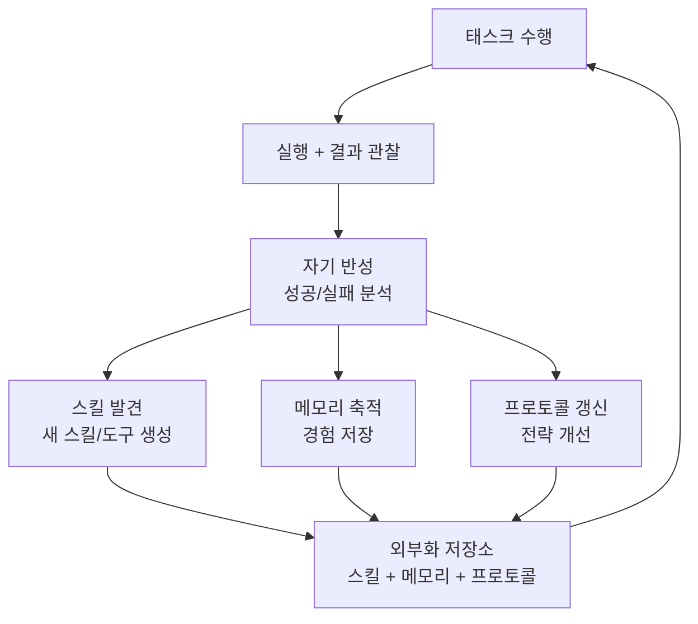

## 개요

자기 진화 에이전트(Self-Evolving Agent, SEA)는 고정된 도구와 프롬프트에 의존하는 정적 에이전트의 한계를 극복하기 위한 패러다임이다. SEA는 에이전트가 태스크를 수행하면서 축적한 경험을 기반으로 **도구, 스킬, 메모리, 프로토콜을 자율적으로 진화**시킨다.

기존 LLM 에이전트의 근본 한계는 두 가지다:

1. **정적 도구셋(static toolset)**: 개발자가 사전 정의한 도구만 사용 가능
2. **에피소딕 기억상실(episodic amnesia)**: 에피소드 간 학습이 발생하지 않음

SEA는 이 두 제약을 동시에 해결하여, 시간이 지남에 따라 성능이 향상되는 에이전트를 지향한다.

## 왜 중요한가

- 현재 에이전트는 매 세션마다 "백지 상태"에서 시작 -- 동일 실수를 반복
- 프로덕션 환경에서 도메인별 최적 도구/워크플로우는 사전 설계가 불가능
- 장기 운용되는 에이전트(코딩, 고객 지원, 연구)에서 누적 학습은 핵심 경쟁력
- SEA는 에이전트가 "사용할수록 나아지는" 시스템으로 전환하는 경로를 제시

## 핵심 메커니즘

SEA의 진화 루프: 태스크 실행 후 자기 반성을 통해 스킬/메모리/프로토콜을 갱신하고, 외부화된 저장소에 축적하여 다음 태스크에 활용한다.

### SEA의 4대 특성

| 특성 | 설명 |
|------|------|
| 태스크 내 실행 신뢰성(Intra-task Execution Reliability) | 단일 태스크 내에서 안정적으로 계획하고 실행하는 능력 |
| 장기 진화 성능(Long-term Evolutionary Performance) | 시간에 걸친 지속적 성능 향상 |
| 도구/스킬 발견(Tool/Skill Discovery) | 새로운 도구와 스킬을 자율적으로 발견하고 생성 |
| 메모리 축적(Memory Accumulation) | 경험의 축적과 재활용 |

### 외부화(Externalization) 패러다임

SEA의 핵심은 **외부화** -- 에이전트의 학습 결과를 LLM 가중치 외부에 저장:

- **스킬 외부화**: 학습한 절차를 재사용 가능한 코드/프롬프트 스킬로 저장
- **메모리 외부화**: 에피소드 경험을 구조화된 메모리 시스템에 축적
- **프로토콜 외부화**: 상호작용 전략/에러 처리 패턴을 명시적 규칙으로 기록

## 관련 프레임워크

- **SkillClaw**: DreamX Team이 개발한 집단적 스킬 진화 프레임워크. 다수 에이전트가 스킬을 공유하며 집단 학습
- **SkillRL**: 재귀적 스킬 증강 강화학습. 에이전트가 RL을 통해 스킬 라이브러리를 반복 확장
- **SEA-Eval**: SEA 특성을 평가하는 벤치마크. 태스크 내 실행 신뢰성과 장기 진화 성능을 동시에 측정

## 실무 적용

- **코딩 에이전트**: 반복적으로 사용하는 패턴을 스킬로 추출, 프로젝트별 컨벤션을 메모리에 축적 (예: [[agent-skills]])
- **연구 에이전트**: 검색 전략을 점진적으로 개선, 도메인 지식을 외부 메모리에 저장 (예: [[agent-memory-systems]])
- **고객 지원**: FAQ 패턴 자동 학습, 에스컬레이션 프로토콜 자율 정제
- 현재 Claude Code의 CLAUDE.md / 프로젝트 메모리는 SEA의 메모리 외부화를 수동으로 구현한 사례로 볼 수 있음

## 관련 문서

- [[agent-memory-systems]] -- 에이전트 메모리 아키텍처
- [[agent-skills]] -- 에이전트 스킬 시스템
- [[agent-skills-specification]] -- 스킬 명세 표준
- [[evolution-of-agentic-patterns]] -- 에이전틱 패턴의 진화
- [[long-horizon-rl-training-for-agents]] -- 장기 에이전트 RL 학습
- [[orchestrator-worker-pattern]] -- 오케스트레이터-워커 패턴
