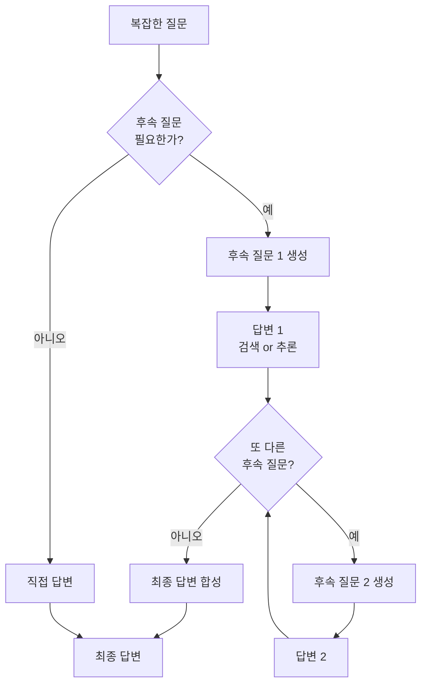

# Self-Ask 분해 패턴

## 개념 정의

Self-Ask(자기 질문)는 LLM이 복잡한 질문을 받았을 때 "후속 질문이 필요한가?(Are follow-up questions needed?)"라는 메타 인지적 자기 검토를 수행하며 문제를 분해하는 프롬프팅 패턴이다. 2022년 Ofir Press 등이 제안한 기법으로, 모델이 명시적으로 하위 질문을 생성하고 각각에 답변한 뒤 최종 답을 종합한다.

[[chain-of-thought]] (CoT)가 추론 과정을 선형적으로 전개한다면, Self-Ask는 문제를 트리처럼 분해하는 명시적 분기 구조를 갖는다.



위 구조는 "후속 질문이 필요한가?"를 반복적으로 자문하며 하위 질문 트리를 명시적으로 전개하는 과정을 보여준다.

## 핵심 메커니즘: 명시적 메타 인지

Self-Ask의 핵심은 "후속 질문이 필요한가?"라는 경계 문구다. 이 문구가 모델에게 두 가지 행동 중 하나를 선택하게 한다:

1. **직접 답변 가능**: "아니오, 후속 질문 불필요" 후 즉시 답변
2. **분해 필요**: "예" 후 구체적인 후속 질문 생성 -> 답변 -> 반복

이 패턴이 단순 CoT와 다른 점은:
- 하위 질문이 **명시적 텍스트**로 생성된다 (암묵적 추론이 아닌)
- 각 하위 질문의 답변이 **검색 쿼리**로 직접 연결될 수 있다
- 분해 깊이가 조건부로 결정된다 (고정 단계수가 아닌)

## 프롬프트 패턴

### 기본 Self-Ask 프롬프트

```
질문: 조선 왕조를 건국한 인물이 태어난 도시의 현재 인구는?

후속 질문이 필요한가? 예
후속 질문: 조선 왕조를 건국한 인물은 누구인가?
중간 답변: 이성계 (태조)

후속 질문이 필요한가? 예
후속 질문: 이성계는 어디서 태어났는가?
중간 답변: 함경도 화령부 (현 함흥시)

후속 질문이 필요한가? 예
후속 질문: 함흥시의 현재 인구는?
중간 답변: 약 76만 명 (2020년 기준)

후속 질문이 필요한가? 아니오
최종 답변: 약 76만 명
```

### 검색 통합 변형 (Self-Ask + Search)

```python
def self_ask_with_search(question: str, llm, search_fn) -> str:
    context = f"질문: {question}\n"

    for _ in range(5):  # 최대 5단계
        # 후속 질문 필요 여부 판단
        prompt = context + "\n후속 질문이 필요한가?"
        response = llm.generate(prompt)

        if "아니오" in response.split("\n")[0]:
            # 직접 답변 생성
            final = llm.generate(context + "최종 답변:")
            return final

        # 후속 질문 추출
        followup = extract_followup_question(response)
        context += f"\n후속 질문: {followup}\n"

        # 검색으로 답변 획득
        search_result = search_fn(followup)
        answer = llm.summarize(followup, search_result)
        context += f"중간 답변: {answer}\n"

    return llm.generate(context + "최종 답변:")
```

## ReAct 패턴과의 비교

Self-Ask는 [[react-pattern]]의 선구자적 패턴으로 볼 수 있다. 두 패턴의 차이점:

| 속성 | Self-Ask | ReAct |
|------|----------|-------|
| 구조 | 질문-답변 트리 | 추론-행동-관찰 루프 |
| 분기 표현 | "후속 질문이 필요한가?" | "생각(Thought):" |
| 도구 통합 | 검색에 특화 | 다양한 도구 지원 |
| 실패 처리 | 명시적 없음 | 관찰에서 재계획 가능 |
| 중간 결과 | 텍스트 답변 | 도구 실행 결과 |

ReAct은 Self-Ask의 아이디어를 확장하여 검색 이외의 다양한 도구 호출과 더 유연한 루프 구조를 지원한다.

## 응용 변형

### 계층적 Self-Ask

하위 질문도 다시 Self-Ask로 분해할 수 있어 재귀적 트리 구조가 가능하다. 단, 깊이 제한 없이 재귀하면 발산하므로 최대 깊이(보통 3-4단계)를 설정한다.

### 병렬 Self-Ask

독립적인 하위 질문들을 병렬로 처리하여 전체 지연 시간을 단축한다. [[rewoo-efficiency-pattern]]이 이 아이디어를 체계화했다.

### 역방향 Self-Ask

"이 질문에 답하려면 무엇을 먼저 알아야 하는가?"로 역방향 분해를 수행한다. 수학 증명이나 논증 구성에 적합하다.

## 적용 시나리오

### 다중 홉 사실 검색 (Multi-hop QA)
중간 엔티티를 거쳐야 답할 수 있는 질문에 특히 효과적이다. 예: "A의 B가 졸업한 학교가 위치한 도시의 시장은?"

### 복잡한 비교 분석
"X와 Y의 장단점을 비교하라"는 질문을 X의 장점, X의 단점, Y의 장점, Y의 단점 네 개의 하위 질문으로 분해한다.

### 법률/의료 상담 초안
"이 상황에서 법적으로 어떤 권리가 있는가?"를 관련 법률 조항, 판례, 절차적 요건 등으로 분해하여 구조화된 답변을 생성한다.

## 적용 시 주의사항

### 과도한 분해
단순한 질문도 강제로 분해하려 할 수 있다. "후속 질문이 필요한가? 아니오"를 먼저 고려하도록 퓨샷 예제에 단순 질문-직접 답변 사례를 포함시켜야 한다.

### 하위 질문 누락
분해가 완전하지 않으면 최종 답변이 부정확하다. 하위 질문이 원래 질문을 완전히 커버하는지 검증하는 단계를 추가하면 좋다.

### 검색 결과 신뢰도
검색으로 얻은 중간 답변이 부정확하면 오류가 전파된다. 중간 답변의 출처 신뢰도를 평가하는 추가 스텝을 고려한다.

### 비용 증가
하위 질문마다 검색 호출과 LLM 추론이 추가되어 단순 CoT 대비 비용이 상당히 높다. 단순 질문에는 적용하지 않도록 라우팅 로직이 필요하다.

### 루프 종료 실패
모델이 "후속 질문이 필요한가? 아니오"에 도달하지 못하고 계속 분해할 수 있다. 명시적인 최대 단계 수와 시간 제한이 필수다.

## 관련 문서

- [[chain-of-thought]] - 선형 추론 전개 기법
- [[chain-of-thought-prompting]] - CoT 프롬프팅 기법
- [[react-pattern]] - Self-Ask의 일반화 버전
- [[plan-and-solve-prompting]] - 계획 단계 명시 패턴
- [[tree-of-thought]] - 트리 구조 사고 탐색
- [[agent-planning-strategies]] - 에이전트 계획 전략
- [[rewoo-efficiency-pattern]] - 병렬 분해 효율화
