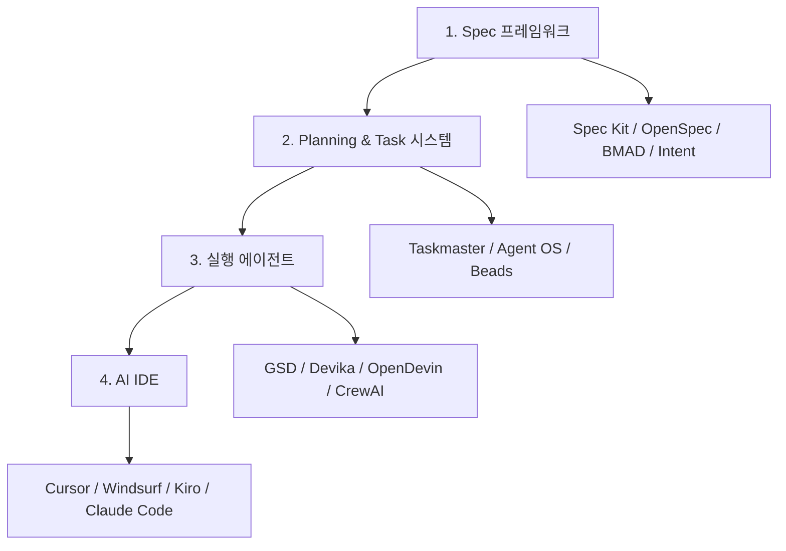

## 개요

Spec-Driven Development(사양 주도 개발)는 코드 대신 사양(specification)을 진실의 원천(source of truth)으로 삼는 에이전트 시대의 소프트웨어 개발 방법론이다. 기존의 "프롬프트 -> 코드" 패턴을 "사양 -> 계획 -> 작업 -> 코드" 워크플로우로 전환한다. [[agentic-ai-foundation|AI 에이전트]]가 열린 프롬프트보다 정의된 작업에서 훨씬 더 잘 수행한다는 관찰에 기반하며, AWS 팀이 18개월 프로젝트를 76일 만에 완료한 사례가 대표적이다. [[tdd-agentic-coding|TDD + Agentic Coding]]과 함께 에이전트 시대의 소프트웨어 개발 방법론 양대 축을 이룬다.

## 핵심 특징

- **사양이 진실의 원천**: 코드가 아닌 사양이 시스템의 설계 의도와 제약조건을 담는 최상위 아티팩트
- **구조화된 워크플로우**: Spec -> Plan -> Tasks -> Code의 4단계 워크플로우
- **컨텍스트 보존**: 대규모 코드베이스에서 아키텍처 결정이 구현 중 손실되는 문제 해결
- **일관성 유지**: 변경사항이 초기 설계 결정과 정렬 상태를 유지
- **개발자 역할 전환**: 라인 단위 코딩에서 시스템 설계로 개발자 초점 이동

## 기술 상세

### 4계층 에이전틱 코딩 스택

### 기존 접근법과의 비교

| 항목 | 프롬프트 기반 | Spec-Driven |
|---|---|---|
| 진실의 원천 | 프롬프트/대화 | 사양 문서 |
| 워크플로우 | 프롬프트 -> 코드 | 사양 -> 계획 -> 작업 -> 코드 |
| 컨텍스트 관리 | 손실 위험 | 사양으로 보존 |
| 아키텍처 일관성 | 낮음 | 높음 |
| 대규모 프로젝트 | 비효율적 | 효과적 |
| 개발자 역할 | 코딩 + 설계 | 설계 집중 |

### 4단계 SDD 워크플로우

1. **병렬 리서치(Subagents)**: 복수 에이전트가 동시에 조사를 수행하여 요구사항과 기존 코드베이스를 분석
2. **사양 작성**: 기능/비기능 요구사항, 아키텍처 결정, 데이터 모델, UX 패턴을 포함하는 상세 사양 문서 생성
3. **인터뷰를 통한 정제**: 구현 전에 모호성을 표면화하고 해소 (예: `ask_user_question` 패턴)
4. **태스크 기반 구현**: 의존성 인식 실행, 원자적 커밋(atomic commits)으로 각 작업을 체계적으로 수행

이 접근법은 SQL이 쿼리 계획을 생성하거나, Terraform이 인프라 계획을 생성하는 것과 유사한 패턴이다.

### 3가지 구현 수준

| 수준 | 접근법 | 설명 |
|------|--------|------|
| **Spec-First** | 사양 문서 선행 강제 | 코드 작성 전 반드시 사양 아티팩트 생성 |
| **Spec-Anchored** | 사양과 개발 병행 | 개발 중 사양을 지속적으로 유지/갱신 |
| **Spec-as-Source** | 사양이 유일한 소스 | 코드가 사양에서 재생성되는 급진적 접근 (예: Tessl) |

### 엔터프라이즈 적용 사례

**AWS 팀**: 원래 18개월로 예상된 프로젝트를 Spec-Driven 방식으로 전환한 후 76일 만에 완료했다. 사양이 AI 에이전트에게 측정 가능한 구조화된 작업을 제공함으로써 달성된 결과다.

**금융기관 사기 탐지 시스템**: 비즈니스 분석가와 아키텍트가 포괄적 사양 작성 -> AI 에이전트가 사양+기존 코드베이스+가이드라인을 수신 -> 코드, API, 데이터베이스, ML 모델 자율 생성 -> 2차 에이전트가 사양 대비 테스트 -> 개발자가 전략적 개선에 집중. "주 단위에서 일 단위로" 타임라인 압축.

### 관련 도구 생태계

| 프레임워크 | 접근법 | 핵심 특징 |
|-----------|--------|----------|
| **Amazon Kiro** | Requirements -> Design -> Tasks | 경량 3-문서 워크플로우 |
| **GitHub Spec-Kit** | Constitution -> Specify -> Plan | 오픈소스, 멀티에이전트 호환 |
| **Tessl** | Spec-as-Source | 사양에서 코드 재생성 |
| **CC-SDD** | Cross-tool | Claude Code, Cursor, Gemini CLI 호환 |
| **BMAD** | 멀티에이전트 아키텍처 | 역할 분담 기반 에이전트 팀 |

- **Planning 시스템**: Taskmaster, Agent OS, Beads, Feature-Driven-Flow
- **실행 에이전트**: GSD, Devika, OpenDevin, [[crewai]], LangGraph
- **AI IDE**: Cursor, Windsurf, Kiro, [[claude-code]]

### Vibe Coding과의 대비

SDD는 "바이브 코딩(Vibe Coding)"의 한계에 대한 직접적 응답으로 등장했다. 바이브 코딩에서 발생하는 반복적 컨텍스트 손실, AI의 불신뢰할 수 있는 가정, 프로젝트 아키텍처와의 불일치가 프로덕션 규모에서는 실패를 초래한다. SDD는 반복적 발견(iterative discovery) 대신 포괄적 사전 사양(comprehensive upfront specification)을 제공하여 이 문제를 해결한다.

## 관련 문서

- [[tdd-agentic-coding]] - TDD와 에이전틱 코딩의 결합
- [[how-coding-agents-work]] - 코딩 에이전트 동작 원리
- [[evolution-of-agentic-patterns]] - 에이전틱 패턴의 진화
- [[claude-code]] - Anthropic의 CLI 코딩 에이전트
