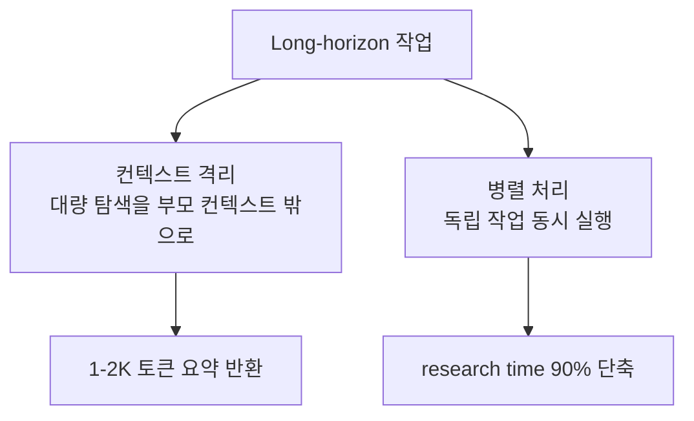
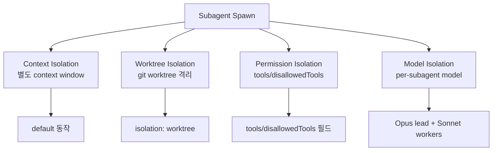
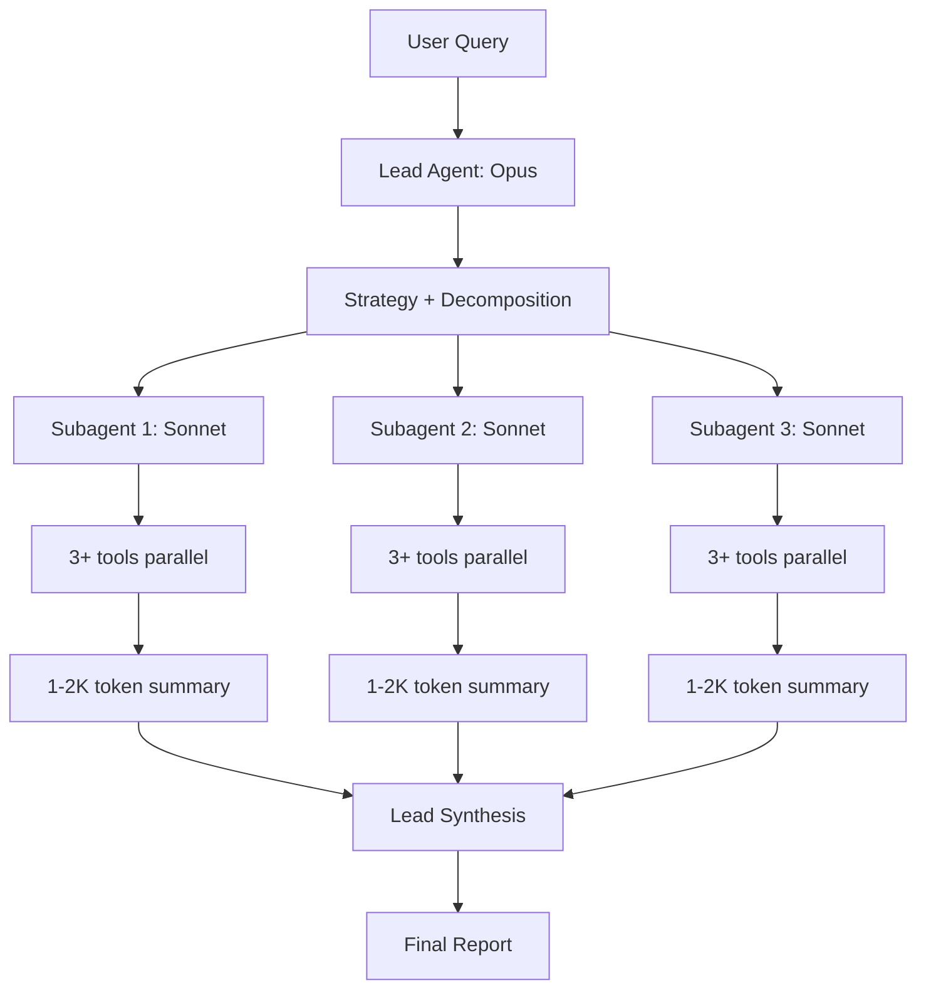

# Subagent Spawning

서브에이전트 spawn은 (1) **컨텍스트 격리(context isolation)** 와 (2) **병렬 처리(parallelism)** 를 동시에 달성하기 위한 표준 멀티에이전트 패턴이다. 부모 에이전트(orchestrator/lead)가 strategy를 수립하고, 자식 에이전트(subagent/worker)가 isolated context에서 작업한 후 condensed summary를 부모에게 반환한다.

> 기존 [[parent-child-spawn-pattern]], [[subagents]], [[anthropic-multi-agent-research-system]], [[orchestrator-worker-pattern]] 와 차별화 — 이 페이지는 production 운영 lessons (rainbow deployments, fault tolerance, token economics 15x), 격리 전략 4가지(context/worktree/permission/model), 그리고 frontmatter 신규 필드(isolation/memory/effort)에 초점.

## 1. 두 축의 동기



> "The lead agent analyzes it, develops a strategy, and spawns subagents to explore different aspects simultaneously."

## 2. 토큰 경제학

| 시스템 | 토큰 사용 (vs single-turn chat) |
|--------|-------------------------|
| Single-turn chat | 1x |
| Single agent (loop) | 약 4x |
| Multi-agent (orchestrator + workers) | 약 15x |

→ 15x 비용을 정당화할 만한 성능 향상 use case에서만 도입해야 한다. Anthropic 내부 사례에서는 multi-agent system이 single-agent 대비 **90.2% 향상** 보고.

## 3. 7가지 prompt engineering 원칙

1. **Delegation design**: Lead가 subagent에게 (a) objective, (b) output format, (c) tools/sources 가이드, (d) clear task boundaries 모두 명시
2. **Effort scaling**: 복잡도 가이드라인 임베딩으로 자원 낭비 방지
3. **Extended thinking**: lead는 planning, subagents는 interleaved thinking
4. **Parallel tool calling**: subagent가 3+ 도구 동시 호출 → research time 90% 단축
5. **Self-improvement**: 모델이 자기 prompt를 진단/개선
6. **Progressive search**: 넓게 시작 → 좁혀감
7. **Evaluation 방법론**: LLM-as-judge with rubric (factual accuracy, citation precision, completeness, source quality, tool efficiency) + human edge case + 작은 데이터셋(20 tests)으로 변경 영향 명확히 관찰

## 4. Production 도전 4가지

### A. Statefulness & error compounding
> "Long-running agents require checkpoint resumption rather than restarts."
> "Without effective mitigations, minor system failures can be catastrophic for agents."

→ Checkpoint resume이 restart보다 중요. 한 자식의 실패가 cascade되지 않도록 격리 필수.

### B. Debugging non-determinism
> "Full production tracing for diagnosing failures without breaching privacy."

→ 프로덕션 trace 필수, privacy 고려.

### C. Rainbow deployments
> "Rainbow deployments prevent breaking existing agents during updates by gradually shifting traffic between versions."

→ 점진적 traffic 이동으로 진행 중인 long-running agent 보호. Blue-green 배포의 멀티에이전트 변형.

### D. Synchronous bottleneck
> "Current architecture executes subagents synchronously, creating information flow constraints that asynchronous execution could address."

## 5. 격리 4계층



### A. Context isolation (default)
서브에이전트가 별도 context window를 가짐. 가장 기본 격리.

### B. Worktree isolation
> "Run the subagent in a temporary git worktree, giving it an isolated copy of the repository. The worktree is automatically cleaned up if the subagent makes no changes."

→ 멀티 에이전트가 동시에 같은 코드베이스 수정 시 충돌 방지.

### C. Permission isolation
- `tools: Read, Grep` → 명시 도구만 허용
- `disallowedTools: Write, Edit` → 상속에서 제외
- 둘 다 생략 → 부모와 동일

### D. Model isolation
- Lead = Opus (복잡한 추론)
- Workers = Sonnet/Haiku (실행)
- 비대칭 조합으로 비용/성능 최적화

## 6. Frontmatter 필드

```yaml
---
name: code-reviewer
description: Reviews code for quality and best practices
tools: Read, Glob, Grep
disallowedTools: Write, Edit
model: sonnet
permissionMode: default
maxTurns: 10
skills: [skill-name]
mcpServers: [slack]
hooks: {...}
memory: user
background: false
effort: medium
isolation: worktree
color: blue
initialPrompt: "..."
---
```

### 신규 필드 (2026)

| 필드 | 의미 |
|------|------|
| `isolation: worktree` | 임시 git worktree에서 실행 |
| `memory: user\|project\|local` | 지속 메모리 디렉토리 (cross-session learning) |
| `skills: [...]` | preload할 skill 목록 (부모로부터 자동 inherit X, 명시 필요) |
| `background: true` | 백그라운드 task로 항상 실행 |
| `effort: ...` | 세션 effort 레벨을 subagent별로 override |

### 모델 우선순위 (resolve order)
1. 환경변수 override (예: `CLAUDE_CODE_SUBAGENT_MODEL`)
2. Per-invocation model parameter
3. Subagent frontmatter `model`
4. Main conversation model

## 7. 실패 모드 관찰

| Failure mode | 대처 |
|--------------|------|
| "Spawning 50 subagents for simple queries" | description으로 effort scaling 가이드 |
| 모호한 task description | objective + output format + boundary 명시 |
| SEO-optimized content farms 선택 | source quality rubric으로 평가 분리 |
| Self-praise bias | Generator/Evaluator 분리 |
| Coherence loss | Context reset + handoff |

## 8. Subagents vs Agent Teams

> "Subagents work within a single session; agent teams coordinate across separate sessions."

| 측면 | Subagents | Agent Teams |
|------|-----------|-------------|
| 세션 | 단일 | 별도 세션 |
| 통신 | parent-child | 동등한 teammate 간 |
| 격리 | context window 분리 | 세션 자체 분리 |
| 사용 | 보조 작업 위임 | 동시 다발적 협업 |

## 9. 재귀 spawn 제약

> "Subagents cannot spawn other subagents (preventing infinite nesting)."

대부분의 시스템은 재귀 spawn을 차단해 무한 분기와 비용 폭증을 방지. 재귀가 필요하면 부모가 명시적으로 다음 layer를 orchestrate.

## 10. Working Directory 동작

> "A subagent starts in the main conversation's current working directory. Within a subagent, `cd` commands do not persist between Bash or PowerShell tool calls and do not affect the main conversation's working directory."

→ 각 bash 호출마다 cwd reset (이는 worktree isolation과 별개).

## 11. Multi-agent Architecture 다이어그램



## 12. Plugin Subagent 보안 제약

> "For security reasons, plugin subagents do not support the `hooks`, `mcpServers`, or `permissionMode` frontmatter fields."

플러그인은 위 3개 필드 무시. 필요 시 `.claude/agents/`로 복사하거나 settings의 `permissions.allow`로 우회.

## 13. CLI에서 subagent 직접 정의

```bash
claude --agents '{
  "code-reviewer": {
    "description": "Expert code reviewer.",
    "prompt": "You are a senior code reviewer.",
    "tools": ["Read", "Grep", "Glob", "Bash"],
    "model": "sonnet"
  }
}'
```

세션 한정, 디스크 저장 안 됨. 자동화 스크립트에 유용.

## 14. 비용 최적화 가이드

- 15x 토큰 비용을 90% 성능 향상으로 정당화하는 use case에서만 도입
- Lead = Opus, Workers = Sonnet/Haiku 조합으로 비용 최적화
- [[prompt-caching-strategies|프롬프트 캐싱]] 70%+ 유지 시 실질 비용 5-7x로 감소
- 단순 쿼리는 single-agent로 처리 (50개 subagent spawning anti-pattern 회피)

## 15. Long-running 운영 패턴

1. Checkpoint마다 state persist (memory 필드 활용)
2. Rainbow deployment로 traffic 점진 이동
3. Production tracing으로 non-deterministic 디버깅
4. Async execution 도입 검토 (sync는 bottleneck)
5. Generator/Evaluator 분리로 self-praise 방지

## 16. Anti-pattern

- subagent 안에서 또 subagent spawn 시도 → 차단됨
- description이 모호 → 잘못된 subagent로 routing 또는 미invoke
- Skill을 부모로부터 자동 상속 가정 → 명시 필요
- `cd` 명령으로 working directory 변경 의존 → bash 호출 사이 reset
- 단순 task에 multi-agent → 15x 비용으로 ROI 음수

## 관련 문서

- [[parent-child-spawn-pattern]] — 부모-자식 spawn 일반론
- [[subagents]] — Simon Willison 관점의 subagent 개념
- [[orchestrator-worker-pattern]] — orchestrator-worker 패턴
- [[anthropic-multi-agent-research-system]] — production 사례
- [[multi-agent-orchestration-frameworks]] — handoff vs subagent 비교
- [[context-window-management]] — sub-agent isolation의 컨텍스트 동기
- [[long-horizon-agent-loop]] — checkpoint/rainbow deployment 연관
- [[skill-system-architecture]] — context: fork와의 관계
- [[anthropic-harness-design]] — multi-agent를 포함한 harness 사례
