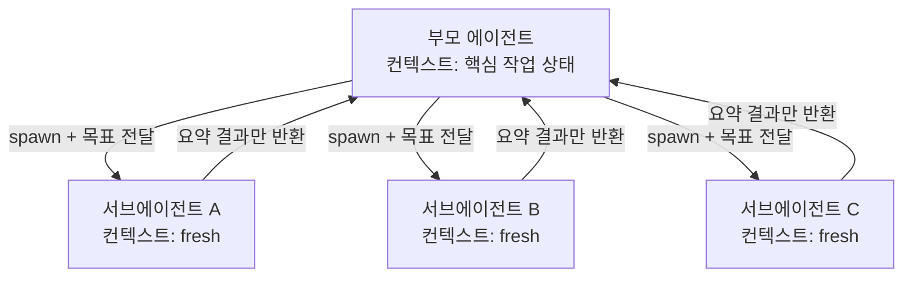

# Subagents

Simon Willison이 [[agentic engineering guide]] Section 2에서 설명하는 핵심 패턴.

## 문제: 컨텍스트 창의 한계

LLM의 **context limit** = 동시에 처리 가능한 최대 토큰 수.

Simon의 관찰:
- 지난 2년간 컨텍스트 한계는 상대적으로 정체
- 최대치: 대략 1,000,000 토큰
- **최적 성능은 200,000 토큰 아래**에서 나옴

긴 대화나 거대 코드베이스 탐색에 그대로 들어가면 부모 에이전트의 "귀중한" 컨텍스트 창이 빠르게 소진된다.

## 해법: Subagents

**Subagent** = 부모 에이전트가 새로운 목표를 가진 "복사본"을 생성하는 패턴.
- 새 컨텍스트 창 (fresh)
- 독립된 프롬프트
- 완료 시 요약 결과만 부모에 리턴

이렇게 하면:
- 대량 탐색은 서브에이전트의 컨텍스트에서 소진
- 부모 에이전트는 핵심 작업 상태만 유지

서브에이전트는 자기 컨텍스트 안에서 토큰을 소진하고 **요약만** 부모에 돌려주기 때문에, 부모의 귀중한 컨텍스트 창이 보호된다.

## Claude Code의 Explore Subagent 예제

[[Claude Code]]는 표준 관행으로 서브에이전트를 활용한다. 기존 저장소에서 작업을 시작하면 먼저 **"Explore" 서브에이전트**를 발사해 코드베이스 구조를 매핑한다.

사용자 요청 예:
> "Make the chapter diffs also show which characters have changed in this diff view with a darker color of red or green for the individually changed segments of text within the line."

Claude Code가 Explore 서브에이전트에 준 지침:
- red/green 배경으로 diff를 렌더링하는 템플릿 찾기
- difflib로 diff를 생성하는 Python 코드 찾기
- diff 렌더링 관련 JavaScript 찾기
- diff 시각화 CSS 스타일 찾기

서브에이전트는 여러 파일에 걸친 전체 diff 뷰 구현을 찾아 부모에 보고.

## Parallel Subagents

여러 서브에이전트를 **동시 실행** 가능:
- 독립 파일 편집 시 속도 이득
- 더 빠르고 값싼 모델 (예: Claude Haiku) 활용 가능

사용자 요청 예:
> "Use subagents to find and update all templates affected by this change."

## Specialist Subagents

특화된 역할을 가진 서브에이전트:

| 역할 | 용도 |
|------|------|
| Code reviewer | 버그, 설계 약점 식별 |
| Test runner | 장황한 테스트 출력을 관리 |
| Debugger | 토큰 집약적 근본 원인 분석 |

각자 자신의 컨텍스트에서 깊이 탐색하되, 부모에는 결론만 반환.

## 실무 적용

1. **새 코드베이스 탐색**: "Use an Explore subagent to find all code related to X" 패턴
2. **병렬 리팩토링**: "Use subagents to update all templates" — 독립 파일에 유리
3. **긴 로그 분석**: 전용 서브에이전트에 로그 읽게 하고 요약만 받기
4. **테스트 반복 실행**: 테스트 러너 서브에이전트로 부모 컨텍스트 보호

## 해석 포인트

Subagents은 **성능만이 아니라 운영 설계까지 함께 봐야 하는 축** 으로 이해할 때 가장 명확하다. 이번 source 묶음이 `code.claude.com×3, anthropic.com×2`처럼 분산돼 있다는 것은, 이 주제가 단일 주장보다 여러 층위의 검증을 거치고 있다는 뜻이다.

실무적으로는 개념 정의 자체보다 **어떤 병목을 해결하고 어떤 비용을 새로 만들까**를 묻는 편이 유익하다. 그래서 이 토픽은 통합 난이도, 관측 가능성, 운영 비용, 교체 가능성를 기준으로 비교·실험하는 식으로 다루는 것이 좋다.

## 2026년 4월 큐레이션 요약

- 정의: 메인 세션이 전용 컨텍스트·권한을 가진 서브에이전트에 작업을 위임하는 오케스트레이션 패턴.
- 왜 중요한가: Claude Code가 `/agents`·`.claude/agents/`·`Agent` 툴·`parent_tool_use_id` 필드를 정식화했고, Anthropic 3월 harness 블로그에서 planner-generator-evaluator 3-agent 구조가 long-running 코딩을 가능하게 한 핵심이라고 공개하면서 "GAN-style agent loop" 패턴이 업계 표준 토론거리가 됐다.
- 직접 수집 원문: 5개
- 주요 도메인: code.claude.com×3, anthropic.com×2

## 핵심 구조

메인 세션이 전용 컨텍스트·권한을 가진 서브에이전트에 작업을 위임하는 오케스트레이션 패턴. 에이전트 토픽은 보통 모델 자체보다 **루프 구조, 상태 관리, 작업 분해, 검증 방식**이 핵심이다. 이번 source 묶음도 `code.claude.com×3, anthropic.com×2`를 오가며 설계 패턴과 구현 사례를 함께 보여 준다.

## 핵심 포인트

Subagents는 현재 시점의 핵심 개념을 정리한 페이지다. 출발점은 Simon Willison이 [[agentic engineering guide]] Section 2에서 설명하는 핵심 패턴.이며, 직접 수집한 source 5건은 이 개념이 연구·문서·구현으로 어떻게 확장되는지 보여준다.

## source로 보면

수집된 source는 code.claude.com×3, anthropic.com×2로 분포한다. 공식 문서/엔지니어링 글 비중이 높아 운영·제품 맥락이 강하다.

## 실무 관점

실무에서는 장기 실행, 상태 관리, 실패 복구, 평가 루프를 함께 설계해야 이 토픽이 효과를 낸다. 즉 개별 아이디어보다 에이전트 시스템 전체의 제약 속에서 읽는 것이 중요하다.

## source 기반 참고

- topic packet: `raw/hot-topics-sources/2026-04-10/topics/subagents.md`

### source별 핵심 신호

- **Create custom subagents - Claude Code Docs** (`code.claude.com`): https://code.claude.com/docs/en/sub-agents
  - 메모: Create and use specialized AI subagents in Claude Code for task-specific workflows and improved context management.
- **Harness design for long-running application development \ Anthropic** (`anthropic.com`): https://www.anthropic.com/engineering/harness-design-long-running-apps
  - 메모: Harness design is key to performance at the frontier of agentic coding. Here's how we pushed Claude further in frontend design and long-running autonomous software engineering.
- **Agent SDK overview - Claude Code Docs** (`code.claude.com`): https://code.claude.com/docs/en/agent-sdk/overview
  - 메모: Intercept and control agent behavior with hooks
- **Common workflows - Claude Code Docs** (`code.claude.com`): https://code.claude.com/docs/en/common-workflows
  - 메모: This page covers practical workflows for everyday development: exploring unfamiliar code, debugging, refactoring, writing tests, creating PRs, and managing sessions.
- **Effective harnesses for long-running agents \ Anthropic** (`anthropic.com`): https://www.anthropic.com/engineering/effective-harnesses-for-long-running-agents
  - 메모: Agents still face challenges working across many context windows. We looked to human engineers for inspiration in creating a more effective harness for long-running agents.

## 관련 문서

- [[how coding agents work]]
- [[coding agent]]
- [[Claude Code]]
- [[agentic engineering guide]]
