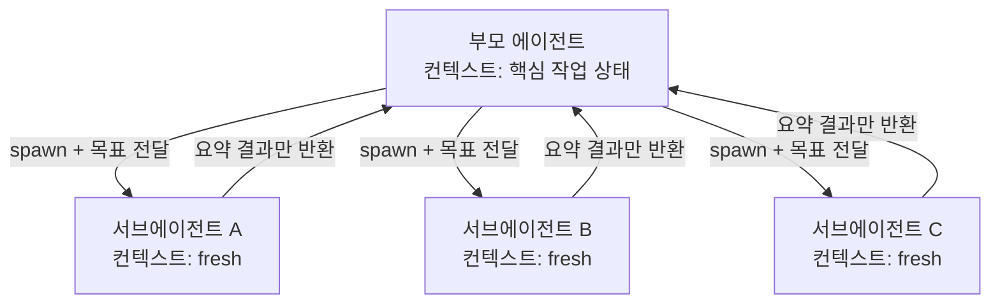

# Subagents

Simon Willison이 [[agentic engineering guide]] Section 2에서 설명하는 핵심 패턴.

## 문제: 컨텍스트 창의 한계

LLM의 **context limit** = 동시에 처리 가능한 최대 토큰 수.

Simon의 관찰:
- 지난 2년간 컨텍스트 한계는 상대적으로 정체
- 최대치: 대략 1,000,000 토큰
- **최적 성능은 200,000 토큰 아래**에서 나옴

긴 대화나 거대 코드베이스 탐색에 그대로 들어가면 부모 에이전트의 "귀중한" 컨텍스트 창이 빠르게 소진된다.

## 해법: Subagents

**Subagent** = 부모 에이전트가 새로운 목표를 가진 "복사본"을 생성하는 패턴.
- 새 컨텍스트 창 (fresh)
- 독립된 프롬프트
- 완료 시 요약 결과만 부모에 리턴

이렇게 하면:
- 대량 탐색은 서브에이전트의 컨텍스트에서 소진
- 부모 에이전트는 핵심 작업 상태만 유지

서브에이전트는 자기 컨텍스트 안에서 토큰을 소진하고 **요약만** 부모에 돌려주기 때문에, 부모의 귀중한 컨텍스트 창이 보호된다.

## Claude Code의 Explore Subagent 예제

[[Claude Code]]는 표준 관행으로 서브에이전트를 활용한다. 기존 저장소에서 작업을 시작하면 먼저 **"Explore" 서브에이전트**를 발사해 코드베이스 구조를 매핑한다.

사용자 요청 예:
> "Make the chapter diffs also show which characters have changed in this diff view with a darker color of red or green for the individually changed segments of text within the line."

Claude Code가 Explore 서브에이전트에 준 지침:
- red/green 배경으로 diff를 렌더링하는 템플릿 찾기
- difflib로 diff를 생성하는 Python 코드 찾기
- diff 렌더링 관련 JavaScript 찾기
- diff 시각화 CSS 스타일 찾기

서브에이전트는 여러 파일에 걸친 전체 diff 뷰 구현을 찾아 부모에 보고.

## Parallel Subagents

여러 서브에이전트를 **동시 실행** 가능:
- 독립 파일 편집 시 속도 이득
- 더 빠르고 값싼 모델 (예: Claude Haiku) 활용 가능

사용자 요청 예:
> "Use subagents to find and update all templates affected by this change."

## Specialist Subagents

특화된 역할을 가진 서브에이전트:

| 역할 | 용도 |
|------|------|
| Code reviewer | 버그, 설계 약점 식별 |
| Test runner | 장황한 테스트 출력을 관리 |
| Debugger | 토큰 집약적 근본 원인 분석 |

각자 자신의 컨텍스트에서 깊이 탐색하되, 부모에는 결론만 반환.

## 실무 적용

1. **새 코드베이스 탐색**: "Use an Explore subagent to find all code related to X" 패턴
2. **병렬 리팩토링**: "Use subagents to update all templates" — 독립 파일에 유리
3. **긴 로그 분석**: 전용 서브에이전트에 로그 읽게 하고 요약만 받기
4. **테스트 반복 실행**: 테스트 러너 서브에이전트로 부모 컨텍스트 보호

## 관련 문서

- [[how coding agents work]]
- [[coding agent]]
- [[Claude Code]]
- [[agentic engineering guide]]
