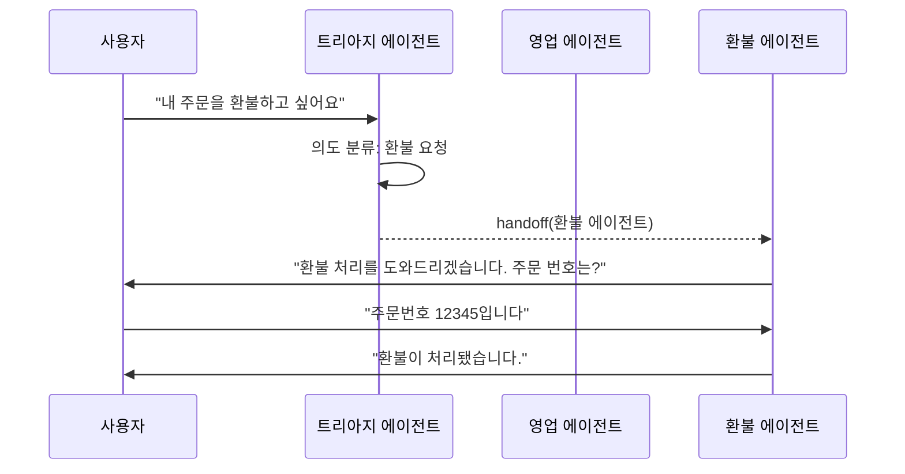
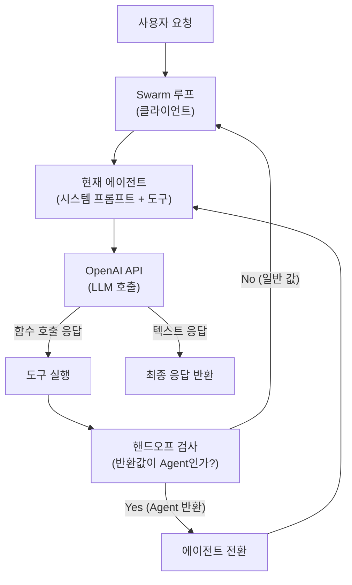

# Swarm - OpenAI 핸드오프 라이브러리

## 개요

Swarm은 2024년 10월 OpenAI가 공개한 실험적(experimental) 멀티 에이전트 오케스트레이션 라이브러리다. **함수 호출(function calling)을 이용해 에이전트 간 핸드오프(handoff)**를 구현하는 것이 핵심 패턴이다. OpenAI는 Swarm을 "교육적(educational) 목적의 경량 라이브러리"로 소개했으며, 프로덕션 사용보다는 멀티 에이전트 패턴 학습과 프로토타이핑을 위한 도구로 위치시켰다. 이후 Swarm의 개념은 [[openai-agents-sdk]]의 핸드오프 기능으로 발전 흡수됐다.

## 핵심 개념: 에이전트와 핸드오프

Swarm은 두 가지 원시 개념(primitive)만을 사용한다.

**에이전트(Agent)**: 시스템 프롬프트 + 도구 목록 + 모델로 구성된 실행 단위

**핸드오프(Handoff)**: 한 에이전트가 실행 제어권을 다른 에이전트에게 넘기는 행위



트리아지 에이전트는 사용자의 의도를 파악하고 적합한 전문 에이전트로 핸드오프한다. 핸드오프 후 대화는 새 에이전트가 이어받는다.

## 핸드오프 구현 방식

Swarm의 핸드오프는 LLM 함수 호출(function calling) 위에 구현된다.

```python
from swarm import Swarm, Agent

client = Swarm()

# 핸드오프 함수 정의 - 에이전트를 반환하면 핸드오프 발생
def transfer_to_refund_agent():
    return refund_agent

def transfer_to_sales_agent():
    return sales_agent

# 트리아지 에이전트: 분류 후 핸드오프
triage_agent = Agent(
    name="트리아지 에이전트",
    instructions="사용자 의도를 파악하고 적합한 에이전트로 전달하세요.",
    functions=[transfer_to_refund_agent, transfer_to_sales_agent],
)

# 환불 전문 에이전트
refund_agent = Agent(
    name="환불 에이전트",
    instructions="환불 요청을 처리합니다. 주문 번호를 확인하고 환불을 진행하세요.",
    functions=[process_refund, escalate_to_human],
)

# 실행
response = client.run(
    agent=triage_agent,
    messages=[{"role": "user", "content": "주문을 환불하고 싶어요"}]
)
```

`functions` 목록에 에이전트를 반환하는 함수를 포함시키면, LLM이 그 함수를 호출했을 때 Swarm이 자동으로 에이전트 전환을 처리한다.

## 컨텍스트 변수

Swarm은 에이전트 간 공유 상태를 위해 **컨텍스트 변수(context variables)** 딕셔너리를 제공한다.

```python
def check_order_status(context_variables: dict, order_id: str) -> str:
    user_id = context_variables.get("user_id")  # 공유 상태 접근
    # 주문 조회 로직...
    return f"주문 {order_id}의 상태: 배송 중"

def process_refund(context_variables: dict) -> str:
    order_id = context_variables.get("order_id")  # 이전 에이전트가 설정한 값
    # 환불 처리 로직...
    context_variables["refund_processed"] = True  # 상태 업데이트
    return "환불이 처리됐습니다."

agent = Agent(
    name="주문 에이전트",
    functions=[check_order_status, process_refund]
)

response = client.run(
    agent=agent,
    messages=[...],
    context_variables={"user_id": "user_123", "order_id": "order_456"}
)
```

컨텍스트 변수는 핸드오프를 거쳐도 유지된다. 트리아지 에이전트가 `order_id`를 확인한 후 환불 에이전트로 핸드오프해도, 환불 에이전트는 `context_variables["order_id"]`로 접근할 수 있다.

## 설계 원칙

### 1. 최소 추상화 (Minimal Abstraction)

Swarm은 의도적으로 얇은 레이어만 추가한다. LLM 호출, 함수 실행, 메시지 루프는 모두 사용자가 이해하고 직접 제어할 수 있는 수준에서 노출된다. "마법 같은" 동작이 최소화돼 있다.

### 2. 에이전트 = 일급 객체

에이전트가 도구의 반환값으로 사용될 수 있다(함수가 에이전트를 반환하면 핸드오프). 에이전트 자체를 프로그래밍 가능한 값으로 다루는 함수형 접근이다.

### 3. 상태 무결성 (Stateless Core)

Swarm 자체는 상태를 저장하지 않는다. 모든 상태는 외부에서 `messages` 리스트와 `context_variables` 딕셔너리로 관리된다. 이는 테스트와 디버깅을 쉽게 한다.

## 아키텍처 다이어그램



## 실제 사용 사례 패턴

### 고객 서비스 라우팅

```python
# 의도별 전문 에이전트로 분기
agents = {
    "refund": refund_agent,
    "technical": tech_support_agent,
    "sales": sales_agent,
    "billing": billing_agent,
}

def route_to_specialist(intent: str):
    return agents.get(intent, general_agent)
```

### 단계별 정보 수집

```python
# 에이전트가 순서대로 정보를 수집하고 다음 에이전트로 핸드오프
def collect_name():
    return name_collected_agent

def collect_address():
    return address_collected_agent

intake_agent = Agent(
    name="접수 에이전트",
    instructions="먼저 이름을 수집한 후 주소를 수집하세요.",
    functions=[collect_name]
)
```

## OpenAI Agents SDK와의 관계

Swarm은 실험적 라이브러리로 공개됐고, 2025년 OpenAI가 정식 출시한 [[openai-agents-sdk]]에 핸드오프 개념이 통합됐다.

| 항목 | Swarm | OpenAI Agents SDK |
|------|-------|-------------------|
| 상태 | 실험적 (deprecated에 가까움) | 정식 지원 |
| 핸드오프 | 함수 반환값으로 구현 | `handoffs` 파라미터로 명시 |
| 트레이싱 | 없음 | 내장 트레이싱 |
| 가드레일 | 없음 | 내장 입출력 가드레일 |
| 목적 | 교육/프로토타이핑 | 프로덕션 |

Swarm의 핵심 패턴("에이전트가 다른 에이전트를 호출/반환")은 OpenAI Agents SDK에서 공식 설계 패턴으로 채택됐다. [[openai-agents-sdk-handoffs]] 참조.

## 한계

- **실험적 라이브러리**: OpenAI가 프로덕션 사용 권장하지 않음 (API 변경 가능)
- **영속 메모리 없음**: 세션 간 대화 이력 저장 불가 (직접 구현 필요)
- **병렬 에이전트 없음**: 에이전트들이 순차 실행만 지원
- **관찰성(observability) 미흡**: 내장 로깅/트레이싱이 없어 디버깅이 불편

## 관련 문서

- [[openai-agents-sdk]] - Swarm 개념이 진화한 공식 SDK
- [[openai-agents-sdk-handoffs]] - 핸드오프 패턴 심화
- [[function-calling-tool-use]] - 함수 호출 기반 도구 사용
- [[function-call-evolution]] - 함수 호출 진화사
- [[multi-agent-orchestration]] - 멀티 에이전트 조율 패턴
- [[agent-workflow-patterns]] - 에이전트 워크플로우 패턴
