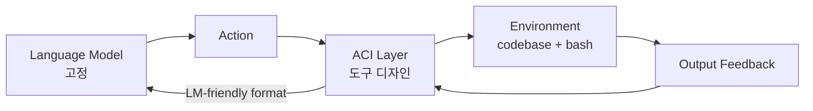
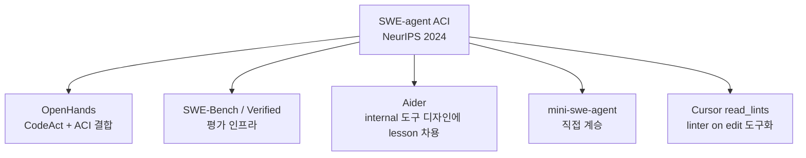

# SWE-agent (Princeton / Stanford)

Yang et al.이 NeurIPS 2024에 발표한 표지석 코딩 에이전트. **Agent-Computer Interface(ACI)** 라는 개념을 정립하며 코딩 에이전트 도구 디자인 분야의 표준 reference로 자리잡았다.

## 정체성

| 항목 | 내용 |
|---|---|
| 이름 | SWE-agent |
| 발표 | NeurIPS 2024 (Yang et al., arXiv:2405.15793) |
| 소속 | Princeton + Stanford |
| 라이선스 | MIT |
| GitHub | github.com/SWE-agent/SWE-agent |
| 현 상태 | maintenance-only (mini-swe-agent로 계승) |

## 핵심 명제 — ACI

> "LM agents represent a new category of end users with their own needs and abilities, and would benefit from specially-built interfaces."

언어 모델 에이전트는 **새로운 카테고리의 end user**이며, raw bash 환경에서는 잘 동작하지 않는다. tool 명령, 출력 포맷, 피드백 모두 LM 친화적으로 재설계해야 한다.

> "good ACI design leads to much better results when using agents"

> "a baseline agent without a well-tuned ACI does much worse than SWE-agent"

→ 무엇을 보여주고 어떻게 피드백하는지가 결정적.

## 접근 방법

> 고정된 LM 가정. ACI 자체를 설계해 "shaping the actions, their documentation, and environment feedback to complement an LM's limitations and abilities."

## 핵심 도구 4종

### A. Linter integration on edit

> "a linter that runs when an edit command is issued, and do not let the edit command go through if the code isn't syntactically correct."

→ 구문 오류 코드가 commit되어 후속 단계까지 cascading 하는 것을 차단. 후일 [[cursor]] 등이 `read_lints` 같은 별도 도구로 차용.

### B. Special-built file viewer

> "works best when displaying just 100 lines in each turn"

스크롤 + 검색 기능 내장. `cat` 같은 raw 도구는 한 번에 너무 많은 컨텍스트를 쏟아내 LM 주의를 분산. **100 라인 슬라이딩 윈도우는 의도적 정보 절약**.

### C. Special-built full-directory search

> "we simply list each file that had at least one match. Showing the model more context about each match proved to be too confusing for the model."

→ grep 같은 도구가 매칭 라인까지 전부 보여주면 모델이 노이즈에 압도된다는 경험적 발견. **매치된 파일만 리스팅하는 단순화**.

### D. Empty output handling

> "When commands have an empty output we return a message saying 'Your command ran successfully and did not produce any output.'"

→ 빈 출력 = 에러로 잘못 해석할 수 있음. **명시적 성공 메시지로 처리**.

## 벤치마크 결과

- **SWE-bench**: 12.5% pass@1
- **HumanEvalFix**: 87.7% pass@1

> "far exceeded the previous state-of-the-art achieved with non-interactive language models"

이전 SOTA 1.96% → 12.5%로 ~6배 도약. **SWE-agent가 SWE-bench라는 "에이전트 코딩" 평가 기준 자체를 정착시켰다**.

## Mini-SWE-agent 계승

### 현 상태

> "Most of our current development effort is on mini-swe-agent, which has superseded SWE-agent."

> mini-swe-agent "matches the performance of SWE-agent, while being much simpler"

SWE-agent 자체는 "in maintenance-only mode."

### 의미

ACI의 설계 lesson은 정착되었고, 더 작은 코드베이스로 동등 성능 가능 → ACI 핵심은 **"시스템의 간결함이 LM 친화성의 함수"** 라는 시사.

## SWE-agent Configuration

### 모토 (GitHub README)

- "Free-flowing & generalizable: Leaves maximal agency to the LM"
- "Configurable & fully documented: Governed by a single yaml file"
- "Simple & hackable by design"

### Configuration scope (단일 yaml)

- Agents
- Models
- Tools
- Environments
- Demonstrations

### Container/sandbox

- `.devcontainer` 디렉토리 — VS Code dev container 지원
- GitHub Codespaces 통합
- (별도 sandbox 메커니즘은 mini-swe-agent에서 더 단순화)

## 설계 lesson summary

| Lesson | 메커니즘 | Why |
|---|---|---|
| 정보 절약 | 100-line viewer | LM 주의 분산 방지 |
| 노이즈 제거 | 매치된 파일만 리스팅 | 매치 컨텍스트가 오히려 혼동 |
| 빠른 피드백 | Linter on edit | syntactic 오류 cascading 차단 |
| 명시성 | Empty output 메시지 | 침묵 = 에러로 오해 방지 |
| 도구 간결성 | yaml 단일 설정 | 재현 가능성 + 쉬운 hacking |

## 다른 하네스와 차이

- **vs [[aider]]**: Aider는 git auto-commit + repo-map 중심. SWE-agent는 SWE-bench 자율 issue 해결 중심으로 ACI 자체 설계에 더 집중
- **vs [[openhands|OpenHands CodeAct]]**: CodeAct는 모든 액션을 코드 실행으로 표현. SWE-agent는 명시적 도구 호출 (file viewer, search, edit) 중심
- **vs [[claude-code|Claude Code]]**: Claude Code는 native multi-tool. SWE-agent는 ACI 자체가 연구 산출물로 분리되어 있음

## 영향 (lineage)

ACI 설계 원칙이 후속 코딩 에이전트에 깊이 침투:

## 인용

> Yang et al., "SWE-agent: Agent-Computer Interfaces Enable Automated Software Engineering", NeurIPS 2024. arXiv:2405.15793

## 관련 문서

- [[openhands|OpenHands]] — ACI를 CodeAct와 결합한 후계
- [[aider|Aider]] — repo-map과 함께 ACI lesson 흡수
- [[cursor|Cursor]] — `read_lints`로 linter on edit 도구화
- [[claude-code|Claude Code]] — native multi-tool 접근
- [[swe-bench-ecosystem-2026|SWE-bench 생태계]]
- [[how-coding-agents-work|코딩 에이전트 작동 원리]]
- [[coding-harness-comparison|코딩 에이전트 하네스 횡단 비교]]
- [[anthropic-harness-design|Anthropic harness design]]
