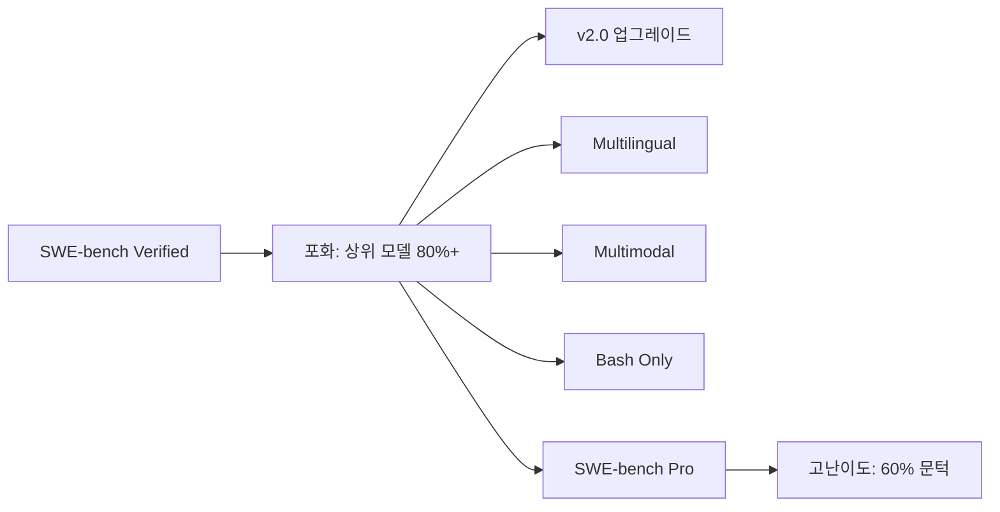

# SWE-bench Verified 생태계 (2026)

## 개요

SWE-bench Verified는 2024년 등장 이후 [[how-coding-agents-work|AI 코딩 에이전트]]의 사실상 표준 벤치마크로 자리잡았으나, 2026년에 접어들며 상위 모델들이 80%를 넘기면서 포화 현상이 나타났다. 이에 대응하여 v2.0 업그레이드, Multilingual, Multimodal, Bash Only 등 다양한 파생 벤치마크가 등장하며 생태계가 크게 확장되었다. Claude Mythos Preview가 93.9%로 1위를 기록하는 등 원본 벤치마크의 변별력이 약화됨에 따라, 더 높은 난이도와 다양한 평가 축이 요구되고 있다. [[long-horizon-agent-benchmarks|장기 실행 에이전트 벤치마크]]가 이 방향의 확장이다.

이 문서는 2026년 SWE-bench 생태계 전체의 확장 양상을 다룬다. 원본 벤치마크의 후속 고난이도 벤치마크인 SWE-bench Pro에 대해서는 [[swe-bench-pro]]를 참조한다.

### 벤치마크 방법론

SWE-bench Verified는 12개 오픈소스 Python 저장소에서 수집한 실제 GitHub 이슈를 사용한다. 원본 데이터셋에서 93명의 소프트웨어 개발자가 3인 교차 검증을 거쳐 500개 샘플을 선별했으며, 인프라 신뢰성 이슈로 16개를 제외한 484개 샘플이 최종 평가에 사용된다. 추정 오류율은 5-10%이다.

평가 환경은 네트워크 접근이 차단된 Linux Docker 컨테이너에서 실행되며, 이슈 시점 이후의 Git 히스토리를 제거하여 솔루션 치팅을 방지한다. 모델에는 bash 명령 실행, 텍스트 에디터(파일 열람/수정), 패치 적용 도구가 제공된다. 토큰 한도는 캐시되지 않은 읽기/쓰기 2M, 캐시된 읽기 20M으로 설정되어 있다.

## 핵심 개념

### 원본 포화와 파생 벤치마크

SWE-bench Verified의 원본 점수가 상한에 근접하면서, 단일 벤치마크로는 모델 간 차이를 변별하기 어려워졌다. 이에 따라 평가의 다양성을 확보하기 위한 파생 벤치마크들이 등장했다.

**SWE-bench Multilingual**: Python 중심이었던 원본을 Java, JavaScript, TypeScript, Go, Rust 등 다국어 코드베이스로 확장. 실무 환경의 다국어 프로젝트를 반영한다.

**SWE-bench Multimodal**: 텍스트 이슈 설명 외에 스크린샷, 에러 로그 이미지 등 시각적 정보를 포함하는 이슈를 다룬다. 프론트엔드 버그, UI 이슈 해결 능력을 평가한다.

**SWE-bench Bash Only**: 코드 에디터 없이 터미널 명령어만으로 이슈를 해결하는 능력을 평가한다. 인프라 운영, 시스템 관리 태스크에 해당한다.

**SWE-bench Lite**: 경량 서브셋으로 빠른 평가 회전을 위한 벤치마크.

### 생태계 확장 도구

| 프로젝트 | 역할 |
|---------|------|
| mini-SWE-agent | 100줄 Python으로 Verified에서 최대 74% 달성하는 경량 에이전트 |
| SWE-smith | 합성 SWE-bench 데이터 생성 도구 |
| CodeClash | LM 간 직접 대결 방식 평가 |
| SWE-ReX | 추가 실험 플랫폼 |

### v2.0 업그레이드 (2026년 2월)

2026년 2월 SWE-bench는 스캐폴딩, 실행 환경, 토큰 한도를 전면 개편한 v2.0.0을 출시했다. 이 업그레이드로 기존 모델들의 성능 점수가 유의미하게 상승했으며, 평가 인프라의 재현성과 안정성이 크게 개선되었다. v2.0은 기존 Verified 서브셋(484개 샘플)을 유지하면서도 평가 조건을 현대화하여, 2026년 시점의 에이전트 능력을 더 정확히 반영한다.

### 2026년 리더보드 현황

**Verified 리더보드 (2026년 4월 기준)**:
- Claude Mythos Preview: 93.9% (1위)
- Claude Opus 4.6: 80.8%

**Bash Only 리더보드 (mini-SWE-agent v2.0.0 기준)**:
- Claude 4.5 Opus (high reasoning): 76.8% (비용 $376.95)
- Gemini 3 Flash (high reasoning): 75.8% (비용 $177.98)
- MiniMax M2.5 (high reasoning): 주목할 만한 비용 효율성

리더보드는 해결률(resolution rate), API 호출 효율성(인스턴스당 평균 호출 수), 인스턴스당 비용을 추적하며, 개별 이슈 단위의 성공/실패까지 기록한다. 테스트된 에이전트들은 평균 30-60회의 API 호출로 개별 문제를 해결하며, 비용 효율성도 크게 향상되었다.

## 기술 상세

### 벤치마크 선택 가이드

- 범용 코딩 에이전트 평가: SWE-bench Verified (기본) + Pro (고난이도)
- 다국어 코드베이스 대응 평가: Multilingual
- 프론트엔드/UI 에이전트 평가: Multimodal
- DevOps/인프라 에이전트 평가: Bash Only
- 빠른 반복 평가: Lite

### 포화 대응 전략

원본 벤치마크의 포화는 벤치마크 자체의 한계가 아니라 AI 코딩 에이전트의 급격한 발전을 반영한다. 생태계 확장은 두 방향으로 진행된다.

1. **난이도 수직 확장**: SWE-bench Pro처럼 더 복잡한 장기 호흡 태스크로 상한을 높이는 방향
2. **범위 수평 확장**: Multilingual, Multimodal, Bash Only처럼 평가 축 자체를 다양화하는 방향

### 평가 인프라 아키텍처

모든 SWE-bench 변형은 공통된 평가 파이프라인을 공유한다. 에이전트에게 저장소 접근 권한과 이슈 설명이 제공되면, 에이전트가 코드를 조사하고 수정한 뒤, 해당 이슈에 연결된 단위 테스트 실행으로 솔루션을 검증한다. 클라우드 인프라에 로그와 트레젝터리가 저장되어 재현성을 보장한다. SWE-smith는 이 파이프라인에 합성 데이터를 공급하여 학습 데이터를 확장하고, CodeClash는 동일 이슈에 대해 두 모델을 직접 대결시켜 상대적 역량을 평가한다.

## 관련 문서

- [[swe-bench-pro]] -- 장기 호흡 고난이도 후속 벤치마크
- [[long-horizon-agent-benchmarks]] -- 장기 호흡 에이전트 벤치마크
- [[component-level-agent-evaluation]] -- 컴포넌트 수준 에이전트 평가
- [[openhands]] -- SWE-bench 상위권 자율 코딩 에이전트
- [[terminal-bench-2-0]] -- 터미널 벤치마크
