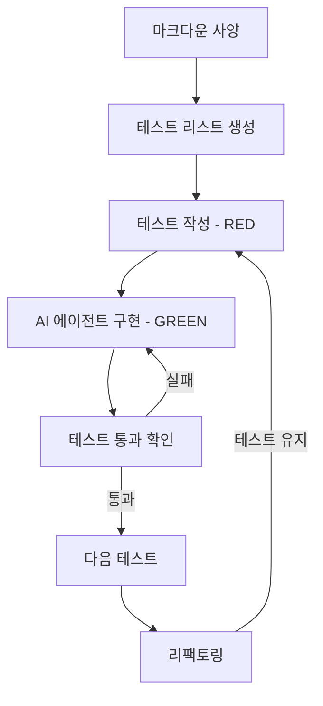

## 개요

TDD + Agentic Coding은 테스트 주도 개발(TDD)과 [[agentic-ai-foundation|AI 에이전트]]를 결합한 개발 방법론이다. 마크다운 사양에서 테스트 리스트를 생성하고, 에이전트가 Red/Green 루프를 자율적으로 실행하는 워크플로우를 따른다. [[spec-driven-development|Spec-Driven Development]]와 함께 에이전트 코딩 방법론의 핵심이다. "TDD는 흐름에 구조를 부여하고, 에이전틱 코딩은 구조에 속도를 부여한다"는 핵심 철학 아래, 테스트가 AI에게 정확한 행동 사양 역할을 하며, 각 생성 단계를 즉시 검증하여 환각(hallucination)을 줄인다. [[component-level-agent-evaluation|컴포넌트 수준 평가]]로 각 단계의 품질을 정밀 진단할 수 있다.

핵심 인사이트: "테스트가 먼저 실패하면 LLM이 속일 수 없고, 실제 구현을 작성해야 한다." 이는 AI 에이전트가 비기능적 코드를 생성하거나 불필요한 코드를 만드는 두 가지 핵심 리스크를 동시에 해결한다.

## 핵심 특징

- **테스트가 프롬프트**: 모호한 지시 대신, 서술적 테스트 케이스가 AI 에이전트의 구현 가이드 역할
- **점진적 구축**: 테스트 하나당 하나의 행동을 기술하고, AI가 단계별로 로직을 구축
- **즉시 검증**: 모든 생성 단계가 테스트 실행을 통해 즉각 검증
- **환각 감소**: 정확하고 초점 맞춘 프롬프트(테스트)로 AI 환각 대폭 감소
- **행동 중심 사고**: 구현 세부사항이 아닌 행동(behavior) 관점의 개발

## 기술 상세

### 워크플로우



### Red/Green/Refactor 에이전틱 루프

| 단계 | 활동 | 주체 |
|---|---|---|
| RED | 특정 행동에 대한 테스트 작성 | 개발자 또는 에이전트 |
| GREEN | 테스트를 통과하는 최소 코드 구현 | AI 에이전트 |
| REFACTOR | 테스트 그린 상태를 유지하며 코드 정리 | AI 에이전트 |
| REPEAT | 다음 행동에 대한 새 테스트 추가 | 반복 |

### 기존 TDD와의 차이

| 항목 | 전통적 TDD | TDD + Agentic Coding |
|---|---|---|
| 구현 주체 | 개발자 | AI 에이전트 |
| 테스트 작성 | 개발자 | 개발자 (또는 사양에서 자동 생성) |
| 루프 속도 | 분 단위 | 초 단위 |
| 환각 문제 | 해당 없음 | 테스트로 자동 검증 |
| 개발자 역할 | 구현 + 테스트 | 행동 정의 + 검증 감독 |

### 모범 사례

1. **고가치 행동 우선**: 엣지 케이스보다 핵심 행동을 먼저 테스트
2. **서술적 테스트 이름**: 명확한 이름으로 AI의 출력 품질 향상 (예: `test_should_reject_negative_price`)
3. **단일 행동 범위**: 각 프롬프트의 범위를 하나의 행동으로 제한
4. **그린 유지 리팩토링**: 리팩토링 요청 시 테스트 통과 상태 유지 명시
5. **Pre-commit 훅**: 잘못된 코드의 머지 방지를 위한 자동 게이트
6. **테스트 실패 확인 필수**: 구현 전 테스트가 반드시 실패하는지 확인하여, 이미 통과하는 테스트 작성을 방지

### 컨텍스트 격리와 멀티 에이전트 접근

단일 컨텍스트 윈도우에서 모든 단계를 실행하면 LLM이 진정한 TDD를 따르기 어렵다. 2026년 주요 프레임워크들은 이를 해결하기 위해 명시적 단계 게이트(phase gate)를 도입했다:

- **테스트 작성 에이전트**와 **구현 에이전트**를 분리하여 컨텍스트 격리
- 테스트 작성자가 구현 계획을 볼 수 없으므로, 예상 코드 구조가 아닌 실제 요구사항을 반영하는 테스트가 작성됨
- 각 TDD 단계 완료 전까지 다음 단계로 진행을 차단하는 서브에이전트 강제

대표적으로 Claude Code의 Skills/Hooks 시스템이 이 패턴을 구현한다. Superpowers 프레임워크는 테스트 전에 작성된 코드를 삭제하는 강제 워크플로우를 적용하며, 출시 3개월 만에 GitHub 99,200+ 스타를 달성했다.

### 프롬프트 예시

```
Build a Python function to extract headers from a markdown string.
Use red/green TDD.
```

이 간결한 프롬프트만으로 에이전트가 (1) 테스트 작성 -> (2) 실패 확인 -> (3) 최소 구현 -> (4) 통과 확인의 전체 루프를 실행한다.

### 적합한 작업 유형

특히 복잡한 로직에서 효과적이다:

- 가격 계산 엔진
- 유효성 검증 로직
- 다중 조건 워크플로우
- 비즈니스 규칙 구현
- 상태 기계(state machine)

### 도구 생태계 (2026)

| 도구 | TDD 지원 방식 |
|------|-------------|
| Claude Code (Skills) | 단계 게이트 + 서브에이전트 격리, 공식 TDD 스킬 |
| Superpowers | 테스트 전 코드 삭제 강제, Brainstorm -> Spec -> Plan -> TDD 파이프라인 |
| Cursor | 인라인 TDD 루프 지원 |
| Aider | watch 모드로 테스트 파일 변경 감지 후 자동 구현 |

### [[spec-driven-development]]와의 시너지

Spec-Driven Development가 "무엇을 만들 것인가"를 정의한다면, TDD + Agentic Coding은 "어떻게 검증하며 만들 것인가"를 정의한다. 사양에서 테스트 리스트를 도출하고, 에이전트가 테스트 기반으로 구현을 진행하는 흐름은 두 방법론의 자연스러운 결합이다. 마크다운 체크리스트 템플릿(tdd-plan.md)으로 비즈니스 로직을 순차적 테스트-구현 쌍으로 분해하면, 에이전트가 복잡한 로직을 안전하게 점진적으로 구축한다.

## 관련 문서

- [[spec-driven-development]] - 사양 주도 개발 방법론
- [[how-coding-agents-work]] - 코딩 에이전트 동작 원리
- [[evolution-of-agentic-patterns]] - 에이전틱 패턴의 진화
- [[claude-code]] - Anthropic의 CLI 코딩 에이전트
