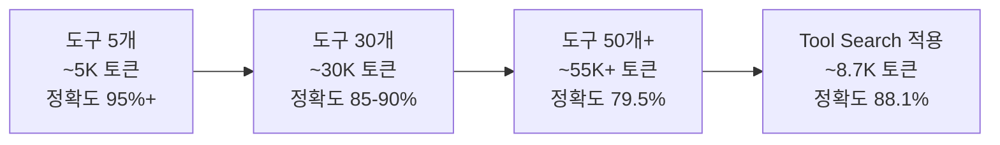

## 개요

도구 호출 최적화(Tool Calling Optimization)는 [[agentic-ai-foundation|LLM 에이전트]]가 외부 도구를 효율적으로 선택하고 실행하도록 토큰 사용량, 스키마 설계, 정확도를 개선하는 기법이다. 도구 수가 증가할수록 컨텍스트 포화와 선택 정확도 저하가 동시에 발생하므로, 프로덕션 에이전트에서 핵심적인 최적화 영역이다. [[prompt-caching-agentic|프롬프트 캐싱]]과 결합하면 비용과 정확도를 동시에 개선할 수 있다. 2026년 기준 Gemini와 Claude가 도구 호출 벤치마크에서 99.3점으로 동점을 기록하고 있다.

핵심 인사이트는 **"어떤 도구를 호출할지 결정하는 것(도구 발견)"과 "실제로 그 도구를 안정적으로 실행하는 것(도구 실행)"은 근본적으로 다른 문제**라는 점이다. [[model-context-protocol-mcp|MCP]] 같은 프로토콜이 인터페이스를 표준화하더라도, 10,000 사용자의 OAuth 2.0 수명주기 관리나 규정 준수 로깅 같은 런타임 문제는 해결하지 못한다.

## 핵심 개념

### 토큰 포화 문제

도구 정의는 상당한 토큰을 소비한다. Anthropic 내부 테스트에 따르면 58개 도구를 로드하면 약 55,000 토큰이 소모되며, 이는 비용 증가와 정확도 저하를 동시에 유발한다. 도구 옵션이 증가할수록 모델의 올바른 도구 선택 능력이 저하된다.

### 3대 최적화 축

1. **토큰 절약**: 도구 정의의 토큰 소비 최소화
2. **선택 정확도**: 올바른 도구를 올바른 파라미터로 호출
3. **실행 안정성**: 인증, 재시도, 에러 처리의 신뢰성

## 기술 상세

### Tool Search 패턴

30개 이상의 도구를 가진 에이전트에서 Anthropic이 권장하는 패턴. 모든 도구를 프롬프트에 로드하는 대신 Tool Registry(MCP 또는 벡터 스토어)를 통해 사용자 의도에 기반하여 관련 도구만 동적으로 발견한다:

- **토큰 감소**: 85% (77K -> 8.7K 토큰)
- **정확도 향상**: 79.5% -> 88.1% (Claude Opus 4.5 기준)
- 에이전트가 먼저 "어떤 도구가 필요한가"를 질의하고, 검색 결과로 반환된 소수의 관련 도구만 컨텍스트에 포함
- [[prompt-caching-agentic|프롬프트 캐싱]]과 결합하면 동적으로 로드된 도구 정의도 후속 턴에서 캐시 재사용 가능

### Strict Schema 설계

도구 정의에 엄격한 JSON Schema를 적용하여 LLM의 구조화된 출력을 보장한다:

- `required` 필드 명시로 누락 방지
- `enum` 제약으로 유효 값 범위 제한
- `additionalProperties: false`로 예상치 못한 필드 차단
- 중첩 객체보다 평면 구조 선호

### 도구 정의 최적화 기법

도구 문서는 계약서처럼 작성해야 한다: 목적 한 줄, 명확한 예시, 추측의 여지가 없는 인자 타입.

| 기법 | 설명 | 효과 |
|------|------|------|
| 간결한 설명 | 불필요한 설명 제거, 핵심 용도만 기술 | 토큰 30-50% 절감 |
| 파라미터 축소 | 선택적 파라미터는 기본값 활용 | 스키마 토큰 절감 |
| 이름 규칙 통일 | `verb_noun` 패턴으로 일관성 유지 | 선택 정확도 향상 |
| 카테고리 그룹핑 | 관련 도구끼리 묶어 제시 | 검색 효율 향상 |
| 예시 포함 | 호출 예시를 1-2개 포함 | 파라미터 정확도 향상 |
| 출력 최소화 | 에이전트가 필요한 것만 반환, 작고 타입된 출력 유지 | 후속 처리 정확도 향상 |
| 결정 투명성 | 도구 호출 전 근거를 명시하도록 요구 | 선택 품질 향상 + 디버깅 용이 |

### 실행 레이어 고려사항

도구 호출 최적화에서 가장 간과되는 부분이 실행 인프라이다. "도구를 발견하는 것은 사소하지만, 실행하는 것은 복잡하다":

- **사용자별 인증**: 수백 개 서비스의 OAuth 2.0 수명주기 관리 (토큰 갱신, 스코프 검증)
- **레이트 리미팅**: API가 429 응답을 반환할 때 지수 백오프 재시도 로직
- **페이지네이션 추상화**: 불완전한 데이터셋에서 에이전트가 환각하는 것을 방지
- **출력 정규화**: 다양한 API 응답 형식을 일관된 구조로 변환
- **거버넌스**: 읽기/쓰기 범위 검증, 규정 준수 로깅
- **옵저버빌리티**: 모든 도구 호출의 로깅 및 추적

### 고급 최적화: 그리드 서치 접근

프로덕션 환경에서는 LLM 모델, 시스템 프롬프트, 아키텍처, 도구 설명의 모든 조합을 그리드 서치하여 최적 구성을 식별하는 것이 권장된다. 또한 ToolChain* 같은 접근법은 A* 탐색 알고리즘을 태스크별 비용 함수와 결합하여 비용 효율적인 도구 호출 경로를 탐색한다.

### 벤치마크 현황 (2026년 4월)

| 모델 | Tool Calling 점수 |
|------|-------------------|
| Gemini 3.1 Pro | 99.3 |
| Claude Opus 4.6 | 99.3 |
| GPT-5.4 | 98.7 |

도구 호출 정확도는 대부분의 프론티어 모델에서 수렴하고 있으며, 차별화 요소는 복잡한 다중 도구 체이닝과 병렬 호출 시나리오로 이동하고 있다. SLM(Small Language Model)도 타겟 파인튜닝을 통해 특정 도구 호출 시나리오에서 대형 모델에 필적하는 성능을 달성하는 연구가 진행 중이다(arXiv:2512.15943).

## 관련 문서
- [[compound-ai-systems]] -- 복합 AI 시스템 (Compound AI Systems)

- [[prompt-caching-agentic]] - 프롬프트 캐싱으로 도구 정의 비용 절감
- [[writing-effective-tools-for-agents]] - 에이전트를 위한 효과적인 도구 작성
- [[tool-contracts-for-agents]] - 에이전트용 도구 계약
- [[how-coding-agents-work]] - 코딩 에이전트 동작 원리
