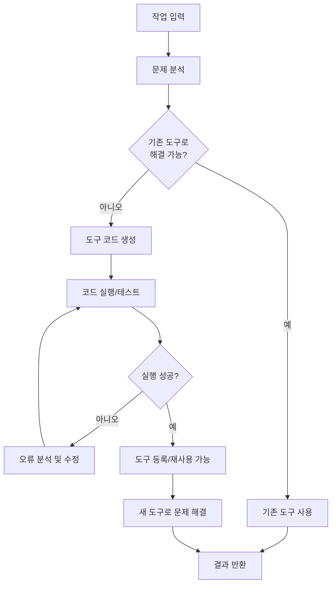

# 도구 생성 메타 에이전트

## 개념 정의

도구 생성 메타 에이전트(Tool-Creator Meta-Agent)는 LLM이 스스로 도구(코드, 함수, API 클라이언트 등)를 작성하고 즉시 실행·사용하는 패턴이다. 기존 에이전트가 미리 정의된 도구 목록에서 선택하는 방식과 달리, 메타 에이전트는 현재 문제에 맞는 도구를 동적으로 생성한다. Code Interpreter 패턴을 일반화한 형태로 볼 수 있다.



위 흐름은 에이전트가 도구 부재 상황에서 스스로 도구를 제작하고 검증하는 전체 사이클을 보여준다.

## 핵심 아이디어: 자기 확장(Self-Extending)

전통적인 에이전트 설계에서 도구 집합은 시스템 구축 시점에 고정된다. 도구 생성 메타 에이전트는 이 가정을 깬다:

- **즉석 도구 제작**: 주어진 문제를 분석하고 그 자리에서 Python 함수, SQL 쿼리, API 호출 코드를 생성
- **자기 검증**: 생성한 코드를 실제 실행해 결과를 확인하고 오류 시 자동 수정
- **도구 라이브러리 축적**: 성공적으로 생성된 도구를 캐시하여 이후 유사한 문제에 재사용
- **추상화 계층 생성**: 복잡한 멀티스텝 도구를 단일 함수로 래핑하여 상위 레벨 추론에 활용

## 알고리즘 구조

### 기본 루프

```
1. 작업 분석: 현재 작업을 부분 문제로 분해
2. 도구 매칭: 기존 도구 목록과 비교, 갭 식별
3. 도구 명세: 필요한 도구의 입력/출력/동작 명세 작성
4. 코드 생성: 명세 기반으로 실행 가능한 코드 생성
5. 샌드박스 실행: 격리된 환경에서 코드 실행
6. 결과 검증: 출력이 기대와 일치하는지 확인
7. 수정/반복: 실패 시 오류를 분석하여 코드 수정
8. 도구 등록: 성공 시 도구 목록에 추가
```

### 도구 명세 생성 예시

```python
# 도구 생성 메타 에이전트의 핵심 구조
class ToolCreatorAgent:
    def __init__(self, llm, executor, tool_registry):
        self.llm = llm
        self.executor = executor  # 코드 실행 환경 (샌드박스)
        self.tool_registry = tool_registry  # 기존 도구 목록

    def solve(self, task: str) -> str:
        # 1단계: 필요한 도구 식별
        tool_need = self.llm.identify_tool_gap(task, self.tool_registry.list())

        if tool_need is None:
            # 기존 도구로 해결 가능
            return self.llm.reason_with_tools(task, self.tool_registry)

        # 2단계: 도구 코드 생성
        tool_spec = self.llm.generate_tool_spec(tool_need)
        tool_code = self.llm.generate_tool_code(tool_spec)

        # 3단계: 검증 루프
        for attempt in range(3):
            result = self.executor.run(tool_code, test_input=tool_spec.test_case)
            if result.success:
                # 4단계: 등록 및 사용
                new_tool = self.tool_registry.register(tool_spec.name, tool_code)
                return self.llm.use_tool(task, new_tool)
            else:
                tool_code = self.llm.fix_code(tool_code, result.error)

        return "도구 생성 실패 - 대체 방법으로 진행"
```

### 도구 명세 프롬프트 패턴

```
현재 작업: {task_description}
기존 도구: {existing_tools}

위 도구들로 해결할 수 없는 부분을 파악하고,
새로운 도구를 Python 함수로 작성해라.

도구 요구사항:
- 함수명: 동작을 명확히 설명하는 snake_case
- 입력: 타입 힌트 포함
- 출력: 명확한 반환 타입
- 오류 처리: try/except 포함
- 독립성: 외부 상태에 의존하지 않을 것

```python
def <함수명>(<파라미터>: <타입>) -> <반환타입>:
    """<함수 설명>"""
    # 구현
```
```

## Code Interpreter 패턴과의 관계

Code Interpreter는 도구 생성 메타 에이전트의 가장 잘 알려진 구현이다. 핵심 차이점을 비교하면:

| 속성 | 일반 Code Interpreter | 메타 에이전트 도구 생성 |
|------|----------------------|------------------------|
| 코드 범위 | 즉시 실행, 결과 반환 | 재사용 가능한 함수 생성 |
| 도구 등록 | 없음 | 도구 라이브러리에 저장 |
| 오류 처리 | 사용자에게 노출 | 자동 디버깅 루프 |
| 추상화 | 낮음 (직접 코드 실행) | 높음 (도구 API 생성) |
| 재사용성 | 없음 | 세션 또는 장기 누적 |

## 적용 시나리오

### 1. 데이터 분석 자동화
미리 정의하지 않은 형태의 데이터 파일을 받았을 때, 에이전트가 자체적으로 파서 함수를 작성하고 분석 파이프라인을 구성한다.

### 2. API 통합
문서화된 새 API를 즉석에서 클라이언트 코드로 변환하여 도구로 등록한다.

### 3. 수학/알고리즘 문제 해결
복잡한 수식 계산이 필요할 때 정확한 수치 계산 함수를 생성하여 LLM의 산술 오류를 방지한다.

### 4. 멀티모달 처리
이미지 처리, 오디오 변환 등 외부 라이브러리가 필요한 작업에 맞는 도구를 즉석에서 생성한다.

## 적용 시 주의사항

### 보안 위험
생성된 코드를 실행하는 것은 본질적으로 임의 코드 실행이다. 반드시 샌드박스 환경(Docker, gVisor, WebAssembly 등)에서 실행해야 하며, 파일시스템 접근과 네트워크 통신을 제한해야 한다.

### 코드 품질 관리
LLM이 생성하는 코드는 동작하지만 비효율적이거나 취약할 수 있다. 성능이 중요한 도구는 인간이 검토하거나 정적 분석 도구를 실행하는 게이트를 두는 것이 좋다.

### 무한 생성 방지
도구가 도구를 생성하는 재귀 상황을 방지하기 위해 생성 깊이 제한과 비용 한도를 설정해야 한다.

### 도구 라이브러리 오염
잘못 생성된 도구가 라이브러리에 등록되면 이후 모든 추론에 악영향을 미친다. 등록 전 단위 테스트 통과를 강제하는 검증 게이트가 필요하다.

### 재현성 문제
동일한 문제에 대해 매번 다른 도구가 생성될 수 있어 디버깅이 어렵다. 도구 생성 로그를 남기고, 결정론적 시드를 활용하는 전략이 도움된다.

## 실무 고려사항

- **점진적 복잡도**: 단순 함수부터 시작하여 도구가 검증되면 더 복잡한 도구를 생성하도록 단계적으로 확장
- **도구 버전 관리**: 같은 이름의 도구가 개선되면 버전 관리가 필요, 의존하는 코드가 깨지지 않도록
- **비용 예측 불가**: 도구 생성 시도 횟수와 디버깅 루프는 토큰 비용을 예측하기 어렵게 만든다. 최대 시도 횟수 제한 필수
- **테스트 케이스 자동 생성**: 도구 명세 작성 시 LLM이 입출력 쌍도 함께 생성하게 하면 검증이 용이

## 관련 문서

- [[function-calling-tool-use]] - 도구 호출의 기반 메커니즘
- [[tool-use-patterns]] - 도구 사용 일반 패턴
- [[react-pattern]] - 추론-행동-관찰 루프
- [[plan-and-execute-pattern]] - 계획 후 실행 에이전트
- [[agent-planning-strategies]] - 에이전트 계획 전략 개요
- [[tool-calling-optimization]] - 도구 호출 비용 최적화
