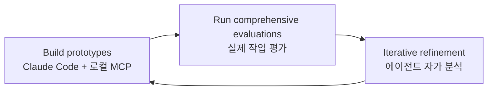

# Writing Effective Tools for AI Agents (Anthropic Engineering 2025-09)

Ken Aizawa(Anthropic)가 정리한 에이전트용 도구 설계 가이드. 핵심 명제는:

> "Agents are only as effective as the tools we give them."

기존 SW는 결정적(deterministic) 시스템에 맞춰 설계됐지만 에이전트는 **비결정적(non-deterministic)** 시스템이다. 도구 설계 패러다임도 인간 친화적 API에서 **에이전트의 인지 모델에 맞춘 인터페이스**로 진화해야 한다.

## Evaluation-Driven Development 워크플로우



> "holding out test sets ensures you don't overfit to training evaluations."

## 5대 효과적 도구 원칙

### 1. Intentional Tool Selection (의도적 도구 선택)
- 모든 API 엔드포인트를 도구로 만들지 말 것
- "more tools don't always lead to better outcomes"
- **다단계 작업 통합**: `list_users`, `list_events`, `create_event` → `schedule_event` 하나

### 2. Judicious Context Use (신중한 컨텍스트 사용)
- 도구는 **high signal information**만 반환
- UUID, mime type 같은 기술적 식별자를 의미적 라벨(이름, 파일 타입)로 대체
- 모든 가능한 정보가 아니라 **컨텍스트 관련성 우선**

### 3. Combinable Workflows (조합 가능한 워크플로우)
- 네임스페이싱 신중히
- "**prefix- and suffix-based namespacing has non-trivial effects on performance**"
- 서비스별로 그룹: `asana_search`, `jira_search`

### 4. Token-Efficient Responses (토큰 효율적 응답)
- 페이지네이션, 필터링, 트런케이션, 범위 선택 with sensible defaults
- **Claude Code restricts responses to 25,000 tokens by default**
- Verbose vs. concise 응답 형식 선택권 제공

```typescript
enum ResponseFormat {
   DETAILED = "detailed",
   CONCISE = "concise"
}
```

실측 차이:
- Slack 스레드 detailed 응답: **206 토큰**
- Concise 버전: **72 토큰** (본질 정보 유지)

### 5. Precise Prompt Engineering (정교한 프롬프트 엔지니어링)
- 도구 설명에 특수 쿼리 형식, 리소스 간 관계, 명확한 파라미터 명명
- "**small refinements to tool descriptions can yield dramatic improvements**"

## 에러 메시지 디자인

| 나쁜 예 | 좋은 예 |
|---|---|
| `"Error: invalid_parameter"` | `"Parameter must be a valid user_id (numeric). Use search_users(name='Jane') first to retrieve IDs, then call with specific user_id values."` |

→ 에러 메시지는 **에이전트에게 다음 행동을 알려줘야** 한다.

## 평가 작업 사례

### 좋은 작업 (실제 워크플로우 + 다중 도구 호출)
- "Schedule a meeting with Jane next week to discuss our latest Acme Corp project. Attach the notes from our last project planning meeting and reserve a conference room."
- "Customer ID 9182 reported triple-charging. Find all relevant log entries and determine if other customers were affected."

### 나쁜 작업 (지나치게 단순)
- "Schedule a meeting with jane@acme.corp next week."
- "Search the payment logs for `purchase_complete`."

## 정량적 결과

내부 평가에서:
- **Slack MCP server**: 인간이 작성한 도구가 Claude 최적화 버전보다 hold-out 테스트셋에서 **낮은 정확도**
- **Asana MCP server**: 같은 패턴 — Claude 주도 최적화가 수동 구현 능가

## 핵심 통찰

> "agents may hallucinate or fail to grasp how to use a tool. Agents are constrained not by computational limits but by cognitive ones."

종래 SW 계약(타입 시그니처)으로는 부족. 에이전트의 **인지 패턴**에 맞춰 도구가 설계되어야 한다 — 인간 친화적 API ≠ 에이전트 친화적 API.

## 실무 팁

- 로컬 MCP 서버 연결: `claude mcp add <name> <command> [args...]`
- LLM용 문서: `docs.anthropic.com/llms.txt` 같은 flat llms.txt 파일

## 관련 문서

- [[mcp-protocol]] — Model Context Protocol 표준
- [[agent-skills]] — Skill 패키징 (도구의 보완재)
- [[function-calling]] — Function Calling 기본
- [[effective-agents-patterns]] — Anthropic 7가지 패턴 카탈로그
- [[agent-evals-anthropic-perspective]] — 에이전트 평가 가이드
- [[mcp-code-execution]] — 토큰 효율을 더 끌어올리는 후속 패턴
