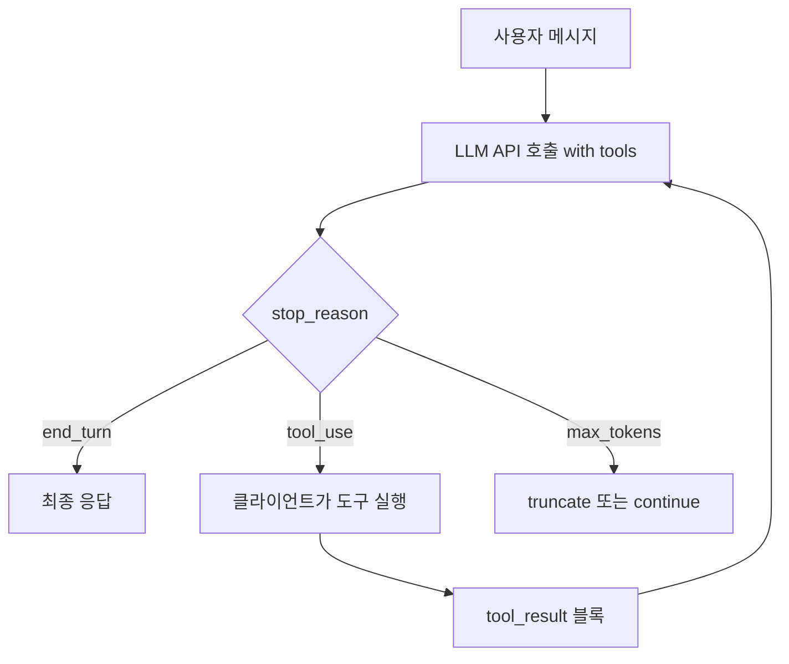
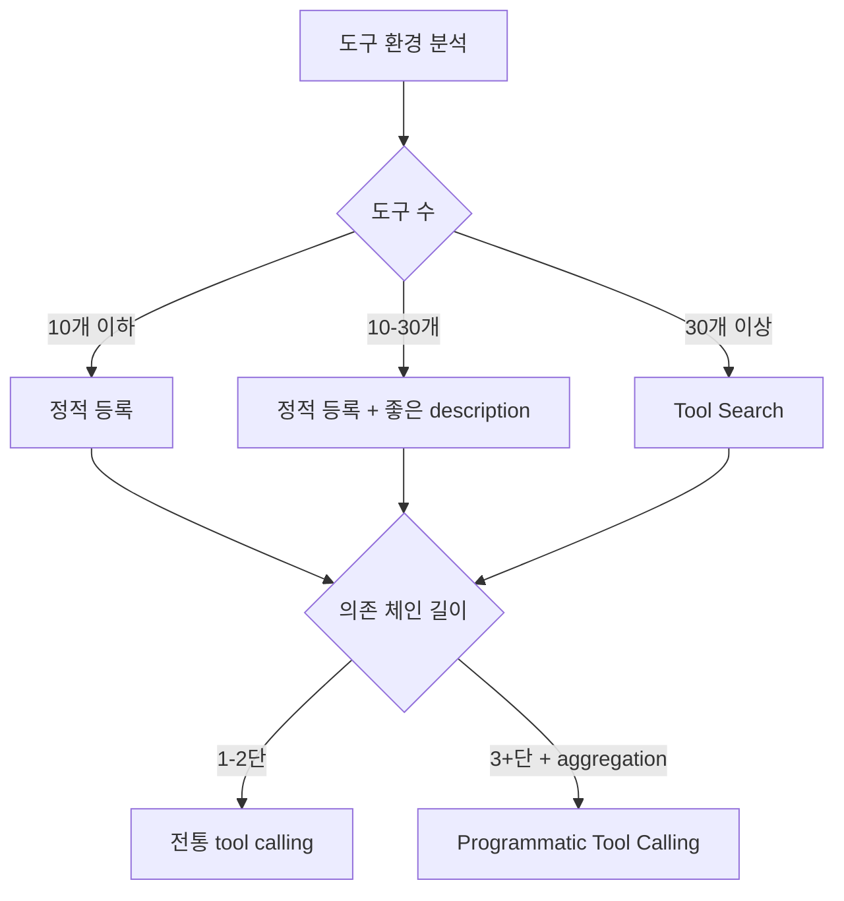

# Tool Orchestration Patterns

Tool Orchestration이란 LLM 에이전트가 다수의 외부 도구를 호출할 때 어떻게 라우팅·병렬화·결과 처리를 수행하는지에 대한 설계 패턴 묶음이다. 단순한 single-tool round-trip 모델에서 출발해 (1) 도구 검색 (tool discovery), (2) 코드 기반 오케스트레이션 (programmatic tool calling), (3) 예시 기반 정확도 향상의 3축으로 진화했다.

> 기존 [[tool-use-patterns]], [[tool-calling-optimization]] 와 차별화 — 이 페이지는 2025-2026년에 도입된 advanced tool use beta(defer_loading, programmatic tool calling, tool examples)와 도구 다수 환경에서의 컨텍스트 절감 패턴에 초점을 맞춘다.

## 1. 기본 Agent Loop 모델

도구 사용 에이전트는 다음 4가지 stop 상태로 정의되는 loop를 반복한다.

| Stop reason | 의미 | 다음 동작 |
|------------|------|-----------|
| `end_turn` | 응답 완료 | 사용자에게 출력 |
| `tool_use` | 도구 호출 필요 | 클라이언트가 실행 → 결과 다시 전달 |
| `max_tokens` | 토큰 한도 초과 | 잘라내거나 계속 |
| `stop_sequence` | 사용자 정의 stop sequence 매칭 | 종료 또는 후처리 |



### Client tools vs Server tools

- **Client tools**: 사용자(클라이언트) 코드에서 실행. 모델은 `tool_use` 블록 반환 → 클라이언트가 실행 → `tool_result`를 다음 메시지로 전달
- **Server tools**: 모델 제공자 인프라에서 실행 (web_search, code_execution, web_fetch 등). 클라이언트는 result만 수신

### tool_choice 옵션

| 값 | 의미 |
|----|------|
| `auto` | 모델이 도구 사용 여부 결정 (기본) |
| `any` | 반드시 어떤 도구든 사용 |
| `tool` | 특정 도구만 사용 |
| `none` | 도구 사용 금지 |

`strict: true` 옵션으로 tool call이 schema에 정확히 부합하도록 강제할 수 있다.

## 2. Tool Use System Prompt 비용

도구를 한 개 이상 등록하면 모델 시스템 프롬프트에 도구 처리 명령이 자동 주입된다 ([교차검증 필요] — 모델 버전마다 토큰 수 상이).

| tool_choice | 추가 토큰 (Claude Opus 4.7 / Sonnet 4.5/4.6 기준) |
|-------------|-----------------|
| `auto`/`none` | 346 |
| `any`/`tool` | 313 |
| Haiku 3.5/3 `auto` | 264 |
| Haiku 3.5/3 `any` | 340 |

도구가 많을수록 도구 정의 자체의 토큰 비용도 누적된다. 5개 MCP 서버 / 58개 도구 환경에서 도구 정의가 약 55K 토큰을 점유한 사례가 보고됐다.

## 3. Advanced Tool Use 3대 패턴

### A. Tool Search Tool (defer_loading)

**문제**: 도구 정의가 컨텍스트 윈도우 절반을 점유 → 작업 시작 전부터 attention budget 소진.

**해법**: `defer_loading: true`로 도구를 초기 컨텍스트에서 제외하고, 모델이 필요할 때 `tool_search_tool_regex_*` 같은 메타 도구로 검색.

```json
{
  "tools": [
    {"type": "tool_search_tool_regex_20251119", "name": "tool_search_tool_regex"},
    {"name": "github.createPullRequest", "defer_loading": true}
  ]
}
```

**보고된 효과** (Anthropic MCP 평가):
- Opus 4 정확도 49% → 74%
- Opus 4.5 정확도 79.5% → 88.1%
- 토큰 77K → 8.7K (95% 컨텍스트 보존)

→ [[agent-context-management|컨텍스트 관리]]의 just-in-time retrieval 원칙을 도구 정의 자체에 적용한 패턴.

### B. Programmatic Tool Calling (PTC)

**문제**: 전통적 tool calling은
1. 매 호출마다 inference round-trip이 발생
2. 중간 결과(tool_result)가 모두 컨텍스트로 들어가 "context pollution" 발생

**해법**: 모델이 sandboxed Python 코드를 작성해 도구를 호출 → 결과는 코드 변수로 처리 → 최종 요약만 컨텍스트에 진입.

```python
# 모델이 직접 작성하는 코드
team = await get_team_members("engineering")
expenses = await asyncio.gather(*[
    get_expenses(m["id"], "Q3") for m in team
])
exceeded = [m for m, exp in zip(team, expenses)
            if sum(e["amount"] for e in exp) > budgets[m["level"]]]
```

도구 노출 시 opt-in 메커니즘으로 PTC만 호출 가능한 도구를 지정한다.

```json
{
  "name": "get_expenses",
  "allowed_callers": ["code_execution_20250825"]
}
```

**보고된 효과**:
- 토큰 37% 절감 (43,588 → 27,297)
- 19+ inference passes 제거
- Internal knowledge retrieval 정확도 25.6% → 28.5%

**제약**: `disable_parallel_tool_use: true` 와 호환되지 않음.

### C. Tool Use Examples

도구 정의 schema에 concrete usage example을 추가하면 복잡한 nested 파라미터의 정확도가 72% → 90%로 향상됨이 보고됐다 [교차검증 필요]. 특히 JSON Schema만으로 표현하기 어려운 의미적 제약(예: 두 필드의 상호 의존)이 있을 때 효과적이다.

## 4. Provider 간 차이 (요약)

| 항목 | OpenAI Function Calling | Anthropic Tool Use |
|------|------------------------|---------------------|
| 명칭 | function/tool | tool |
| 병렬 도구 호출 | 기본 활성, `parallel_tool_calls: false`로 비활성화 | 모델이 자율 결정, `disable_parallel_tool_use: true`로 비활성화 |
| 도구 개수 한도 | 최대 128 tools/request | 최대 64 tools/request |
| Strict mode | `strict: true` | `strict: true` (2025년 추가) |
| Stop reason | `finish_reason: "tool_calls"` | `stop_reason: "tool_use"` |
| 응답 포맷 | `tool_calls: [{id, function: {name, arguments}}]` | `content: [{type: "tool_use", id, name, input}]` |
| 동적 도구 검색 | 미지원 | Tool Search Tool (defer_loading) |
| 코드 기반 오케스트레이션 | 미지원 | Programmatic Tool Calling |

## 5. 언제 어떤 패턴을 쓰는가



### Tool Search 도입 임계
- 도구 정의가 10K+ 토큰을 점유
- 10+ 도구가 동시 등록된 환경 (멀티 MCP 서버)

### Programmatic Tool Calling 도입 임계
- 3+ 의존성 있는 도구 호출 (예: list_users → for each → get_expenses → aggregate)
- 큰 데이터셋 집계 (필터링/매핑이 다수의 round-trip 없이 1회 코드 실행으로 처리)

## 6. 비용 모델

- 도구 정의 토큰 = input token으로 청구 → 캐시 친화적 위치(앞쪽)에 두는 것이 유리
- Tool use 시스템 프롬프트 = 313~346 tokens 자동 추가
- Server tool은 별도 사용량 과금 (예: web_search는 검색 횟수당)

[[prompt-caching-strategies|프롬프트 캐싱]]과 결합하면 도구 정의를 캐시 prefix에 포함시켜 반복 호출에서 비용을 90%까지 절감할 수 있다.

## 7. Anti-pattern

- 30개 이상 도구를 정적 등록 → 정확도와 비용 모두 악화
- 의존 체인이 깊은데 정통 tool calling 사용 → round-trip 폭증
- PTC 도입했는데 도구 description은 그대로 → 코드 작성 모델이 도구 사용법 추정에 실패
- 병렬 호출이 가능한 독립 도구를 sequential하게 호출 → research time 단축 기회 상실

## 관련 문서

- [[tool-use-patterns]] — 도구 사용 패턴 일반론
- [[tool-calling-optimization]] — 도구 선택 최적화
- [[agent-context-management]] — 컨텍스트 관리와 도구 정의 절감
- [[prompt-caching-strategies]] — 도구 정의 캐싱
- [[long-horizon-agent-loop]] — agent loop의 장기 실행
- [[mcp-protocol-deep-dive]] — MCP 서버를 통한 도구 노출
- [[function-calling]] — 함수 호출 메커니즘
