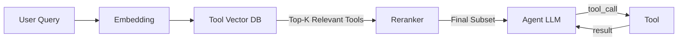
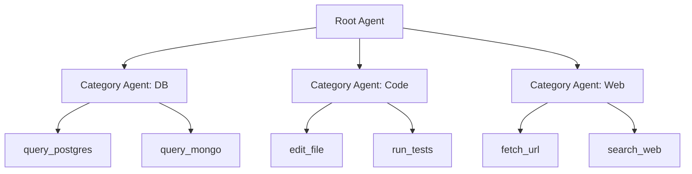
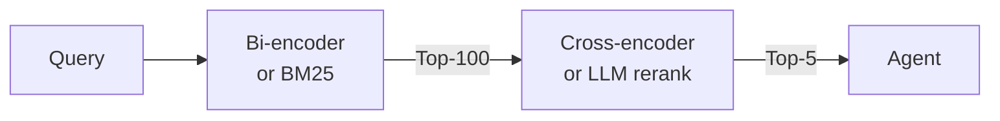

# Tool Routing RAG - 수십~수백 개 도구 중 적절한 도구 선택

대규모 도구 카탈로그에서 LLM에게 노출할 top-k 도구만 retrieval로 선택하는 패턴(Tool RAG)을 정리한다. Tool-to-Agent Retrieval, hierarchical catalog, two-stage retrieval, Toolshed 등.

## 문제

> As enterprise-scale use cases grow, the number of tools quickly expands into dozens, hundreds, or thousands—but giving models access to all at once simply doesn't scale.

핵심 도전:
1. 수천 개 도구의 description을 context window에 다 못 넣음
2. 넣어도 "context dilution" → 정확도 저하
3. 토큰 비용 증가
4. Tool selection 정확도 자체 하락

## Tool RAG 패러다임

> Tool RAG emerged as a solution to the tool scaling problem, retrieving only the most relevant tools from a large registry, similar to how classic RAG retrieves knowledge snippets.

### 효과

> Recent studies show that intelligent tool retrieval can triple tool invocation accuracy while reducing prompt length in half.

- **3x tool invocation accuracy**
- **prompt length 절반 감소**

### 기본 흐름

## Tool-to-Agent Retrieval (arxiv 2511.01854)

> The paper introduces a unified approach that fundamentally reimagines how multi-agent systems locate resources. Rather than matching queries against high-level agent descriptions, the method "embeds both tools and their parent agents in a shared vector space and connects them through metadata relationships."

### 핵심 기법

1. **공유 벡터 공간**: tool과 parent agent를 같은 space에 embed
2. **Metadata 관계**: tool ↔ agent 연결 정보 보존
3. **Hierarchical retrieval**: tool-level 또는 agent-level 둘 다 가능
4. **Granular**: 한 agent의 수십 도구를 individual하게 retrieve

### 성능 메트릭 (LiveMCPBench, 8개 embedding 모델)

| 메트릭 | 개선 |
|---|---|
| Recall@5 | +19.4% over SOTA |
| nDCG@5 | +17.7% over SOTA |

> The paper contrasts naive agent-level matching (which obscures fine-grained tool functionality) against their granular retrieval strategy that preserves individual tool capabilities while maintaining agent-level organization.

## 계층적 도구 카탈로그 (Hierarchical Tool Catalog)

### 패턴

### 장점
- Top-level에서 카테고리 선택 → 하위 도구로 zoom in
- 각 레벨에서만 tool description 노출 → 토큰 절약
- 조직 구조 = 도구 구조 매핑 가능

## Toolshed (Advanced RAG-Tool Fusion)

> Toolshed Knowledge Bases store enhanced tool representations and use Advanced RAG-Tool Fusion—an ensemble of techniques across pre-retrieval, intra-retrieval, and post-retrieval phases.

3-phase ensemble:
1. **Pre-retrieval**: query expansion, tool description 증강
2. **Intra-retrieval**: bi-encoder 1차 + cross-encoder rerank
3. **Post-retrieval**: 결과 필터링, 합성

## 효율적인 retrieval 전략

> Efficient retrieval typically uses bi-encoder or lexical search in a first pass, with a second-pass cross-encoder or LLM employed to rerank or refine the subset of tools or agents.

### Two-stage retrieval

| Stage | 도구 | 속도 | 정확도 |
|---|---|---|---|
| 1차 | Bi-encoder, BM25 | 빠름 | 중간 |
| 2차 | Cross-encoder, LLM-as-Judge | 느림 | 높음 |

## ToolReAGt (ACL 2025)

> ToolReAGt: Tool Retrieval for LLM-based Complex Task Solution via Retrieval Augmented Generation

핵심: 복잡한 task에서 multi-tool 조합이 필요한 경우의 retrieval. 단일 query → 단일 tool이 아니라 sub-task 별로 tool 선택.

## 실제 적용 - MCP context

[[mcp-tools-protocol]]의 `tools/list`는 모든 도구를 한 번에 반환 → 클라이언트가 모든 도구를 LLM에 노출하면 위 문제 발생.

해결책:
1. **클라이언트 측 retrieval**: tools/list 결과를 vector DB에 저장 → query별 retrieval
2. **Agent-as-Tool**: parent agent가 sub-agent를 도구로 보유 → sub-agent 안에서 다시 도구 선택
3. **Pruning**: hot tools만 system prompt에 노출, cold tools는 retrieval 통해

## 벤치마크

- **LiveMCPBench**: 1,000+ 복잡 task, 2,000+ 도구
- **ToolBench**: 16,000+ tool에서 retrieval 성능

## 핵심 인사이트

1. **Tool RAG는 prompting 문제를 retrieval 문제로 전환**: 모든 도구 노출이 아닌 top-k 선택
2. **Hierarchical = agent + tool 양쪽 retrieval**: 한 레벨이 아닌 다층 구조
3. **Two-stage가 표준**: bi-encoder 후보 추출 + cross-encoder rerank
4. **3x accuracy + 0.5x prompt**: 측정된 효과
5. **MCP는 native tool retrieval 미지원**: 클라이언트가 직접 구현 필요
6. **Tool description quality가 핵심**: retrieval 정확도는 description 품질에 비례
7. **Agent-as-Tool 패턴**: 수백 도구를 sub-agent로 분할 → 호출자는 sub-agent만 선택

## 관련 문서

- [[mcp-tools-protocol]] — MCP tools/list, tools/call 메시지
- [[agent-as-tool-pattern]] — agent를 tool로 추상화
- [[agent-capability-discovery]] — 능력 디스커버리
- [[agent-model-routing]] — model routing (관련 패턴)
- [[agent-context-management]] — 컨텍스트 관리
- [[mcp-clients-comparison]] — 클라이언트별 도구 노출

## 참고

- Tool-to-Agent Retrieval (arxiv): https://arxiv.org/abs/2511.01854
- Tool RAG (Red Hat 2025-11): https://next.redhat.com/2025/11/26/tool-rag-the-next-breakthrough-in-scalable-ai-agents/
- Toolshed (SciTePress 2025): https://www.scitepress.org/Papers/2025/133030/133030.pdf
- ToolReAGt (ACL 2025): https://aclanthology.org/2025.knowllm-1.7/
- Tool Selection survey: https://www.preprints.org/frontend/manuscript/9402a980820b7b420ea80a1871a9c0d4/download_pub
- Next-gen RAG to Agentic AI: https://www.vldb.org/2025/Workshops/VLDB-Workshops-2025/LLM+Graph/LLMGraph-8.pdf
