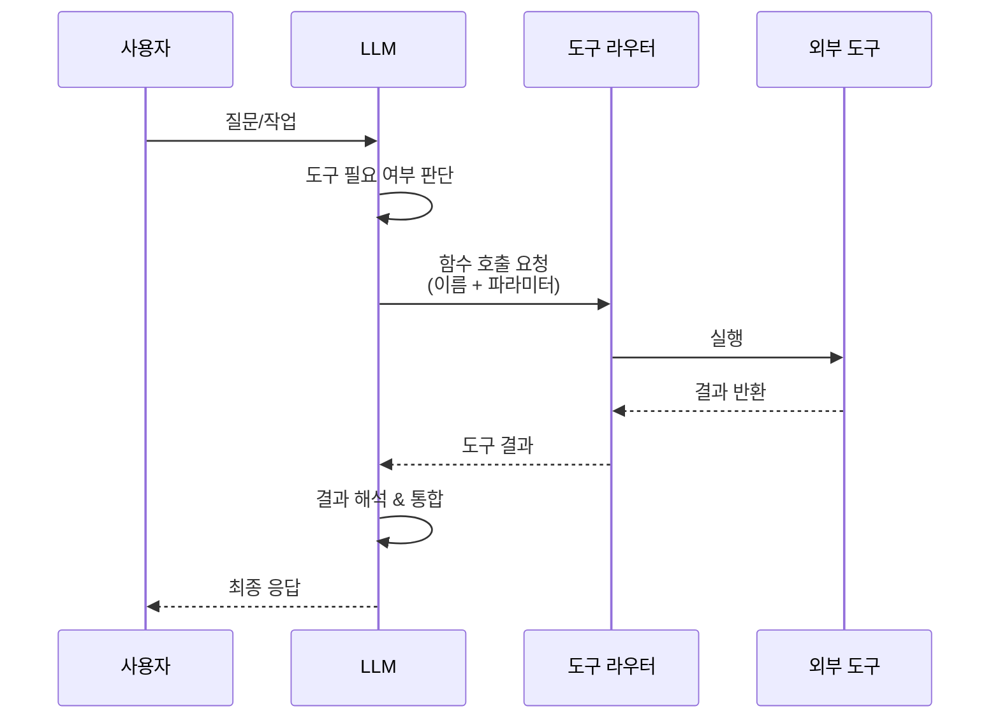
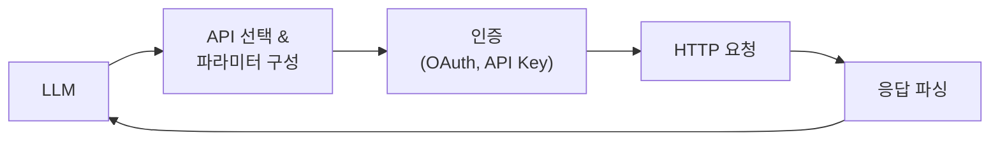
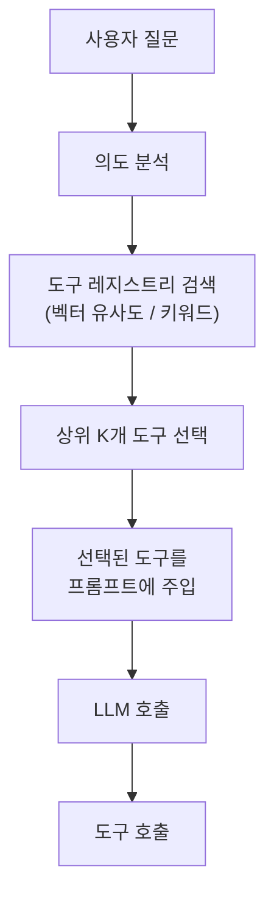
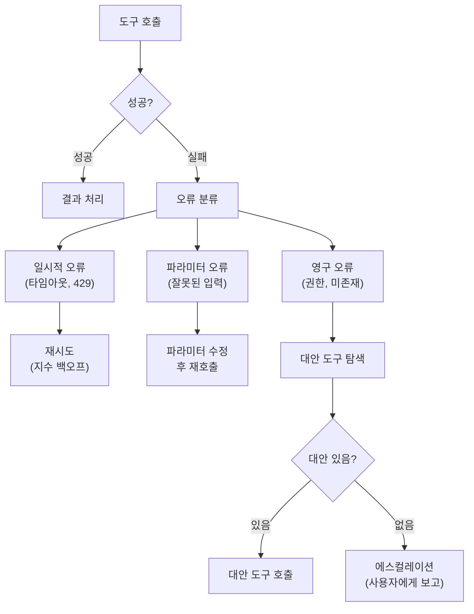

# LLM 도구 사용 패턴 (Tool Use Patterns)

## 정의

**도구 사용 패턴(Tool Use Patterns)**은 LLM 기반 에이전트가 외부 도구를 발견하고, 선택하고, 호출하며, 결과를 처리하는 방식의 체계적 분류다. 도구 사용 능력은 LLM을 단순 텍스트 생성기에서 실세계에 영향을 미치는 에이전트로 변환하는 핵심 역량이다. Schick et al.(2023)의 Toolformer 이후 도구 사용은 LLM의 표준 기능이 되었으며, 2024-2026년에는 [[model-context-protocol-mcp|MCP]]같은 표준 프로토콜과 동적 도구 검색이 등장하며 급속히 성숙하고 있다.

## 도구 사용의 기본 흐름



이 시퀀스 다이어그램은 사용자 입력에서 최종 응답까지의 도구 사용 전체 흐름을 보여준다.

## 도구 호출 메커니즘

### 1. 함수 호출 (Function Calling)

가장 표준적인 도구 사용 방식이다. 모델이 구조화된 JSON 형태로 함수 이름과 파라미터를 출력하면, 런타임이 해당 함수를 실행한다.

```json
{
  "name": "search_database",
  "arguments": {
    "query": "2024년 매출 데이터",
    "limit": 10
  }
}
```

**핵심 요소**:
- 도구 정의 스키마: 함수명, 설명, 파라미터 타입/설명을 포함
- 모델의 스키마 준수: strict mode에서는 스키마를 100% 따르도록 강제
- 병렬 호출: 독립적인 여러 도구를 한 턴에 동시 호출 (GPT-4, Claude 등 지원)

[[tool-contracts-for-agents|도구 계약]]은 이 스키마 정의를 체계화한 패턴으로, 도구의 기대 행동, 에러 유형, 부작용을 명시적으로 문서화한다.

### 2. 코드 실행 (Code Execution)

LLM이 Python/JavaScript 등의 코드를 생성하면, 샌드박스에서 실행하여 결과를 돌려주는 방식이다.

**장점**:
- 무한한 유연성: 사전 정의된 도구가 없어도 어떤 연산이든 가능
- 복합 로직: 조건문, 반복문, 데이터 변환을 자유롭게 표현
- 라이브러리 활용: pandas, matplotlib 등 기존 라이브러리 활용

**한계**:
- 보안 위험: 악의적 코드 실행 가능성 -> 샌드박싱 필수
- 실행 시간: 복잡한 코드는 타임아웃 위험
- 디버깅 난이도: 코드 오류 시 에이전트가 스스로 디버깅해야

### 3. API 호출 (API Invocation)

외부 서비스의 REST/GraphQL API를 호출하는 패턴이다. 함수 호출의 특수 케이스로, 네트워크 통신과 인증이 추가된다.



## 도구 선택 전략

도구 수가 증가하면 "어떤 도구를 사용할 것인가"가 핵심 문제가 된다. [[tool-calling-optimization]]에서 다루는 것처럼, 50개 이상의 도구가 있으면 모델의 선택 정확도가 크게 떨어진다.

### 고정 도구셋 (Static Tool Set)

모든 사용 가능한 도구를 시스템 프롬프트에 포함하는 가장 단순한 방식이다.

| 도구 수 | 적합성 | 비고 |
|---------|--------|------|
| 1-10개 | 최적 | 추가 최적화 불필요 |
| 10-30개 | 적합 | 도구 설명 품질이 중요 |
| 30-50개 | 주의 필요 | 토큰 비용 증가, 정확도 저하 시작 |
| 50개+ | 비권장 | 동적 도구 검색 필요 |

### 동적 도구 검색 (Dynamic Tool Discovery)

도구를 벡터 DB나 레지스트리에 저장하고, 사용자 의도에 따라 관련 도구만 동적으로 로드하는 패턴이다.



**Tool Search 패턴**: Anthropic이 제안한 방식으로, 모든 도구를 프롬프트에 넣는 대신 "도구 검색" 도구를 제공한다. 에이전트가 먼저 어떤 도구가 필요한지 검색하고, 반환된 도구만 사용한다. 이 방식으로 58개 도구를 55,000 토큰에서 8,700 토큰으로 줄이면서 정확도를 유지한 사례가 보고되었다.

### 도구 추천 (Tool Recommendation)

이전 사용 패턴, 현재 작업 컨텍스트, 도구 간 의존 관계를 분석하여 가장 적합한 도구를 추천하는 고급 패턴이다. [[writing-effective-tools-for-agents|효과적 도구 작성 가이드]]에서 강조하는 것처럼, 도구의 이름과 설명이 명확할수록 추천/선택 정확도가 높아진다.

## 도구 오류 처리

실세계 도구는 실패할 수 있으며, 에이전트가 오류를 적절히 처리하는 능력은 프로덕션 환경에서 필수적이다.

### 오류 처리 전략



이 다이어그램은 오류 유형별 처리 전략의 의사결정 트리를 보여준다.

### 1. 재시도 (Retry)

일시적 오류(네트워크 타임아웃, 속도 제한 등)에 대해 지수 백오프로 재시도한다. 재시도 횟수에 상한을 두어 무한 반복을 방지해야 한다.

### 2. 파라미터 수정 (Parameter Correction)

도구가 "잘못된 날짜 형식"같은 에러를 반환하면, 에이전트가 에러 메시지를 해석하여 파라미터를 수정하고 재호출한다. 이를 위해 도구의 에러 메시지가 충분히 설명적이어야 한다.

### 3. 대안 도구 (Fallback Tool)

주 도구가 영구적으로 실패하면 동일 기능의 대안 도구로 전환한다. 예: 특정 검색 API가 다운되면 다른 검색 엔진으로 전환.

### 4. 에스컬레이션 (Escalation)

모든 자동 복구가 실패하면 사용자에게 상황을 보고하고 개입을 요청한다. "이 도구에 접근할 수 없습니다. 다른 방법을 시도할까요?"

## 도구 설계 원칙

[[writing-effective-tools-for-agents]]에서 강조하는 핵심 원칙들이다.

1. **명확한 이름과 설명**: 모델이 도구의 용도를 정확히 이해할 수 있어야 한다
2. **원자성**: 하나의 도구는 하나의 명확한 작업을 수행
3. **설명적 에러**: 에러 메시지가 무엇이 잘못되었고 어떻게 고쳐야 하는지 안내
4. **멱등성**: 같은 입력에 같은 결과를 반환 (가능한 경우)
5. **최소 권한**: 도구가 필요한 최소한의 권한만 보유

## 표준화: MCP

[[model-context-protocol-mcp|Model Context Protocol(MCP)]]은 Anthropic이 제안한 도구/서비스 통합 표준이다. 도구 정의, 호출, 결과 반환의 프로토콜을 표준화하여, 다양한 LLM과 도구 제공자 간의 상호운용성을 높인다.

MCP 이전에는 각 LLM 제공자마다 함수 호출 형식이 달랐으나, MCP를 통해 "한 번 구현하면 모든 LLM에서 사용 가능한" 도구 생태계를 지향한다.

## 실무 관점

1. **5개 이하로 시작**: 도구 수를 최소화하여 시작하고, 필요에 따라 추가. 도구가 많을수록 모델의 혼란과 토큰 비용이 증가
2. **도구 설명에 투자**: 도구의 이름, 설명, 파라미터 설명이 모델 성능을 좌우함. 사용자가 아닌 LLM이 읽는 문서라는 관점으로 작성
3. **에러 경로 테스트**: 도구 실패 시나리오를 사전에 테스트하고, 에이전트의 복구 행동을 검증
4. **관찰 가능성**: 모든 도구 호출을 로깅하여 디버깅과 비용 추적에 활용
5. **보안 우선**: 도구가 실세계에 영향을 미치는 경우(이메일 전송, 결제 등), 인간 확인(human-in-the-loop) 게이트를 반드시 배치

## 관련 문서
- [[tool-augmented-language-models]] -- 도구 증강 언어 모델 (Tool-Augmented Language Models)

- [[tool-calling-optimization]] -- 다수의 도구를 효율적으로 선택하는 최적화 기법
- [[writing-effective-tools-for-agents]] -- 에이전트용 효과적 도구 작성 가이드
- [[tool-contracts-for-agents]] -- 도구의 기대 행동을 명시하는 계약 패턴
- [[model-context-protocol-mcp]] -- 도구 표준화 프로토콜
- [[agent-skills-specification]] -- 스킬로서의 도구 패키징
- [[orchestrator-worker-pattern]] -- 도구를 조합하는 상위 에이전트 패턴
