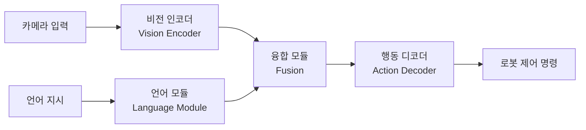
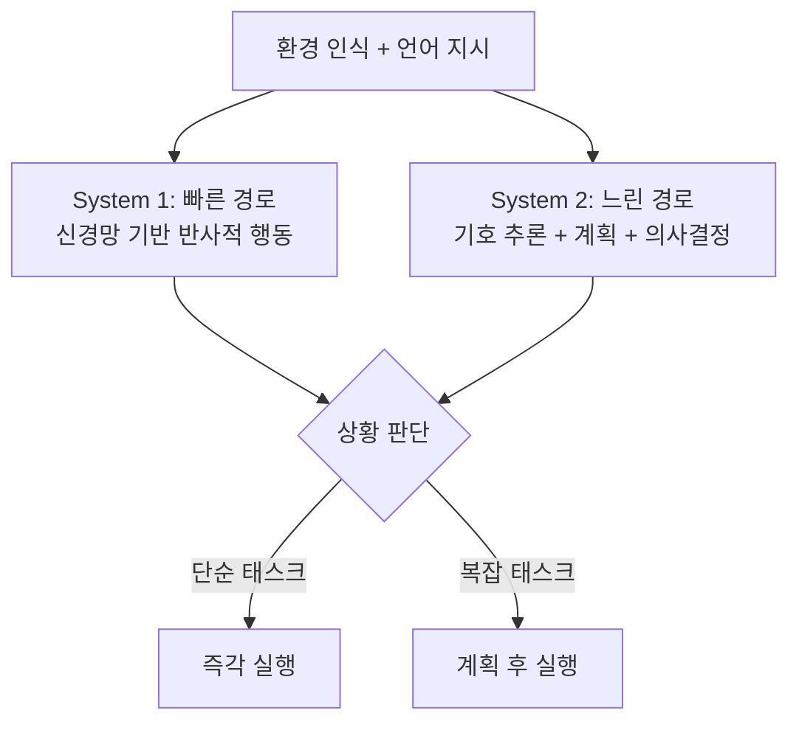

# Vision-Language-Action (VLA) 모델

시각 입력(camera), 언어 지시(language instruction), 물리적 행동(action)을 통합하는 로보틱스 AI 모델. LLM의 추론 능력을 비전(vision)과 물리적 움직임(motor control)으로 확장하여, 자연어 지시만으로 로봇이 실제 세계에서 행동할 수 있게 한다.

## 왜 중요한가

- **로보틱스 AI의 브레인**: 기존에는 시각, 언어, 행동이 별도 파이프라인이었으나, VLA는 이를 단일 모델로 통합
- **일반화 가능성**: 다양한 로봇/환경에서 전이(transfer) 가능한 범용 로봇 기반 모델(foundation model) 추구
- **에너지 효율**: NS-VLA가 뉴로-심볼릭 접근으로 에너지 100x 절감 + 95% 성공률 달성

## 아키텍처

이 다이어그램은 VLA 모델의 기본 아키텍처를 보여준다. 카메라의 시각 입력과 자연어 지시가 각각 인코딩된 후 융합 모듈에서 통합되고, 행동 디코더가 로봇 제어 명령을 생성한다.

## 이중 시스템(Dual-System) 접근

NS-VLA가 이 이중 시스템을 구현한다. 인간 인지의 System 1(직관)/System 2(숙고)를 모방하여, 단순 태스크는 신경망으로 빠르게 처리하고 복잡한 태스크는 기호 추론으로 계획 후 실행한다. 이 접근으로 95% 성공률을 달성했다.

## 주요 VLA 모델 (2026)

| 모델 | 개발사 | 특징 |
|------|--------|------|
| Isaac GR00T | NVIDIA | 오픈 파운데이션 모델. 멀티스텝 태스크 |
| HY-Embodied-0.5 | Tencent | 22개 벤치마크 중 16개 SOTA |
| NS-VLA | Tufts University | 뉴로-심볼릭. [[physics-informed-ml\|물리 기반 ML]] 접근으로 100x 에너지 절감 |
| RT-X | Google | 다양한 로봇/환경에서 일반화 |

## 남은 과제

| 과제 | 설명 |
|------|------|
| 데모-배포 격차 | 인상적인 데모와 만 번 연속 무인 운영 사이의 간극 |
| 일반화 | 학습 환경 외에서의 성능 저하 |
| 안전 | 물리적 세계에서의 실패는 비용이 큼 (되돌릴 수 없음) |
| 데이터 | 로봇 상호작용 데이터 수집의 어려움과 비용 |

## 관련 문서

- [[physics-informed-ml]] -- 물리 법칙 기반 ML: NS-VLA의 핵심 접근
- [[evolution-of-agentic-patterns]] -- 에이전틱 패턴 진화
- [[how-coding-agents-work]] -- 코딩 에이전트와 비교: 소프트웨어 vs 물리 세계 에이전트
