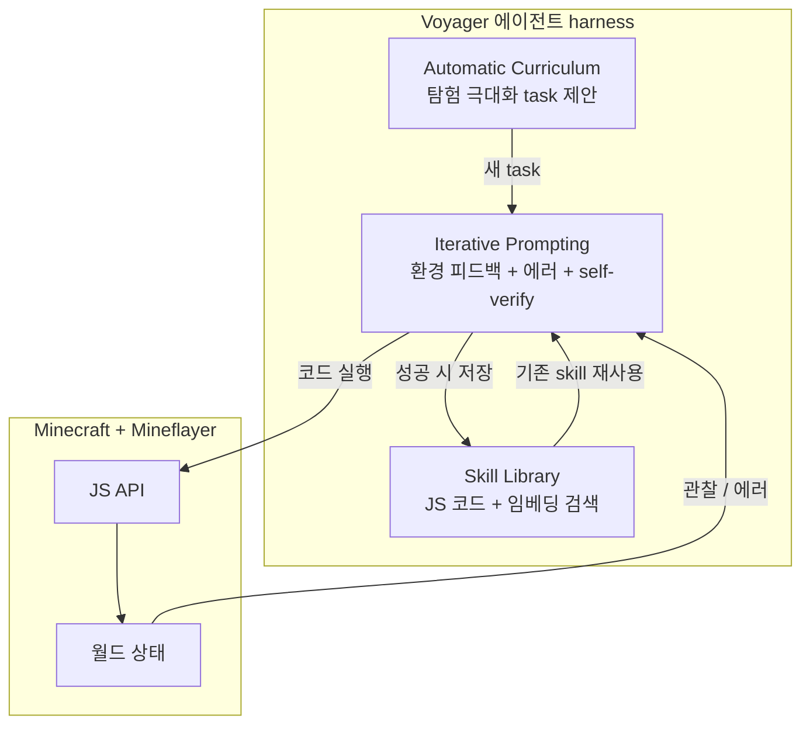

# Voyager - LLM 기반 lifelong learning 에이전트

## 개요

Voyager는 NVIDIA, Caltech, UT Austin 공동 연구진(Wang et al. 2023)이 발표한 **첫 LLM 기반 lifelong learning embodied agent**이다. Minecraft 환경에서 GPT-4를 black-box로 호출하여 스스로 탐험하고, 다양한 스킬을 획득하며, 새로운 발견을 인간 개입 없이 수행한다. 모델 파라미터의 fine-tuning이 전혀 없는 **gradient-free harness**라는 점에서 RL 기반 접근과 구분된다.

- arXiv: [Voyager: An Open-Ended Embodied Agent with Large Language Models (2305.16291)](https://arxiv.org/abs/2305.16291)
- 공식 repo: [MineDojo/Voyager](https://github.com/MineDojo/Voyager)
- 사이트: voyager.minedojo.org
- 발표: 2023-05-25

## 핵심 컴포넌트

세 컴포넌트가 외부 메모리(skill library)와 함께 lifelong learning 루프를 구성한다.

### 1. Automatic Curriculum

탐험을 극대화하는 task proposer 컴포넌트. 현재 인벤토리, 방문 위치, 보유 스킬을 종합해 "다음에 시도할 만한 새 task"를 GPT-4가 직접 제안한다. 인간이 정의한 카리큘럼 없이도 점진적으로 어려운 목표를 발굴하는 것이 핵심.

### 2. Skill Library

GPT-4가 생성한 **실행 가능한 JavaScript 코드**(Mineflayer API 호출)로 스킬을 저장한다. 각 스킬은 자연어 설명과 함께 임베딩되어 vector DB에 적재되며, 새 task 직면 시 의미적으로 가까운 기존 스킬을 검색해 재사용한다.

스킬은 **temporally extended, interpretable, compositional** 성질을 갖는다 — 코드이기 때문에 인간이 읽고 검증 가능하며, 작은 스킬을 합성해 큰 스킬을 만들 수 있다.

### 3. Iterative Prompting Mechanism

세 종류의 피드백을 한 번의 prompt에 통합한다:
- **환경 피드백**: 관찰된 상태 변화
- **실행 에러**: JavaScript 런타임 에러, API 실패
- **self-verification**: 별도 verifier 에이전트가 task 완료 여부 판정

GPT-4가 이 피드백을 보고 코드를 수정 → 재실행하는 루프가 학습 신호를 대신한다.

## 학습 패턴 — gradient-free harness

| 측면 | 통상 RL 학습 | Voyager harness |
|------|-------------|-----------------|
| 모델 weight | gradient update | frozen (GPT-4 API) |
| 학습 신호 | reward → loss | 환경 피드백 → 코드 수정 |
| 메모리 | replay buffer | skill library (vector DB) |
| 수렴 단위 | 파라미터 업데이트 | 스킬 누적 |

이는 [[react-pattern]] / AutoGPT 계열 prompting harness의 진화형이며, 동시에 [[long-horizon-rl-training-for-agents]] 기반 RL 학습과 대조된다.

## 평가 결과

- **3.3x more unique items** vs. 이전 SOTA (AutoGPT, ReAct, Reflexion)
- **2.3x longer travel distance**
- **15.3x faster tech tree milestones**
- 학습된 skill library를 새 Minecraft world에 transfer 가능 — zero-shot 일반화 입증

## 후속 영향

Voyager의 설계 패턴은 코드/도구 에이전트 진영 전반에 영향을 주었다:

- **AutoGPT, BabyAGI** 같은 단일 루프 에이전트와 차별화 (task proposer 분리)
- **SWE-Agent, OpenDevin** 등 코드 에이전트의 skill library 패턴 차용
- [[agent-skill-library]] 개념 정착의 결정적 사례

RL 진영에서는 **AgentGym, AgentGym-RL**(Xi et al. 2024-2025)가 Voyager를 baseline으로 설정하고 prompting-only 한계를 SFT + RL로 보강하는 흐름을 형성했다.

## 핵심 인용

> "Voyager, the first LLM-powered embodied lifelong learning agent in Minecraft that continuously explores the world, acquires diverse skills, and makes novel discoveries without human intervention." — abstract

> "Voyager interacts with GPT-4 via blackbox queries, which bypasses the need for model parameter fine-tuning." — abstract

> "The skills developed by Voyager are temporally extended, interpretable, and compositional, which compounds the agent's abilities rapidly and alleviates catastrophic forgetting." — abstract

## 관련 문서

- [[react-pattern]] - prompting harness baseline
- [[autogpt-original-agent]] - 자율 에이전트 baseline
- [[long-horizon-rl-training-for-agents]] - RL 기반 multi-turn 학습
- [[agent-skill-library]] - 스킬 라이브러리 패턴
- [[hy-embodied]] - embodied agent 일반
