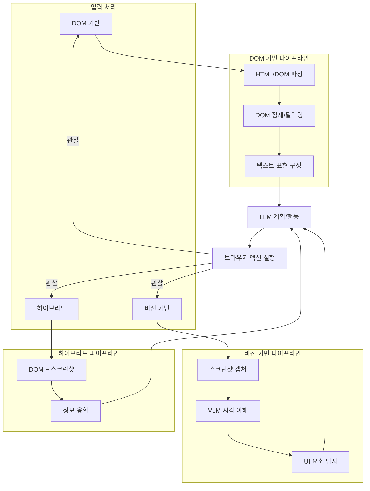

# 웹 에이전트 (Web Agent)

## 정의

**웹 에이전트(Web Agent)**는 웹 브라우저를 통해 웹 페이지를 탐색하고, 정보를 추출하며, 사용자를 대신해 작업을 수행하는 AI 에이전트다. 단순한 웹 스크래핑과 달리, 웹 에이전트는 자연어 지시를 이해하고 다단계 웹 작업을 자율적으로 수행한다 -- 호텔 예약, 폼 작성, 쇼핑, 정보 비교 등 사람이 브라우저에서 수행하는 거의 모든 작업이 대상이다.

2025-2026년에 걸쳐 LLM의 시각적 이해력과 도구 사용 능력이 급격히 향상되면서, 웹 에이전트는 [[browser-automation-agents|브라우저 자동화 에이전트]]의 핵심 패러다임으로 부상했다.

## 아키텍처 유형

웹 에이전트는 웹 페이지를 "인식"하는 방식에 따라 세 가지 아키텍처로 나뉜다.

이 다이어그램은 웹 에이전트의 세 가지 인식 방식과 공통 실행 루프를 보여준다.

### DOM 기반 (DOM-based)

HTML DOM 트리를 파싱하여 텍스트 표현으로 변환하고, LLM이 이를 기반으로 행동을 결정한다.

- **장점**: 정확한 요소 식별, 구조화된 정보 접근 가능, 토큰 효율적
- **단점**: 동적 렌더링 페이지에서 DOM이 실제 시각적 레이아웃과 불일치할 수 있음, Shadow DOM/iframe 처리 복잡

대표 시스템으로 MindAct, WebAgent 등이 있다.

### 비전 기반 (Vision-based)

스크린샷을 캡처하여 VLM(Vision-Language Model)이 시각적으로 페이지를 이해하고 행동한다. Anthropic의 Computer Use, OpenAI의 Operator가 이 방식의 대표 사례다.

- **장점**: 사람이 보는 것과 동일한 정보 접근, Canvas/WebGL 등 비DOM 콘텐츠 처리 가능
- **단점**: 좌표 기반 클릭의 부정확성, 높은 연산 비용, 작은 텍스트 인식 어려움

### 하이브리드 (Hybrid)

DOM과 비전 정보를 모두 활용한다. SoM(Set-of-Mark) 기법이 대표적 -- 스크린샷 위에 각 인터랙티브 요소를 번호로 마킹하고, DOM에서 해당 요소의 의미 정보를 함께 제공한다.

## 액션 공간 (Action Space)

웹 에이전트가 수행할 수 있는 기본 행동의 집합이다.

| 액션 | 설명 | 예시 |
|---|---|---|
| click(element) | 특정 요소 클릭 | 버튼, 링크, 체크박스 |
| type(element, text) | 텍스트 입력 | 검색창, 폼 필드 |
| scroll(direction, amount) | 스크롤 | 페이지 아래로 500px |
| navigate(url) | URL 직접 이동 | 새 페이지 열기 |
| select(element, option) | 드롭다운 선택 | 날짜, 카테고리 |
| hover(element) | 마우스 오버 | 툴팁 표시 |
| wait(condition) | 조건 대기 | 로딩 완료, 요소 출현 |
| go_back() | 이전 페이지 | 탐색 실패 시 복구 |

고급 에이전트는 이 기본 액션을 조합한 매크로 액션(예: `fill_form`, `add_to_cart`)을 지원하기도 한다.

## 주요 벤치마크

### WebArena

카네기 멜론 대학에서 제작한 실제 웹사이트 환경 기반 벤치마크다. Reddit, GitLab, 쇼핑몰, Wikipedia 등 4개 도메인의 자체 호스팅 사이트에서 812개 과제를 수행한다. 2024년 초 최고 성능 14.4%에서 2026년 현재 40%대로 빠르게 발전 중이다.

### OSWorld

데스크톱 환경 전체를 대상으로 하는 벤치마크로, 웹 브라우저뿐 아니라 운영체제 수준의 작업까지 포함한다. [[osworld-verified|OSWorld]]는 Ubuntu VM에서 실제 OS 작업을 평가하며, 웹 에이전트의 일반화 능력을 테스트한다.

### BrowseComp

OpenAI가 제작한 웹 검색 난이도 벤치마크다. [[browsecomp|BrowseComp]]는 인간 전문가가 평균 30분 이상 웹을 탐색해야 찾을 수 있는 정보를 에이전트가 얼마나 효과적으로 찾는지 측정한다. Deep Research 시스템의 평가에 주로 사용된다.

### VisualWebArena / Mind2Web

VisualWebArena는 시각적 이해가 필수인 과제를 추가했고, Mind2Web은 실제 웹사이트 1000개 이상에서 수집한 2350개 과제로 일반화 능력을 평가한다.

## 핵심 도전 과제

### 동적 페이지 처리

현대 웹은 SPA(Single Page Application), 무한 스크롤, 비동기 로딩 등으로 구성된다. DOM이 수시로 변하므로 에이전트가 "안정된 상태"를 판단하는 것 자체가 어렵다.

### 인증과 세션 관리

로그인이 필요한 서비스에서 에이전트가 안전하게 인증 정보를 다루는 문제다. 자격 증명 유출 위험과 보안 정책 준수 사이의 균형이 필요하다.

### 안티봇 방어

CAPTCHA, 봇 탐지 시스템, 행동 분석 기반 차단 등은 웹 에이전트의 실전 배포를 가로막는 주요 장벽이다. 윤리적/법적 경계도 함께 고려해야 한다.

### 장기 계획과 복구

10단계 이상의 장기 작업에서 에이전트가 중간에 실수하면, 이를 감지하고 복구하는 능력이 필요하다. [[agentic-manual-testing|에이전트 수동 테스트]]에서도 동일한 복구 패턴이 중요하게 다뤄진다.

## Computer Use와의 관계

웹 에이전트는 넓은 의미의 "Computer Use" 에이전트의 하위 집합이다. Anthropic의 Computer Use는 브라우저뿐 아니라 터미널, 파일 관리자, 코드 에디터 등 전체 데스크톱을 제어하며, 웹 에이전트 기술이 범용 컴퓨터 제어로 확장되는 방향을 보여준다.

## 관련 문서
- [[agentic-browser]] -- 에이전틱 브라우저 (Agentic Browser)

- [[browser-automation-agents]] -- 브라우저 자동화 에이전트 개요
- [[agentic-manual-testing]] -- 에이전트 기반 수동 테스트 자동화
- [[osworld-verified]] -- OSWorld 데스크톱 환경 벤치마크
- [[browsecomp]] -- BrowseComp 웹 검색 벤치마크
- [[agent-planning-strategies]] -- 에이전트 계획 전략
- [[evolution-of-agentic-patterns]] -- 에이전트 패턴의 진화
