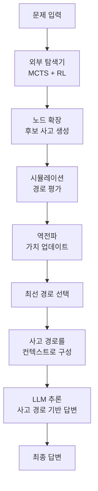

# XoT - 외부 탐색 사고 (Explorer of Thought)

## 개념 정의

XoT(Explorer of Thought, 외부 탐색 사고)는 MCTS (Monte Carlo Tree Search, 몬테카를로 트리 탐색)와 강화학습(RL)을 결합하여 LLM의 추론 탐색 공간을 외부에서 안내하는 패턴이다. [[tree-of-thought]] (ToT)나 [[graph-of-thoughts-got]] (GoT)가 LLM 내부의 자기 평가로 탐색 방향을 결정하는 것과 달리, XoT는 훈련된 외부 탐색 알고리즘이 유망한 추론 경로를 사전에 계산하고 LLM에게 주입한다.

> "Instead of relying on the LLM itself to evaluate and select thoughts, XoT uses an external search algorithm trained via RL to guide the reasoning process."

핵심 직관: LLM은 언어 생성에 뛰어나지만, 체계적인 탐색과 장기 계획에는 약하다. 반면 MCTS+RL은 장기 보상을 최적화하는 탐색에 특화되어 있다. 두 강점을 결합하면 게임, 퍼즐, 수학 등 구조적 추론에서 SOTA를 달성할 수 있다.

## 구조: MCTS + LLM 조합



외부 탐색기가 유망한 사고 경로를 MCTS로 계산하고, 그 경로를 컨텍스트로 LLM에 주입하여 최종 답변을 생성하는 구조다.

## 기존 패턴과의 비교

| 속성 | CoT | ToT | GoT | XoT |
|------|-----|-----|-----|-----|
| 탐색 구조 | 선형 | 트리 | 그래프 | 트리 (외부 MCTS) |
| 경로 평가자 | 없음 | LLM 자기 평가 | LLM 집계 | 훈련된 가치 함수 |
| 탐색 효율 | 최고 | 중간 | 중간 | 가장 높음 |
| 외부 학습 필요 | 없음 | 없음 | 없음 | 필요 (RL 훈련) |
| 적합 도메인 | 범용 | 탐색 필요 문제 | 복잡한 추론 | 구조적/게임형 문제 |

## 핵심 구성 요소

### 1. 외부 탐색기 (External Searcher)

MCTS 기반으로 사고 공간을 탐색한다. 표준 MCTS의 네 단계:
- **선택(Selection)**: UCB1 공식으로 탐색-활용 균형
- **확장(Expansion)**: 선택된 노드에서 후보 사고 생성
- **시뮬레이션(Simulation)**: 선택된 경로를 끝까지 시뮬레이션하여 보상 추정
- **역전파(Backpropagation)**: 결과를 상위 노드에 전파하여 가치 업데이트

$UCB1 = \bar{Q}(s,a) + c \cdot \sqrt{\frac{\ln N(s)}{N(s,a)}}$

- $\bar{Q}(s,a)$: 행동 $a$의 추정 가치 (평균 보상)
- $N(s)$: 상태 $s$ 방문 횟수
- $N(s,a)$: 상태 $s$에서 행동 $a$ 선택 횟수
- $c$: 탐색 계수

### 2. RL 훈련된 가치 함수

단순 MCTS와 달리 XoT는 강화학습으로 훈련된 가치 함수를 사용한다:
- **정책 네트워크**: 각 상태에서 어떤 사고(액션)를 취할지 결정
- **가치 네트워크**: 현재 상태에서 최종 보상을 추정
- 훈련 보상: 최종 답변 정확도, 경로 길이 페널티 등

### 3. 컨텍스트 주입

탐색으로 찾은 최선 경로를 LLM 프롬프트에 주입:

```python
def xot_solve(problem: str, searcher, llm) -> str:
    # 외부 탐색기가 최선 사고 경로 계산
    thought_path = searcher.search(problem, num_simulations=100)

    # 사고 경로를 프롬프트 컨텍스트로 구성
    context = f"문제: {problem}\n\n추론 경로:\n"
    for i, thought in enumerate(thought_path, 1):
        context += f"{i}. {thought}\n"

    # LLM이 사고 경로를 기반으로 최종 답변 생성
    response = llm.generate(context + "\n최종 답변:")
    return response
```

## 적용 도메인

### 게임 및 퍼즐
- **24 게임**: 4개 숫자로 사칙연산을 조합하여 24 만들기
- **블록 와드 (Blocksworld)**: 블록 쌓기 시뮬레이션
- **수독, 체스 퍼즐**: 상태 공간이 명확한 문제

### 수학 추론
복잡한 수학 문제에서 탐색 공간이 크고 중간 단계 검증이 필요할 때 유효하다.

### 코드 생성
컴파일/실행 결과를 보상 신호로 사용하여 올바른 코드를 생성하는 경로를 탐색한다.

## MCTS와 LLM 통합 코드 예시

```python
import math
from dataclasses import dataclass, field
from typing import List, Optional

@dataclass
class ThoughtNode:
    thought: str
    children: List["ThoughtNode"] = field(default_factory=list)
    visits: int = 0
    value: float = 0.0
    parent: Optional["ThoughtNode"] = None

    def ucb_score(self, c: float = 1.4) -> float:
        if self.visits == 0:
            return float("inf")
        parent_visits = self.parent.visits if self.parent else 1
        return self.value / self.visits + c * math.sqrt(
            math.log(parent_visits) / self.visits
        )

class XoTSearcher:
    def __init__(self, thought_generator, value_fn, num_simulations: int = 50):
        self.thought_generator = thought_generator  # 후보 사고 생성 (LLM 또는 별도 모델)
        self.value_fn = value_fn  # 훈련된 가치 함수
        self.num_simulations = num_simulations

    def search(self, problem: str) -> List[str]:
        root = ThoughtNode(thought=problem)

        for _ in range(self.num_simulations):
            node = self._select(root)
            self._expand(node, problem)
            reward = self._simulate(node, problem)
            self._backpropagate(node, reward)

        # 최선 경로 추출
        return self._best_path(root)

    def _select(self, node: ThoughtNode) -> ThoughtNode:
        while node.children:
            node = max(node.children, key=lambda n: n.ucb_score())
        return node

    def _expand(self, node: ThoughtNode, problem: str) -> None:
        candidates = self.thought_generator.generate(problem, node.thought)
        for thought in candidates:
            child = ThoughtNode(thought=thought, parent=node)
            node.children.append(child)

    def _simulate(self, node: ThoughtNode, problem: str) -> float:
        return self.value_fn.estimate(problem, node.thought)

    def _backpropagate(self, node: ThoughtNode, reward: float) -> None:
        while node:
            node.visits += 1
            node.value += reward
            node = node.parent

    def _best_path(self, root: ThoughtNode) -> List[str]:
        path = []
        node = root
        while node.children:
            node = max(node.children, key=lambda n: n.visits)
            path.append(node.thought)
        return path
```

## 적용 시 주의사항

### 훈련 비용
XoT의 가치 함수와 정책 네트워크를 RL로 훈련하는 것은 비싸다. 이미 학습된 가치 함수가 없으면 일반 ToT보다 오히려 나쁜 성능을 낼 수 있다. 도메인 특화 훈련 데이터가 충분할 때 적용한다.

### 도메인 이전 불가
게임 A에서 학습한 가치 함수가 게임 B에 직접 적용되지 않는다. 새 도메인마다 재훈련이 필요하다.

### 탐색 시간
MCTS 시뮬레이션 횟수가 많을수록 정확도가 높아지지만, 응답 지연이 증가한다. 실시간 응용에서는 시뮬레이션 횟수를 제한해야 한다.

### 보상 함수 설계
잘못된 보상 함수(reward hacking)는 원하지 않는 행동을 유발한다. 올바른 최종 답변을 정의하기 어려운 개방형 문제에서는 부적합하다.

## 관련 문서

- [[tree-of-thought]] - LLM 내부 평가 기반 트리 탐색
- [[graph-of-thoughts-got]] - 비선형 그래프 사고 구조
- [[mcts-llm-reasoning]] - MCTS와 LLM 추론 일반 통합
- [[forest-of-thought]] - 다중 트리 앙상블 탐색
- [[chain-of-thought]] - 선형 추론 기법
- [[agent-planning-strategies]] - 에이전트 계획 전략 개요
- [[self-consistency-decoding]] - 다수결 앙상블 추론
