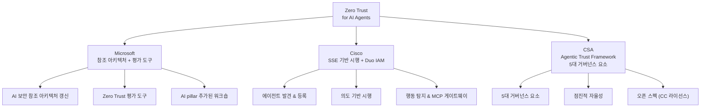

# Zero Trust for AI Agents

## 정의

**Zero Trust for AI Agents**는 기존의 "신뢰하되 검증하라(trust but verify)" 보안 모델을 AI 에이전트 환경에 적용한 패러다임이다. 핵심 원칙은 **"어떤 AI 에이전트도 목적이나 주장된 능력에 관계없이 기본적으로 신뢰하지 않는다(never trust, always verify)"** 이다. 비인간 신원(NHI, Non-Human Identity)이 인간 신원 대비 **80:1 이상**의 비율로 존재하는 현실에서, 에이전트 전용 Zero Trust 프레임워크가 필수적이다. [[human-in-the-loop-patterns|Human-in-the-Loop 패턴]]과 함께 에이전트 안전성의 핵심 설계 원칙이다.

## 왜 지금 중요한가

[[owasp-agentic-top-10|OWASP Agentic Top 10]]의 ASI-03(Identity Abuse), ASI-07(Inter-Agent Communication), ASI-10(Rogue Agents)은 모두 신원과 권한 관리의 실패에서 비롯된다. 에이전트가 다른 [[subagents|에이전트]]에게 작업을 위임하고, 도구를 동적으로 선택하며, 장기간 자율적으로 동작하는 환경에서는 전통적 경계 보안(perimeter security)이 무력하다. **의도(intent)가 새로운 경계**가 된다.

## 3대 프레임워크 비교

2026년 초 Microsoft, Cisco, Cloud Security Alliance(CSA)가 각각 독립적으로 AI 에이전트용 Zero Trust 프레임워크를 발표했다.

### Microsoft: 참조 아키텍처와 평가 도구

2026년 3월 19일 발표. 기존 Zero Trust 참조 아키텍처에 **AI pillar**을 추가하고, 조직의 AI 보안 구현 수준을 평가하는 새 도구를 제공한다. 실용적 가이던스와 갱신된 워크숍을 포함한다.

### Cisco: Security Service Edge 기반 시행

Cisco의 접근법은 세 가지 핵심 계층으로 구성된다:

1. **에이전트 가시성과 신원 관리** - AI 에이전트, MCP 서버, 관련 도구를 발견하고 등록하여 에이전트 신원과 활동의 중앙 인벤토리를 생성
2. **세밀한 접근 제어** - 에이전트가 접근할 수 있는 서비스뿐 아니라 수행 가능한 **행동**까지 정책으로 정의. 신원 인식(identity-aware), 시간 제한(time-bound) 자격증명으로 범위와 기간 제한
3. **실시간 행동 모니터링** - 비인가 도구 사용, 정책 위반, 민감 데이터 접근 시도 등 비정상 행동 탐지

핵심 통찰: **"의도가 새로운 경계가 된다(intention becomes the new perimeter)."** 정적 규칙이 아닌 에이전트의 의도를 탐지하고 적절한 행동에 매칭하는 의도 기반 시행(intent-based enforcement)이 중심이다. Security Service Edge(SSE)를 에이전트, 도구, 데이터 접근의 중앙 제어점으로 활용한다.

### CSA: Agentic Trust Framework (ATF)

CSA는 전통적 Zero Trust를 에이전틱 거버넌스로 번역한 오픈 스펙을 발표했다. Creative Commons 라이선스로 GitHub에서 유지된다.

**5대 거버넌스 요소:**

| 요소 | 핵심 질문 | 기능 |
|---|---|---|
| **Identity** | "누구인가?" | 인증, 인가, 세션 관리 |
| **Behavior** | "무엇을 하고 있는가?" | 관측성, 이상 탐지, 의도 분석 |
| **Data Governance** | "무엇을 먹고 무엇을 내놓는가?" | 입력 검증, 출력 제어 |
| **Segmentation** | "어디에 갈 수 있는가?" | 접근 제어, 리소스 경계 |
| **Incident Response** | "불량화되면 어떻게 하는가?" | 서킷 브레이커, 격리 메커니즘 |

ATF의 핵심 혁신은 **점진적 자율성(progressive autonomy)** 모델이다. 정의된 자율성 수준에서 각 단계마다 명확한 기준과 제어가 있어, 초기 배포부터 자율성을 점진적으로 높이면서도 필요한 거버넌스와 보안을 유지할 수 있다.

## 전통적 Zero Trust와의 차이

| 구분 | 전통적 Zero Trust | AI 에이전트 Zero Trust |
|---|---|---|
| 주체 | 인간 사용자, 디바이스 | AI 에이전트, NHI |
| 행동 예측 | 결정적, 규칙 기반 | **비결정적, 적응적** |
| 접근 패턴 | 정적 리소스 요청 | 동적 도구 체이닝 |
| 권한 범위 | 역할 기반 | **작업 기반, 시간 제한** |
| 신뢰 경계 | 네트워크 | **의도(intent)** |
| 모니터링 | 접근 로그 | 행동 분석 + 시맨틱 패턴 |

AI 에이전트는 "행동보다 규칙이 예측 가능하다"는 기존 Zero Trust의 기본 가정을 근본적으로 깨뜨린다.

## NHI(비인간 신원) 문제

NHI 대 인간 신원 비율이 **80:1 이상**이라는 현실은 다음을 의미한다:

- 공격 표면이 인간 중심 보안 대비 80배 이상 확대
- 수동 신원 관리가 불가능한 규모
- 자격증명 라이프사이클(발급, 갱신, 폐기)의 자동화 필수
- 각 에이전트가 인간 소유자(human owner)에 매핑되어 기업 신원 시스템과 통합되어야 함

## 구현 원칙

1. **최소 권한** - 에이전트에게 현재 작업에 필요한 최소한의 권한만 부여, 시간 제한 적용
2. **지속적 검증** - 모든 도구 호출, 에이전트 간 통신, 데이터 접근을 실시간 검증
3. **행동 기반 탐지** - 정적 규칙이 아닌 에이전트 행동 패턴의 이상을 탐지
4. **격리와 서킷 브레이커** - 이상 탐지 시 즉시 격리하고 연쇄 장애 차단
5. **감사 추적** - 모든 에이전트 행동의 불변 로그 유지

## 대표 자료

- [Microsoft: Zero Trust for AI 발표](https://www.microsoft.com/en-us/security/blog/2026/03/19/new-tools-and-guidance-announcing-zero-trust-for-ai/)
- [Cisco: Zero Trust를 에이전틱 디지털 인력에 적용](https://blogs.cisco.com/security/security-agentic-ai-how-cisco-brings-zero-trust-to-your-new-digital-workforce)
- [CSA: Agentic Trust Framework](https://cloudsecurityalliance.org/blog/2026/02/02/the-agentic-trust-framework-zero-trust-governance-for-ai-agents)

## 관련 문서
- [[rag-security-privacy]] -- RAG 보안과 프라이버시 (RAG Security & Privacy)
- [[minimal-footprint-principle]] -- 최소 발자국 원칙 (Minimal Footprint Principle)
- [[cloudflare-dynamic-workers]] -- Cloudflare Dynamic Workers

- [[owasp-agentic-top-10]] - Zero Trust가 대응하는 위협 분류
- [[cisco-defenseclaw]] - Cisco Zero Trust 에이전트 보안의 오픈소스 구현
- [[nist-ai-agent-standards]] - 에이전트 신원/인가의 공식 표준화
- [[agentmon]] - 행동 모니터링의 구현 도구
- [[mcp-server-cards]] - 에이전트 발견과 신원 검증 인프라
