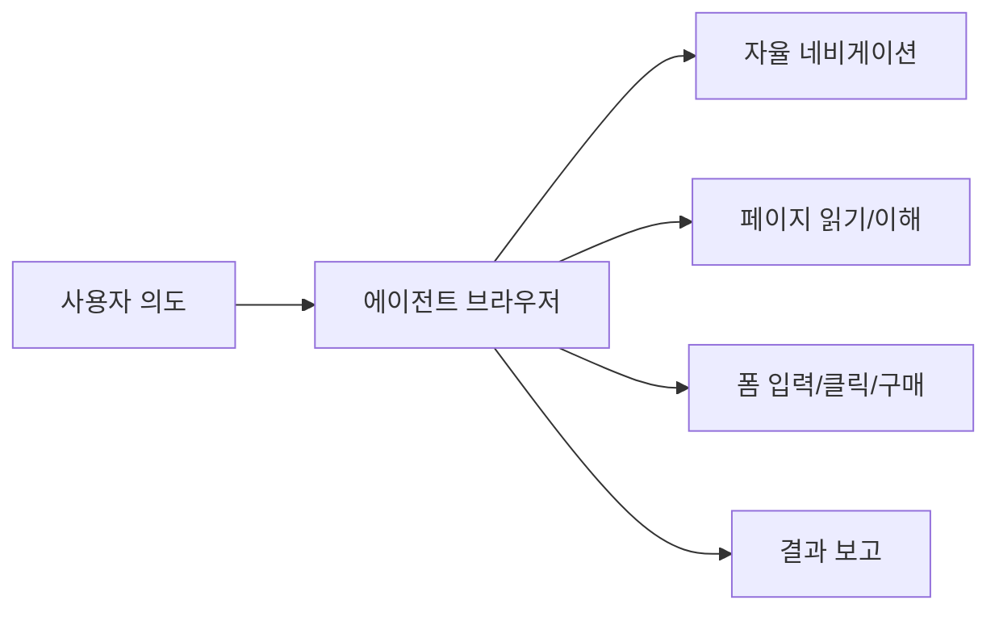

# 에이전틱 브라우저

AI가 웹을 자율적으로 탐색하며 사용자 대신 정보를 수집하고 작업을 수행하는 브라우저 패러다임. [[web-agent|웹 에이전트]]와 [[browser-automation-agents|브라우저 자동화]]의 제품화 형태.

## 주요 제품

| 제품 | 개발사 | 방식 |
|------|--------|------|
| Perplexity Comet | Perplexity | 검색+답변 에이전트 |
| OpenAI Operator | OpenAI | Computer Use 기반 |
| Google Auto Browse | Google | Chrome 내장 AI |
| Arc Browser Max | The Browser Company | 브라우저 네이티브 AI |

## [[computer-use-agent|컴퓨터 사용 에이전트]]와의 관계

컴퓨터 사용 에이전트가 스크린샷 기반으로 모든 데스크톱 앱을 다루는 범용 접근이라면, 에이전틱 브라우저는 **웹 특화**로 DOM/API 접근이 가능해 더 정확하고 빠르다.

## 관련 문서

- [[web-agent]] -- 웹 에이전트
- [[browser-automation-agents]] -- 브라우저 자동화
- [[computer-use-agent]] -- 컴퓨터 사용 에이전트
- [[ai-search-engine]] -- AI 검색 엔진
