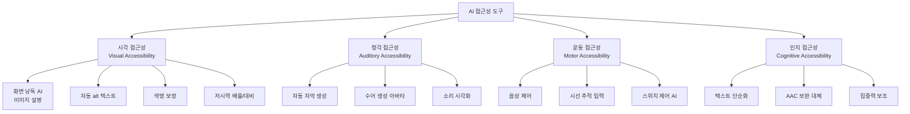
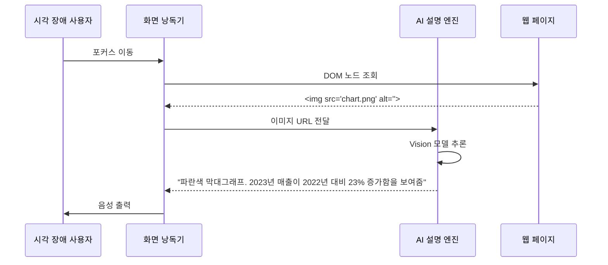
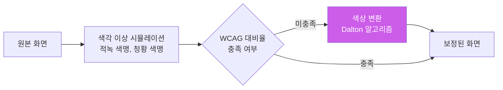
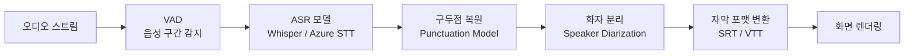
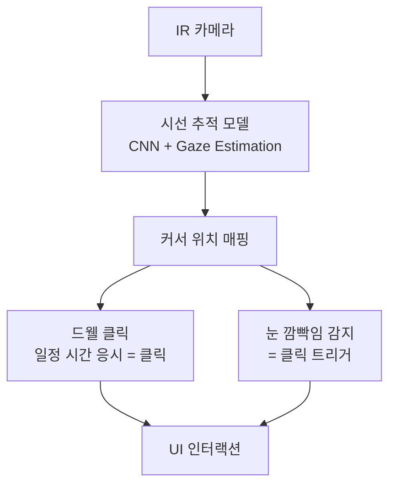
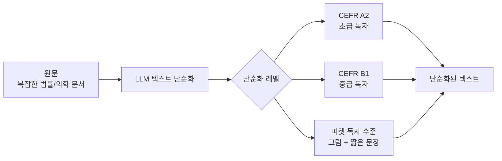
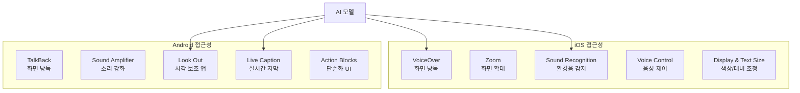
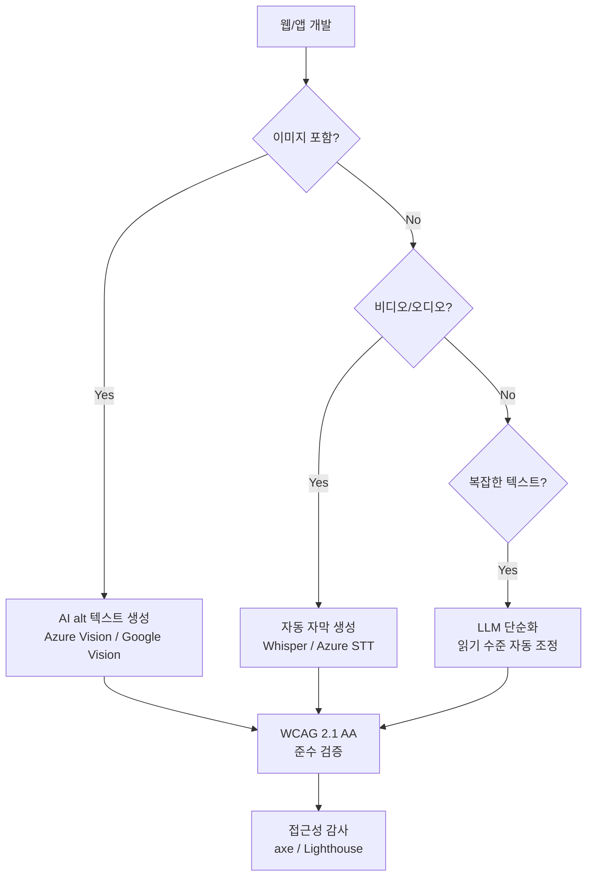

# AI 접근성 도구

## 개요

AI 접근성 도구(AI Accessibility Tools)는 신체적·인지적 장애를 가진 사용자가 디지털 환경을 동등하게 이용할 수 있도록 AI를 활용하는 기술의 총칭이다. 시각 장애인을 위한 화면 낭독, 청각 장애인을 위한 자동 자막·수어 생성, 운동 장애인을 위한 대체 입력, 인지 장애인을 위한 콘텐츠 단순화까지 광범위한 영역을 포괄한다.

UN 장애인 권리 협약(CRPD)과 미국의 ADA(Americans with Disabilities Act), 유럽의 European Accessibility Act는 디지털 제품의 접근성을 법적 의무로 규정한다. AI는 이 의무를 충족하는 데 드는 비용과 노력을 크게 낮춘다.

**WHO 통계**: 전 세계 인구의 약 16%(약 13억 명)가 어떤 형태의 장애를 가지고 있으며, 고령화로 이 수치는 증가하는 추세다.

## 핵심 아이디어

### 접근성 AI의 4대 영역

## 시각 접근성

### 화면 낭독기(Screen Reader)와 AI

전통적 화면 낭독기(NVDA, JAWS, VoiceOver)는 HTML 시맨틱과 ARIA 레이블을 음성으로 읽는다. AI는 두 가지 방향으로 이를 확장한다:

1. **이미지 시각적 설명**: alt 텍스트가 없거나 부실한 이미지를 AI가 실시간 설명
2. **맥락 이해 낭독**: "버튼 6개 중 3번째 버튼" 대신 "장바구니에 추가 버튼"처럼 의미 기반 설명

### 자동 alt 텍스트 생성

이미지 캡셔닝(image captioning) 모델을 이용해 이미지에 자동으로 대체 텍스트(alt text)를 생성한다. 단순 객체 나열("고양이, 소파, 창문")이 아니라 맥락과 감정을 포함한 자연스러운 설명이 목표다.

**품질 평가 기준:**
- 중요 정보 포함 여부 (이미지의 주제와 목적)
- 장식적 이미지 구분 (alt="" 처리)
- 차트/그래프의 데이터 수치 포함
- 문화적 맥락 반영 (동일한 손짓이 문화마다 다른 의미)

**현재 활용 사례:**
- Facebook/Instagram: 2019년부터 자동 alt 텍스트 기능 제공
- Microsoft Word/PowerPoint: 삽입 이미지에 AI alt 텍스트 자동 제안
- Twitter/X: 자동 이미지 설명 기능

### 색맹 보정 및 대비 향상

AI 기반 색맹 보정 앱(EnChroma, Color Oracle)은 실시간으로 화면 색상을 조정해 색각 이상 사용자가 색상 구분을 할 수 있게 한다. 단순 색상 팔레트 변환을 넘어 딥러닝으로 자연스럽게 처리한다.

## 청각 접근성

### 자동 자막 생성

ASR(Automatic Speech Recognition) 모델을 이용해 영상/음성의 자막을 자동 생성한다. 정확도와 지연시간이 핵심 품질 지표다.

**자막 생성 파이프라인:**

**플랫폼별 자동 자막 비교:**

| 플랫폼 | 기술 기반 | 지원 언어 | 정확도 (영어) |
|--------|---------|---------|------------|
| YouTube | Google STT | 60개+ | ~90% |
| Zoom | 자체 ASR | 40개+ | ~85% |
| Microsoft Teams | Azure STT | 30개+ | ~88% |
| Otter.ai | 자체 ASR | 영어 중심 | ~92% |
| Rev | 하이브리드 | 영어 | ~99% (인간 검수) |

### 소리의 시각화

청각 장애인을 위해 음향 환경을 시각적으로 표시한다.

- **알림음 시각화**: 화재 경보, 도어벨, 전화 벨을 화면 섬광이나 진동으로 변환
- **음성 강도 표시**: 말하는 사람의 발화 강도와 감정 톤을 색상 막대로 표시
- **환경음 분류**: 개 짖는 소리, 아기 울음, 사이렌 소리 등을 텍스트 레이블로 표시

Apple iOS의 Sound Recognition 기능과 Android의 Sound Amplifier가 이 범주의 대표적 구현이다.

## 운동 접근성

### 음성 제어 (Voice Control)

키보드·마우스 없이 음성 명령만으로 컴퓨터를 제어한다. Apple의 Voice Control, Windows Speech Recognition, Dragon NaturallySpeaking이 대표적이다.

AI 발전으로 자연어 명령 이해도가 크게 향상됐다: "이메일 열어서 첫 번째 첨부파일 다운로드해줘"와 같은 복잡한 명령도 처리 가능.

### 시선 추적 입력 (Eye Tracking)

카메라로 눈 위치를 추적해 커서 위치를 결정한다. ALS(루게릭병), 척수 손상 등 전신 운동 기능이 제한된 사용자에게 주요 입력 수단이다.

Tobii, EyeGaze Edge, Windows Eye Control이 주요 솔루션이다. 최근에는 일반 웹캠으로도 작동하는 소프트웨어 전용 시선 추적 솔루션이 등장했다.

### 스위치 제어와 예측 보조

단일 스위치(버튼 하나)만 누를 수 있는 사용자를 위한 스캐닝 인터페이스에 AI 예측을 결합한다. 다음에 선택할 가능성이 높은 항목을 예측해 스캐닝 시간을 단축한다.

## 인지 접근성

### 텍스트 단순화 (Text Simplification)

난독증, 지적 장애, 읽기 발달 장애 사용자를 위해 복잡한 텍스트를 쉽게 재작성한다.

EU의 Easy-to-Read 기준과 미국의 Plain Language Act가 공공 문서 단순화를 의무화하고 있어, LLM 기반 자동화 수요가 증가하고 있다.

### AAC (보완 대체 의사소통)

뇌성마비, 자폐 스펙트럼 장애, ALS 등으로 구어(oral speech)가 어려운 사람을 위한 의사소통 시스템이다.

AI 강화 AAC의 특징:
- **단어 예측**: 이전 입력과 맥락을 바탕으로 다음 단어·구절 예측
- **문장 완성**: 짧은 입력에서 완전한 문장 생성
- **개인화**: 개인의 어휘 사용 패턴 학습

Proloquo2Go, Snap Core First, TouchChat 등 주요 AAC 앱에 LLM 기반 예측 기능이 통합되고 있다.

## 모바일 접근성 통합

스마트폰은 이동 중 접근성 도구를 사용하는 핵심 플랫폼이다.

**Google Look Out**: 스마트폰 카메라를 이용해 시각 장애인에게 주변 환경을 설명한다. 문서 스캔, 식품 바코드 인식, 통화 정보 읽기 등을 지원한다.

**Apple Magnifier + People Detection**: iPhone 카메라를 돋보기로 활용하고, 사람의 거리를 LiDAR로 측정해 진동으로 알려준다.

## 실제 사례

### Microsoft Seeing AI
시각 장애인을 위한 iOS/Android 앱. 스마트폰 카메라로 사람 묘사, 텍스트 읽기, 바코드 스캔, 색상 인식, 지폐 인식, 명함 읽기를 제공한다. Azure Computer Vision과 Custom Vision을 기반으로 한다.

### Be My Eyes + GPT-4V
시각 장애인과 자원봉사 안내자를 연결하는 플랫폼 Be My Eyes가 GPT-4V를 통합해 "AI 자원봉사자" 기능을 추가했다. 24시간 AI가 화면 내용을 설명한다.

### Google Live Transcribe
Android용 실시간 자막 앱. 80개 이상 언어 지원, 인터넷 없이도 작동하는 오프라인 모드, 화자 분리 기능을 제공한다.

### Amazon Alexa Accessibility Features
Alexa는 시각 장애인을 위한 Show and Tell(물건 인식), 청각 장애인을 위한 화면 텍스트 자막, 인지 장애를 위한 간소화된 모드를 제공한다.

### Microsoft Immersive Reader
읽기 장애(난독증)를 가진 학생을 위한 도구. 텍스트 간격 조정, 음절 분리, 읽기 안내선, 그림 사전, 번역을 통합 제공한다. Office 365, Teams, Edge 브라우저에 통합됐다.

## 개발자를 위한 접근성 AI 통합 가이드

**주요 API:**
- Azure Cognitive Services Computer Vision: 이미지 설명, alt 텍스트 생성
- Google Cloud Vision API: 이미지 라벨링, OCR, 얼굴 감지
- Amazon Rekognition: 이미지/비디오 분석
- OpenAI GPT-4V: 이미지 설명, 복합 질문

## 한계 및 트레이드오프

| 항목 | 내용 |
|------|------|
| 오류 전파 | ASR 오류가 자막에 그대로 노출되면 청각 장애인에게 잘못된 정보 전달 |
| 언어 편향 | 영어 중심 학습으로 소수 언어 지원 품질이 크게 낮음 |
| 문화적 맥락 | 이미지 설명에서 문화·지역적 맥락을 놓치는 경우 많음 |
| 개인정보 | 카메라·오디오 상시 처리는 개인정보 침해 우려 |
| 배터리/성능 | 실시간 AI 처리는 모바일 기기 배터리를 빠르게 소모 |
| 과의존 위험 | AI에 과도하게 의존하면 기술 오작동 시 더 취약해짐 |

## 윤리 이슈

- **디자인 참여**: 접근성 도구는 실제 장애인 사용자가 설계 초기부터 참여해야 한다. "장애인을 위해 만들었지만 장애인의 의견은 없는" 제품이 많다.
- **자동화의 한계**: AI가 대체할 수 없는 전문 인간 지원(수어 통역사, 점자 번역사)과의 역할 분담이 필요하다.
- **경제적 접근성**: 고급 접근성 AI 기기는 비용이 높아 경제적 취약 계층에게는 오히려 장벽이 된다.
- **교육**: AI 접근성 도구 사용법을 교육할 수 있는 지원 인프라가 필요하다.

## 관련 문서

- [[ai-sign-language]] - 수어 인식 및 생성 AI
- [[whisper]] - 자동 자막 기반 ASR 모델
- [[image-captioning]] - 이미지 설명 생성 모델
- [[ai-realtime-translation]] - 실시간 번역과 접근성의 교차
- [[ai-elder-care]] - 노인 접근성 특화 AI
