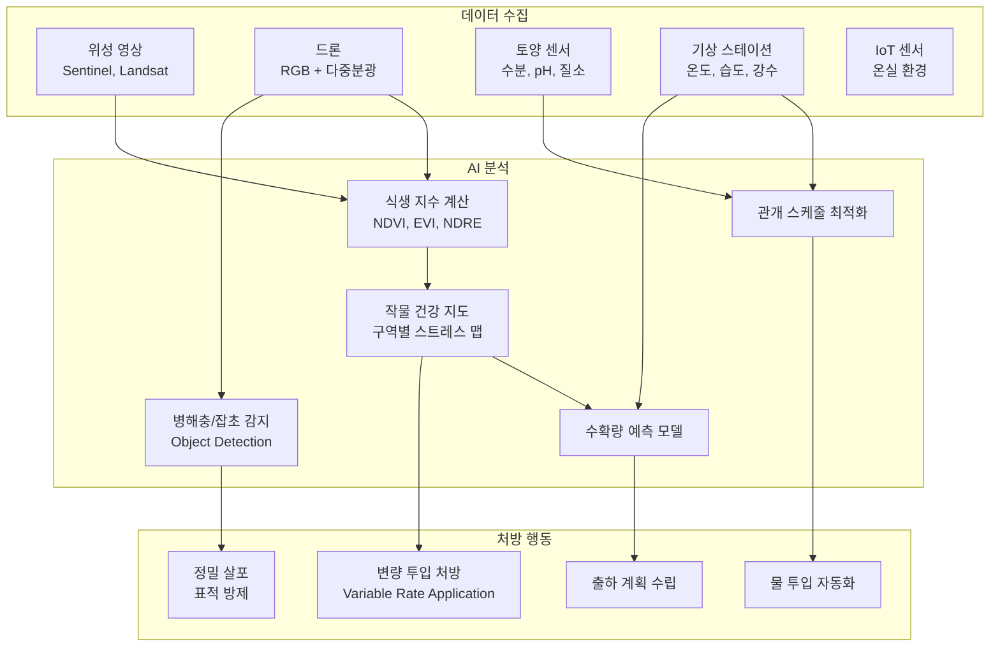
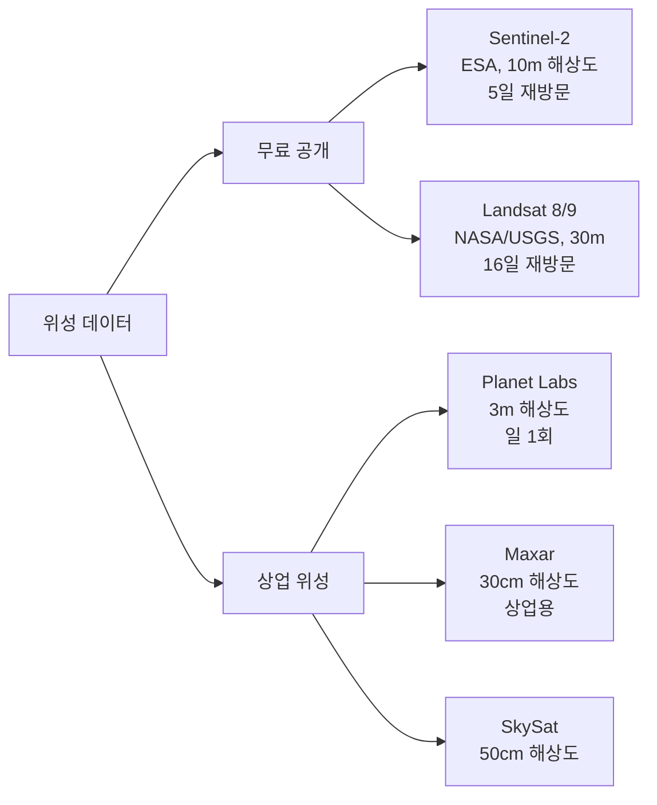
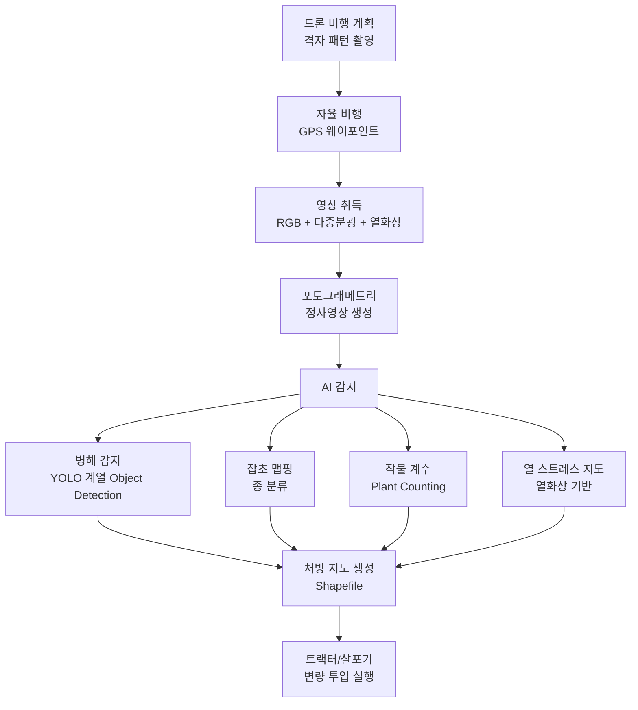
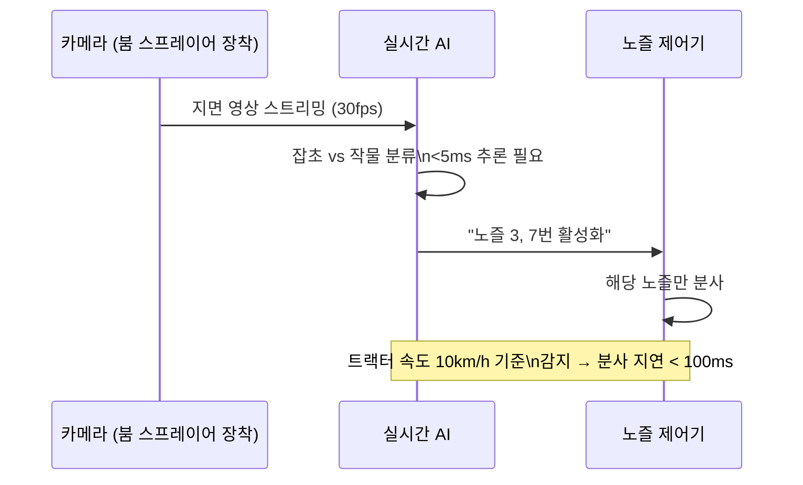
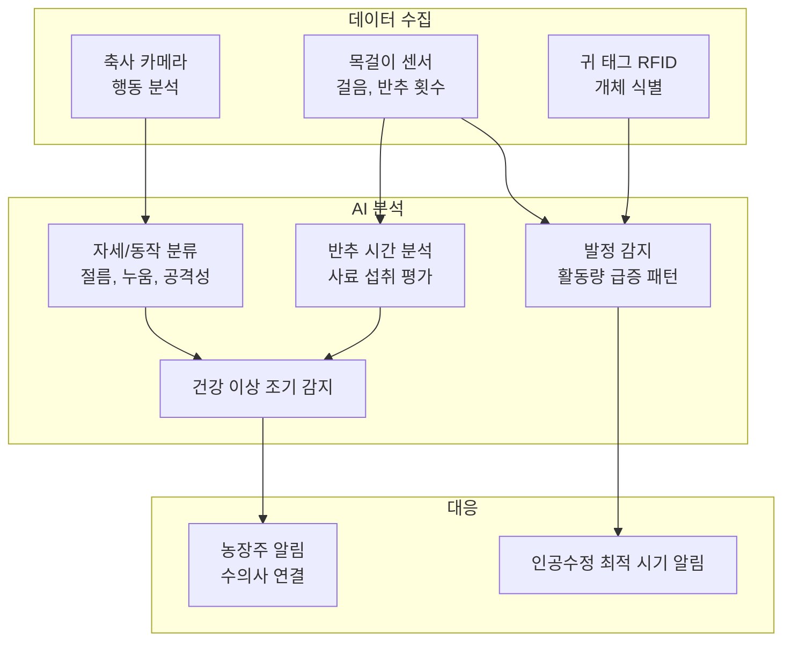
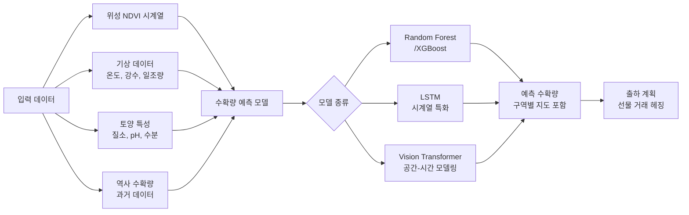
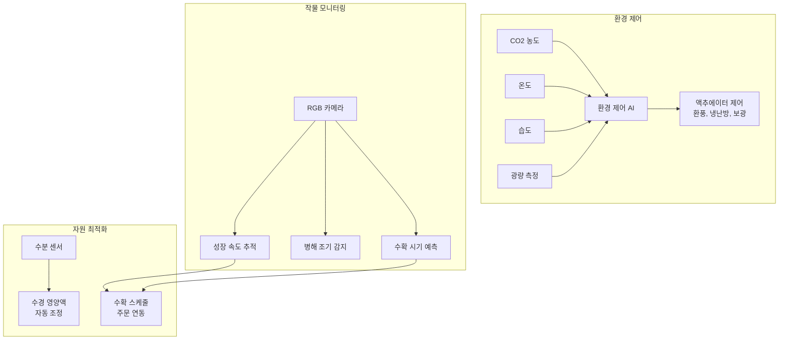

# AI 농업 및 스마트 팜

## 개요

AI 농업(AI in Agriculture)은 컴퓨터 비전, 위성 원격탐사(remote sensing), 시계열 예측, 드론 기술을 결합해 작물 생산성을 높이고 자원 사용을 최소화하는 기술 분야다. UN FAO에 따르면 2050년까지 세계 인구는 97억 명에 달하고 식량 생산을 현재 대비 60% 증대해야 하는 반면, 경작 가능 토지와 담수는 줄어들고 있다. AI는 이 간극을 메우는 핵심 수단이다.

**정밀 농업(Precision Agriculture)**은 AI 농업의 핵심 패러다임이다: 밭 전체에 균일하게 자원을 투입하는 대신, 각 구역의 실제 필요에 맞게 물·비료·농약을 정확히 투입한다.

핵심 응용 영역:
- **작물 모니터링**: 위성·드론 영상으로 작물 건강 상태 광역 감시
- **정밀 살포**: 잡초·병해충 감지 후 해당 구역에만 농약 투입
- **수확량 예측**: 기상·위성 데이터 결합으로 수확량 사전 예측
- **관개 최적화**: 토양 수분 센서 + AI로 물 낭비 없는 관개 스케줄
- **가축 관리**: 개체별 행동·건강 모니터링

## 핵심 아이디어

### 정밀 농업의 데이터 흐름

## 위성 작물 모니터링

### 식생 지수 (Vegetation Index)

원격탐사의 핵심 지표다. 식물은 가시광선(특히 빨강)을 흡수하고 근적외선(NIR)을 반사하는 특성이 있다.

**주요 식생 지수:**

| 지수 | 공식 | 용도 |
|------|------|------|
| NDVI | $(NIR - Red) / (NIR + Red)$ | 전반적 작물 건강 |
| EVI | $2.5 \times (NIR - Red) / (NIR + 6 \times Red - 7.5 \times Blue + 1)$ | 고밀도 작물 |
| NDRE | $(RedEdge - Red) / (RedEdge + Red)$ | 질소 결핍 감지 |
| NDWI | $(Green - NIR) / (Green + NIR)$ | 작물 수분 스트레스 |
| SAVI | $(NIR - Red) / (NIR + Red + L) \times (1 + L)$ | 토양 노출 보정 |

**NDVI 값 해석:**
- 0.2 미만: 나지(裸地), 비식생
- 0.2-0.4: 저밀도 식생, 건조 스트레스
- 0.4-0.6: 중간 건강 상태
- 0.6-0.8: 건강한 작물
- 0.8 이상: 매우 건강한 고밀도 식생

### 위성 데이터 소스

AI는 시계열 위성 영상을 분석해 작물 성장 곡선을 추적하고, 예년 대비 이상을 조기에 감지한다. 클라우드 커버(구름 가림) 처리를 위해 SAR(Synthetic Aperture Radar) 데이터와 광학 영상을 융합하기도 한다.

## 드론 기반 정밀 진단

위성 영상의 해상도 한계(10-30m)를 극복하기 위해 드론(UAV)이 사용된다.

**드론 다중분광(Multispectral) 카메라:**
- Micasense RedEdge: 5개 밴드 (Blue, Green, Red, Red-Edge, NIR)
- Parrot Sequoia: 4개 밴드 + RGB
- 데이터: 1헥타르당 약 2-3GB

## 정밀 살포 (Precision Spraying)

전통 농약 살포는 밭 전체에 균일하게 뿌려 농약의 70-80%가 낭비된다. AI 기반 정밀 살포는 잡초나 병해충이 있는 구역에만 살포한다.

### 실시간 잡초 감지 및 선택 살포

**Blue River Technology (John Deere 인수)**의 See & Spray 시스템은 이 방식의 상업적 구현이다. 개별 식물 단위로 제초제를 선택 투여해 제초제 사용량을 최대 90% 절감한다고 보고한다. [교차검증 필요: 현장 적용 절감율]

## 가축 행동 모니터링

AI는 카메라와 IoT 센서로 개별 가축을 모니터링해 질병 조기 발견, 발정 감지, 복지 관리를 자동화한다.

**주요 지표별 AI 응용:**
- **반추(Rumination)**: 소의 반추 횟수 감소는 질병의 초기 신호. 목걸이 센서 + 기계학습으로 24시간 모니터링
- **절름(Lameness)**: 보행 영상 분석으로 초기 절름 감지, 조기 치료로 생산성 손실 방지
- **발정 감지**: 활동량 패턴 변화로 발정기를 정확히 감지해 인공수정 적기 포착 (정확도 90%+ 가능)
- **열 스트레스**: 소의 더위로 인한 생산성 저하를 기온-습도 지수(THI)와 행동 데이터로 예측

## 수확량 예측

**예측 정확도 사례:**
- Google의 Cropland Mapper: 인도 밀 수확량 예측 RMSE 11% 이하 달성 [교차검증 필요]
- The Climate Corporation (Bayer): 옥수수 수확량 예측 모델 상업화

## 온실/수직 농장 AI

수직 농장에서 AI는 광량, 온도, 영양액 농도를 작물 성장 단계와 품종에 맞게 동적으로 최적화한다. 에너지(주로 LED 조명)와 물 사용량을 최소화하면서 생산성을 극대화한다.

## 실제 사례

### Climate Corporation (Bayer)
의사결정 농업 플랫폼 FieldView. 위성·드론·현장 데이터를 통합해 파종 시기, 비료 투입량, 병해 예경보를 개별 포장(圃場)별로 제공한다. 미국 내 수천만 에이커의 농지에서 사용된다.

### Syngenta Cropwise
디지털 농업 플랫폼. 날씨 예측, 병해충 위험 모델, 작물 보호 권고를 통합 제공한다.

### AeroFarms / Bowery Farming (수직 농장)
LED 조명, 에어로포닉(무토양 재배), AI 환경 제어를 결합한 실내 수직 농장. 전통 농업 대비 물 사용 95% 절감, 1m² 당 생산성 100배를 주장한다. [교차검증 필요: 전체 생애주기 에너지 대비 효율]

### Taranis (농업 영상 분석)
드론·위성·비행기 영상으로 작물 병해, 잡초, 영양 결핍을 픽셀 수준에서 감지하는 AI 플랫폼.

### CattleEye (가축 모니터링)
목장 카메라로 소 개체를 추적하고 절름, 질병, 발정을 자동 감지하는 AI 서비스.

### 국내 사례: 팜에이트, LG CNS 스마트팜
팜에이트는 AI 기반 수직 농장 운영 기업으로 딸기, 채소 등을 실내 재배한다. LG CNS는 스마트 팜 통합 관제 솔루션을 개발하고 있다.

## 한계 및 트레이드오프

| 항목 | 내용 |
|------|------|
| 데이터 접근성 | 소농(小農)은 위성 구독, 드론, 센서 투자 비용을 감당하기 어려움 |
| 연결성 | 농촌 지역 인터넷 인프라 부족으로 실시간 AI 처리 한계 |
| 데이터 품질 | 기상 이변, 새로운 품종에는 기존 모델이 과소 적응 |
| 작물 다양성 | 주요 곡물(옥수수, 밀, 대두) 외 소규모 작물은 데이터 부족 |
| 환경 영향 평가 | AI 정밀 농약 투입이 실제로 환경 부하를 얼마나 줄이는지 실증 연구 부족 |
| 농업 지식 통합 | AI 모델이 현지 농업 지식(local knowledge)을 충분히 반영하지 못함 |

## 윤리 이슈

- **데이터 주권**: 농부가 자신의 토지 데이터를 대기업에 제공할 경우 데이터 소유권과 수익 분배 문제. 미국 농업부(USDA)는 농업 데이터 보호 원칙을 발표했다.
- **소농 소외**: 기술 비용으로 인해 대규모 기업 농업만 혜택 받고 소농은 경쟁에서 뒤처질 우려.
- **생물다양성**: AI 최적화가 단일 품종 집약 재배를 강화해 농업 생물다양성을 감소시킬 위험.
- **일자리**: 농기계 자동화와 AI 확산으로 농업 노동자 고용 감소.

## 관련 문서

- [[remote-sensing]] - 원격탐사 및 위성 데이터 처리
- [[time-series-forecasting]] - 수확량 예측에 쓰이는 시계열 예측
- [[ai-climate-modeling]] - 기후 데이터와 농업 예측의 교차점
- [[object-detection]] - 드론 이미지 내 병해충/잡초 감지
- [[ai-sustainability-optimization]] - 지속 가능 농업과 AI
