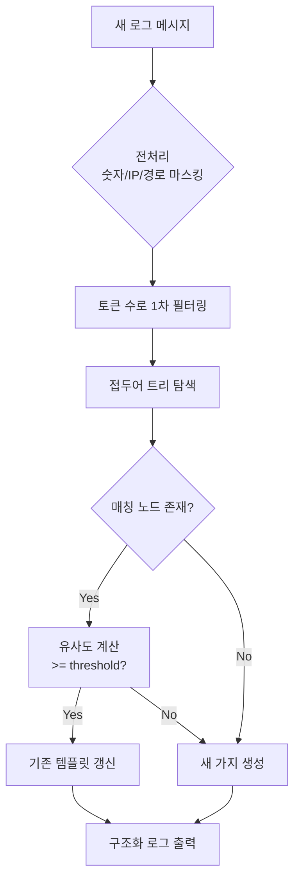
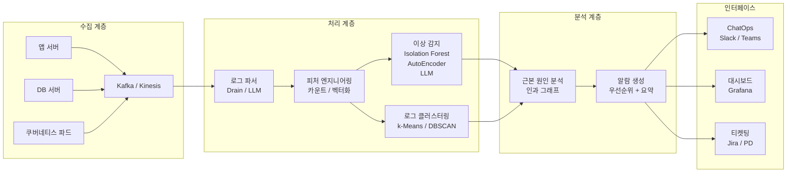
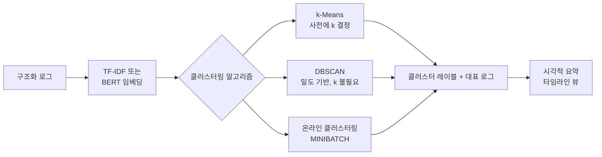
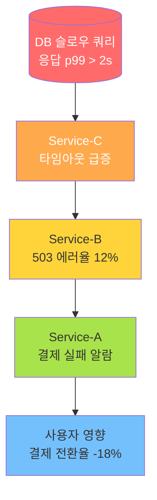
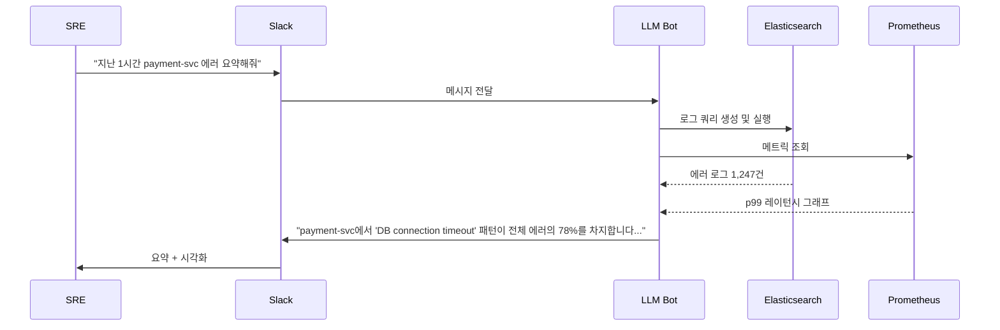
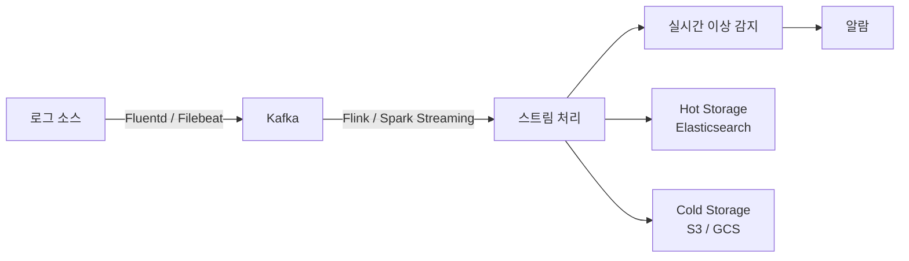

# AI 로그 분석 (AIOps)

## 개요

AIOps(Artificial Intelligence for IT Operations)의 핵심 축인 AI 기반 로그 분석은 수십 억 줄의 시스템 로그를 실시간으로 소화해 이상 징후를 감지하고, 근본 원인을 추적하며, 운영팀에 자연어로 경보를 전달하는 기술이다. 전통적 규칙 기반 알람(임계값 초과 시 PagerDuty 발송)은 폭발적으로 늘어나는 마이크로서비스 환경에서 "알람 피로(alert fatigue)"를 유발한다. AI 로그 분석은 패턴 학습으로 노이즈를 줄이고 진짜 문제에만 집중하게 한다.

핵심 가치는 세 가지다:
- **노이즈 억제**: 반복·예측 가능한 이벤트를 학습해 무시
- **이상 감지**: 알려지지 않은 패턴 이탈을 비지도 학습으로 포착
- **근본 원인 분석(Root Cause Analysis, RCA)**: 인과 그래프로 "어디서 시작됐나"를 추적

## 핵심 아이디어

### 로그 데이터의 특성

로그는 반정형(semi-structured) 데이터다. 타임스탬프, 심각도(level), 서비스명, 메시지로 구성되지만 메시지 자체는 자유 텍스트다. 분석의 첫 단계는 이 자유 텍스트에서 구조를 추출하는 파싱(parsing)이다.

```
2026-04-27T08:23:11Z ERROR payment-svc [req=abc123] DB connection timeout after 5000ms
```

이 한 줄에서 추출해야 하는 정보:
- 시간: `2026-04-27T08:23:11Z`
- 심각도: `ERROR`
- 서비스: `payment-svc`
- 요청 ID: `abc123`
- 패턴 템플릿: `DB connection timeout after <NUM>ms`

### 로그 파싱과 템플릿 마이닝

드레인(Drain) 알고리즘은 전처리 없이 실시간으로 로그 메시지를 템플릿으로 클러스터링하는 대표적 방법이다. 접두어 트리(prefix tree)를 유지하며 새 로그가 들어올 때마다 기존 템플릿과 매칭하고, 매칭 실패 시 새 템플릿으로 등록한다.

**Drain 알고리즘 흐름:**



Drain 외에도 LLM 기반 파서가 최근 주목받고 있다. GPT-4 수준 모델을 소수샷(few-shot) 프롬프팅으로 활용하면 드레인이 실패하는 복잡한 중첩 메시지도 정확히 파싱할 수 있다.

## 시스템 아키텍처



## 주요 컴포넌트 및 기법

### 1. 로그 클러스터링

비슷한 패턴의 로그를 묶어 "이 시간대에 이 서비스에서 이런 종류의 에러가 N건 발생했다"고 요약한다. 개별 로그를 하나씩 보는 것보다 훨씬 인지 부하가 낮다.

**클러스터링 파이프라인:**



로그 임베딩은 최근 `LogBERT`, `UniLog`, `LILAC` 같은 로그 특화 사전학습 모델이 제안됐다. 일반 텍스트 BERT보다 로그 특유의 반복 패턴과 수치 토큰을 더 잘 처리한다.

### 2. 이상 시퀀스 감지

단순히 "지금 이 로그가 이상한가"가 아니라 "이 서비스에서 발생한 로그의 순서가 비정상적인가"를 판단한다. 예를 들어 정상 흐름은 `LOGIN -> VERIFY -> ORDER`인데 `LOGIN -> ERROR -> ORDER`가 반복된다면 시퀀스 수준 이상이다.

**시퀀스 이상 감지 방법:**

| 방법 | 원리 | 장점 | 단점 |
|------|------|------|------|
| LSTM 기반 예측 | 다음 로그 키를 예측, 실제와 비교 | 시퀀스 패턴 잘 포착 | 학습 시간, 레이블 필요 |
| Transformer LogAnomaly | 어텐션으로 멀리 있는 키 관계 학습 | 장거리 의존성 | 높은 계산 비용 |
| Isolation Forest | 로그 카운트 벡터 이상값 탐색 | 비지도, 빠름 | 시퀀스 정보 무시 |
| LLM 제로샷 | 로그 블록을 GPT에 넣어 이상 여부 판단 | 레이블 불필요 | 지연시간, 비용 |

### 3. 근본 원인 분석 (RCA)

이상 감지 이후 "왜?"를 답하는 단계다. 마이크로서비스 환경에서는 A 서비스의 에러가 사실 B 서비스의 타임아웃에서 비롯되고, 그 타임아웃은 C의 DB 슬로우 쿼리에서 왔을 수 있다. 인과 그래프(causal graph)와 서비스 의존성 맵을 결합해 전파 경로를 역추적한다.



**알림 메시지 예시 (ChatOps):**
> "결제 실패율이 지난 5분간 12% 상승했습니다. 근본 원인: `db-cluster-3` 슬로우 쿼리 (p99 2.1s). 영향 서비스: payment-svc -> checkout-svc. 담당자: @db-oncall"

### 4. ChatOps 통합

LLM 기반 대화 인터페이스를 운영 채널(Slack, Microsoft Teams)에 연결하면 SRE(Site Reliability Engineer)가 자연어로 로그를 조회할 수 있다.



## 실제 사례

### Dynatrace Davis AI
Dynatrace는 "Davis"라는 AI 엔진을 자사 APM(Application Performance Monitoring) 플랫폼에 통합했다. Davis는 위상 맵(topology map)과 로그를 결합해 근본 원인을 자동으로 식별하고, "문제(Problem)" 카드 형태로 요약해 제공한다. 수백만 개의 메트릭, 로그, 이벤트를 실시간으로 연관 분석한다.

### Elastic Observability + ES|QL
Elastic은 자사 Elasticsearch 기반 관찰 가능성(observability) 플랫폼에 ML 이상 감지와 자연어 쿼리(ES|QL)를 추가했다. 오퍼레이터가 자연어로 질문하면 LLM이 ES|QL로 변환해 실행한다.

### Splunk ITSI (IT Service Intelligence)
Splunk ITSI는 서비스 상태를 "서비스 KPI(Key Performance Indicator)" 기반으로 모델링하고, ML을 이용해 KPI 이상값을 감지한다. "유리 테이블(Glass Table)" 뷰로 경영진에게 서비스 건강도를 시각화한다.

### Moogsoft / BigPanda
두 제품 모두 멀티소스 알람을 수집해 AI로 연관 분석(correlation)한 뒤 "인시던트(incident)"로 통합한다. 100개의 개별 알람을 1개의 인시던트로 압축해 MTTA(Mean Time To Acknowledge)를 단축한다.

### Microsoft Azure Monitor Copilot
Azure Monitor에 Copilot을 통합해 자연어로 로그·메트릭 조회, 진단, 수정 제안까지 제공한다. "왜 이 VM이 느린가요?"라고 물으면 로그를 분석하고 권고 사항을 텍스트로 반환한다.

## 핵심 모델 및 논문

### LogBERT (2021)
로그 키(log key)를 BERT의 토큰처럼 취급해 마스크드 사전학습을 수행한다. 이상 감지 시 마스크된 키를 복원하는 예측 신뢰도로 이상 여부를 판단한다.

### Drain3 (Zhu et al., 2019)
Drain 알고리즘의 온라인·실시간 버전. 파이썬 패키지로 배포되어 많은 오픈소스 AIOps 파이프라인에서 채택됐다.

### LogPPT (2023)
LLM을 로그 파싱에 활용한 연구. GPT-3/4 계열 모델을 소수샷으로 파인튜닝해 Drain 대비 복잡 로그 파싱 정확도를 크게 높였다.

### Nezha (2023, Microsoft Research)
마이크로서비스 근본 원인 분석을 위한 인과 추론 프레임워크. 로그·메트릭·트레이스를 통합해 원인 전파 경로를 그래프로 시각화한다.

## 구현 고려 사항

### 데이터 볼륨과 스트리밍

로그 분석 시스템은 초당 수백만 건의 이벤트를 처리해야 한다. 배치 처리는 실시간성이 없어 운영 환경에서 부적합하다.



### 레이블 부족 문제

실제 이상 이벤트는 전체 로그의 0.01% 미만이다. 지도 학습은 레이블 수집 비용이 극히 높으므로 비지도 / 반지도 접근법이 일반적이다. 비지도 방법은 정상 패턴을 학습해 이탈을 이상으로 판단한다.

### 드리프트(Drift) 문제

시스템이 변경되면 로그 패턴도 변한다. 새 서비스 배포, 라이브러리 업그레이드 후에는 기존 모델이 모든 로그를 이상으로 판단하는 오탐(false positive) 폭발이 발생할 수 있다. 배포 이벤트를 컨텍스트로 주입하거나 주기적 재학습으로 대응한다.

## 한계 및 트레이드오프

| 항목 | 내용 |
|------|------|
| 오탐율 | 비지도 모델은 새로운 정상 패턴도 이상으로 분류할 수 있음 |
| 설명 가능성 | 딥러닝 기반 이상 감지는 왜 이상인지 설명하기 어려움 |
| 지연 시간 | LLM 기반 분석은 실시간 요구 사항(< 1초)과 충돌 가능 |
| 데이터 프라이버시 | 로그에 PII(개인 식별 정보)가 포함될 수 있어 외부 LLM API 사용 시 주의 |
| 비용 | 실시간 임베딩 + LLM 추론은 대용량 로그에서 비용이 급증 |
| 컨텍스트 창 | 긴 로그 시퀀스를 LLM에 한 번에 넣기 어려움 |

## 윤리 및 운영 이슈

- **자동화 수준**: AI가 자동으로 서비스를 재시작하거나 롤백할 수 있는 수준까지 허용할지 결정이 필요하다. 오탐이 자동 복구를 트리거하면 더 큰 장애로 이어질 수 있다.
- **책임 소재**: AI가 근본 원인을 잘못 지목해 불필요한 조치가 취해졌을 때 책임 구조를 명확히 해야 한다.
- **데이터 보존**: 보안 및 컴플라이언스 목적으로 로그를 장기 보존하면 AI 분석의 노이즈가 증가한다.

## 관련 문서

- [[ai-anomaly-detection]] - 비지도 이상 감지 기법 전반
- [[ai-network-monitoring]] - 네트워크 레이어 AI 모니터링
- [[time-series-anomaly-detection]] - 시계열 이상 감지 알고리즘
- [[ai-incident-response]] - 인시던트 대응 자동화
- [[ai-devops-cicd]] - DevOps 파이프라인에서의 AI 통합
