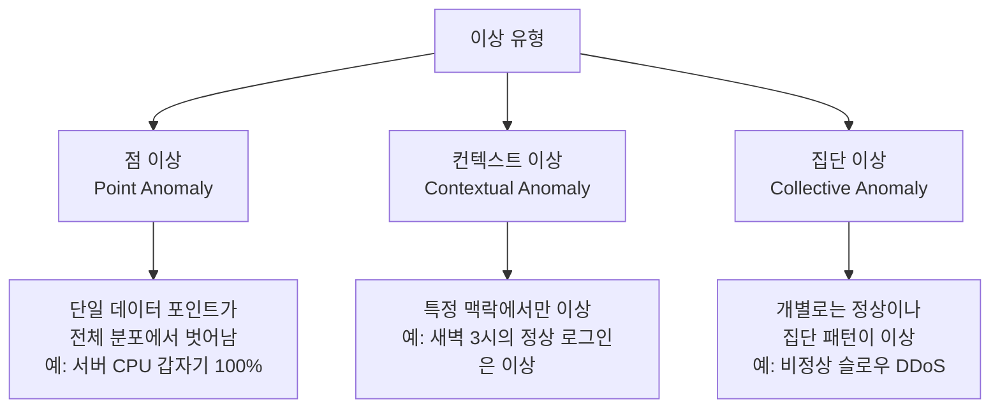
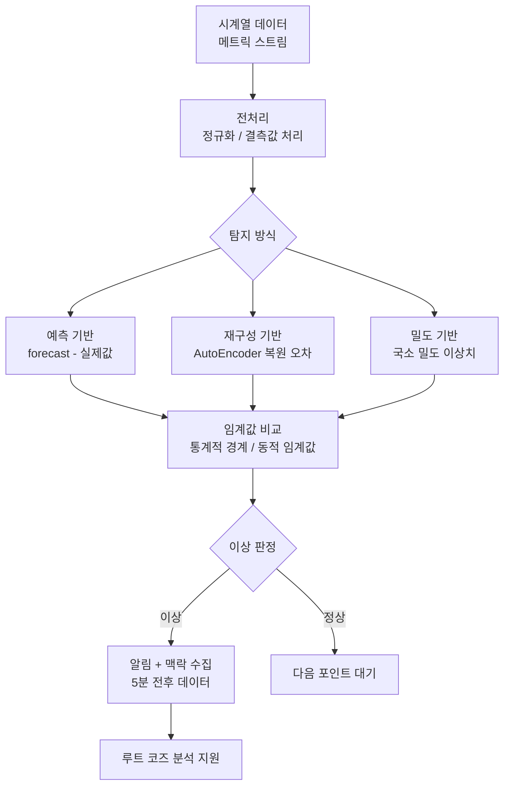
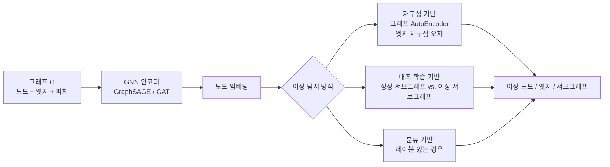
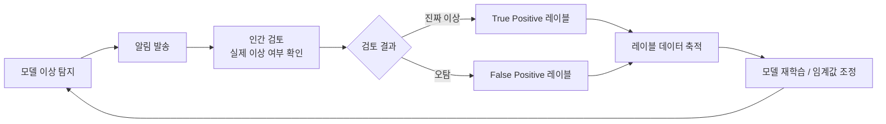

# AI 이상 탐지 응용

## 개요

이상 탐지(anomaly detection)는 데이터에서 **예상치 못한 패턴이나 이상치(outlier)**를 식별하는 기법이다. "정상이 무엇인지"를 학습한 후, 그 기준에서 벗어나는 것을 이상으로 분류한다.

이상 탐지의 핵심 특성은 **레이블 비대칭성**이다. 정상 데이터는 풍부하게 수집되지만, 이상 사례는 드물고 미리 알 수 없다(unknown unknowns). 이 때문에 지도 학습(supervised learning)이 아닌 **비지도 학습(unsupervised learning)** 또는 **단일 클래스(one-class) 학습** 방식이 주로 사용된다.

적용 도메인은 매우 넓다: IT 인프라 장애 예측, 금융 사기, 사이버 보안, 제조 품질 관리, 의료 진단, 공급망 이상 등.

## 이상의 종류



---

## 1. 핵심 알고리즘

### Isolation Forest

앙상블 방식의 이상 탐지 알고리즘. 핵심 아이디어: **이상점은 정상 데이터보다 '고립(isolate)'시키기 쉽다**.

랜덤 분할(random split)을 반복해 트리를 만들 때, 이상점은 적은 분할 횟수(짧은 경로)로 고립된다. 경로 길이의 평균으로 이상 점수를 산출.

```
이상 점수 = f(평균 경로 길이) → 낮은 경로 길이 = 높은 이상 점수
```

**장점**: 훈련이 빠르고 고차원에서도 잘 동작, 설명이 직관적  
**단점**: 밀집된 클러스터 내부의 이상 탐지에 약함, 컨텍스트 이상에 한계

### AutoEncoder 기반 이상 탐지

정상 데이터만으로 AutoEncoder를 학습시키면, 정상 패턴의 압축/복원이 잘 된다. 이상 데이터는 학습에서 본 적 없는 패턴이므로 **복원 오차(reconstruction error)**가 높게 나온다.

```mermaid
flowchart LR
    A[입력 x] --> B[인코더\n압축 표현 z]
    B --> C[디코더\n복원 x']
    C --> D{복원 오차\n|x - x'|}
    D -- 낮음 --> E[정상]
    D -- 높음 --> F[이상]
```

**변형 모델**:
- **VAE (Variational AutoEncoder)**: 잠재 공간을 확률 분포로 모델링 → 불확실성 추정 가능
- **Sparse AutoEncoder**: 활성화에 희소성(sparsity) 제약 → 더 의미 있는 표현 학습
- **Convolutional AutoEncoder**: 이미지 이상 탐지에 적합

### OCSVM (One-Class Support Vector Machine)

정상 데이터만으로 결정 경계를 학습하고, 경계 밖을 이상으로 분류.

**RBF 커널(radial basis function)**: 고차원 비선형 경계 학습 가능. 하지만 고차원 대용량 데이터에서 훈련 비용이 높아 딥러닝 기반으로 대체되는 추세.

### Temporal 모델 (시계열)

시계열 이상 탐지는 시간 의존성을 고려해야 한다.

| 모델 | 특성 |
|------|------|
| ARIMA 잔차 분석 | 예측값과 실제값 차이로 이상 판단 |
| LSTM AutoEncoder | 시퀀스 패턴의 복원 오차 기반 |
| Transformer 기반 | 장기 의존성 + 멀티변수 상관 포착 |
| DeepAR (Amazon) | 확률적 시계열 예측 + 이상 구간 탐지 |
| Prophet + 이상 임계값 | 분해(추세/계절성) 후 잔차 모니터링 |

---

## 2. 시계열 이상 탐지

### 적용 패턴



### 계절성과 이상 구분

계절성(seasonality)을 이상으로 오탐하는 것은 흔한 문제다.

- **STL (Seasonal-Trend decomposition using LOESS)**: 시계열을 추세 + 계절성 + 잔차로 분해. 잔차에서만 이상 탐지 → 오탐 감소
- **이상 탐지와 예측의 분리**: 예측 모델이 계절성을 내재화하면 잔차(residual)는 예측 불가 성분만 남음

### 멀티변수 이상 탐지

단일 지표의 이상은 놓치기 쉽다. 여러 지표의 상관 패턴이 깨지는 것을 탐지해야 한다.

예시: CPU 사용률 단독으로는 정상이지만, "CPU 80% + 메모리 50% + 네트워크 트래픽 없음" 조합은 이상.

- **MSET (Multivariate State Estimation Technique)**: 정상 상태의 변수 간 관계 모델링
- **GNN 기반 (MTAD-GAT)**: 다변수 시계열의 변수 간 의존 그래프를 어텐션 메커니즘으로 학습

---

## 3. IT 인프라 모니터링

### AIOps에서의 이상 탐지

AIOps(AI for IT Operations)는 IT 운영에 AI를 적용하는 분야. 이상 탐지는 그 핵심 기능이다. [[ai-aiops-log-analysis]] 참조.

**모니터링 대상**:

| 레이어 | 주요 지표 |
|--------|----------|
| 인프라 | CPU, 메모리, 디스크 I/O, 네트워크 대역폭 |
| 애플리케이션 | 응답 시간, 오류율, 처리량(TPS) |
| 비즈니스 | 주문 건수, 결제 성공률, 활성 사용자 수 |
| 로그 | 에러 로그 급증, 특정 로그 패턴 이상 |

### 동적 임계값 (Dynamic Thresholding)

정적 임계값(예: CPU > 90%)은 야간 배치와 주간 트래픽 피크를 구분하지 못한다. 동적 임계값은 시간대, 요일, 계절에 따라 다른 기준선을 학습한다.

```mermaid
flowchart LR
    A[메트릭 시계열] --> B[기준선 모델\n학습: 정상 패턴]
    B --> C[예측 구간 생성\n신뢰 구간 95%]
    C --> D{실측값 비교}
    D -- 구간 내 --> E[정상]
    D -- 구간 초과 --> F{심각도 판정}
    F -- 소폭 초과 --> G[경고 (Warning)]
    F -- 대폭 초과 --> H[위험 (Critical)]
    G --> I[Slack/PagerDuty 알림]
    H --> I
```

---

## 4. 그래프 이상 탐지

그래프(네트워크) 구조에서의 이상 탐지는 노드, 엣지, 서브그래프 레벨에서 이루어진다.

### 적용 사례

| 도메인 | 그래프 구조 | 이상 유형 |
|--------|-----------|---------|
| 금융 사기 | 계정-거래 이분 그래프 | 사기 링, 머니뮬 |
| 사이버 보안 | 내부망 연결 그래프 | 비정상 내부망 이동 |
| 소셜 미디어 | 팔로우/공유 그래프 | 봇 네트워크, 스팸 |
| 지식 그래프 | 엔티티-관계 그래프 | 잘못된 관계 선언 |

### GNN 기반 그래프 이상 탐지



---

## 5. 이미지 이상 탐지

제조업 품질 관리(visual inspection)가 대표적 응용이다.

### 제조 결함 탐지 파이프라인


**PatchCore (2022)**: 정상 이미지의 패치 임베딩을 메모리 뱅크에 저장하고, 새 이미지의 패치가 메모리 뱅크와 얼마나 다른지로 이상 판정. MVTec 벤치마크에서 SOTA 달성.

**FastFlow**: 정상화 흐름(normalizing flows)으로 정상 이미지의 분포를 학습. 로그 우도가 낮은 이미지를 이상으로 탐지.

---

## 6. 프로덕션 이상 탐지 설계 원칙

### 알림 피로 관리

이상 탐지 시스템의 가장 흔한 실패는 너무 많은 알림으로 팀이 "알림 피로(alert fatigue)"에 빠지는 것이다.

**알림 품질 향상 전략**:
- **경보 집계(alert aggregation)**: 관련 알림을 하나의 인시던트로 묶기
- **우선순위 점수**: 비즈니스 임팩트 × 이상 심각도
- **컨텍스트 자동 수집**: 알림 발생 시 관련 메트릭/로그 자동 첨부
- **점진적 임계값**: 경고 → 주의 → 위험 단계별 에스컬레이션

### 레이블 피드백 루프

이상 탐지는 지속적인 레이블 수집과 모델 개선이 필수다.



---

## 한계 및 트레이드오프

### 알려지지 않은 정상(Unknown Normal)

훈련 데이터에 포함되지 않은 정상 패턴(예: 계절성 이벤트, 새로운 기능 출시로 인한 패턴 변화)이 이상으로 탐지된다. 모델이 "새로운 정상"에 적응하는 업데이트 메커니즘이 필요.

### 레이블 없는 이상의 평가 어려움

비지도 학습 이상 탐지는 평가가 어렵다. 실제 이상 레이블 없이는 정밀도/재현율 계산이 불가능하다. 주로 시뮬레이션 데이터나 역사적 인시던트로 평가.

### 설명 가능성 요구

"무엇이 이상인가"뿐 아니라 "왜 이상인가"를 설명해야 분석가가 대응 방안을 결정할 수 있다. SHAP, 그래디언트 기반 귀속, 어텐션 시각화 등으로 기여 피처를 설명.

---

## 관련 문서

- [[ai-aiops-log-analysis]] - IT 운영 로그 이상 탐지
- [[ai-network-monitoring]] - 네트워크 트래픽 이상 탐지
- [[ai-fraud-detection]] - 금융 사기 탐지의 이상 탐지 기법
- [[ai-cyber-threat-hunting]] - 사이버 보안 이상 탐지
- [[unsupervised-learning]] - 비지도 학습 기반 개념
