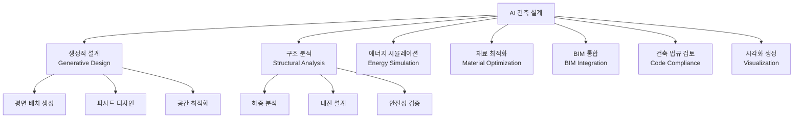
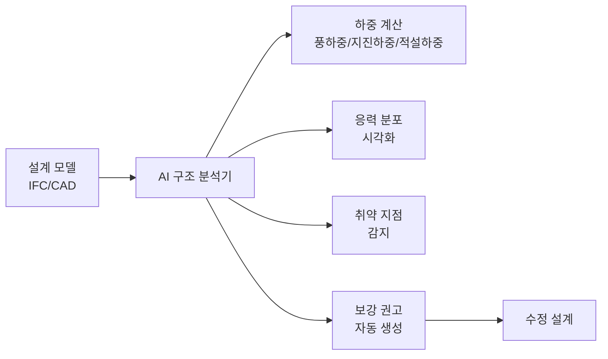
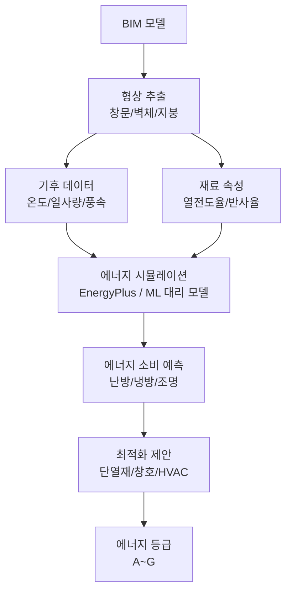
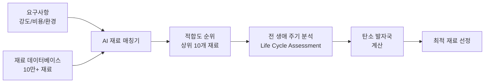
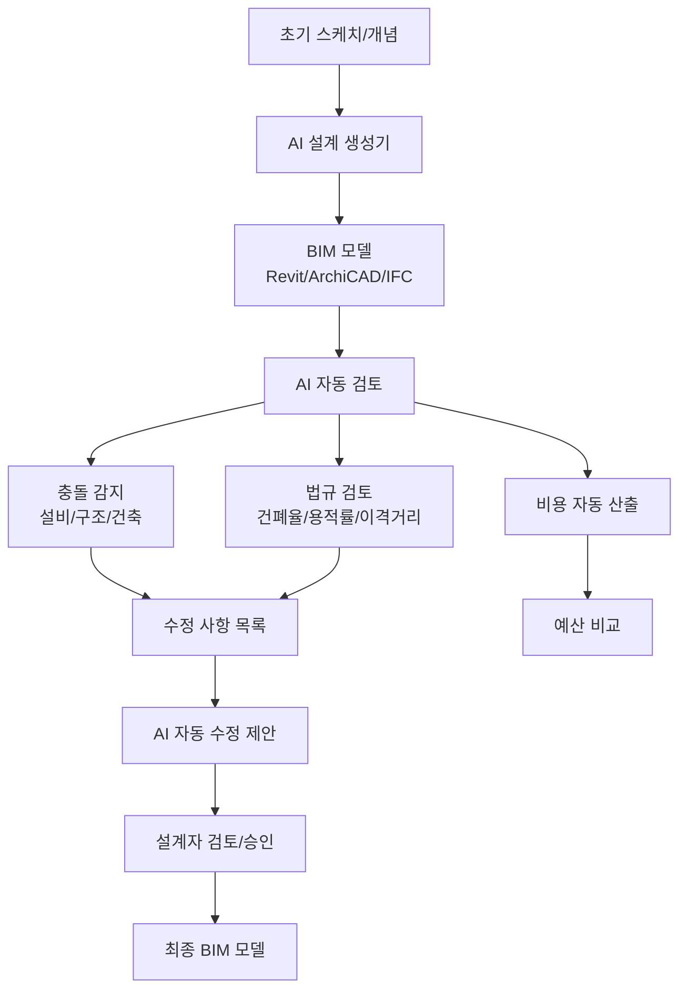
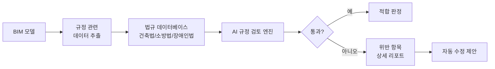
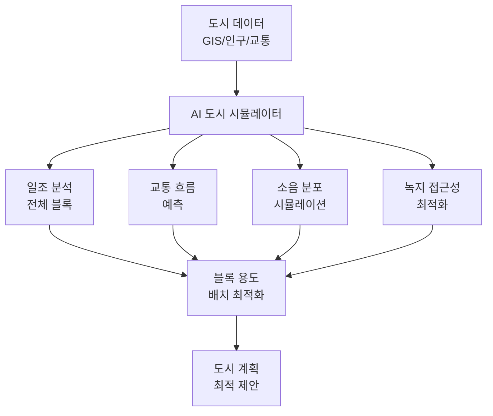

# AI 건축 설계 응용

## 개요

AI는 건축 설계(architectural design)의 전 과정에 걸쳐 적용되고 있다. 평면도 생성과 파사드(facade) 디자인 자동화부터, 구조 안전성 분석, 에너지 소비 시뮬레이션, 자재 최적화, 그리고 BIM(Building Information Modeling) 워크플로우 통합까지 광범위하게 활용된다.

전통적으로 건축 설계는 고도로 전문화된 인간 창의성과 수십 년의 경험이 필요한 영역이었으나, AI 도구들이 반복적이고 계산 집약적인 작업을 대체하면서 설계자가 더 창의적인 의사결정에 집중할 수 있게 돕고 있다.

## 핵심 적용 영역



## 생성적 설계 (Generative Design)

생성적 설계(generative design)는 AI가 주어진 제약 조건(면적, 층수, 예산, 환경 기준)을 만족하는 수백-수천 가지 설계 변형을 자동으로 생성하고, 최적 후보를 선별하는 접근법이다.

### 제약 기반 평면 생성

```python
# 의사코드: 제약 기반 평면 생성 파이프라인
class FloorPlanGenerator:
    def generate(self, constraints: DesignConstraints) -> list[FloorPlan]:
        """
        constraints:
          - 총 면적: 1000 m2
          - 용도 비율: 거실 30%, 침실 40%, 공용 30%
          - 채광: 남향 거실 필수
          - 동선: 침실-욕실 거리 최소화
        """
        candidates = []
        for _ in range(1000):
            # 공간 배치 샘플링
            layout = self.sample_layout(constraints)
            # 제약 조건 만족도 평가
            score = self.evaluate(layout, constraints)
            candidates.append((score, layout))

        # 상위 N개 후보 반환
        return [plan for _, plan in sorted(candidates, reverse=True)[:10]]
```

### LLM 기반 설계 보조

최근에는 GPT-4V, Claude 등의 멀티모달(multimodal) LLM이 설계 이미지와 텍스트 요구사항을 함께 이해해 설계 제안을 생성한다.

```
프롬프트 예시:
"첨부된 부지 도면을 분석하고, 다음 조건을 만족하는 3가지 배치 방안을 제안하라:
- 4인 가족을 위한 단독주택
- 연면적 200 m2 이하
- 남향 최대화
- 마당과 주차 공간 포함
각 방안의 장단점도 설명하라."
```

## 구조 분석 자동화

### AI 기반 구조 안전성 평가

전통적인 유한요소해석(Finite Element Analysis, FEA)은 전문 엔지니어가 수동으로 설정해야 했으나, AI가 이를 자동화하고 있다.



**실제 적용 사례**:
- Autodesk Fusion에서 구조 부재의 토폴로지 최적화(topology optimization)로 재료 사용량 30-50% 절감
- AI가 기둥, 보, 슬래브의 단면 크기를 자동 제안
- 지진 발생 시나리오별 건물 거동을 ML 모델로 빠르게 예측

### 내진 설계 지원

한국의 경우 내진 설계 기준(KDS 41 17 00) 준수가 필수다. AI가 지진 하중 계산과 내진 보강 옵션을 자동으로 생성한다.

## 에너지 시뮬레이션

### 에너지 성능 예측 파이프라인



**ML 대리 모델(surrogate model)**:
EnergyPlus 같은 물리 기반 시뮬레이터는 한 번 실행에 수 시간이 걸릴 수 있다. ML 모델이 대리 모델로 훈련되어 수백만 설계 변형을 초 단위로 평가한다.

```python
# 에너지 성능 대리 모델 (의사코드)
class EnergyPerformanceSurrogate:
    def predict(self, building_params: BuildingParams) -> EnergyPrediction:
        """
        입력: 건물 형태, 창면적비, 단열재 종류, 지역 기후 코드
        출력: 연간 냉난방 에너지 소비량 (kWh/m2·year)
        학습 데이터: EnergyPlus 시뮬레이션 결과 100만+ 케이스
        """
        features = self.extract_features(building_params)
        return self.model.predict(features)
```

**대표 수치 (한국 기준)**:
- 패시브하우스(passive house): 15 kWh/m2·year 이하
- 녹색건축 1등급: 60 kWh/m2·year 이하
- 일반 사무소 평균: 150-250 kWh/m2·year

## 재료 최적화

### AI 재료 선택 지원



**AI가 고려하는 재료 선택 기준**:
- 구조 성능 (압축강도, 인장강도, 탄성계수)
- 경제성 (재료비, 시공비, 유지보수비)
- 환경성 (탄소 배출량, 재활용 가능성, 원산지 거리)
- 공급 안정성 (국내 수급 가능 여부)
- 심미성 (색상, 질감, 연출 효과)

### 토폴로지 최적화

토폴로지 최적화(topology optimization)는 특정 하중 조건에서 최소 재료로 최대 강도를 달성하는 형태를 AI가 자동으로 찾는 기술이다.

```
입력:
  - 설계 공간 (예: 1m x 1m 사각형)
  - 지지 조건 (양단 고정)
  - 하중 (중앙 하향 1톤)
  - 목표 재료 비율 (30%)

출력:
  - 뼈대 구조 형태 (유기적 트러스 구조)
  - 예상 최대 응력과 변형량
```

자동차 부품, 항공기 구조, 건축 브래킷(bracket) 설계에 실제로 사용된다.

## BIM 통합

### AI-BIM 워크플로우

BIM(Building Information Modeling)은 건물의 3D 모델에 모든 정보(재료, 비용, 일정, 설비)를 통합한 디지털 트윈(digital twin)이다. AI가 BIM 워크플로우에 통합되는 방식.



### IFC와 AI

IFC(Industry Foundation Classes)는 BIM 데이터 교환 국제 표준(ISO 16739)이다. AI 모델이 IFC 파일을 파싱해 건물 구성 요소를 자동으로 분류하고 분석한다.

```python
# IFC 파일 AI 분석 (의사코드)
import ifcopenshell

def analyze_building(ifc_file: str) -> BuildingAnalysis:
    model = ifcopenshell.open(ifc_file)

    # 건물 요소 추출
    walls = model.by_type("IfcWall")
    windows = model.by_type("IfcWindow")
    doors = model.by_type("IfcDoor")

    # AI로 각 요소 분석
    window_area_ratio = calculate_wwr(walls, windows)
    thermal_performance = ai_thermal_model.predict(walls)
    natural_light = ai_daylight_model.simulate(windows)

    return BuildingAnalysis(
        window_wall_ratio=window_area_ratio,
        estimated_heating_load=thermal_performance.heating,
        daylight_factor=natural_light.average_df
    )
```

## 건축 법규 자동 검토

### AI 규정 준수 체크

한국 건축법, 지구단위계획, 소방법 등 수백 개의 규정을 자동으로 검토한다.

| 검토 항목 | AI 적용 방식 |
|----------|------------|
| 건폐율/용적률 | BIM 모델에서 자동 계산 후 지역 기준과 비교 |
| 일조권 사선제한 | 3D 그림자 시뮬레이션으로 위반 여부 확인 |
| 주차 대수 | 용도/면적 기반 자동 계산 |
| 피난 경로 | 최악 시나리오 대피 시뮬레이션 |
| 장애인 편의시설 | 이동 경로 접근성 자동 검토 |



## 시각화와 렌더링

### AI 렌더링 가속

전통적인 광선 추적(ray tracing) 렌더링은 수 시간이 걸리지만, AI 기반 네이럴 렌더링(neural rendering)이 이를 크게 단축한다.

- **NVIDIA DLSS (Deep Learning Super Sampling)**: 저해상도 렌더링을 AI로 고해상도로 업스케일
- **Stable Diffusion + ControlNet**: 개략적인 3D 형태를 포토리얼리스틱(photorealistic) 이미지로 변환
- **점진적 렌더링**: AI가 중요 영역을 먼저 정밀 렌더링하고 나머지를 빠르게 처리

### 텍스트-투-렌더링

```
입력: "현대 미니멀 스타일의 북향 주택 외관, 콘크리트와 목재 혼합, 저녁 황혼 조명"
출력: 포토리얼리스틱 건축 렌더링 이미지
```

## 도시 계획과의 연계

건물 단위를 넘어 도시 블록 수준의 AI 최적화가 연구되고 있다.



[[ai-urban-planning]] 문서에서 도시 규모의 AI 응용을 더 상세히 다룬다.

## 주요 도구와 플랫폼

| 도구 | 용도 | AI 특징 |
|------|------|--------|
| Autodesk Forma | 도시/건축 설계 | AI 일조/바람/소음 분석 |
| Spacemaker (Autodesk) | 도시 개발 사업지 분석 | 생성적 배치 최적화 |
| TestFit | 주거/상업 개발 검토 | 즉시 수익성 분석 |
| Cove.tool | 에너지 성능 최적화 | EnergyPlus 대리 모델 |
| Hypar | 파라메트릭 설계 | 클라우드 기반 생성적 설계 |
| ArchiGAN | 평면도 생성 | GAN 기반 공간 배치 |

## 한국 건설 산업에서의 도입 현황

- **스마트 건설 추진 계획** (국토교통부): BIM 의무화 단계적 확대
- **제로에너지건물 인증**: 2025년 공공건물 의무화, AI 에너지 시뮬레이션 활용
- **디지털 트윈 도시**: 서울시 S-Map, 부산 에코델타시티의 AI 기반 도시 시뮬레이션

## 한계 및 트레이드오프

### 현재 한계

- **창의성의 경계**: AI가 생성하는 설계는 학습 데이터의 편향을 반영 → 기존 사례를 넘는 혁신 어려움
- **맥락 이해 부족**: 장소의 문화적 맥락, 거주자의 생활 방식 같은 무형적 요소 파악 미흡
- **규제 복잡성**: 국가/지역마다 다른 건축 법규를 전부 학습시키기 어려움
- **데이터 희소성**: 고품질 건축 설계 데이터는 독점적이며 공개된 학습 데이터 부족
- **BIM-AI 통합 표준 부재**: IFC와 AI 모델 간 원활한 데이터 교환 파이프라인이 표준화되지 않음

### 윤리적 고려사항

- **저작권**: AI가 기존 건축가 작품을 학습해 생성한 설계의 저작권 귀속 불명확
- **전문가 역할 변화**: 설계 도구 조작 능력보다 창의적 방향 제시 능력이 더 중요해짐
- **알고리즘 편향**: 특정 건축 스타일이나 부유층 고급 건물 위주의 학습 데이터가 다양성을 저해할 수 있음

## 관련 문서

- [[generative-design]] - 생성적 설계 일반 개념
- [[bim]] - BIM(Building Information Modeling) 개요
- [[ai-urban-planning]] - 도시 규모 AI 계획 응용
- [[ai-design-tools]] - AI 설계 도구 전반
- [[topology-optimization]] - 구조 최적화 수학적 접근
