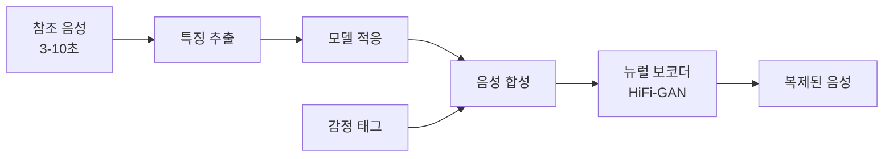

## 개요

AI 음성 합성 기술은 2026년 3초 분량의 오디오 샘플만으로 고품질 음성 복제가 가능한 수준에 도달했다. OpenBMB의 VoxCPM2는 기존 토크나이저 기반 TTS 파이프라인을 제거한 토크나이저-프리 아키텍처로 다국어 음성 생성의 새로운 방향을 제시했다. 실시간 대화형 음성 에이전트의 등장으로 고객 서비스, 콘텐츠 제작, 게임 등 다양한 분야에서 상업적 활용이 확산되고 있다.

## 핵심 개념

**토크나이저-프리 TTS(Tokenizer-Free TTS)**: VoxCPM2가 도입한 방식으로, 텍스트를 음성 토큰으로 변환하는 중간 단계 없이 텍스트에서 음성 특성으로 직접 매핑한다. 기존 TTS 파이프라인의 토크나이저 -> 언어 모델 -> 보코더 구조에서 토크나이저 단계를 제거함으로써, 파이프라인 단순화로 지연시간 감소와 자연스러움 향상을 동시에 달성한다. VoxCPM2는 오픈소스(GitHub)로 공개되어 있다.

**음성 임베딩(Voice Embedding)**: 특정 음성을 고유하게 만드는 수학적 표현으로, 참조 오디오에서 화자의 음색, 억양, 발화 패턴을 벡터로 인코딩한다. 이 임베딩이 음성 복제의 핵심 매개변수 역할을 한다.

**뉴럴 보코더(Neural Vocoder)**: HiFi-GAN 등의 모델이 합성 음성의 자연스러움을 극적으로 개선했다. 멜 스펙트로그램에서 원시 오디오 파형으로의 변환을 수행하며, "불쾌한 골짜기(uncanny valley)" 현상을 최소화하는 핵심 기술이다.

**감정 태그 제어(Emotion Tag Control)**: 텍스트에 감정 마커를 삽입하여 발화의 감정적 색채를 제어하는 기술. 동일한 문장을 기쁨, 슬픔, 분노 등 다양한 감정으로 재현할 수 있다.

## 현황 (2026)

### 주요 플랫폼

- **VoxCPM2**: OpenBMB가 공개한 토크나이저-프리 TTS 모델. 다국어 음성 생성에 최적화. 오픈소스(GitHub)
- **ElevenLabs V3**: 상용 음성 복제의 선두주자. 높은 자연스러움과 감정 표현력
- **Fish Audio**: 글로벌 AI TTS 플랫폼. 특히 중국어 및 혼합언어(code-switching) 콘텐츠에서 우수
- **Resemble AI**: 엔터프라이즈 음성 AI 플랫폼. 실시간 음성 변환 및 워터마킹 내장

### 참조 오디오 요구사항

| 품질 수준 | 필요 오디오 길이 | 비고 |
|----------|-----------------|------|
| 최소 복제 | 3-10초 | 기본적 음색 캡처 |
| 효과적 복제 | 10-30초 | Fish Audio 기준 |
| 고품질 복제 | 30-60초 | 억양/리듬까지 정확한 재현 |

### 다국어 지원

주요 플랫폼이 영어, 일본어, 한국어, 중국어, 프랑스어, 독일어, 아랍어, 스페인어 등 8개 이상 언어를 지원한다. 실시간 애플리케이션에는 밀리초 단위의 합성 속도가 요구된다.

### 산업 활용

- **콘텐츠 제작**: 유튜브/팟캐스트 크리에이터의 반복 녹음 작업 감소, 비디오/교육 콘텐츠 재녹음 병목 해소
- **오디오북**: 완성본 1시간당 2-4시간 녹음이 필요했던 제작 시간 대폭 단축
- **게임**: NPC가 플레이어 선택에 따라 상황에 맞게 동적 대화 생성 -- 모든 대사 사전 녹음 불필요
- **엔터프라이즈 음성 에이전트**: 음성 복제 + LLM을 결합한 실시간 음성 에이전트가 고객 서비스 영역에서 배포 확대. 브랜드 정체성을 반영한 일관된 보이스 유지
- **가상 어시스턴트**: 음성 복제 + LLM을 결합한 개인화된 AI 어시스턴트

### 가격 모델

플랫폼마다 문자 기반(per-character), 분 기반(per-minute), 구독 모델 등 다양한 과금 구조가 존재한다. 오픈소스 모델(VoxCPM2)을 자체 호스팅하면 API 비용 없이 사용 가능하다.

## 전망/과제

**윤리적 문제**: 음성 복제의 접근성이 높아지면서 동의 없는 음성 사용, 사기, 신원 도용 위험이 증가한다. **"명시적 동의 없이 누군가의 음성을 합성하면 심각한 윤리적, 법적 문제가 발생한다"**는 것이 업계 공통 원칙이다. 음성 모델을 민감한 디지털 자산으로 취급해야 한다. [[deepfake-detection-c2pa]] 기술과의 연계가 필수적이다.

**규제 동향**: [[ai-regulation-us]]의 DEEPFAKES Accountability Act와 [[eu-ai-act-enforcement]]가 합성 음성 콘텐츠에 대한 워터마킹과 출처 표시를 의무화하는 방향으로 진행 중이다.

**품질 격차**: 감정 표현, 운율, 호흡 패턴 등 미세한 음성 특성의 재현은 아직 개선 여지가 크다. 장시간 발화에서의 일관성 유지도 과제이다.

## 기술 파이프라인 상세

음성 복제의 전체 파이프라인은 네 단계로 구성된다:

1. **특징 추출(Feature Extraction)**: 참조 오디오에서 음성 임베딩 -- 특정 음성을 고유하게 만드는 수학적 표현 -- 을 추출한다. 음색, 피치, 발화 속도, 억양 패턴 등이 벡터로 인코딩된다.

2. **모델 적응(Model Adaptation)**: 두 가지 방식이 있다.
   - **미세 조정(Fine-tuning)**: 참조 음성으로 기존 TTS 모델의 가중치를 조정. 높은 품질이지만 시간 소요
   - **인코딩(Encoding)**: 음성 임베딩을 모델에 직접 주입. 빠르지만 품질이 다소 낮을 수 있음

3. **음성 합성(Speech Synthesis)**: 텍스트에 학습된 음성 특성을 적용하여 멜 스펙트로그램 생성. 감정 태그가 있는 경우 이 단계에서 감정적 색채가 적용됨

4. **보코더 처리(Vocoder Processing)**: HiFi-GAN 등 뉴럴 보코더가 멜 스펙트로그램을 원시 오디오 파형으로 변환. 자연스러움의 최종 결정 단계

### 토크나이저-프리 vs 토크나이저 기반 비교

| 항목 | 토크나이저 기반 TTS | 토크나이저-프리 (VoxCPM2) |
|------|-------------------|------------------------|
| 파이프라인 | 텍스트 -> 토큰 -> 음성 | 텍스트 -> 음성 직접 매핑 |
| 지연시간 | 토큰화 단계 추가 | 단계 제거로 감소 |
| 자연스러움 | 토큰 경계에서 부자연스러움 가능 | 연속적 매핑으로 개선 |
| 다국어 | 언어별 토크나이저 필요 | 언어 독립적 처리 가능 |

## 관련 문서
- [[mai-speech-models]] -- Microsoft MAI Speech Models

- [[ai-video-generation]] - 네이티브 오디오가 통합된 비디오 생성
- [[ai-image-generation]] - 멀티모달 생성 AI 생태계
- [[deepfake-detection-c2pa]] - 합성 미디어 탐지와 콘텐츠 인증
