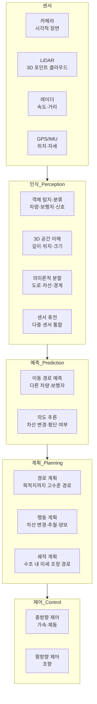
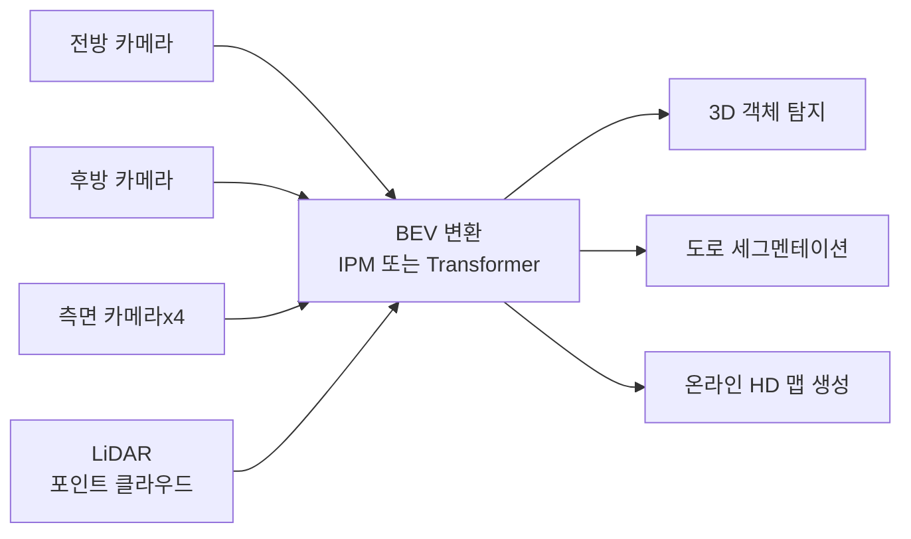
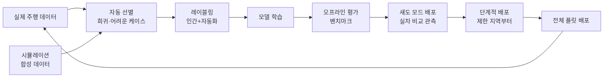

# AI 자율 주행 차량

## 개요

AI 자율 주행 차량(Autonomous Vehicles, AV)은 인간의 조작 없이 스스로 주변 환경을 인식하고, 경로를 계획하며, 차량을 제어하는 시스템이다. 카메라, LiDAR(레이저 거리 측정기), 레이더, 초음파 센서의 데이터를 딥러닝으로 처리하여 실시간 판단을 내린다.

SAE(국제자동차공학회)는 자율주행을 레벨 0(완전 수동)에서 레벨 5(완전 자동)까지 6단계로 분류한다. 2026년 현재 상업적으로 의미 있는 수준은 레벨 2+(ADAS 고도화)와 레벨 4(특정 지역 내 완전 자율주행)이며, 레벨 5는 아직 상용화 단계에 이르지 못했다.

## SAE 자율주행 레벨

| 레벨 | 명칭 | 핵심 특징 | 대표 사례 |
|------|------|----------|----------|
| 0 | 수동 | 모든 제어 인간 | 대부분의 기존 차량 |
| 1 | 운전자 지원 | 조향 또는 가감속 중 하나만 자동 | 크루즈 컨트롤 |
| 2 | 부분 자동화 | 조향+가감속 동시 자동, 인간 상시 감시 | Tesla Autopilot, GM Super Cruise |
| 3 | 조건부 자동화 | 특정 조건에서 시스템이 운전, 요청 시 인간 개입 | Mercedes Drive Pilot |
| 4 | 고도 자동화 | 제한된 지역·조건에서 완전 자율, 인간 불필요 | Waymo One, Cruise |
| 5 | 완전 자동화 | 모든 조건에서 완전 자율 | 미상용화 |

## 핵심 아이디어: 인식-계획-제어 스택

자율주행 시스템은 **인식(Perception) - 예측(Prediction) - 계획(Planning) - 제어(Control)**의 파이프라인으로 구성된다.

이 파이프라인의 각 단계에서 딥러닝 모델이 핵심 역할을 하며, 단계 간 오류가 누적되면 안전 위험으로 이어진다.

## 주요 기술 컴포넌트

### 인식(Perception)

**BEV(Bird's Eye View) 변환:**
최근 자율주행 인식의 핵심 트렌드는 여러 카메라의 원근 뷰(perspective view)를 하나의 조감도(BEV) 표현으로 변환하는 것이다. BEV 공간에서 객체 위치, 크기, 방향을 통일적으로 표현하면 다중 센서 퓨전과 경로 계획이 단순해진다.

**Tesla의 비전 전용(Vision-Only) 접근:**
Tesla는 비용과 확장성을 이유로 LiDAR 없이 카메라 8개만으로 완전 자율주행 시스템을 구축한다. FSD(Full Self-Driving) 컴퓨터는 자체 설계한 도조(Dojo) 칩으로 수십억 마일의 실제 주행 데이터를 학습한다. 비전 전용 방식은 비용이 저렴하지만 LiDAR의 정밀한 거리 측정을 상실한다.

**Waymo의 멀티 센서 접근:**
Waymo는 카메라, LiDAR, 레이더를 모두 통합한 풍부한 센서 스택을 사용한다. LiDAR는 정밀한 3D 거리 정보를 제공하고, 카메라는 색상·텍스처·신호등 인식을 담당하며, 레이더는 눈·비·안개에서도 속도와 거리를 안정적으로 측정한다.

**3D 객체 탐지 모델:**
- PointPillars, VoxelNet: 포인트 클라우드를 3D 그리드로 변환 후 3D 탐지
- CenterPoint: BEV 공간에서 객체 중심 기반 탐지, 회전 불변성
- DETR3D, PETR: 멀티카메라 → BEV 변환 + Transformer 탐지

### 예측(Prediction)

다른 차량과 보행자의 미래 궤적을 예측하지 못하면 안전한 경로 계획이 불가능하다. 예측은 물리적 가능성뿐 아니라 운전자의 의도(intent)를 추론해야 한다.

**소셜 어텐션(Social Attention) 모델:**
이웃 차량 간의 상호작용(social interaction)을 모델링한다. Social Force Model, LSTM + Attention, Transformer 기반 접근이 있다.

**고정밀 지도와의 통합:**
HD 맵의 차선 정보, 신호 체계, 속도 제한을 컨텍스트로 제공하면 예측 정확도가 크게 향상된다. 차선을 따라 이동하는 것이 가장 개연성 높은 행동이기 때문이다.

**불확실성 정량화:**
단일 예측 궤적보다 가능한 여러 미래 궤적의 확률 분포를 예측하는 것이 안전한 계획에 중요하다. 멀티모달 예측(multimodal prediction)이 현재 연구의 주요 방향이다.

### 계획(Planning)

계획 단계는 고수준 목적(목적지 도달)을 차량이 실행할 수 있는 구체적 궤적으로 변환한다.

**전통적 모듈형 vs 학습 기반:**
- **모듈형**: 인식-예측-계획이 명확히 분리된 파이프라인. 디버깅과 해석이 용이하나 각 모듈 오류가 하류(downstream)에 누적
- **end-to-end 학습**: 센서 입력에서 직접 조향/가속 출력을 학습. 인간 운전자 모방 학습(imitation learning)이나 강화학습으로 훈련. 해석이 어렵지만 모듈 간 최적화가 가능

**비용 기반 계획(Cost-Based Planning):**
후보 궤적들을 생성하고 각각의 비용(안전, 속도, 승차감, 법규 준수)을 계산하여 최적 궤적을 선택한다. 비용 함수 설계가 핵심이다.

### 제어(Control)

계획된 궤적을 차량의 실제 물리적 움직임으로 변환한다.

**MPC(모델 예측 제어, Model Predictive Control):**
미래의 짧은 시간 창을 예측하며 최적 제어 입력을 반복 계산한다. 제약 조건(가속도 한계, 조향각 한계)을 직접 처리할 수 있어 자율주행 제어에 널리 사용된다.

## 주요 플레이어 비교

### Waymo

구글에서 분사한 Waymo는 2018년부터 미국 피닉스에서 로보택시(robotaxi) 서비스를 상업 운영한다. 샌프란시스코, 로스앤젤레스로 확장 중이다.

**기술적 강점:**
- 풍부한 멀티 센서 스택 (LiDAR, 카메라, 레이더)
- 수천만 마일의 실제 주행 데이터 + 수십억 마일의 시뮬레이션 데이터
- Waymo Driver: 범용 자율주행 스택을 다양한 차량 플랫폼에 적용

**한계:**
- 오도 비용이 높아 차량당 수십만 달러
- 현재 제한된 지역(오퍼레이션 디자인 도메인) 내에서만 운행

### Tesla

Tesla는 레벨 2+ 운전자 지원 시스템인 FSD(Full Self-Driving)를 대규모 소비자 차량에 적용하는 독특한 전략을 취한다.

**Tesla의 차별화:**
- **플릿 학습(fleet learning)**: 수백만 대 테슬라 차량이 매일 수억 마일을 주행하며 데이터를 수집. 인간 운전자의 개입(intervention) 순간을 "하드 케이스"로 자동 레이블링
- **도조(Dojo) 슈퍼컴퓨터**: 자체 설계한 AI 학습용 슈퍼컴퓨터
- **비전 전용(Vision-Only)**: 카메라만으로 3D 공간 이해 (Neural Planner 기반)

**논란:** FSD는 레벨 2 시스템임에도 명칭으로 인해 운전자가 과신하여 감시를 소홀히 하는 문제가 지속 제기된다.

### Cruise (GM)

GM 자회사 Cruise는 샌프란시스코에서 로보택시를 운영했으나 2023년 사고 이후 운영이 중단됐다. 2024년 일부 시장에서 재개 중이다.

### BYD/바이두(Baidu Apollo)

중국 시장에서 바이두 Apollo Go 로보택시가 우한, 충칭 등에서 상업 서비스를 운영 중이다. 중국은 데이터 수집 규모와 정부 지원에서 미국과 경쟁하는 독자적 생태계를 형성했다.

## MLOps와 안전

자율주행 AI의 가장 어려운 문제 중 하나는 안전성을 어떻게 보장하고 검증하느냐다.

### 롱테일 엣지 케이스

도로 위에는 학습 데이터에 거의 없는 희귀한 상황(long-tail edge case)이 존재한다. 매우 드물지만 발생하면 치명적인 상황들이다:
- 도로 위에 세워진 대형 광고물 낙하
- 경찰관의 수동 교통 통제
- 예상치 못한 위치에 있는 공사 구간
- 강한 역광으로 신호등이 구분 안 되는 상황

이런 케이스를 모두 실제 주행으로 수집하는 것은 불가능하며, 합성 데이터(synthetic data) 생성과 시뮬레이션이 필수다.

### 자율주행 MLOps 파이프라인

**섀도 모드(Shadow Mode) 테스팅:**
새 모델을 실제 차량에 배포하되, 제어권은 현재 모델이 가지고 새 모델은 병렬로 결정을 내리면서 두 결정의 차이를 기록한다. 실제 도로에서 안전하게 새 모델을 평가하는 방법이다.

### 기능 안전(Functional Safety)

ISO 26262는 자동차 기능 안전을 위한 국제 표준이다. AI 시스템을 ASIL(Automotive Safety Integrity Level) D(가장 높은 안전 요구)로 인증하는 것은 기존 소프트웨어 방법론으로는 어렵다. "AI 시스템의 기능 안전 인증"은 업계와 규제기관이 공동으로 해결해야 할 과제다.

**안전 아키텍처 원칙:**
- 이중화(redundancy): 중요 센서와 컴퓨팅을 이중화
- 감시 루프(watchdog): 별도 감시 프로세서가 메인 AI를 상시 점검
- 안전 종단(safe stop): AI 실패 시 차량을 안전하게 정지시키는 독립 시스템
- 결정론적(deterministic) 컴포넌트: AI가 실패할 때 작동하는 규칙 기반 안전 레이어

## 실제 사례와 성과

### Waymo 성과 데이터

Waymo는 주기적으로 안전 보고서를 발표한다. 2023년 보고서에 따르면, 레벨 4 자율주행 환경에서 인간 운전자 대비 상해 유발 사고율이 크게 낮다고 보고했다. 단, 샘플 편향(제한된 지역, 날씨 조건)에 주의해야 한다.

### Tesla FSD 마일리지

Tesla는 2024년 말 기준 글로벌 FSD 누적 주행 거리가 수십억 마일을 넘었다고 보고했다. 이 방대한 데이터는 Tesla의 핵심 경쟁 우위다.

### 로보택시 경제성 과제

현재 로보택시 비용은 일반 택시 대비 여전히 높다. 차량 가격, 원격 감시 인력, 유지보수 등 비용이 미래에 충분히 낮아지지 않으면 경제적 지속 가능성이 문제다.

## 한계와 트레이드오프

### 지역 의존성(Geo-Dependency)

현재 레벨 4 시스템은 사전에 매핑된 특정 지역(오퍼레이션 디자인 도메인)에서만 안정적으로 작동한다. 새 도시에 진출하려면 HD 맵 구축, 규제 승인, 현지 데이터 수집이 필요하다.

### 날씨와 야간 성능

강한 비, 눈, 짙은 안개는 카메라와 LiDAR 성능을 모두 저하시킨다. 이런 극단 조건에서의 안전성 확보는 여전히 미해결 과제다.

### 혼합 교통 환경

자율주행 차량이 불규칙한 인간 운전자, 보행자, 오토바이, 우마차(일부 국가) 등과 공존해야 하는 복잡한 혼합 교통 환경에서의 강인성(robustness)은 아직 부족하다.

### 책임 소재와 규제

사고 발생 시 책임이 차량 제조사, 소프트웨어 개발사, 차량 소유자 중 누구에게 있는지 법적으로 불명확하다. 국가별 규제 체계가 불일치하여 글로벌 배포가 어렵다.

### 윤리적 딜레마

불가피한 사고 상황에서 AI가 어떤 결정을 내려야 하는지는 근본적 윤리 문제다. "트롤리 문제(trolley problem)"의 자율주행 버전은 법적·철학적으로 아직 해결되지 않았다.

### AI 안전성의 블랙박스 문제

딥러닝 기반 인식·계획 시스템은 왜 특정 결정을 내렸는지 사후 설명이 어렵다. 사고 원인 분석과 규제 기관 설명에 어려움을 야기한다.

## 실무 적용 관점

자율주행 시스템 개발 시 핵심 교훈:

1. **시뮬레이션이 필수**: 실제 도로 주행만으로는 충분한 엣지 케이스 데이터를 수집할 수 없다. CARLA, AirSim, LGSVL 같은 시뮬레이터와 NVIDIA Omniverse 기반 합성 데이터가 필수다.

2. **단계적 자동화**: 레벨 2에서 축적한 대규모 실데이터가 레벨 3/4 개발의 기반이 된다. Tesla의 플릿 학습 전략이 이를 잘 보여준다.

3. **안전 최우선 아키텍처**: AI 성능과 별도로, AI 실패 시 안전하게 종단하는 독립적 안전 레이어는 타협하면 안 된다.

4. **지역 규제 이해**: 자율주행 규제는 국가·주·도시마다 다르다. 기술 개발과 병행하여 규제 승인 프로세스를 초기부터 관리해야 한다.

5. **커버리지 맵핑**: "무엇을 할 수 있는가"보다 "어떤 조건에서는 안전하게 작동하지 않는가"를 정의하는 오퍼레이션 디자인 도메인(ODD) 명시가 책임 있는 배포의 기본이다.

## 관련 문서

- [[bev-perception]] - BEV 공간 기반 인식 모델 상세 기술
- [[ai-transportation-routing]] - 도시 교통 시스템과 자율주행의 통합
- [[reinforcement-learning]] - 자율주행 계획 레이어에서의 RL 활용
- [[ai-warehouse-robotics]] - 제한된 실내 환경에서의 자율 이동 로봇
- [[digital-twin]] - 자율주행 시뮬레이션 환경과 디지털 트윈
